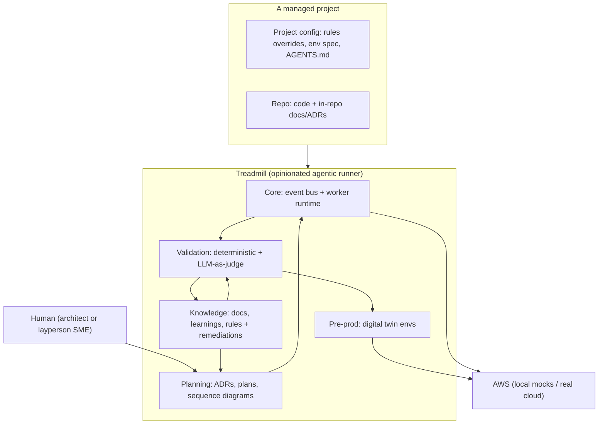

# ADR-0001: Treadmill is an opinionated agentic runner

- **Status:** accepted
- **Date:** 2026-05-06

## Context

Bunkhouse already exists as a cloud-native multi-agent worker orchestration system: SNS+SQS event coordination, immutable tasks with derived status, ECS Fargate workers, OpenTelemetry observability, post-deployment validation runner, agency-agents base profiles, federated dashboard. It is mature and operational. Bunkhouse has its own trajectory and stakeholder set; Treadmill is a separate effort.

We need an agentic runner that:

- Bakes in our opinions about how software should be designed, validated, and operated, rather than staying neutral.
- Runs both locally on a developer machine and in any AWS account from a single configuration.
- Serves as the substrate for software factories — systems that produce software with minimal human intervention by leveraging baked-in best practices.
- Keeps the door open to a north-star use as a general-purpose agent runtime, beyond software work.

Bunkhouse cannot be that system. Its accumulated cruft is concentrated in the lifecycle and composition layer above the event spine, and adding strong opinions retroactively would require touching nearly every layer simultaneously. We also want to reset the design space for the opinions themselves — to author them as primary intent rather than retrofit them through an existing system's installed-base assumptions.

We also want to demonstrate that *abstract, generalizable software factories are possible* — that a layperson with no prior software knowledge can interact with such a system to create a software feature or business, with cloud and software best practices applied automatically and tastemaker SMEs validating output.

## Decision

We are building Treadmill as a new codebase, distinct from any existing system. Treadmill is an opinionated agentic runner: an agent execution substrate that ships with strongly held opinions about how work should be designed, validated, and documented. Per-project configuration layers on top of Treadmill's core opinions, but the spine of opinions belongs to Treadmill, not to any project it manages.

The opinions Treadmill bakes in from day one:

1. **Decisions are recorded as ADRs** with sequence or flow diagrams when the decision describes a system interaction. The diagram is the contract of intent.
2. **Documentation is federated and durable.** Each managed project has an in-repo `docs/` tree and `AGENTS.md` files at directory level. Treadmill itself maintains a knowledge base of cross-project learnings that crystallize into rules.
3. **Validation is layered and partly probabilistic.** Deterministic checks (lint, tests, build) are baseline. Beyond that, Treadmill uses LLM-as-judge to evaluate plan-conformance, architectural fit, doc completeness, and intended-purpose match — generating confidence intervals to decide when a changeset is "good enough."
4. **Every changeset is previewable in an isolated pre-prod environment.** Validation runs against that environment using data kept outside the repo (digital-twin-style boundary fakes for third-party dependencies).
5. **Unsupervised iteration is a Ralph loop with an LLM judge gating each iteration**, not a fixed retry count.
6. **Learnings are first-class.** They are captured automatically (when humans react strongly to plans, when PRs receive harsh feedback) and manually. They crystallize into rules with attached remediations that apply across all Treadmill-managed projects.
7. **Local-first development from a single configuration.** A Treadmill-native local adapter interprets the same infrastructure-as-code definitions used in production, so we never maintain dev and prod topologies in parallel.
8. **Treadmill develops Treadmill.** Once the planning, runner, and validation layers exist, all further Treadmill development is performed by Treadmill.

Treadmill is inspired by Bunkhouse's event spine but does not lift code from it. The codebases stay separate so each can evolve to fit its own goals.

## Alternatives considered

- **Extend Bunkhouse with Treadmill's opinions.** Rejected because Bunkhouse has its own trajectory and stakeholder set, and embedding Treadmill's opinions there would conflict with that trajectory. Bunkhouse's cruft is also concentrated in the lifecycle and composition layers — restructuring those layers in place is slower than authoring them correctly the first time.
- **Use AWS Bedrock AgentCore as the runtime.** Rejected because AgentCore is AWS-managed, conflicts with the local-first requirement, and forces design decisions to fit a managed-agent shape we have not validated. Treadmill should remain runtime-agnostic so AgentCore (or others) can be plugged in later for specific agent types — for example, observability monitors.
- **Build a generic agent runtime first, layer factory opinions later.** Rejected because the opinions are the value. A generic runtime with no opinions is functionally equivalent to Bunkhouse and gives us no reason to invest in a parallel system.
- **Defer the rewrite, address Bunkhouse's cruft incrementally.** Rejected because the cruft is concentrated in the layer where Treadmill's opinions need to live; refactoring three coexisting layers in place is slower than authoring one layered correctly.
- **Adopt LocalStack as the local-first substrate.** Rejected because LocalStack's March 2026 license change moved ECS, RDS, and ElastiCache behind a paid tier, customer reports describe iteration friction (delete-and-redeploy on update failures, slow CFN runs against stateful resources), and the recent rug-pull pattern signals vendor risk we do not want at the foundation. We adopt a Treadmill-native local adapter instead, documented in ADR-0002.

## Consequences

### Good

- Opinions can evolve without external negotiation, since the codebase is ours.
- Local-first runs unblock fast iteration regardless of AWS access.
- Treadmill develops Treadmill creates a tight feedback loop between the system and its opinions; if a Treadmill workflow is painful, we feel it first.
- Clean separation from Bunkhouse means Treadmill is not constrained by Bunkhouse's installed-base assumptions.
- The opinions are explicit and document-bound (ADRs, rules, learnings), so they remain inspectable rather than tribal.

### Bad / trade-offs

- Rebuilding the runner costs time. Bunkhouse's working primitives — the messaging topology, protobuf event schemas, OTEL plumbing — must be authored fresh in Treadmill's codebase before Treadmill can do useful work.
- Treadmill will not benefit from Bunkhouse's ongoing improvements. If Bunkhouse adds a useful feature, Treadmill must implement it independently or wait.
- Bootstrap order matters: planning skills must precede the runner, the runner must precede dogfooding, dogfooding must precede further opinions. Premature jumps will produce code that the opinions don't yet cover.
- The "general agent runtime" north star creates scope-creep risk. Every primitive we add will be tempted toward generality before it has earned the right.

### Risks

- **Scope creep.** Treadmill is for software factories first. If the layperson UX or the general agent runtime starts driving design before the software-factory case works end-to-end, we lose focus. Signal to revisit: any ADR that justifies a primitive purely by appeal to the general-runtime use case.
- **Opinion drift.** Without rigor, baked-in opinions become tribal knowledge again. Signal to revisit: a decision is being made in conversation that doesn't end up in an ADR.
- **Bunkhouse divergence.** Useful patterns invented in Bunkhouse may go unobserved in Treadmill. Signal to revisit: a Bunkhouse capability is being reinvented under a different name.

## Diagram

## References

- StrongDM Software Factory: https://factory.strongdm.ai/techniques — the manifesto on Seed → Validation Harness → Feedback Loop, Digital Twin Universe, Shift Work, and scenarios.
- Bunkhouse — prior art for the event-driven coordination spine that informs Treadmill's runtime layer.

## Follow-ups

The following decisions are deliberately deferred to subsequent ADRs and remain open:

- **ADR-0002:** Local-first development substrate — a Treadmill-native adapter that interprets CDK synth output and provisions moto-backed AWS-managed services plus native Docker containers, with the same CDK definitions deploying to real AWS.
- **ADR-0003:** Documentation model — in-repo `docs/`, federated `AGENTS.md`, and Treadmill's cross-project knowledge base.
- **ADR-0004:** Sequence diagrams and flow diagrams as contract of intent, including plan-conformance validation.
- **ADR-0005:** LLM-as-judge validation with confidence intervals — when a changeset is "good enough."
- **ADR-0006:** Rules and remediations as a primitive (YAML hybrid: deterministic checks plus LLM judges).
- **ADR-0007:** Pre-prod environments per changeset — boundary fakes, isolated infra, validation data.
- **ADR-0008:** Learning capture — manual `/learning` skill plus automated triggers (orchestrator-side sentiment shifts, PR-side harsh feedback).
- **ADR-0009:** Bootstrap order — what gets built first, the dogfooding moment.
