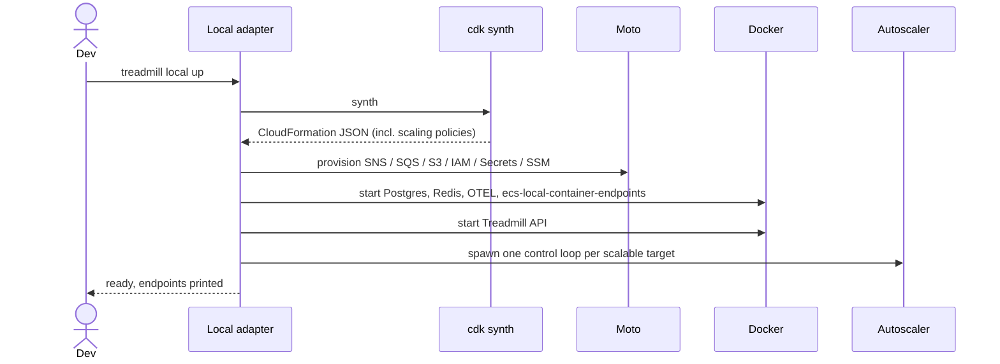

# ADR-0002: Local-first development via a Treadmill-native CDK adapter

- **Status:** accepted
- **Date:** 2026-05-07
- **Related:** ADR-0001

## Context

ADR-0001 committed us to running Treadmill "both locally on a developer machine and in any AWS account from a single configuration." We now need to decide *how*. The pattern most teams settle into — a `docker-compose.yml` for development plus an IaC tool (CDK, Terraform, Pulumi) for production — produces continuous skew between dev and prod, requires bespoke bash scripts to keep them in sync, and surfaces friction every time a service is added. Eliminating this skew at the foundation is one of Treadmill's load-bearing opinions.

We surveyed the candidate substrates and found three:

- **LocalStack Base.** As of LocalStack's March 2026 license change, ECS, RDS, and ElastiCache are paid features (~$39/mo per developer). Customer reports describe iteration friction — official docs recommend "re-create over update" for stack changes — and the rug-pull pattern signals vendor risk we do not want at the foundation.
- **Pulumi or Terraform with `pulumilocal` / `tflocal`.** Both wrap LocalStack underneath. They inherit the same constraints; switching IaC tools does not escape them.
- **Floci.** A new MIT-licensed AWS emulator (April 2026), wire-compatible with LocalStack's port 4566. Promising but months old, no production track record.

No AWS-blessed answer converges on the goal. SAM is Lambda-first; Application Composer is a CFN editor; AWS's published guidance for "test ECS locally" is `ecs-local-container-endpoints` plus `docker-compose` — exactly the dual-definition pattern we want to escape.

## Decision

CDK is the single topology language for Treadmill. The same `lib/` directory describes both local and AWS deployments. We do not maintain a `docker-compose.yml` alongside the CDK.

We build a Treadmill-native local adapter, shipped inside the Treadmill repo at `tools/local-adapter/`. If it proves useful beyond Treadmill, we extract it later.

### What the adapter does

The adapter reads CDK synth output (CloudFormation JSON) and operationalizes it locally by:

- **Provisioning AWS-managed primitives** (SNS topics including FIFO, SQS queues with subscriptions and filter policies, S3 buckets, IAM roles, Secrets Manager entries, SSM parameters) against **moto in daemon mode** on a known port.
- **Starting Postgres, Redis, and the OTEL collector as native Docker containers** — not via RDS or ElastiCache emulation, since both are first-class container images and emulation adds friction without value.
- **Reading ECS task definitions** to learn what container images, env vars, ports, and IAM identity each Treadmill workload expects.
- **Running `amazon-ecs-local-container-endpoints`** so workload containers fetch their task ARN and IAM credentials in the same shape they expect in production.
- **Wiring `AWS_ENDPOINT_URL`** into every container's environment so application code is unchanged between local and AWS.

### Autoscaling

Workers exit after each step (`EXIT_AFTER_STEP=true`) in both environments. The exit-then-restart path is where credential refresh, signal handling, and cleanup bugs hide; we want it exercised locally as well as in prod.

CDK's `ApplicationAutoScaling::ScalingPolicy` is the single declaration of intent. In production the policy is enforced by ECS Application Auto Scaling targeting SQS `ApproximateNumberOfMessages`. Locally the adapter reads the same CFN resources and runs an equivalent control loop:

1. Tick on a fixed interval.
2. Read SQS depth from moto and current worker count from Docker.
3. Compute desired count from the policy (min, max, target depth).
4. Start new containers if desired > current. Workers self-terminate after one step; the loop launches replacements only when policy dictates.
5. When depth has been zero for the configured idle window, the loop stops launching replacements and worker count naturally drains to the policy minimum (zero by default).

The loop is small — naive target-tracking on SQS depth is ~100 lines — and its semantics match ECS's enough that local behavior is faithful to prod for the cases we care about. Mid-step worker termination (`StopTask`) is not emulated; if it becomes load-bearing, we add it explicitly.

### Production deployment

Unmodified `cdk deploy` against real AWS. Same `lib/`, same scaling policy, same task definitions.

## Alternatives considered

- **LocalStack Base.** Already rejected in ADR-0001 — vendor risk, iteration friction, ongoing cost.
- **Floci.** Too new; reconsider in 6+ months. Wire compatibility with LocalStack means we may be able to swap it in later behind the same adapter interface.
- **moto with a sidecar that watches its ECS state and runs Docker containers to match.** Rejected because it requires emulating ECS API semantics (task ARNs, lifecycle, RunTask, StopTask) that we don't need locally. Reading CDK output directly is simpler.
- **Persistent local workers, no autoscaling.** Rejected: leaves the exit-then-restart path, idle drain, and concurrency caps untested locally — exactly the surface where production has historically had bugs.
- **Local-only `EXIT_AFTER_STEP=false`.** Rejected: divergent runtime behavior between dev and prod is the skew we are building Treadmill specifically to eliminate.
- **Treadmill-namespaced scaling spec parallel to CDK.** Rejected: introduces a second source of truth for scaling intent. CDK's autoscaling constructs are sufficient.
- **`docker-compose.yml` duplicated alongside CDK.** Rejected — the dual-definition pattern is the problem.

## Consequences

### Good
- Zero ongoing licensing cost. No vendor risk at the foundation.
- Single source of truth for both topology and scaling intent.
- The adapter is a candidate first managed project for Treadmill, providing a dogfooding target.
- Local behavior — including the exit-then-restart cycle — matches prod faithfully for the cases we care about.
- Iteration loop is fully under our control; nothing forces a delete-and-redeploy cycle.

### Bad / trade-offs
- Engineering cost: ~1–2 weeks for a useful first version of the adapter, including the autoscaler loop.
- We own all bugs.
- AWS service support is narrow at first and grows as Treadmill needs more surface.
- Autoscaling fidelity is partial — target tracking on SQS depth, no scheduled or step-scaling.

### Risks
- **Adapter scope creep.** Resist supporting AWS services Treadmill itself does not consume. Signal to revisit: a service is being added "in case it's useful later."
- **Autoscaler subtlety.** Target-tracking math is small but easy to get wrong (oscillation, slow convergence). Mitigation: keep the policy simple at v1; instrument the loop.
- **CDK output format drift.** CloudFormation evolves with AWS releases. Test the adapter against the pinned CDK version; signal to revisit on upgrade.
- **Spike overrun.** If the adapter does not show a clear glide path after the spike, we abort to LocalStack Base and amend this ADR.

## Diagrams

### Startup



### Autoscaling control loop

```mermaid
sequenceDiagram
    participant Autoscaler
    participant Moto as Moto SQS
    participant Docker
    participant Worker

    loop every tick
        Autoscaler->>Moto: GetQueueAttributes (ApproximateNumberOfMessages)
        Moto-->>Autoscaler: depth = N
        Autoscaler->>Docker: list running workers for target
        Docker-->>Autoscaler: current = C
        Note over Autoscaler: desired = clamp(policy(N, C), min, max)
        alt desired > current
            Autoscaler->>Docker: docker run (desired - current) workers
            Docker->>Worker: start
            Worker->>Moto: ReceiveMessage
            Moto-->>Worker: message
            Worker->>Worker: process step
            Worker->>Moto: DeleteMessage
            Worker->>Worker: exit (EXIT_AFTER_STEP=true)
        else desired <= current
            Note over Autoscaler: no action; existing workers drain naturally
        end
    end
```

## References

- ADR-0001 — opinion #7 commits us to single-config local-first.
- moto: https://github.com/getmoto/moto
- amazon-ecs-local-container-endpoints: https://github.com/awslabs/amazon-ecs-local-container-endpoints
- AWS CDK: https://aws.amazon.com/cdk/
- AWS Application Auto Scaling — ScalingPolicy CFN reference (the resource the adapter reads): https://docs.aws.amazon.com/AWSCloudFormation/latest/UserGuide/aws-resource-applicationautoscaling-scalingpolicy.html

## Follow-ups

- A pre-spike planning document covering the adapter's exact CLI surface (`treadmill local up/down/logs/status`), config layout, language choice, and the minimum CDK slice the spike must round-trip.
- The 3-day spike: a CDK stack with SNS+SQS+S3+ECS task definition + autoscaling policy, end-to-end via the adapter. Success: publish 3 messages, see the autoscaler spin a worker up to process each (one at a time, since workers exit after each step), and after the idle window, no workers running.
- Post-spike amendment to lock the spike result and detail what the adapter does and does not support at v1.
- ADR-0007 (pre-prod environments per changeset) will use this adapter to provision isolated preview environments.
- An eventual extraction ADR if the adapter proves useful beyond Treadmill.
