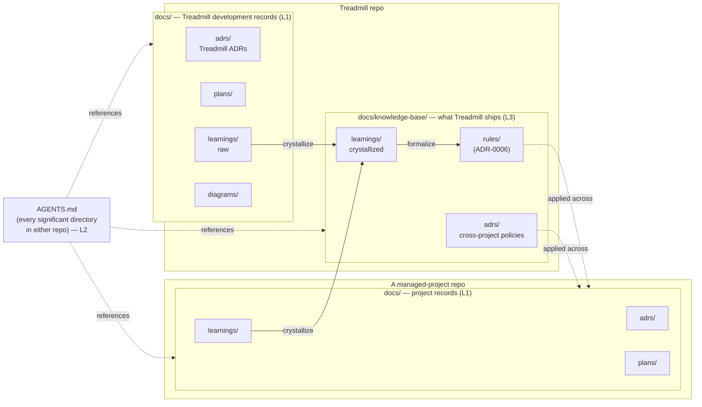

# ADR-0003: Three-layer documentation model

- **Status:** accepted
- **Date:** 2026-05-07
- **Related:** ADR-0001

## Context

ADR-0001 committed Treadmill to "documentation is federated and durable" — each managed project has an in-repo `docs/` and `AGENTS.md` files at directory level, and Treadmill itself maintains a knowledge base of cross-project learnings that crystallize into rules. The local-adapter spike exercised only the in-repo `docs/` layer. Layers 2 and 3 remain undefined, and we need them defined before the next round of work — every component, learning, and rule we author from here lands somewhere in this model.

We also need to be explicit about what content flows between the layers, so a learning captured during one project's work has a path to becoming a rule that applies across all projects without anyone having to reinvent it.

## Decision

Treadmill maintains documentation at three distinct layers, each with a defined shape, location, and lifecycle.

### Layer 1 — In-repo project docs

Per managed project, including Treadmill itself. Authored at `docs/`:

- `docs/adrs/NNNN-slug.md` — architectural decision records. Numbered, immutable except for status. Authored via `/decide`.
- `docs/plans/<date>-<slug>.md` — operational plan documents. Mutable while in flight, post-mortem on close. Authored via `/plan`.
- `docs/learnings/<date>-<slug>.md` — captured observations. Authored via `/learning` (manual today; automated trigger in ADR-0008).
- `docs/diagrams/<slug>.md` — Mermaid diagrams referenced from ADRs / plans, or standalone documentation of system shapes that outlive a single decision.

This layer captures what is true *for this project*. It is the lowest-friction surface to author into and the highest-resolution view of project-specific decisions.

### Layer 2 — Federated `AGENTS.md`

Directory-level orientation files. Each significant directory in a managed repo carries an `AGENTS.md` answering exactly three questions:

1. **What is this directory?** One paragraph; what it contains and why it exists.
2. **What conventions apply here?** Project-wide conventions go in the root file; directory-specific ones go in the local file. Children add to parents, never replace.
3. **What should an agent (or new contributor) read first?** A short list of the most relevant ADRs, plans, or files.

Files cap at ~100 lines. Each `AGENTS.md` answers questions specific to its level — root-level conventions go in the root file; subdirectory-specific ones go in the local file.

Treadmill workers and orchestrator agents load every `AGENTS.md` along the path of any file they touch (root → ... → leaf). This is the layer that makes federation work without flooding context.

### Layer 3 — Cross-project knowledge base

Treadmill writes two distinct kinds of documentation, and we keep them in separate trees so the audience and lifecycle are unambiguous:

- **Treadmill development records** at `docs/` — the artifacts we produce as we build Treadmill itself. ADR-0001 (what Treadmill is), ADR-0002 (local-adapter spike), the spike's plan and learning. These are written *about* Treadmill, *for* the people developing it.
- **Cross-project knowledge base** at `docs/knowledge-base/` — what Treadmill ships *to* the projects it manages. Crystallized learnings, rules, and policy-style ADRs that are meant to apply across all managed projects. These are written *for* managed projects (and the agents working in them).

Concretely under `docs/knowledge-base/`:

- `adrs/NNNN-slug.md` — cross-project policy ADRs. Numbered independently from `docs/adrs/`. A policy ADR records a decision Treadmill makes about how all managed projects must work (e.g., "every managed project must have an `AGENTS.md` at every significant directory"). Authored via `/decide` with status, alternatives, and consequences just like an internal ADR.
- `learnings/<date>-<slug>.md` — crystallized cross-project learnings. Frontmatter carries `kind: crystallized` plus `crystallized_from: [...]` referencing source learnings (which may be in Treadmill's own `docs/learnings/` or in a managed project's repo).
- `rules/<slug>.yaml` — formalized constraints with attached remediations. Schema and engine come in ADR-0006.

The boundary is by audience: a Treadmill-internal artifact is read by us as we build; a cross-project artifact is loaded by Treadmill's runtime when it operates on a managed project. Some artifacts may eventually need to exist in both places (a learning observed during Treadmill development that crystallizes into a cross-project policy), but they are *separate documents*: the development-record stays as raw evidence; a new crystallized artifact is authored in `docs/knowledge-base/` referencing the source.

The DB-backed evolution of the durable parts of `docs/knowledge-base/` is its own ADR when scoped.

### Content flow between layers

- Layer 1 (any project, including Treadmill's own `docs/`) → Layer 3 (`docs/knowledge-base/`): when a learning generalizes, we author a NEW crystallized learning in `docs/knowledge-base/learnings/` referencing the source via `crystallized_from:`. The source learning stays put as raw evidence.
- Promotion is manual via `/learning` today; ADR-0008 adds an auto-trigger for the cases where it can fire.
- Layer 3 → managed-project Layer 1: rules and crystallized learnings are not copied down. Managed-project artifacts reference them by slug; Treadmill's runtime loads them from `docs/knowledge-base/` directly. Single source of truth.
- Layer 2 ↔ Layers 1 and 3: `AGENTS.md` files reference artifacts in either layer without duplicating them.

## Alternatives considered

- **Single-layer docs (everything in one tree).** Rejected — does not separate project specifics from cross-project patterns, which is the value Treadmill is supposed to add.
- **Two layers (in-repo docs + `AGENTS.md`, no knowledge base).** Rejected — without a durable cross-project surface, learnings die with their projects. That contradicts ADR-0001 opinion #6.
- **Build the docs site first** (Sphinx, Docusaurus, etc.). Rejected for now. Publication is a separate concern from authoring; we can add it later without changing how docs are written.
- **Monorepo for all managed projects.** Rejected — Treadmill is designed to manage projects in separate repos.

## Consequences

### Good
- Clear separation between project specifics and cross-project knowledge.
- Agents and humans have predictable file locations.
- Markdown-as-source means everything is grep-able and versionable.
- The model upgrades incrementally — Layer 3 gets a DB without changing Layer 1 or Layer 2.

### Bad / trade-offs
- Two separate doc trees in the Treadmill repo (`docs/` and `docs/knowledge-base/`) creates a routing decision every time someone authors. We accept this — the audience boundary is the cost of the audience clarity.
- ADR numbering forks: `docs/adrs/` and `docs/knowledge-base/adrs/` each have their own NNNN sequences. A reader who sees "ADR-0001" must know which tree it's in.
- AGENTS.md cascade can grow unwieldy if every subdirectory adds one. We will be selective.

### Risks
- **Promotion never happens.** A learning captured at Layer 1 sits there forever. Mitigation: ADR-0008 adds auto-trigger and auto-promotion.
- **AGENTS.md becomes a dumping ground.** Mitigation: each file answers the three questions only; reviewers reject changes that add unrelated content.
- **`docs/knowledge-base/` grows unwieldy in markdown before the DB exists.** Mitigation: the markdown form follows a fixed schema we will migrate; we add a DB only when volume forces it.
- **Cross-project ADR numbering collides with internal ADR numbering in conversation.** Mitigation: when ambiguity is possible, we cite as `ADR-0006` for internal and `KB-ADR-0001` (or similar prefix) for cross-project. The convention is finalized when the first cross-project ADR lands.

## Diagram

## References

- ADR-0001 — opinion #2 on federated, durable documentation.
- `/decide`, `/plan`, `/learning` skills — the Layer 1 authoring mechanisms.
- AGENTS.md convention — community spec for agent-readable directory documentation.

## Follow-ups

- Author root `AGENTS.md` for the Treadmill repo as the first concrete instance of Layer 2.
- ADR-0006 (rules and remediations) defines the schema and engine for Layer 3 rules.
- ADR-0008 (learning capture) defines auto-trigger and promotion mechanics.
- A future ADR scoping the DB-backed evolution of `docs/knowledge-base/` once volume warrants migration.
- A future cross-project policy ADR clarifying the `ADR-NNNN` vs. cross-project ADR citation convention, finalized when the first cross-project ADR lands.
