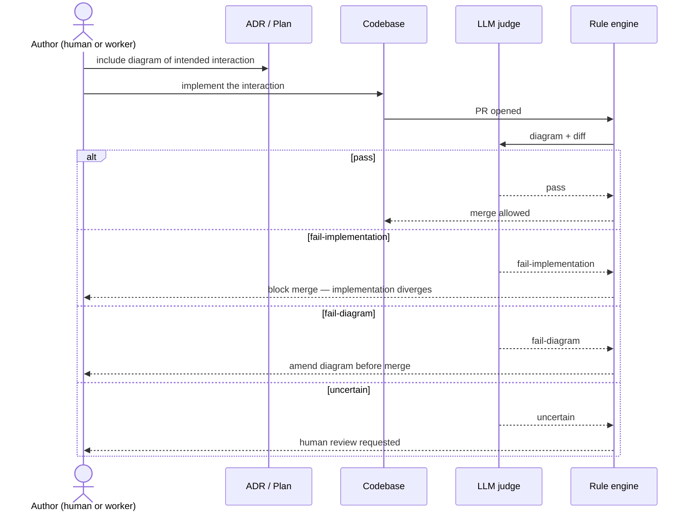

# ADR-0004: Diagrams as contract of intent

- **Status:** proposed
- **Date:** 2026-05-07
- **Related:** ADR-0001, ADR-0006, ADR-0009

## Context

ADR-0001 named diagrams as a "contract of intent" — opinion #1 says the diagram is what implementation must conform to. The `/decide` skill already requires a Mermaid diagram in any ADR that "describes a system interaction, data flow, or state machine." `/plan` similarly requires one when the plan describes a system interaction. We have the convention; we have not specified what *contract* means concretely or how conformance is verified.

Without that specification, diagrams degrade into decoration. An ADR's diagram and an ADR's prose drift; a plan's diagram and the resulting code drift; the artifact lives but the discipline does not. ADR-0009's Phase 2 (Minimum runnable Treadmill) will produce many plans, each describing an interaction — this is the moment to lock the contract before we author against it.

## Decision

A diagram in an ADR or plan is the *binding intent* for the interaction it describes. Implementation that diverges from the diagram is wrong, *or* the diagram requires amendment. Drift is not silently acceptable. Three pieces operationalize this.

### When a diagram is required

A diagram is required, not optional, when:

- An ADR describes a system interaction, a data flow, a state machine, or a layered topology with cross-component dependencies.
- A plan describes work that involves multiple components communicating, multiple steps with ordering constraints, or a state transition with observable consequences.
- A worker's task description involves implementing or modifying an existing diagrammed interaction.

A diagram is *not* required for pure prose decisions, single-actor refactors, or bug fixes that stay inside one function.

### What makes a diagram conformant

A conformant diagram:

- **Names every actor explicitly.** No `?` participants; no anonymous boxes. If a participant is "the human," that's named.
- **Labels every interaction.** Every arrow carries the operation, event, or message name — not just a verb. `step.completed` beats "publishes."
- **Stays at the intent layer.** No function signatures, no class names, no return-value details. The diagram describes *what* and *between whom*, not *how*.
- **Uses the right Mermaid kind for the question.** `sequenceDiagram` for actor-to-actor over time. `flowchart` for static topology, dependencies, layered architecture. `stateDiagram-v2` for lifecycle and observable state transitions.
- **Distinguishes synchronous from asynchronous interactions** when the distinction matters (`->>` solid for sync requests; `-->>` dashed for async returns or events).
- **Names alternative branches** with `alt`/`else` blocks rather than describing them in surrounding prose only.

A non-conformant diagram is a defect of the artifact that contains it. Reviewers reject ADRs and plans that ship with vague or decorative diagrams.

### Plan-conformance validation

When code lands that purports to implement a diagrammed interaction, an LLM judge evaluates whether the implementation honors the diagram. This is a candidate rule (`rule:implementation-conforms-to-diagram`, future), evaluated under ADR-0006's rule primitive. The judge receives:

- The diagram source (Mermaid text from the ADR or plan).
- The diff being judged.
- The list of actors named in the diagram.

The judge returns one of:

- `pass` — every interaction in the diagram has a corresponding code path; no code path implements interactions that aren't in the diagram.
- `fail-implementation` — code has interactions the diagram does not declare, or omits ones the diagram requires.
- `fail-diagram` — implementation is reasonable, but the diagram no longer reflects intent. Outcome: amend the diagram.
- `uncertain` — partial coverage or ambiguity; flag for human review.

The two `fail-*` outcomes have different remediations. `fail-implementation` blocks merge until the code conforms or the diagram is amended via the protocol below. `fail-diagram` prompts an ADR or plan amendment with the changes that explain why intent has shifted.

### Amendment protocol

When implementation must legitimately diverge from a diagram, the discipline is:

1. **Author the amendment first.** Update the diagram in its source ADR or plan, with a brief note in surrounding prose explaining what changed and why.
2. **Reference the amendment from the implementing change.** PR description cites the diagram amendment.
3. **Bump the artifact's status appropriately.** ADR amendment may use the `amended by ADR-MMMM` mechanism from `/decide`; plan amendments are in-place edits while the plan is `active`.

A change that updates the diagram and the code in the same PR is preferred. The judge accepts that pairing as conformant — the contract was rewritten with the implementation, not violated by it.

## Alternatives considered

- **Diagrams are advisory; humans review for drift manually.** Rejected — drift is exactly what humans miss, especially across many small changes. The judge catches what the human will not.
- **Use a stricter formal modeling language (TLA+, Alloy, etc.).** Rejected for now — Mermaid is readable, version-controllable, and already in our authoring path. Formal modeling has place; it is not the default.
- **Generate diagrams from code rather than using diagrams as contracts.** Rejected — the value is in *intent*, which is what code does not encode. A code-generated diagram describes what we wrote, not what we meant.
- **Skip plan-conformance validation; trust the planner.** Rejected — the entire ADR-0001 thesis is that validation is layered and partly probabilistic. A plan without a verification path is a wish.

## Consequences

### Good
- Diagrams stop being decorative. Authors take them seriously because reviewers and judges do.
- The validation backbone has a concrete first target: plan-conformance is a tractable LLM-judge problem.
- Phase 2 plans (per ADR-0009) start with diagram-as-contract from day one rather than retrofitting later.
- Drift becomes diagnosable. When the judge says `fail-diagram`, we know intent has moved; when it says `fail-implementation`, we know intent has been violated.

### Bad / trade-offs
- More work per ADR and plan. Authoring a conformant diagram takes longer than waving at a sketch.
- The judge's accuracy is unproven. False positives (judge says fail when conform) and false negatives (judge says pass when divergent) both cost.
- Mermaid's expressiveness has limits. Some interactions are awkward to model (concurrent actors, complex error propagation). Authors will be tempted to under-spec.

### Risks
- **Diagrams ossify.** A team avoids diagram amendments because amending is friction; reality drifts silently and the judge starts failing legitimate implementations. Mitigation: amendment is cheap (in-place plan edit; ADR status flip) — we will not gate amendments behind heavy review.
- **The judge becomes the bottleneck.** Latency on every diagrammed interaction's PR. Mitigation: judge runs only when the changed files match a "diagrammed component" set; rules engine timeouts cap exposure.
- **Authors over-diagram to game the rule.** Mitigation: reviewers reject diagrams that exceed the intent layer (no implementation detail clutter).

## Diagram

## References

- ADR-0001 — opinion #1 (decisions recorded as ADRs with sequence or flow diagrams; the diagram is the contract of intent).
- ADR-0006 — rule + remediations primitive; plan-conformance is a candidate rule.
- ADR-0009 — Phase 2 begins authoring against this contract.
- `/decide` skill — already requires a Mermaid diagram for system-interaction ADRs.
- `/plan` skill — already requires a Mermaid diagram for system-interaction plans.

## Follow-ups

- Author `rule:implementation-conforms-to-diagram` once the rule engine ships in Phase 4.
- Update `/decide` and `/plan` skill conventions to reference this ADR's "what makes a diagram conformant" checklist.
- A future ADR (or amendment) may add `stateDiagram-v2` examples and conventions for state-machine artifacts; current convention defaults to sequence and flow.
- The judge's prompt (and the diagram-source extraction logic) is a Phase 4 deliverable.
