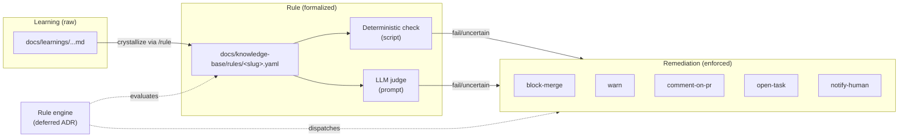

# ADR-0006: Rules and remediations as a Treadmill primitive

- **Status:** accepted
- **Date:** 2026-05-07
- **Related:** ADR-0001, ADR-0003, ADR-0008

## Context

ADR-0001 named "Learnings are first-class. They crystallize into rules with attached remediations that apply across all Treadmill-managed projects." ADR-0008 made learnings durable and auto-captured. We now have learnings with proposed rules and proposed remediations sitting in raw form, waiting for a schema to formalize them.

Without a defined rule primitive, the "promote a learning to enforcement" path is tribal — each promotion would invent its own structure, and the runtime has no contract to evaluate against. We define the primitive now so that the first rule (`features-ship-with-tests`, already a candidate) lands cleanly and every rule that follows shares the same shape.

## Decision

A **rule** is a YAML document at `docs/knowledge-base/rules/<slug>.yaml`. It is cross-project by definition — rules in this directory apply to every Treadmill-managed project unless explicitly scoped otherwise. The schema:

```yaml
name: <kebab-case-slug>             # matches filename
description: <one-line summary>
status: active                       # active | deprecated | superseded-by-<slug>
created: 2026-MM-DD
crystallized_from:                   # at least one source required
  - <learning-slug-or-other-evidence>
applies_to:                          # optional; defaults to "all managed projects"
  - <project-name-or-glob>           #   omit field entirely for "all"
checks:                              # one or more
  - id: <kebab-case-id>
    type: deterministic | llm-judge
    description: <what this check evaluates>
    # for deterministic:
    script: <repo-relative-path-to-script>      # exits 0 = pass, non-0 = fail
    # for llm-judge:
    prompt: |
      <prompt template; receives diff/context as input>
    severity: blocking | warning | advisory
remediations:                        # one or more
  - on: <check-id>:fail | <check-id>:uncertain
    action: block-merge | warn | comment-on-pr | open-task | notify-human
    target: pr-author | repo-owner | treadmill-orchestrator | <other>
    message: <optional template; passed to the action>
references:                          # optional but encouraged
  - <ADR-NNNN, KB-ADR-NNNN, learning-slug, or external link>
```

### Hybrid checks

We support two check types per ADR-0001's hybrid framing:

- **Deterministic** — a script with a defined exit-code contract. Cheap, repeatable, easy to debug. Used for any rule that can be expressed mechanically (file presence, lint pass, test count delta, etc.).
- **LLM judge** — a prompt-based evaluation that returns pass / fail / uncertain plus rationale. Used when the rule is semantic (e.g., "do these tests actually exercise the changes?"). The prompt template receives a defined context (diff, plan reference, etc.) and emits structured JSON.

A single rule may use one or both. Deterministic checks should run first; LLM checks should layer on top to catch what the deterministic check cannot see.

### Remediations

A remediation is the action taken when a check fires its failure or uncertain branch. The v0 menu:

- `block-merge` — the canonical hard stop. PR cannot merge.
- `warn` — surface the issue but do not block.
- `comment-on-pr` — post a comment to the PR with the rule's message and check rationale.
- `open-task` — auto-create a follow-up task in the project's task surface (when one exists).
- `notify-human` — page a human via the configured notification channel.

A rule may declare multiple remediations across multiple checks. Severity drives default action; explicit `action:` wins over default.

### Citation convention

Rules are cited by their slug (`rule:features-ship-with-tests`) — not by a numeric ID — because slugs are stable, descriptive, and unambiguous. ADRs in `docs/knowledge-base/adrs/` use `KB-ADR-NNNN` per ADR-0003; rules use the slug-only form.

### Engine deferred

This ADR defines the *primitive*, not the *engine* that evaluates rules. The engine — the loop that loads rule files, gathers context, runs checks, and executes remediations — is its own ADR when the Treadmill runtime is mature enough to host it. Until then, rules are documents. Their checks are real (runnable scripts; well-formed prompts) but no Treadmill component yet runs them. The engine ADR will need to address: when does evaluation fire (PR-time, plan-time, scheduled), how is context gathered, where do results land, how are remediations dispatched.

## Alternatives considered

- **Pure deterministic (scripts only).** Rejected — many of the rules we want (plan-conformance, doc-completeness, "tests exercise the right thing") are inherently semantic. Scripts cannot judge them.
- **Pure LLM-judged.** Rejected — LLM cost and non-determinism make it the wrong default for cheap mechanical checks. Hybrid lets each rule pick the right tool per check.
- **Encode rules in code, not YAML.** Rejected — rules need to be authorable, reviewable, and crystallizable from learnings without writing Python. YAML keeps the artifact at the right level of abstraction.
- **Reuse existing policy frameworks (OPA, Conftest, etc.).** Rejected for v0 — those frameworks assume Rego or similar DSLs and a runtime we don't yet have. Treadmill's rule shape is purpose-built for the learning-to-rule crystallization path.

## Consequences

### Good
- Crystallization path from learning to rule is now schema-defined; the orchestrator can author rules without inventing structure.
- Hybrid checks let each rule pick the right tool per concern.
- Engine deferral keeps the v0 cost low while preserving forward compatibility.
- The first concrete rule (`features-ship-with-tests`) can land alongside this ADR as the proof case.

### Bad / trade-offs
- A rule with no engine cannot enforce. We will be tempted to add an engine before we have the runtime context to host it well.
- Two check types means two debugging modes. Mixed-type rules may obscure where a failure originated.
- YAML's flexibility is a liability — the schema needs validation tooling we have not built.

### Risks
- **Rules pile up unenforced.** Mitigation: when we author a rule, we also note the engine work it implies, so the engine ADR has a concrete backlog driving it.
- **LLM-judge prompts drift from intent.** Mitigation: every LLM check has a `description:` field that summarizes what it judges, separate from the prompt; reviewers can compare drift between description and prompt.
- **Check scripts become a maintenance surface.** Mitigation: scripts live alongside the rule (under `tools/rule-checks/<rule-slug>/`) so they move and version together.

## Diagram



## References

- ADR-0001 — opinion #6 (learnings crystallize into rules with attached remediations).
- ADR-0003 — `docs/knowledge-base/rules/` is the storage layer.
- ADR-0008 — `/learning` and the auto-capture path; rules consume crystallized learnings.
- `/rule` skill — the authoring path for rule files (lands alongside this ADR).

## Follow-ups

- Author the `/rule` skill alongside this ADR.
- Author the first rule (`features-ship-with-tests.yaml`) as the proof case; flip the source learning's status to `crystallized-into-rule-features-ship-with-tests`.
- A future ADR scopes the rule engine — when evaluation fires, how context is gathered, how remediations dispatch.
- A future ADR adds rule schema validation (CI lint pass) once we have more than a couple of rules.
