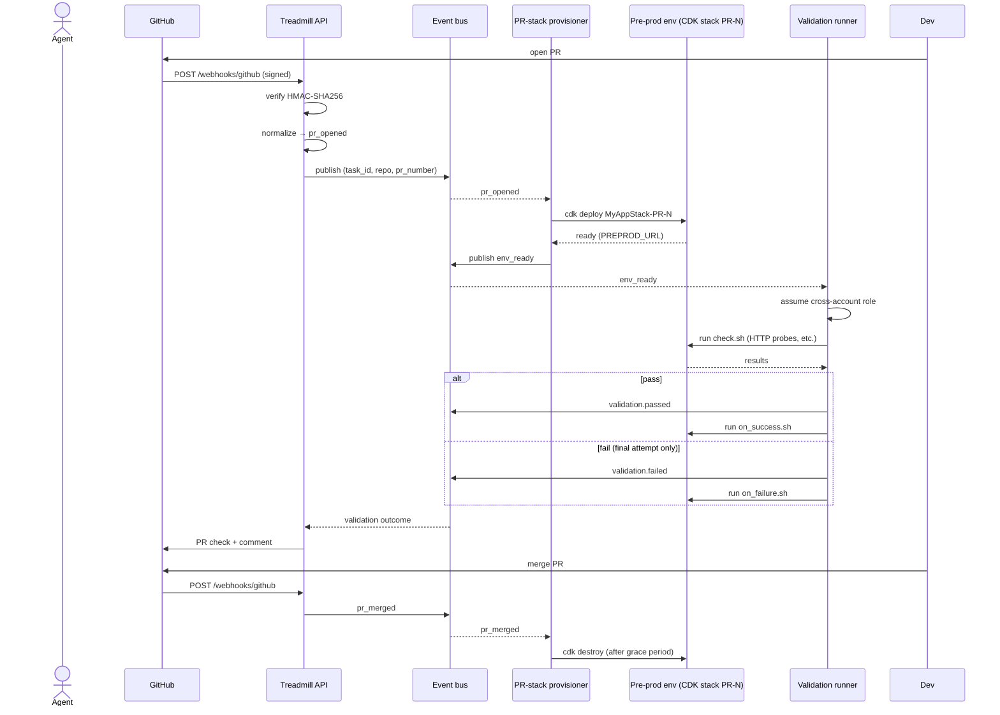

# ADR-0007: Pre-prod environments per changeset, GitHub-webhook driven

- **Status:** accepted
- **Date:** 2026-05-07
- **Related:** ADR-0001, ADR-0002, ADR-0006

## Context

ADR-0001 named "Every changeset is previewable in an isolated pre-prod environment. Validation runs against that environment using data kept outside the repo (digital-twin-style boundary fakes for third-party dependencies)." We have the substrate (ADR-0002 made CDK the single topology language; the local adapter spike validated the moto + native-Docker shape) and the rule primitive (ADR-0006). We do not yet have the trigger source (GitHub webhooks), the per-changeset env shape, or the validation runner that exercises it.

Bunkhouse has solved similar problems in production. We crib three of its patterns intact — webhook ingestion, validation runner, and the task-PR bridge — adapted for Treadmill's opinions and language. We do not lift code; we honor the proven shapes.

## Decision

A **pre-prod environment** is an isolated, production-like instance of a managed project's stack, provisioned per changeset (PR), validated against, and torn down. Treadmill's contract has three pieces: the env primitive, the webhook ingestion that triggers it, and the validation runner that exercises it.

### Pre-prod env primitive

For every PR opened against a managed project, Treadmill provisions a CDK stack instance suffixed by PR number — e.g., a base stack `MyAppStack` becomes `MyAppStack-PR-123`. The stack uses CDK parameters (or context values) to keep PR instances isolated:

- Subdomain / URL: `<base>-pr-123.<env>.<domain>` so each PR has a distinct ingress.
- Queue and topic names: `<base>-pr-123-<queue>` so messages do not bleed.
- Database name: per-PR schema or per-PR database, depending on the project's tolerance for shared physical instances.
- Storage prefix: per-PR S3 prefix or bucket-name suffix.

CDK is the single topology source — same constructs, parameterized values. The local adapter's evolution (a follow-up to ADR-0002) will support per-PR namespacing in moto + a per-PR Docker network for local pre-prod, so a developer can stand up a pre-prod env without AWS access.

**Lifecycle:**

- `pull_request opened` → provision the PR stack.
- `pull_request synchronize` (push to the PR branch) → re-deploy the PR stack with the new commit.
- `pull_request merged` or `closed` → tear down the PR stack within a configured grace period (default: 1 hour, so debugging is possible if a deploy issue surfaced post-merge).

**Boundary fakes for third-party dependencies** (the StrongDM "digital twin" framing) live in the pre-prod env. Each managed project declares which third-party services it talks to; Treadmill's contract is to provide a fake (built from API contracts plus observed edge cases) on a known endpoint per PR. Building the fake catalog is its own follow-up; this ADR commits us to the boundary shape, not the catalog.

### GitHub webhook ingestion

We crib bunkhouse's webhook contract intact. The shape:

- **Endpoint** at `POST /api/v1/webhooks/github` on Treadmill's API service.
- **Signature verification** via HMAC-SHA256 against `X-Hub-Signature-256: sha256=<hex>`. Constant-time comparison via `hmac.compare_digest`. Empty-secret short-circuit for local dev only — production rejects unverified payloads.
- **Event normalization** to internal verbs: `pull_request opened` → `pr_opened`; `pull_request closed + merged=true` → `pr_merged`; `pull_request_review submitted` → `pr_review_submitted`; `check_run completed` → `check_run_completed`; etc. The internal verb is the stable contract; GitHub's event taxonomy may evolve underneath.
- **Persistence + publish.** Each accepted event lands in the `events` table (immutable audit ledger) AND publishes to the GitHub event topic on Treadmill's event bus, with message attributes for `repo`, `pr_number`, and `task_id` enabling downstream filter policies.
- **Task-PR bridge.** A `task_prs(repo, pr_number) → task_id` table populates when a worker creates a PR. Webhook handlers query this bridge first; if no row, they fall back to ad-hoc resolution by repo + branch.
- **Cache-then-heal buffering.** If a webhook arrives before the PR is registered in `task_prs` (a race), the event is buffered in a queue (Redis or equivalent) keyed `pr:{repo}:{pr_number}:pending_events` with a 48-hour TTL. When `task_prs` populates, pending events replay through the trigger evaluator. This is the bunkhouse pattern and it works.

The receiver implementation is deferred — Treadmill does not yet have an API service, and authoring it is the first concrete non-substrate component (ADR-0009 will sequence the bootstrap). This ADR commits us to the shape so the eventual implementation is constrained.

### Validation against the env

We crib bunkhouse's validation runner intact, adapted for pre-merge use. The runner:

- Polls a `pre-prod-validations` queue with long-poll receive (20s) and a 300s initial visibility timeout, extended via heartbeat every 60s for long checks.
- Runs scripts stored in S3 at `s3://treadmill-validation/<project-slug>/<commit-sha>/{check.sh,on_success.sh,on_failure.sh}` (interim) or in `docs/knowledge-base/rules/` per ADR-0006 (durable).
- Assumes a cross-account role with `ExternalId=treadmill` (confused-deputy guard), session name `treadmill-validation`, duration 3600s.
- Injects standard env vars: `TREADMILL_PR_NUMBER`, `TREADMILL_REPO`, `TREADMILL_COMMIT_SHA`, `TREADMILL_PREPROD_URL`, plus per-project user-configured vars and the cross-account credentials.
- Runs scripts as a non-root `runner` user with a clean environment (no `os.environ` passthrough).
- Retries with exponential backoff; `on_success.sh` fires on any passing attempt; `on_failure.sh` fires only on the final failed attempt to avoid alert noise on transient infra issues.
- Reports outcomes via `validation.passed` / `validation.failed` / `validation.hook_failed` events on the event bus, which the rule engine (deferred ADR) consumes to decide block-merge vs comment-on-pr.

## Alternatives considered

- **Build pre-prod envs without webhook ingestion (manual trigger).** Rejected — manual triggers don't scale and force humans into the validation loop on every change.
- **Use GitHub Actions for pre-prod stand-up.** Rejected — Treadmill loses control of the substrate, the validation runner, and the cross-account model. Actions can complement (e.g., calling the Treadmill API on workflow_run) but not replace.
- **Per-branch envs instead of per-PR.** Rejected — a branch without a PR is not yet a validation candidate; PR is the unit of intent.
- **Reuse bunkhouse's webhook receiver as a service.** Rejected per ADR-0001 — Treadmill's codebase is separate from bunkhouse. We crib the shape, not the binary.
- **Author our own webhook contract instead of cribbing.** Rejected — the bunkhouse contract is proven, and reinventing the structure adds risk without distinguishing value.

## Consequences

### Good
- Every PR is a real environment, not a hope. Validation runs against real infra with real (or boundary-faked) integrations.
- The webhook contract is settled before the receiver is built — implementation has a target, not a blank page.
- The validation runner pattern composes cleanly with the rule primitive: a rule with an `llm-judge` check can target a `TREADMILL_PREPROD_URL` and judge real behavior, not just diff content.
- Cross-account assume-role keeps managed-project AWS accounts cleanly separated from Treadmill's control plane.

### Bad / trade-offs
- Per-PR infra has cost. AWS charges per stack; we will need budget controls and aggressive tear-down.
- The boundary-fake catalog is real work. Building fakes for third-party services is the largest undeclared scope.
- Cribbing requires discipline. Drift from bunkhouse's contract is fine; reinventing it accidentally is not.

### Risks
- **Tear-down failure leaks.** A webhook missed for `pr_closed` leaves a stack live. Mitigation: a scheduled reaper queries open stacks against `task_prs` weekly and tears down orphans.
- **Webhook secret leakage.** Mitigation: secret rotation procedure in the eventual receiver ADR; per-repo secrets, not org-wide.
- **Validation cost runs away.** A flapping check at exponential backoff could run hours per attempt. Mitigation: per-rule absolute timeout, attempt cap, and a circuit breaker (mirror bunkhouse's `wf-validation-fix`).

## Diagram

## References

- ADR-0001 — opinion #4 on isolated pre-prod per changeset; opinion #5 on Ralph loop with LLM judge.
- ADR-0002 — CDK as single topology source; local adapter as the local-mode substrate.
- ADR-0006 — rule primitive; LLM-judge checks may target `TREADMILL_PREPROD_URL`.
- StrongDM Software Factory — digital twin universe (boundary fakes), seed → validation harness → feedback loop.
- Bunkhouse — proven implementation we crib from, specifically:
  - `services/api/bunkhouse/routers/webhooks.py` — webhook ingestion contract.
  - `services/validation-runner/runner.py` — validation runner pattern.
  - `services/api/bunkhouse/models/task_pr.py` and `events/consumer.py` — task-PR bridge and cross-repo cascade.

## Follow-ups

- ADR-0009 sequences the bootstrap order, including when the API service that receives webhooks gets built.
- A future ADR scopes the rule engine, including how `validation.passed` / `validation.failed` events drive remediation dispatch.
- A future ADR scopes the boundary-fake catalog (StrongDM-style digital twin per third-party dependency).
- A future ADR scopes the local-adapter evolution to support per-PR namespacing for local pre-prod.
- A future cross-project policy ADR may declare "every managed project must declare its third-party dependencies in `treadmill.yaml`" so the boundary-fake catalog can compose automatically.
- A future ADR may add the cross-repo cascade (a PR merged in repo A unblocks pre-prod validation in repo B) once we have multiple managed projects.
