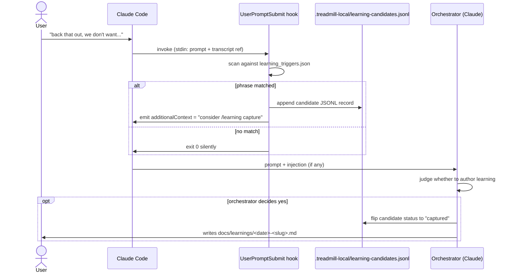

# ADR-0008: Learning capture — `/learning` skill plus hook-driven triggers

- **Status:** accepted
- **Date:** 2026-05-07
- **Related:** ADR-0001, ADR-0003

## Context

ADR-0001 committed Treadmill to capturing learnings "automatically (when humans react strongly to plans, when PRs receive harsh feedback) and manually." The `/learning` skill is in place for the manual path. This session has already produced two corrections that should have surfaced as learning candidates — one about path prefixes in ADR-0003, one about the conceptual model of `docs/knowledge-base/`. Neither was caught at the moment; both required the user to pause, raise the issue, and wait while the orchestrator caught up. That is exactly the friction auto-capture exists to remove.

We need an immediate auto-capture mechanism that works in this session and from here forward, before any Treadmill runtime exists. Whatever we ship now must compose cleanly with the eventual runtime — the runtime will produce richer signal (PR webhooks, plan-state transitions, observability events) and should consume the same downstream queue this v0 produces.

## Decision

We add a Claude Code hook layer for auto-capture, configured at the Treadmill repo. Specifically:

- **`UserPromptSubmit` hook** scans every user prompt for correction-phrase patterns. On match, the hook (a) appends a JSONL record to `.treadmill-local/learning-candidates.jsonl` with timestamp, matched phrase, and a transcript-position pointer, and (b) emits an `additionalContext` injection visible to the orchestrator: *"a correction-phrase trigger fired; consider whether this moment warrants a `/learning` capture."*
- **The hook is advisory.** It surfaces candidates; the orchestrator exercises judgment about whether to author a learning. False positives are cheap; missed learnings are expensive — the bias is toward firing.
- **Phrase list is data, not code.** Stored at `tools/dev-hooks/learning_triggers.json` so it can be tuned without changing the script.
- **Plan-abandoned trigger** is a second event: when a plan transitions to `abandoned`, the same script runs against the post-mortem text and writes a candidate. (Implemented as a small wrapper script the orchestrator invokes when it flips a plan status; richer triggering belongs to the runtime.)
- **PR-feedback trigger is deferred** — no GitHub integration exists yet. Adding it later is a webhook + the same JSONL queue; no schema change needed.
- **The candidates queue is the seam between v0 and the eventual runtime.** Today the orchestrator (Claude in this session) reads it; later, Treadmill's runtime will subscribe to the same file (or its DB-backed successor) and act on entries.

The schema for entries in `.treadmill-local/learning-candidates.jsonl`:

```json
{
  "timestamp": "2026-05-07T16:45:12Z",
  "trigger": "correction-phrase",
  "matched": "back that out",
  "context_pointer": "transcript:<turn-id>",
  "status": "open"
}
```

`status` flips to `captured` when a learning has been authored that references this candidate, or to `dismissed` when reviewed and judged not load-bearing.

## Alternatives considered

- **Pure manual capture.** Rejected — the rule "capture learnings when they happen" depends on noticing in real time, which the spike already showed we cannot rely on doing.
- **Sentiment analysis via a dedicated LLM call** at the hook layer. Rejected for v0 — phrase matching is cheap and high-signal for the corrections we actually see; we can layer an LLM judge on top later if false-positive rates demand it.
- **Hooks that auto-write full learning files.** Rejected — too noisy; drafts pile up unread. A queued candidate plus advisory injection puts the work where judgment lives (the orchestrator).
- **Webhook-driven only.** Rejected for v0 — no GitHub integration; conversation is the most immediate signal source.
- **Build the auto-capture into the Treadmill runtime now.** Rejected as out-of-order — the runtime does not yet exist; hooks let us start capturing today and migrate the consumption path later.

## Consequences

### Good
- Lower friction. Missed-learning rate drops because surfacing is automatic.
- Composable with the eventual runtime. The candidates queue is the abstraction; both v0 (hook) and v1 (runtime) write to it; both v0 (orchestrator-as-Claude) and v1 (Treadmill runtime) read it.
- Phrase list is configuration, not code. Tunable as we learn what triggers are noisy or missing.
- Hooks fire even when the orchestrator is not paying attention to the meta-level, so the signal is captured regardless.

### Bad / trade-offs
- False positives. "no, that's correct" matches "no" and would fire. Mitigation: the phrase list excludes leading "no, " when followed by an affirmation; we tune as we go.
- Phrase matching is brittle. Subtle corrections without trigger words slip through. Mitigation: layer an LLM judge later.
- Hook-script dependency adds a small surface. If the script breaks, prompts still land — the hook returns non-zero quietly and Claude Code keeps going.

### Risks
- **Candidates queue grows unread.** Mitigation: the orchestrator's session-end behavior (per a future hook or AGENTS.md convention) reviews open entries and dispositions them.
- **Trigger spam degrades the orchestrator's context.** Mitigation: rate-limit (the hook does not fire the same trigger phrase twice in close succession); the injection is short and addressable.
- **The hook becomes a maintenance burden in its own right.** Mitigation: keep it under ~100 lines; its only job is "match phrase → write record → emit message."

## Diagram



## References

- ADR-0001 — opinion #6 on first-class learnings, captured automatically and manually.
- ADR-0003 — `docs/learnings/` is Layer 1 (raw); cross-project crystallization to `docs/knowledge-base/learnings/` is Layer 3.
- `/learning` skill — the manual authoring path; gets a section update in this round to acknowledge auto-capture.
- Claude Code hooks documentation — `UserPromptSubmit` event, JSON I/O contract.

## Follow-ups

- Implement the hook script + `.claude/settings.json` configuration alongside this ADR.
- Update `/learning` skill so the orchestrator's authoring path includes "check `learning-candidates.jsonl` for open entries; flip status on capture."
- Add a session-end review convention to root AGENTS.md (or a Stop hook) so candidates do not accumulate silently.
- A future ADR adds the PR-feedback trigger when GitHub integration lands.
- A future ADR migrates the candidates queue to the Treadmill runtime when the runtime can subscribe to it.
- The first cross-project policy ADR (in `docs/knowledge-base/adrs/`) declares auto-capture a feature Treadmill ships to managed projects.
