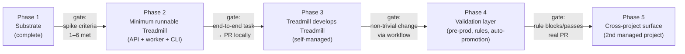

# ADR-0009: Bootstrap order — building Treadmill in dogfoodable phases

- **Status:** accepted
- **Date:** 2026-05-07
- **Related:** ADR-0001, ADR-0002, ADR-0006, ADR-0007, ADR-0008

## Context

ADR-0001 committed us to "Treadmill develops Treadmill" once the planning, runner, and validation layers exist. ADR-0002 built the substrate. ADR-0006 specified the rule primitive. ADR-0007 specified pre-prod environments and the webhook contract. ADR-0008 specified learning capture. Each of these is correctly named as a primitive; none of them is a runnable Treadmill.

We now have evidence of what's been hard (substrate parsing, autoscaling reconciliation, doc-model disambiguation) and what's been straightforward (skill authoring, ADR convention). We have one paying-attention risk from the review: *substrate drift* — three turns spent on documentation infrastructure produced no Treadmill component that does work. If we keep authoring primitives without bootstrapping a runnable system, Treadmill becomes "very well-documented infrastructure with no system."

The bootstrap-order ADR is the place to admit what comes next, in what order, and what each phase has to deliver before the next can start.

## Decision

We build Treadmill in five phases. Each phase has explicit gating criteria; phase N+1 may not start until phase N's gates are met.

### Phase 1 — Substrate (complete)

CDK app, local adapter (moto + Docker), autoscaler, noop worker, all the documentation infrastructure (skills, ADR convention, learning auto-capture, rules + remediations primitive). The local-adapter spike's success criteria 1–6 were the gate.

**Status:** complete as of 2026-05-07. ADRs 0001, 0002, 0003, 0006, 0007, 0008 in place; spike plan completed; 40 tests green.

### Phase 2 — Minimum runnable Treadmill

The smallest Treadmill that can accept a task, dispatch a worker, and produce a PR — for any project, including itself. Three concrete components:

- **Treadmill API service.** Python + FastAPI, deployed by the existing CDK app, runs in the local adapter exactly as the noop worker does today. Endpoints: `POST /api/v1/tasks` (submit), `GET /api/v1/tasks/{id}` (status), `POST /api/v1/webhooks/github` (per ADR-0007), plus the WebSocket / SSE surface for streaming updates. Persistence: Postgres. Event publishing: SNS topics already provisioned by the spike's CDK.
- **First non-noop worker.** A worker that takes a task description, runs Claude Code (or equivalent) in a container, opens a PR. Cribbed in shape from bunkhouse's worker entrypoint but rewritten — no code lift. Uses the substrate's autoscaling primitive; exits after one step.
- **`bunk`-equivalent CLI** (working name: `treadmill`). A small Click/Typer CLI that talks to the API. Submit a task, list tasks, watch logs. The orchestrator's interface to the system.

**Phase 2 gate:** an end-to-end run from `treadmill submit` → API queues → worker picks up → worker authors a one-file change → worker opens a PR. Locally, against the spike's CDK substrate. Tests cover each component to the rule:`features-ship-with-tests` standard.

### Phase 3 — Treadmill develops Treadmill

Treadmill is registered as its own first managed project. From this point forward, all non-emergency Treadmill development goes through Treadmill itself: tasks submitted via `treadmill submit`, executed by Treadmill workers, opened as PRs, reviewed and merged by us. The `/plan` and `/decide` skills' output drives task submission.

**Phase 3 gate:** a non-trivial Treadmill change (e.g., adding a small feature or fixing a real bug) is authored by a Treadmill worker, lands as a PR, passes our review, and merges. Both the artifacts (plan, ADR if applicable, learning if applicable) and the code change are produced through the workflow.

### Phase 4 — Validation layer

The pre-prod env primitive (ADR-0007) and rule engine (the deferred follow-up to ADR-0006) come online. Specifically:

- **Pre-prod env provisioner**: consumes `pr_opened` events, runs `cdk deploy` for a per-PR stack, publishes `env_ready`.
- **Validation runner**: consumes `env_ready`, runs the project's check scripts and LLM-judge prompts, publishes `validation.passed` / `validation.failed`.
- **Rule engine**: loads rules from `docs/knowledge-base/rules/`, evaluates checks (deterministic + LLM judge), dispatches remediations per the validation outcomes. The first rule we wire: `rule:features-ship-with-tests`.
- **Auto-promotion**: the path from learning candidates (ADR-0008's queue) → captured learnings → crystallized learnings → rules begins running automatically rather than manually.

**Phase 4 gate:** a Treadmill-authored PR fails `rule:features-ship-with-tests` because the worker didn't add tests, and the rule engine blocks the merge. Then a different Treadmill-authored PR passes the rule and merges. The rule is *enforced*, not documented.

### Phase 5 — Cross-project surface

A second managed project, separate from Treadmill itself, registers with Treadmill and consumes the same pipeline. The cross-project boundary becomes real: KB-ADR-0001 (or similar) lands as the first cross-project policy ADR; the boundary-fake catalog gets its first entries; the cross-repo cascade (per ADR-0007) starts firing.

**Phase 5 gate:** a PR in the second managed project, opened via Treadmill, runs through pre-prod validation and merges, with rules from `docs/knowledge-base/rules/` applied. At least one rule fires a remediation (block, warn, or comment) that affects the merge decision. Treadmill is now multi-tenant in the meaningful sense.

## Alternatives considered

- **Single component at a time, in any order.** Rejected — components depend on each other (workers need an API to receive tasks; rule engine needs validation events; etc.). Sequencing matters.
- **Big-bang Phase 2** (build API, all workers, rule engine, validation runner all at once). Rejected — coordination cost is high; we'd lose the dogfooding feedback that comes from each phase's gate.
- **Skip Phase 3** (go straight from "minimum runnable" to validation layer). Rejected — Treadmill-develops-Treadmill is the load-bearing claim of ADR-0001. Skipping the dogfood phase means we're authoring validation against a system we haven't proven runs.
- **Defer Phase 5 indefinitely.** Tempting but rejected — single-tenant Treadmill never exercises the cross-project boundary that motivates `docs/knowledge-base/`. We need a second managed project to stress the design.
- **Build the rule engine before the API.** Rejected — the rule engine without a system to enforce against is documentation. Phase 2's API gives the engine a place to attach.

## Consequences

### Good
- Each phase delivers a runnable artifact; no phase is purely scaffolding.
- The gates are observable, not subjective. "PR fails the rule and is blocked" is verifiable.
- Phase 3 (dogfooding) catches design problems early — every Phase 4 component is built for a system Treadmill itself has experienced.
- The bootstrap order matches the value-delivery order: by Phase 2 we have a runnable Treadmill; by Phase 3 it improves itself; by Phase 4 it enforces our opinions; by Phase 5 it serves others.

### Bad / trade-offs
- Phase 2 is the longest. Building API + worker + CLI from scratch is multi-week even with bunkhouse as a shape reference.
- The phases are not independently shippable to external users. Treadmill is internal-only until Phase 5.
- Some primitives sit unused for phases (e.g., the rule we already authored is unenforced through Phase 3).

### Risks
- **Phase 2 sprawl.** Easy to bolt features onto the API "while we're here." Mitigation: the gate is the smallest end-to-end run; everything not on that path is a follow-up.
- **Dogfooding regresses Phase 2.** A change Treadmill authors might break Treadmill's own CI. Mitigation: Phase 3 gate is a *non-trivial* change, not a critical-path one; we keep an emergency manual-edit path until Phase 4.
- **Phase 5 deferred forever.** Without a real second managed project, the cross-project surface stays theoretical. Mitigation: name a candidate second project before Phase 4 closes.

## Diagram

## References

- ADR-0001 — opinion #8 (Treadmill develops Treadmill).
- ADR-0002 — substrate (Phase 1).
- ADR-0006 — rule primitive (engine deferred to Phase 4).
- ADR-0007 — pre-prod env primitive (Phase 4).
- ADR-0008 — learning auto-capture (Phase 1; auto-promotion in Phase 4).
- Bunkhouse — shape reference for Phase 2's API and worker.

## Follow-ups

- **Phase 2 plan** at `docs/plans/2026-05-08-minimum-runnable-treadmill.md` — sequences the API, worker, and CLI sub-components, with daily gates and success criteria.
- **Phase 2 ADRs** as decisions arise: API technology stack (likely FastAPI but worth confirming), Postgres schema, worker container shape, CLI surface.
- **Phase 4 ADR** for the rule engine — when checks fire (PR-time, plan-time, scheduled), how context is gathered, how remediations dispatch, how confidence intervals are computed (intersects with deferred ADR-0005).
- **Phase 5 candidate** named explicitly before Phase 4 closes; the second managed project is the test of cross-project surface.
- A short Phase 1 retrospective added to this ADR (or a sibling) once we have a few sessions of Phase 2 to reflect against.
