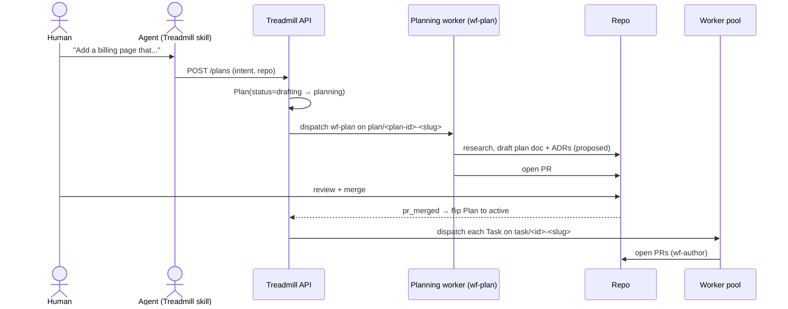

# ADR-0010: Plan-rooted task hierarchy

- **Status:** accepted
- **Date:** 2026-05-08
- **Related:** ADR-0001, ADR-0002, ADR-0004, ADR-0006, ADR-0007, ADR-0009

## Context

ADR-0009 sequences Treadmill in five phases; Phase 2 builds the API + first non-noop worker + CLI. We cannot author Phase 2's plan against an undecided entity model. Bunkhouse's task / workflow / role / epic hierarchy is proven in production, but several layers (BaseProfile composition, mutable workflow definitions, per-role container images implied by docs) either accreted as cruft or solved problems Treadmill does not need to solve the same way. We crib what works, simplify what does not, and add explicit support for two scenarios that bunkhouse does not directly model: (1) a human + orchestrator pre-author a plan doc and submit it; (2) a human submits brief intent and Treadmill plans the work.

## Decision

### Entity hierarchy

```
Plan
  ├── Task (1:N, immutable; references workflow_version)
  │     └── WorkflowRun (1:N, append-only)
  │           └── WorkflowRunStep (1:N, ordered)
  │                 └── Worker (1:1, ephemeral)
  └── (optional) child Plans — reserved via parent_plan_id, unused at v1
```

Every Task belongs to exactly one Plan. There are no orphan Tasks. A small fix submitted via `treadmill submit "fix the OAuth redirect"` creates an implicit Plan with `intent` populated and `doc_path` null; a real plan doc is authored only when work is significant enough to warrant one. **Even small fixes have a plan.** When a plan violates existing architectural norms (an existing ADR), it must also be paired with an ADR amendment or new ADR before transitioning from `drafting` / `planning` to `active`.

### Plan as first-class entity

`Plan` subsumes bunkhouse's `Epic`. The entity has a state machine:

```
drafting ──(human submits)──▶ active ─▶ completed
       └─(wf-plan dispatches)──▶ planning ──(plan-doc PR merges)──▶ active
                                                                      │
                                              ┌──(human cancels)──────┘
                                              ▼
                                          abandoned
```

Two paths through the machine map to two scenarios:

- **Scenario 1 (human-authored plan):** a human + orchestrator interactively author a plan doc on `plan/<slug>`, merge to main, then submit via `treadmill plan submit --doc <path>`. The Plan entity is created with `status=active` directly; `planning` is skipped. Tasks spawn from the doc's `## Sequence of work` section.
- **Scenario 2 (Treadmill-planned):** an agent calls `POST /api/v1/plans { intent, repo }`. Plan is created with `status=drafting`. Treadmill dispatches `wf-plan` against it (`status=planning`); the planning role authors the plan doc on `plan/<plan-id>-<slug>`, opens a PR, human (or, eventually, an adversarial LLM reviewer) merges. On merge, Treadmill auto-flips to `active` and spawns Tasks.

Plan fields: `id, repo, intent, doc_path, status, parent_plan_id (reserved), created_by, created_at, updated_at, completed_at`.

### Workflows: versioned, snapshot-on-submission

Workflow definitions are versioned. The table is `workflow_versions(workflow_id, version, definition_json, created_at)` and is append-only. A Task carries `workflow_version_id` referencing a specific row, set at submission time. Editing a workflow creates a new version row; pinned tasks are not affected.

### Starter workflows

Six workflows ship with Phase 2. Each is one or more steps; each step references a Role.

| Workflow | Trigger | Steps | Notes |
|---|---|---|---|
| `wf-plan` | `POST /api/v1/plans` with `intent` | research → plan-author | Produces plan doc + ADRs (proposed) |
| `wf-author` | task submission (S1 or S2) | author | Worker authors PR for one task |
| `wf-review` | `pr_opened` | review | Auto-fires on every PR |
| `wf-feedback` | `pr_review_submitted` | respond-to-feedback | Worker addresses review comments |
| `wf-ci-fix` | `check_run_completed` failed | fix-ci | Capped retry count |
| `wf-conflict` | merge conflict detected | resolve-conflict | Cribbed from bunkhouse pattern |

Additional workflows arrive on evidence, not speculation.

### Roles: three layers

A Role is `model + system_prompt + skills[] + hooks[] + compute_tier`. We **drop BaseProfile** — bunkhouse's community-sourced personality layer did not earn its place. If we ever need community personalities, we add them with evidence.

`compute_tier` is a first-class field. Phase 2 ships a single tier (`standard`) and a single image (`treadmill-worker:latest`). Per-tier images arrive when a tier's baseline deps genuinely differ — e.g., a future `gpu` tier with PyTorch + CUDA baked in. **One image per tier when tier deps differ; one image total when they don't.** We do not ship per-role images.

### Branch conventions

| Branch | When | Format |
|---|---|---|
| Plan-author branch | Plan doc authored (S1: by human; S2: by `wf-plan` worker) | `plan/<plan-id>-<slug>` |
| Task-execution branch | Worker picks up a Task | `task/<short-id>-<slugified-title>` |

Both formats use the entity ID prefix for unambiguous lookup, and a slug suffix for human readability. `<plan-id>` is the Plan's ID; `<short-id>` is the first 8 hex chars of the Task's UUID. For Scenario 1, the human picks the plan-author branch slug interactively; for Scenario 2, `wf-plan` derives it.

### PRs as organizing artifact

Every Plan-doc and every Task-execution lands as a PR. The PR is the gating artifact — review, validation, and merge happen there. Long-term, adversarial LLM reviewers (an LLM-as-judge gate per ADR-0001) replace most human review; a future ADR formalizes that direction. Phase 2 keeps human review on the critical path; the rule engine arrives in Phase 4 and starts blocking on rule violations.

## Alternatives considered

- **Keep Epic as a separate entity.** Rejected — Plan is the aggregator; cross-plan references and `parent_plan_id` cover any future hierarchy without inventing a parallel concept.
- **Allow orphan Tasks (no parent Plan).** Rejected — even small fixes deserve a stated *why*. An auto-created one-task Plan from CLI submission is the lowest-friction way to enforce this.
- **Mutable workflow definitions, no versioning.** Rejected — bunkhouse's experience showed silently-changing workflows are an audit and reproducibility hazard. Snapshot-on-submission costs one column.
- **Keep BaseProfile.** Rejected — composition added a layer without earning it. Roles author their full system prompt directly.
- **Per-role container images.** Rejected — bunkhouse's research showed the hierarchy was already one image per tier (and the GPU image tag is a latent build bug, not a feature). Per-role images would re-introduce a structure that doesn't exist.
- **Skip `wf-plan` for v1; only support pre-authored plans.** Rejected — Scenario 2 is half the value of Treadmill's "minimum runnable" target; Phase 2 must support both intake paths.

## Consequences

### Good
- Every Task has a parent Plan and a stated *why*. The audit trail is intrinsic.
- Workflow versioning makes runs reproducible; pinning at submission removes a class of "the workflow changed under us" failures.
- Three-layer roles are simpler to author and maintain than four.
- Branch conventions are unambiguous; both `plan/...` and `task/...` carry their entity ID, so lookup is mechanical.
- Scenario 2 (intent → planned plan) is supported from Phase 2, which makes Treadmill usable by humans without orchestrator skill from day one.

### Bad / trade-offs
- Required Plan parentage adds friction for small fixes; CLI auto-creates the Plan, but the entity is real and tracked.
- Workflow versioning is more table rows and more migration work than mutable definitions.
- `wf-plan` is the most agent-judgment-heavy workflow we ship; getting its prompt right is non-trivial.
- "ADR-pairing on architectural-norm violation" is a discipline before it is a check — Phase 4's rule engine enforces, but Phase 2 relies on author honesty.

### Risks
- **Plan ↔ Task parsing is brittle.** Extracting Tasks from a plan doc's `## Sequence of work` section requires either a strict format or LLM parsing. Mitigation: ship a strict YAML format for the section, with prose surrounding it.
- **`wf-plan`'s plan-doc PR becomes a bottleneck.** Every Scenario 2 submission gates on a human-reviewed plan doc. Mitigation: adversarial LLM reviewers (future ADR) take over most reviews once the rule engine ships.
- **BaseProfile turns out to have been load-bearing for a workload we haven't met.** Mitigation: ADRs are amendable; adding BaseProfile back is one column on `roles` and a composition step in the worker.

## Diagrams

### Scenario 1 — human-authored plan

```mermaid
sequenceDiagram
    actor Human
    actor Claude as Claude (orchestrator)
    participant Repo as Repo (main)
    participant API as Treadmill API
    participant Workers as Worker pool

    Human->>Claude: collaborate on plan doc
    Claude->>Repo: branch plan/<slug>; commit doc
    Claude->>Repo: open PR; merge to main
    Claude->>API: POST /plans (doc_path, repo)
    API->>API: Plan(status=active); spawn Tasks from doc
    API->>Workers: dispatch each Task on task/<id>-<slug>
    Workers->>Repo: open PRs (wf-author)
    Repo-->>API: pr_opened → wf-review (auto)
    Human->>Repo: review + merge
```

### Scenario 2 — Treadmill-planned



## References

- ADR-0001 — opinions #5, #6 (Ralph loop with LLM judge; learnings crystallize into rules).
- ADR-0002 — substrate; autoscaling primitive consumed by all workflow-run steps.
- ADR-0004 — diagrams as contract of intent; plan docs and ADRs both author conformant diagrams.
- ADR-0006 — rule primitive; `rule:plan-norm-conformance` is a future rule that enforces ADR-pairing on norm-violating plans.
- ADR-0007 — pre-prod env per changeset; consumes the `pr_opened` events emitted by this hierarchy.
- ADR-0009 — Phase 2 builds against this hierarchy; Phase 4 brings the rule engine that enforces it.
- Bunkhouse — shape reference for task / workflow / run / step; workflow lifecycle automation patterns.

## Follow-ups

- **Phase 2 plan** at `docs/plans/2026-05-08-minimum-runnable-treadmill.md` — written against this hierarchy, with diagrams that conform to ADR-0004.
- A future ADR formalizes **PRs as organizing artifact + adversarial LLM reviewers** as the long-term gating mechanism. Phase 2 ships with humans on the critical path; the adversarial-reviewer ADR scopes the transition.
- A future rule `rule:plan-norm-conformance` (Phase 4) — LLM-judge check that every plan with norm-violating decisions pairs with an ADR amendment or new ADR.
- A future ADR scopes the **plan-doc Task-extraction** format — strict YAML in `## Sequence of work` vs. LLM parsing of free prose. Decision deferred to first encounter; Phase 2 starts with strict YAML.
- A future ADR scopes per-tier image management when ML / GPU workloads land.
