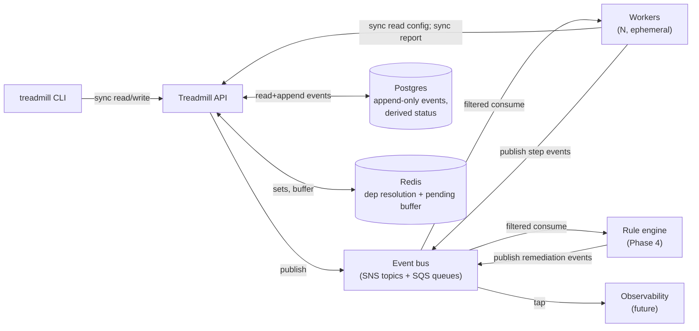

# ADR-0011: Event-driven, immutable runtime architecture

- **Status:** accepted
- **Date:** 2026-05-08
- **Related:** ADR-0001, ADR-0002, ADR-0010

## Context

Phase 2 (per ADR-0009) builds the API service, the first non-noop worker, and the CLI. Most of the supporting tech is settled by precedent — bunkhouse's existing operational shape gives us strong defaults for FastAPI, Postgres, alembic, Redis, and the SNS+SQS topology already provisioned by the spike's CDK. Those choices are commodity and earn brief mentions, not full ADRs.

The shape that *is* worth being pedantic about is the architectural opinion underneath: **events are the unit of coordination, and persisted state is append-only.** That opinion is what bunkhouse retrofitted into its cloud-native rewrite, what its first design got wrong, and what makes the validation / replay / audit story tractable. We adopt it from day one in Treadmill — and we say why so the future doesn't relitigate it.

## Decision

### Architectural opinion

Treadmill's runtime is **event-driven and immutable**. Two paired claims:

**1. Events are the unit of coordination.** Components communicate by publishing events to a bus (SNS topics today, per ADR-0002) and consuming from queues (SQS, with FIFO topics for ordering-sensitive entity types). The API does not call workers; workers do not call the API directly to discover work. Both publish and subscribe to the bus. Direct synchronous calls are reserved for read paths (CLI → API; worker → API for config fetch / status report) where the response is needed immediately and is cheap.

The reasons:

- **Long-running work cannot block synchronous handlers.** A coding worker can take minutes; the API serving a `POST /tasks` cannot hold open while a worker authors. Events decouple submission from execution.
- **New consumers are additive.** Adding observability taps, the rule engine, the autoscaler, or a future component that subscribes to events does not require changing the producers. The bus is the integration surface.
- **Retry, replay, and audit fall out naturally.** Events persisted in an `events` table can be replayed; consumers that fail can re-process; the timeline of any task is reconstructable from the event log alone.
- **Horizontal scaling is mechanical.** Workers consume from queues; the API does not know how many workers exist. Adding capacity is a matter of running more consumers.

**2. State is append-only; status is derived.** Tables for tasks, plans, workflow runs, workflow run steps, and events are immutable except for explicitly-marked status fields whose values are computed from the event log. We never mutate a task's `status` directly; we publish a `task.cancelled` event and let the derived view reflect it.

The reasons:

- **Race-free reads.** A task's status is the deterministic projection of its events. Two services updating the same status field at once cannot exist because no service writes the field directly.
- **Reproducibility.** A workflow run's full history — input role config, prompt at the time of run, outputs of each step, errors — is preserved. Reruns against historical state are possible.
- **Audit is intrinsic.** The `events` table answers every "who did what when" question without separate logging.
- **Bunkhouse proved the cost of *not* doing this.** Bunkhouse's first architecture had a mutable `status` column updated by 9+ code paths. It produced races, wrong-state bugs, and ultimately the cloud-native rewrite. We are not running that experiment again.

**Day-1 implementation: a `task_status` Postgres VIEW.** We crib the shape from bunkhouse migration 020 directly — three migrations of evolution (015 → 017 → 020) hardened the SQL, and we adopt the post-evolution form as the starting point. The VIEW evaluates five priority categories in order: `cancelled > blocked > registered > executing/failed > pr_state/done`. Active states carry a workflow-id prefix (e.g. `coding: executing`); failure states overlay PR lifecycle (e.g. `pr_merged (review: failed)` rather than collapsing to a generic `failed`). The VIEW is regular, not materialized, at v0; promotion to materialized is a future move when read cost demands it. No mutable status column, no triggers, no Python fallback — the VIEW is the source of truth.

The trade-offs we accept:

- **Event tables grow.** Mitigation: archival to S3 after a configurable retention window; the live DB carries the recent window.
- **"Status from events" is more SQL than a column.** Mitigation: encapsulate the projection in the `task_status` VIEW; consumers query the VIEW like any table.
- **Bug fixes that need to "rewrite history" are harder.** Mitigation: corrective events (e.g., `task.status_corrected`) override the projection without mutating the log.

### Commodity tech (terse)

Listed in one paragraph because none of it is open:

- **API:** FastAPI (Python ≥3.12) — async-native, type-hint-driven, OpenAPI for free, bunkhouse-proven.
- **Persistence:** Postgres (RDS Aurora Serverless v2 in AWS; container locally). Typed columns are the default; alembic for migrations. **JSONB is reserved for genuinely-polymorphic payloads** — `events.payload` and `workflow_run_steps.output` only — and even there, **Pydantic event-type / step-type models validate at every serialize/deserialize boundary**. No "metadata JSONB" on tasks, plans, roles, hooks, repos, workflows, or event-triggers. Bunkhouse's JSONB-creep is exactly what we are not doing; PG's value is strong contracts.
- **Cache + ephemeral state:** Redis. Used for dependency-resolution sets (`SADD` / `SDIFF` per bunkhouse pattern) and pending-event buffering for cache-then-heal (per ADR-0007).
- **Event bus:** SNS topics + SQS queues, FIFO where ordering matters, already provisioned by ADR-0002's CDK.
- **Container runtime:** Docker locally (per ADR-0002), ECS Fargate in AWS.
- **Build / package:** uv (workspace already set up).
- **Tests:** pytest, with `moto[server]` for AWS mocks (per the spike's pattern).
- **Protobuf for event payloads** is a future move — Phase 2 starts with JSON because the cost-benefit of protobuf is small until we have multiple language consumers. Bunkhouse used protobuf from day one in the cloud-native rewrite; we accept the asymmetric tradeoff and revisit when the second-language consumer appears.

These choices are not architectural opinions; they are the materials we work in. Any of them can be replaced when evidence demands.

## Alternatives considered

- **Synchronous request/response coordination.** Rejected — long-running workers cannot fit in HTTP request lifetimes. We would re-invent queues poorly.
- **Mutable status columns.** Rejected per the bunkhouse experience above — races, wrong-state bugs, and a rewrite. The cost of immutability is worth its returns.
- **A different language for the API** (Go, Rust, Node.js). Rejected — Python's ergonomics for orchestration code, ML-adjacent libraries, and bunkhouse's proven shape make it the lower-risk default. We can add a service in another language when a workload demands it.
- **A document store (Mongo, DynamoDB)** instead of Postgres. Rejected — the query patterns we have (relational dependencies, aggregations across tasks within a plan, foreign-key audits) are exactly what relational does well. JSONB covers payloads without forcing the rest of the schema into a different model.
- **Protobuf from day one.** Rejected as premature; revisit at the first second-language consumer.

## Consequences

### Good
- The architectural opinion is named; future debates can cite this ADR rather than rederive it.
- Commodity choices are settled and out of the way.
- Bunkhouse's cloud-native shape transfers cleanly — we do not re-prove what is already proven.
- The cost of immutability is understood up front; we do not stumble into the bunkhouse-original bug class.

### Bad / trade-offs
- **Event tables and event proliferation are real ops concerns.** We accept them.
- **The lack of protobuf at day one** means a future migration if second-language consumers arrive. We accept the deferred cost in exchange for a faster start.
- **JSONB-where-allowed is a freedom that can drift** if Pydantic models are skipped. Mitigation: every read/write of `events.payload` and `workflow_run_steps.output` goes through the per-type Pydantic model — never raw `dict[str, Any]` access. Reviewers reject code that bypasses.

### Risks
- **A team member from a synchronous-architecture background pushes back later.** Mitigation: this ADR exists; cite it.
- **Queue-depth-driven autoscaling tuning is non-trivial.** Per ADR-0002 and the spike post-mortem, oscillation is the obvious failure mode. Mitigation: monitoring and conservative defaults.
- **Replay correctness drifts.** A consumer that handles an event differently in a later version produces a different end state on replay. Mitigation: events carry version metadata; consumers honor the version they were written against.

## Diagram

## References

- ADR-0001 — opinions #4 and #5 (validation, Ralph loop with LLM judge) depend on event-driven coordination.
- ADR-0002 — substrate; SNS+SQS already provisioned; the autoscaling primitive consumes the architecture this ADR formalizes.
- ADR-0010 — Plan / Task / WorkflowRun / Step are append-only per this ADR.
- Bunkhouse cloud-native rewrite (`bunkhouse/docs/plans/cloud-native-architecture.md`) — the prior-art experience that informs the immutability claim.

## Follow-ups

- A future ADR scopes **protobuf adoption** when a second-language consumer is in scope.
- A future ADR scopes **event-versioning** conventions when consumers evolve faster than producers (or vice versa).
- A future ADR scopes **event archival** (cold S3 storage past N days) when the live `events` table outgrows convenient query times.
- A future ADR scopes the **`task_status` view promotion to MATERIALIZED** once read cost demands it; the regular VIEW ships from day 1.
