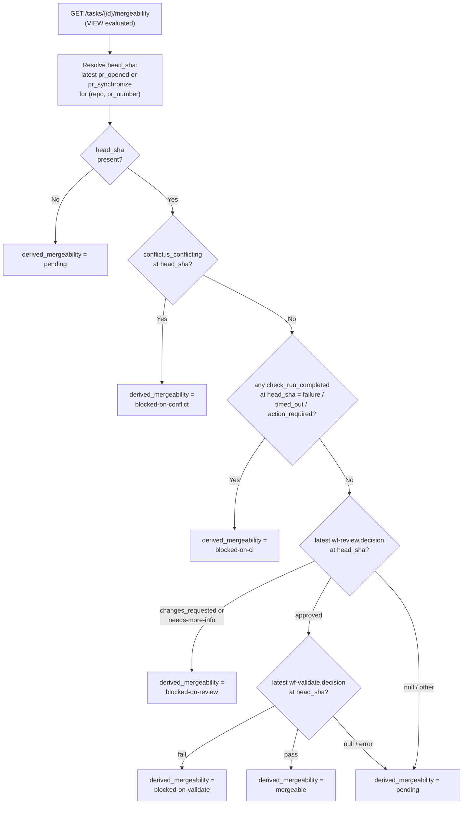
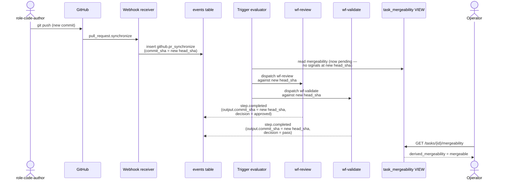

# ADR-0013: Per-commit mergeability VIEW

- **Status:** accepted
- **Date:** 2026-05-11
- **Related:** ADR-0007, ADR-0010, ADR-0011, ADR-0012, ADR-0014

## Context

Treadmill's job is to take a task from intent to a merged PR with as little human gating as is responsible. Phase 2 closed with `task_status` resolving a task's lifecycle position — `executing`, `pr_opened`, `pr_merged`, `done`. What `task_status` does *not* answer is the question that the dark-factory operating mode actually needs:

> **Is the diff at the HEAD of this task's PR currently mergeable?**

"Mergeable" is its own derived state. It depends on simultaneous greenness of multiple async signals, each produced by a separate workflow:

- `wf-review` — has a reviewer approved (or requested changes) on this specific commit?
- `wf-validate` — has the task's declared `validation:` block passed on this specific commit?
- GitHub `check_run_completed` — has CI succeeded on this specific commit?
- Conflict-detection sweep — is the PR currently conflicting with main?

The trick is that every push to the branch invalidates prior thumbs. A stale `changes_requested` from before the author pushed a fix is *not* a blocker on the new HEAD. A reviewer's approval of commit X does not approve a fix-up commit Y. The signals must be **commit-keyed**.

The user-blessed simplification on 2026-05-11: **no cancellation of in-flight workflow runs.** When a new push arrives, in-flight runs against the prior HEAD finish and land their outputs in the events table for history, but the mergeability calculation only consults the latest result *per check kind* at the *current HEAD*. The cost is wasted tokens on stale work; the benefit is dramatically less coordination machinery.

Auto-merge is **out of scope** for this ADR. v0 does not pull the trigger; a human (or GitHub branch protection rules) does. But the shape this ADR commits must support a future auto-merge orchestrator without schema migration.

This is a Treadmill addition vs. bunkhouse: bunkhouse models `review_passed` and `pr_merged` post-fact statuses in its `task_status` VIEW but never modeled `mergeable` pre-merge, never commit-keyed its thumbs, and relied on the human merge gate to catch the staleness. Treadmill is a stricter shape because the dark-factory mode demands it.

## Decision

### A `task_mergeability` VIEW, sibling to `task_status`

Ship mergeability as a Postgres VIEW, **not** as a mutable column on `task_prs`, **not** as a new event type, **not** as an extension of `task_status`. The reasoning:

- Mutable column violates ADR-0011 ("state is append-only; status is derived").
- A `task.mergeable` / `task.unmergeable` event would require *something* to compute mergeable before emitting it. That something is the VIEW logic, just sitting in Python — worse because events lag the underlying signals (review decision arrives → projector runs → emits mergeable), introducing a race and a duplication. The VIEW *is* the projection; making it an event would make it stale.
- Sibling VIEW (not extension of `task_status`) because the priority semantics differ — `task_status` cares about lifecycle (executing > done), mergeability cares about gate state at HEAD. Plus `task_status` is read by every list endpoint; widening it costs every list query while mergeability is a focused concern.

New migration: `services/api/alembic/versions/0006_task_mergeability_view.py`. The VIEW is regular (not materialized) at v0. Promotion to materialized is a future move per ADR-0011 when read cost demands.

### Derived states

The VIEW returns `derived_mergeability ∈ {mergeable, blocked-on-review, blocked-on-validate, blocked-on-ci, blocked-on-conflict, pending}`. Priority order (most-severe-blocker wins):

1. `pending` if there's no HEAD yet (no PR opened, no synchronize event).
2. `blocked-on-conflict` if the latest conflict signal at HEAD says the PR is conflicting.
3. `blocked-on-ci` if any `github.check_run_completed` at HEAD has `conclusion ∈ {failure, timed_out, action_required}`.
4. `blocked-on-review` if the latest `wf-review` at HEAD has `decision = 'changes_requested'` (or `'needs-more-info'`, which collapses to the same derived state but preserves the distinction in the underlying field).
5. `blocked-on-validate` if the latest `wf-validate` at HEAD has `decision = 'fail'`.
6. `mergeable` if all four signals are green (review approved, validate pass, CI success or no CI configured, no conflict).
7. `pending` otherwise (signals incomplete — some workflow hasn't run yet against HEAD).

This priority precedent matches `task_status` (migration `0002`) — most-severe-blocker wins.

### The VIEW shape (illustrative)

```sql
CREATE VIEW task_mergeability AS
SELECT
    t.id AS task_id,
    tp.repo,
    tp.pr_number,
    head.head_sha,
    review.decision AS review_decision,
    validate.decision AS validate_decision,
    ci.conclusion AS ci_conclusion,
    conflict.is_conflicting AS pr_conflicting,
    CASE
        WHEN head.head_sha IS NULL                              THEN 'pending'
        WHEN conflict.is_conflicting IS TRUE                     THEN 'blocked-on-conflict'
        WHEN ci.conclusion = 'failure'                           THEN 'blocked-on-ci'
        WHEN review.decision = 'changes_requested'               THEN 'blocked-on-review'
        WHEN review.decision = 'needs-more-info'                 THEN 'blocked-on-review'
        WHEN validate.decision = 'fail'                          THEN 'blocked-on-validate'
        WHEN review.decision = 'approved'
         AND validate.decision = 'pass'
         AND (ci.conclusion = 'success' OR ci.conclusion IS NULL)
         AND conflict.is_conflicting IS NOT TRUE                 THEN 'mergeable'
        ELSE 'pending'
    END AS derived_mergeability
FROM tasks t
JOIN task_prs tp ON tp.task_id = t.id
-- head: most recent pr_opened or pr_synchronize for the PR
LEFT JOIN LATERAL (
    SELECT (e.payload->>'head_sha') AS head_sha
    FROM events e
    WHERE e.entity_type = 'github'
      AND e.action IN ('pr_opened', 'pr_synchronize')
      AND (e.payload->>'repo') = tp.repo
      AND (e.payload->>'pr_number')::int = tp.pr_number
    ORDER BY e.created_at DESC
    LIMIT 1
) head ON true
-- review: latest wf-review step.completed at this HEAD
LEFT JOIN LATERAL (
    SELECT (s.output->>'decision') AS decision
    FROM workflow_run_steps s
    JOIN workflow_runs r ON r.id = s.run_id
    JOIN workflow_versions wv ON wv.id = r.workflow_version_id
    WHERE r.task_id = t.id
      AND wv.workflow_id = 'wf-review'
      AND s.status = 'completed'
      AND (s.output->>'commit_sha') = head.head_sha
    ORDER BY s.completed_at DESC
    LIMIT 1
) review ON true
-- validate: same shape, wf-validate
LEFT JOIN LATERAL ( ... 'wf-validate' ... ) validate ON true
-- ci: aggregated github.check_run_completed at HEAD
LEFT JOIN LATERAL (
    SELECT
        CASE WHEN EXISTS (
            SELECT 1 FROM events e2
            WHERE e2.entity_type = 'github'
              AND e2.action = 'check_run_completed'
              AND e2.commit_sha = head.head_sha
              AND (e2.payload->>'conclusion') IN ('failure', 'timed_out', 'action_required')
        ) THEN 'failure'
        WHEN EXISTS (
            SELECT 1 FROM events e2
            WHERE e2.entity_type = 'github'
              AND e2.action = 'check_run_completed'
              AND e2.commit_sha = head.head_sha
        ) THEN 'success'
        ELSE NULL
    END AS conclusion
) ci ON true
-- conflict: latest conflict-sweep result at HEAD
LEFT JOIN LATERAL ( ... ) conflict ON true;
```

The exact SQL lands in the migration; the shape is the contract.

The CASE-WHEN priority order in the VIEW *is* the mergeability state machine. Adding a new blocker means adding one clause + one derived state. The VIEW is the single seam.

### Workflow contribution matrix

What each starter workflow contributes to mergeability:

| Workflow | Contributes a thumb? | Field consulted | Notes |
|---|---|---|---|
| `wf-author` | No (writes the HEAD) | — | Authoring updates `task_prs` via consumer; `commit_sha` becomes the new HEAD basis. |
| `wf-plan` | No | — | Plan-doc creation; orthogonal to per-task mergeability. |
| `wf-review` | **Yes** | `output.decision ∈ {approved, changes_requested, needs-more-info}` | Latest *at HEAD* only. |
| `wf-validate` | **Yes** | `output.decision ∈ {pass, fail, error}` | Latest *at HEAD* only. |
| `wf-feedback` | No (writes a new HEAD or comments) | — | When it pushes code, that's a new `pr_synchronize`; prior thumbs invalidated by VIEW construction. When it comments without code change, mergeability is unchanged — the `changes_requested` thumb persists until a fresh `wf-review` run at the same HEAD returns `approved`. |
| `wf-ci-fix` | No (writes a new HEAD) | — | Pushes a fix → new `pr_synchronize`. The *CI signal itself* is the thumb (via webhook), not the workflow output. |
| `wf-conflict` | No (writes a new HEAD or signals conflict) | — | Same shape as `wf-ci-fix`. |
| (webhook) `github.check_run_completed` | **Yes** | aggregated conclusion at HEAD | |
| (webhook) `pr_conflict` (or `wf-conflict`'s push) | **Yes** | conflict flag at HEAD | |

### Per-commit invalidation by construction

The VIEW's `head.head_sha` is the latest `pr_opened` / `pr_synchronize` for the PR. Every signal (review, validate, ci) is filtered by `commit_sha = head.head_sha`. When a new push arrives:

1. The webhook receiver persists a `github.pr_synchronize` event with the new `head_sha`.
2. The VIEW's `head` subquery now returns the new SHA.
3. The signal subqueries find no `wf-review` / `wf-validate` rows for the new SHA → those fields become NULL → derived state falls back to `pending`.
4. Trigger evaluator (per ADR-0015 / Week 3 D.7) fires fresh `wf-review` + `wf-validate` against the new HEAD.
5. As each completes with a `commit_sha = new_head_sha` output, the VIEW re-resolves toward `mergeable`.

**No event cancellation, no run cancellation, no explicit invalidation logic.** The VIEW's filter is the invalidation. This is the user-blessed simplification.

The cost: in-flight workflow runs against the prior HEAD will finish, land their outputs, and never be consulted by the VIEW for mergeability. Token waste is the explicit price. If it becomes painful in Phase 4+, a `step.superseded` event + worker-side check at start is purely additive — no schema migration, no change to this ADR's contract.

### Surfaces

- `GET /api/v1/tasks/{id}` LEFT-JOINs `task_mergeability` and includes `mergeability` in the response (precedent: `task_status.derived_status` join in `routers/tasks.py`).
- New endpoint `GET /api/v1/tasks/{id}/mergeability` returns just the mergeability row. Single-purpose, doesn't widen the task contract; reserved for a future auto-merge orchestrator's polling.

### Auto-merge upgrade path

Out of scope for this ADR; documented for shape verification. A future `wf-auto-merge` orchestrator (or a dedicated auto-merge subscriber) polls `GET /tasks/{id}/mergeability` or subscribes to a future `task.mergeability_changed` event we add when value churn justifies it. On `mergeable`, it calls `gh pr merge` (or the GitHub API equivalent). **Zero schema change required** from this ADR's contract. The auto-merge ADR is Phase 5+ and explicitly purely additive.

## Bunkhouse precedent

- Bunkhouse models `review_passed` and `pr_merged` post-fact statuses in `migration 020`, never modeled `mergeable` pre-merge. **No precedent for the four-signal mergeability VIEW.** Treadmill is inventing this.
- Bunkhouse does not commit-key its thumbs. `wf-review.completed` "passes" by being the most recent run regardless of underlying push state. In practice bunkhouse relies on the human-merge gate to catch staleness; the merge is human, so the window is short. **Per-commit keying is a Treadmill addition**, motivated by the dark-factory operating mode.
- Bunkhouse's `_check_open_prs_for_conflicts` (`bunkhouse/services/api/bunkhouse/events/consumer.py:897`) is a polling conflict detector against GitHub's mergeable API with rate-limit + retry handling. **Treadmill cribs it intact** for ADR-0014's conflict-sweep work — detection lives in the webhook/consumer layer, not in `wf-conflict` (which is the resolver only).

## Trade-offs

- **In-flight runs against stale HEAD waste tokens.** Accepted explicitly. Cheaper than the cancellation machinery that would prevent it.
- **VIEW computation cost grows with events table size.** Mitigation: partial indexes on `events(task_id, commit_sha)` and `events(entity_type, action, commit_sha)` per the migration; promotion to materialized VIEW when read cost demands per ADR-0011.
- **The `changes_requested` thumb does not clear until a fresh `wf-review` at HEAD returns `approved`.** A `wf-feedback` "responded-without-change" outcome does not clear it (per user-blessed design — comments are not thumb-ups). The author must push a code change OR a re-review must run.
- **A `wf-review.needs-more-info` decision collapses to `blocked-on-review` in the derived state.** The distinction is preserved in `review_decision` for UI display but doesn't carve out a separate top-level state at v0.
- **Mergeability is read-time computed.** Operators inspecting `GET /tasks/{id}/mergeability` see the current state synthesized at query time. There is no historical "was this task mergeable at time T?" answer at v0 — the events table preserves the inputs but the VIEW only resolves the current view. A future audit-log VIEW could reconstruct historical state from events; out of scope here.

## Alternatives considered

- **Mutable `mergeable` column on `task_prs`.** Cheaper to read; violates ADR-0011's append-only opinion. Rejected — exactly the failure mode bunkhouse's first architecture had.
- **A `task.mergeable` / `task.unmergeable` event type.** Looks attractive ("project mergeable like step status") but produces a derivation problem: *something* computes mergeable before emitting. That something is the VIEW logic in Python, stale relative to its own inputs. Rejected.
- **Extension of `task_status` VIEW with mergeability mixed in.** Rejected for two reasons: priority semantics differ (lifecycle vs. gate); widening `task_status` costs every list query while mergeability is focused.
- **Task-keyed (not commit-keyed) mergeability.** The simpler thing the user implicitly endorsed by saying "no cancelled state on diffs." But the user *also* said "no thumbs down on the diff at the HEAD" — that *requires* commit-keying, otherwise stale `changes_requested` from a prior push never clears. Rejected.
- **Cancellation of in-flight runs on new push.** Cheaper in tokens; expensive in coordination machinery. User explicitly chose the simpler shape. Rejected for v0; purely additive if revisited later.
- **Conflict detection inside `wf-conflict` rather than the consumer layer.** Rejected per bunkhouse precedent. Detection is a polling concern with rate-limit + retry edge cases (`mergeable=null` retry-after). Centralizing in the webhook/consumer layer is what bunkhouse proved out (`_check_open_prs_for_conflicts`). `wf-conflict` is the resolver only.

## Open questions

- **Does a `wf-review.needs-more-info` decision warrant its own derived state** (e.g. `blocked-on-review-info` distinct from `blocked-on-review`)? v0 collapses; if operator feedback shows this matters, splitting is one VIEW clause. **Not blocking at v0.**
- **CI signal granularity:** `task_mergeability` aggregates all `check_run_completed` events at HEAD into a single `ci.conclusion`. Per-check breakdown (e.g. "tests passed but lint failed") is not exposed by this VIEW. A future endpoint can join the events table directly for that breakdown. **Not blocking at v0.**
- **How does the conflict-sweep frequency get tuned?** Bunkhouse polls on every `pr_merged` event for *all* open PRs. Treadmill cribs intact; tuning (per-PR-on-demand vs. global-sweep) is an ADR-0014 implementation detail. **Not blocking this ADR.**

## Consequences

- **ADR-0014** ships the `commit_sha` column on `events`, the `GithubPrSynchronize` payload class, and the conflict-sweep wiring. ADR-0013's VIEW reads what ADR-0014 writes.
- **ADR-0012**'s envelope `commit_sha` top-level field is the join target for the review / validate subqueries. The two ADRs must agree on the placement; this ADR's correctness depends on ADR-0012's choice.
- The Week-3 plan doc sequences the migration after the envelope work (since the VIEW's review / validate joins read `output->>'commit_sha'` per ADR-0012's promotion).
- A future auto-merge orchestrator is the user-visible value of this ADR. Until it ships, the VIEW serves as the operator-visible "is this ready to merge?" answer.

## Diagram

The VIEW resolves `derived_mergeability` by walking a fixed priority cascade over four commit-keyed signals at the current HEAD. Most-severe-blocker wins; `mergeable` is the conjunction of every green signal.



The per-commit invalidation flow: a new push to the PR moves `head_sha` forward; signal subqueries filtered by `commit_sha = head_sha` return NULL until fresh runs land outputs against the new HEAD.



## References

- ADR-0004 — diagrams as contract of intent.
- ADR-0011 — state is append-only; status is derived (VIEW, not mutable column).
- ADR-0012 — envelope `commit_sha` top-level field; VIEW joins on it.
- ADR-0014 — `events.commit_sha` column + `pr_synchronize` payload class.
- ADR-0031 — auto-merge orchestrator (downstream consumer of this VIEW).
