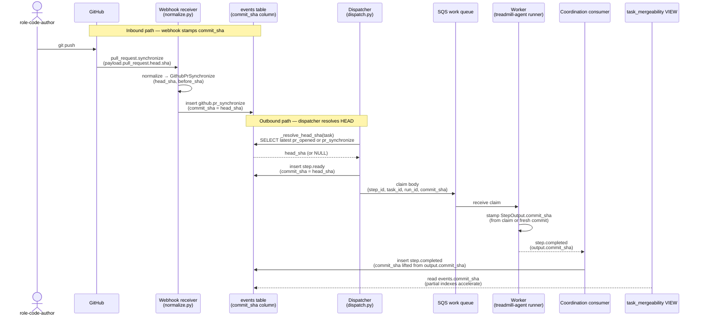

# ADR-0014: `commit_sha` plumbing and `pr_synchronize` event

- **Status:** accepted
- **Date:** 2026-05-11
- **Related:** ADR-0007, ADR-0011, ADR-0012, ADR-0013

## Context

ADR-0013 commits to a per-commit mergeability VIEW that joins workflow outputs and webhook events on `commit_sha`. ADR-0012 commits to a uniform StepOutput envelope with `commit_sha` as a top-level field. For both to work, the system needs three plumbing pieces that are not present today:

1. **An `events.commit_sha` column.** The VIEW's CI subquery filters `events` rows by `commit_sha` (for `github.check_run_completed` events). The events table today has no such column; the SHA is buried in `payload`.
2. **A `GithubPrSynchronize` payload class.** GitHub's `pull_request.synchronize` webhook arrives when a new push lands on an open PR. ADR-0007's normalizer maps the internal verb but no Pydantic class exists; the event is not registered.
3. **`commit_sha` populated on every event whose semantics are "I ran against (or describe) a specific HEAD."** Workers populate it on `step.completed` via the envelope; the webhook receiver populates it on `github.*` events; the dispatcher reads the current HEAD and stamps it on `step.ready`.

This ADR is small, mostly mechanical, and gates ADR-0013's correctness. Separated from ADR-0013 because the architectural shape (the VIEW) and the plumbing (where the SHA comes from) are independently reviewable — and because the plumbing has a small ripple beyond mergeability (every audit query that wants to scope by HEAD benefits from the column).

## Decision

### `events.commit_sha` column

New alembic migration `services/api/alembic/versions/0005_events_commit_sha.py`:

```python
op.add_column(
    "events",
    sa.Column("commit_sha", sa.Text(), nullable=True),
)
op.create_index(
    "ix_events_task_commit",
    "events",
    ["task_id", "commit_sha"],
    postgresql_where=sa.text("commit_sha IS NOT NULL"),
)
op.create_index(
    "ix_events_entity_action_commit",
    "events",
    ["entity_type", "action", "commit_sha"],
    postgresql_where=sa.text("commit_sha IS NOT NULL"),
)
```

The column is `nullable=True` because not every event has a commit (e.g. `plan.registered` is pre-commit). The partial indexes accelerate ADR-0013's VIEW joins without bloating the index over the NULL majority.

`services/api/treadmill_api/models/event.py` adds the column to the `Event` model.

The dispatcher and webhook receiver populate the column on writes; the column is *never* re-derived from `payload` after the fact. v0 has no production data so backfill is not a concern.

### `GithubPrSynchronize` payload class

New Pydantic class in `services/api/treadmill_api/events/github.py`:

```python
class GithubPrSynchronize(EventPayload):
    ENTITY_TYPE: ClassVar[str] = "github"
    ACTION: ClassVar[str] = "pr_synchronize"
    repo: str
    pr_number: int
    sender: str
    head_sha: str
    before_sha: str | None = None
```

Registered in `services/api/treadmill_api/events/registry.py:_REGISTRY_CLASSES`.

`services/api/treadmill_api/webhooks/normalize.py` adds a mapping for `pull_request.synchronize`:

```python
elif gh_action == "synchronize":
    return NormalizedEvent(
        entity_type="github",
        action="pr_synchronize",
        payload=GithubPrSynchronize(
            repo=repo,
            pr_number=pr["number"],
            sender=sender_login,
            head_sha=pr["head"]["sha"],
            before_sha=body.get("before"),
        ),
    )
```

The webhook receiver inserts the Event row with `commit_sha = payload.head_sha`.

### Other webhook events that populate `commit_sha`

- `github.pr_opened` — `commit_sha = pr.head.sha`.
- `github.check_run_completed` — `commit_sha = check_run.head_sha`.
- `github.pr_review_submitted` — `commit_sha = review.commit_id` (the commit the reviewer reviewed; GitHub guarantees this in the webhook payload).
- `github.pr_merged` — `commit_sha = pr.merge_commit_sha` (or `pr.head.sha` at merge time; check the webhook payload shape).

These are wire updates in `webhooks/normalize.py` + the receiver in `webhooks/router.py` — each event's normalizer pulls the right field from the GitHub payload and the receiver writes the column.

### Worker- and dispatcher-populated `commit_sha`

- **Dispatcher (`dispatch.py:dispatch_task`)**: when emitting `step.ready` for a task whose `task_prs` row exists, read the latest `head_sha` (from the most recent `pr_synchronize` or `pr_opened` for `(repo, pr_number)`) and set `commit_sha` on the `step.ready` Event row. This gives `step.started` and `step.completed` a target SHA to write into their envelope's `commit_sha` field. Tasks that have never opened a PR (the first `step.ready` from `wf-author`) emit with `commit_sha = NULL` — they're authoring the first commit.
- **Worker (`workers/agent/treadmill_agent/runner.py`)**: when constructing the `StepOutput` envelope per ADR-0012, populate `commit_sha` from the actual commit pushed (for `wf-author`, `wf-feedback`, `wf-ci-fix`, `wf-conflict`) or from the prior step's `commit_sha` (for `wf-review`, `wf-validate`, which run against an existing HEAD).
- **Coordination consumer (`coordination/consumer.py`)**: when persisting the `step.completed` Event row from the worker's SNS publish, copy `commit_sha` from `output.commit_sha` (the envelope's top-level field per ADR-0012) into the Event row's column.

### Dispatcher resolves HEAD at dispatch time

Add a helper `_resolve_head_sha(session, task)` in `dispatch.py`:

```python
async def _resolve_head_sha(session, task) -> str | None:
    """Return the latest known HEAD for the task's PR, or None if no PR exists."""
    result = await session.execute(text("""
        SELECT e.payload->>'head_sha' AS head_sha
        FROM events e
        JOIN task_prs tp ON tp.repo = e.payload->>'repo'
                        AND tp.pr_number = (e.payload->>'pr_number')::int
        WHERE tp.task_id = :task_id
          AND e.entity_type = 'github'
          AND e.action IN ('pr_opened', 'pr_synchronize')
        ORDER BY e.created_at DESC
        LIMIT 1
    """), {"task_id": task.id})
    row = result.first()
    return row.head_sha if row else None
```

`dispatch_task` calls this before publishing `step.ready` and includes the result on the Event row + the SQS claim body.

### SQS claim body extension

The work queue claim body (set by the dispatcher per Week-2's B.4) currently carries `step_id`, `task_id`, `plan_id`, `run_id`. Add `commit_sha` (nullable). The worker reads it into its WorkerContext and stamps the envelope `commit_sha` field at output time without re-querying.

```json
{"step_id": "...", "task_id": "...", "plan_id": "...", "run_id": "...", "commit_sha": "..."}
```

Workers tolerate `commit_sha = null` for the first `wf-author` step of a task (no PR yet exists).

## Bunkhouse precedent

- Bunkhouse does not have an `events.commit_sha` column. Its events table stores SHA only in `payload` (via JSONB extraction). This is a Treadmill addition driven by ADR-0013's VIEW requirements. The column promotion is justified because the VIEW joins on it heavily and the JSONB-extraction-everywhere pattern is exactly what ADR-0011 cautioned against ("JSONB is reserved for genuinely-polymorphic payloads").
- Bunkhouse's webhook receiver normalizes `pull_request.synchronize` similarly — Treadmill cribs the field-extraction shape from `bunkhouse/services/api/bunkhouse/webhooks/normalize.py` (or equivalent).

## Trade-offs

- **One more column on `events`.** The column is small (text), the indexes are partial, and the query patterns benefit. Net positive.
- **Dispatcher does one more SELECT before publishing.** The `_resolve_head_sha` query hits one indexed lookup. Mitigation if hot: cache HEAD on the `task_prs` row (mutable field on an otherwise append-only table — a precedent break, but only when measured cost demands).
- **Workers carry `commit_sha` through their lifecycle.** Adds a field to the claim body and the WorkerContext; trivial.
- **Backfill is required if we ever onboard from existing events.** v0 has no production data; the migration is forward-only. Future production migration may need a backfill script reading payload JSON; documented as a follow-up for the production-deploy ADR (out of scope here).

## Alternatives considered

- **Keep `commit_sha` in `payload` only; rely on JSONB extraction in the VIEW.** Rejected. The VIEW joins are hot path; JSON extraction is operationally worse than a typed column. ADR-0011's JSONB discipline cautions against this exact creep.
- **Compute HEAD lazily in the VIEW instead of stamping `commit_sha` on each event.** Rejected. The HEAD-at-event-time is what the VIEW needs; recomputing it from the latest `pr_synchronize` per-row would require correlated subqueries that are dramatically more expensive than a column read.
- **Add `commit_sha` to the `task_prs` table** (mutable column updated by the webhook receiver on `pr_synchronize`). Tempting because it's a single source for "current HEAD." Rejected because it's a precedent break on append-only state, and because the VIEW *also* needs the historical SHA per event (a single current-HEAD column doesn't suffice for "did this `wf-review` run against the current HEAD?").
- **Use GitHub commit SHA as the primary key on per-step output rows.** Rejected as over-engineering — multiple steps can run against the same SHA (review + validate); SHA-as-PK breaks the natural `(run_id, step_index)` uniqueness.

## Open questions

- **Should `events.commit_sha` be backfilled from `payload` on existing rows?** v0 has no production data so this is N/A. When production migration arrives, a backfill script reads `payload->>'head_sha'` / `payload->>'commit_id'` per event type. **Not blocking this ADR.**
- **Should the dispatcher cache `head_sha` on the `task_prs` row?** Speculative optimization. Measure first. **Not blocking.**

## Consequences

- ADR-0013's VIEW correctness depends on this ADR. The two land in sequence: 0014 ships the column + the payload class + the wiring; 0013 ships the VIEW that reads them.
- The dispatcher's SQS claim body grows by one field. Workers update the claim parser.
- The coordination consumer's `step.completed` handler copies `commit_sha` from envelope → Event row column. Already idempotent (the existing `_persist_event` already uses ON CONFLICT DO NOTHING per event_id); no race.
- A future production-deploy ADR captures the backfill requirement.

## Diagram

`commit_sha` flows along two paths: the inbound webhook path (GitHub push → `pr_synchronize` Event row with `commit_sha = head_sha`) and the outbound dispatch path (dispatcher resolves HEAD at dispatch time, stamps it on `step.ready` + the SQS claim, worker echoes it back through the envelope, consumer projects it into the Event row).



## References

- ADR-0004 — diagrams as contract of intent.
- ADR-0007 — webhook normalization layer.
- ADR-0011 — append-only events table.
- ADR-0012 — envelope `commit_sha` top-level field (the source consumer copies from).
- ADR-0013 — `task_mergeability` VIEW (the primary reader of `events.commit_sha`).
