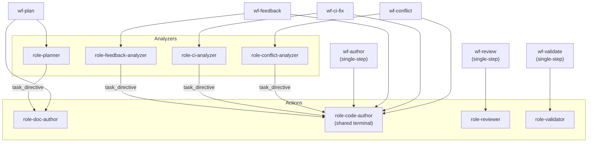

# ADR-0015: Multi-step workflows and role reuse

- **Status:** accepted
- **Date:** 2026-05-11
- **Related:** ADR-0010, ADR-0011, ADR-0012, ADR-0016

## Context

ADR-0010 defined the Plan → Task → WorkflowRun → Step hierarchy and committed to seven starter workflows: `wf-plan`, `wf-author`, `wf-review`, `wf-validate`, `wf-feedback`, `wf-ci-fix`, `wf-conflict`. The Phase-2 closure shipped them as single-step shells in `services/api/treadmill_api/starters.py` with one-paragraph system prompts. That was a placeholder — enough to let `wf-author` exercise end-to-end, not enough to be a Phase-3 product.

Two 2026-05-11 user directives constrain Phase-3's workflow design:

1. **Multi-step (multi-role) workflows from day one.** *"I don't think that multi-step multi-role workflows is something that we can kick down the road now. … And I think that not reusing the coding role is a big miss in bunkhouse."*
2. **Read-only workflows + roles at v0.** *"I agree that we should start with read-only versions of workflows and roles."* — i.e. code-managed via `starters.py`; CRUD endpoints exist but are operator-only.

The shape that earns its keep across the resolution workflows is **analyzer-then-action**: a comprehension step that translates an unstructured inbound signal (review comments, CI failure logs, conflict tree) into a structured "what to do" block, followed by an action step that executes. The reuse target is `role-code-author` — the *same* role across `wf-author`, `wf-feedback`, `wf-ci-fix`, `wf-conflict`. Specialization lives in the analyzer's prompt + the structured task directive it produces; the action role sees a uniform input regardless of which workflow it's in.

This corrects the bunkhouse miss the user explicitly named. Bunkhouse partially reuses `coding` (across `coding` / `feedback` / `conflict-resolve` / `wf-validation-fix` workflows) but carves out a separate `ci-fixer` role for `wf-ci-fix`. The action of pushing a fix is identical across all four; the analysis is what differs. Treadmill consolidates.

ADR-0012 (uniform envelope) is the contract for inter-step state passing. ADR-0013 (mergeability VIEW) reads `output.decision` per step. This ADR sequences alongside both.

## Decision

### The analyzer-then-action shape

Workflows whose inbound signal is unstructured and big (review comment threads, CI failure logs, conflict trees, bare intent) are **two-step**:

- **Step 1 — analyzer role.** Reads the inbound signal. Produces a structured "what to do" block in its `StepOutput.payload.task_directive` (convention; not statically typed per ADR-0012). Emits `decision ∈ {plan-ready, no-action-needed, blocked}` or workflow-specific equivalents (e.g. `not-our-bug`).
- **Step 2 — action role.** Reads the analyzer's `task_directive` (via the `prior_steps` API extension below). Executes — commits, pushes, opens PR / posts comment. Emits `decision` per the workflow's value-set in ADR-0012.

Workflows whose inbound signal is structured (the plan-doc's task spec for `wf-author`; the diff for `wf-review`; the `task.validation` block for `wf-validate`) are **single-step**.

### Per-workflow shape matrix

| Workflow | Steps | Roles | Step 1 input | Step 2 input | Decision values |
|---|---|---|---|---|---|
| `wf-author` | 1 | `role-code-author` | task spec from plan-doc parser | — | `pushed` / `blocked` / `no-changes` |
| `wf-plan` | 2 | `role-planner` → `role-doc-author` | bare intent | analyzer's plan_directive | step1: `plan-ready` / `blocked` ; step2: `plan-doc-pushed` / `blocked` |
| `wf-review` | 1 | `role-reviewer` | PR diff + task | — | `approved` / `changes_requested` / `needs-more-info` |
| `wf-validate` | 1 | `role-validator` | task.validation entries + repo at HEAD | — | `pass` / `fail` / `error` |
| `wf-feedback` | 2 | `role-feedback-analyzer` → `role-code-author` | PR review submission + task | analyzer's task_directive | step1: `plan-ready` / `no-action-needed` / `blocked` ; step2: `code-change-dispatched` / `responded-without-change` / `blocked` |
| `wf-ci-fix` | 2 | `role-ci-analyzer` → `role-code-author` | failing check + logs | analyzer's task_directive | step1: `plan-ready` / `not-our-bug` / `blocked` ; step2: `fix-pushed` / `gave-up` / `not-our-bug` |
| `wf-conflict` | 2 | `role-conflict-analyzer` → `role-code-author` | conflict tree + main HEAD | analyzer's task_directive | step1: `plan-ready` / `blocked` ; step2: `resolved` / `gave-up` |

`wf-feedback`'s step 2 is conditionally a code-change OR a comment. Both are executed by `role-code-author` (its skill set covers `gh pr comment` issuance in addition to code edits); when the analyzer's decision was `no-action-needed-but-respond`, the action step posts a comment instead of pushing code. Per `rule:purpose-before-collapse`, we do **not** carve a separate `role-commenter` until evidence shows it earns its own role.

### Why `wf-author` stays single-step

The user's framing mentioned `wf-author` in the list of analyzer+action candidates. The researcher pushed back, the user ratified: `wf-author`'s input is *already* structured (the plan-doc parser extracted intent, scope, files, validation per ADR-0010); an analyzer step in front would be solving a parsing problem better fixed upstream. **Push back on uniformity for its own sake.** The analyzer pattern earns its keep when the input is unstructured; uniformity is not a value in itself.

### Role taxonomy

Eight roles, code-managed in `services/api/treadmill_api/starters.py`:

- `role-planner` — analyzer for `wf-plan`. Researches the repo, produces a plan_directive.
- `role-doc-author` — action for `wf-plan`. Authors the plan doc + pushes + opens PR.
- `role-code-author` — **the shared terminal**. Action for `wf-author`, `wf-feedback`, `wf-ci-fix`, `wf-conflict`. Reads a task_directive (when present) or a task spec (for `wf-author`'s single-step path), edits code, commits, pushes, opens PR. Also handles the comment path for `wf-feedback`'s no-code-change branch.
- `role-reviewer` — `wf-review`'s single role. Reads the diff + task + plan intent, produces a structured review decision.
- `role-validator` — `wf-validate`'s single role. Runs the task's declared `validation:` entries against the repo at HEAD.
- `role-feedback-analyzer` — analyzer for `wf-feedback`. Classifies inbound review comments → task_directive (or no-action).
- `role-ci-analyzer` — analyzer for `wf-ci-fix`. Classifies CI failure logs → task_directive (or not-our-bug).
- `role-conflict-analyzer` — analyzer for `wf-conflict`. Reads the conflict tree → resolution directive.

**Compare bunkhouse:** four workflows share `coding` (corresponds to `role-code-author`); `ci-fix` uses a separate `ci-fixer`. The Treadmill correction: pull `ci-fix`'s action into `role-code-author`. The action of fixing-and-pushing is identical; the analysis is specialized.

Bunkhouse has no analyzer roles at all — each resolution workflow's single coding step does its own inline analysis. Splitting analysis from action is the **bunkhouse-correcting move** that earns its place even though bunkhouse didn't do it. The motivations:

- The analyzer's output is **debuggable** — humans can see what the system thought it was about to do before it did it.
- A cheap model (haiku) handles analysis; the action role can be the same or stronger.
- Conditional no-op via the analyzer's decision is cheap to express.
- The action role's prompt budget doesn't compete with analysis — the prompt is "execute this task_directive," not "comprehend this messy input AND execute."

### `task_directive` — the analyzer-action contract

Lives in `StepOutput.payload.task_directive` (convention, not statically typed; per ADR-0012's payload-discipline). Shape (illustrative):

```python
# convention; documented here, not enforced at the boundary
class TaskDirective:
    summary: str                 # one-line description of what the action should do
    files: list[str]             # files to edit (relative paths)
    intent: str                  # what to change and why
    out_of_scope: list[str]      # explicit guards against scope creep
    validation: list[dict]       # validation checks the action should satisfy (mirrors ADR-0010's task.validation)
```

This is the same shape as ADR-0010's `TaskSpec` from the plan-doc parser. The analyzer's job is to produce a plan-doc-task-spec-shaped directive from an unstructured inbound; the action role sees the same shape it sees when running from a real plan-doc. **The analyzer is a translator.**

### Inter-step state passing

The next step needs the prior step's output. Extend `GET /api/v1/steps/{id}` (`services/api/treadmill_api/routers/steps.py`) to return a `prior_steps` field — an ordered list of completed prior steps in the run with their full `StepOutput` envelopes:

```python
class StepContextResponse(BaseModel):
    step: WorkflowRunStepBlock         # the current step
    run: WorkflowRunBlock              # the run
    task: TaskBlock                    # the task
    plan: PlanBlock                    # the plan
    role: RoleBlock                    # current role
    prior_steps: list[PriorStepBlock]  # NEW — ordered list of completed prior steps
```

`PriorStepBlock` carries `step_index`, `step_name`, `role_id`, `status`, `output` (full `StepOutput` per ADR-0012). The worker looks at `prior_steps[0].output.payload.task_directive` for two-step workflows. Convention, not type-enforced.

The worker's prompt-composer (`workers/agent/treadmill_agent/claude_code.py`) gains one branch: if `prior_steps` is non-empty, fold prior step outputs into the input section. **This is the only worker-side change needed to make multi-step run** — the rest is API + dispatcher work.

### Cross-step dispatch

The Week-2 closure left dispatch as single-step: `Dispatcher.dispatch_task` publishes `step.ready` only for the first step. For multi-step workflows, the consumer takes over after step 1 completes:

- Coordination consumer's `step.completed` handler reads the run's `workflow_version_steps` ordered by `step_index`.
- If there's a next step (not yet running), publish `step.ready` + send the SQS work-queue claim for it (same shape as the dispatcher's first-step publish).
- If the prior step's `decision` is `blocked`, the next step still runs (no cancellation in v0); the action role sees a `task_directive=None` and emits `decision=blocked`. The run terminates at that step's completion.

New module: `services/api/treadmill_api/coordination/cross_step.py`. Cribs intact from bunkhouse `events/consumer.py:_on_step_completed` (around line 524) — the "Determine next pending step" pattern is bunkhouse-proven; rewrite in Treadmill's style.

The dispatcher's `dispatch_task` stays the single-step firing path; the consumer becomes the cross-step orchestrator. This matches ADR-0011's "consumer is the projector + cross-step orchestrator; dispatcher is single-shot."

The cross-step dispatch path reuses ADR-0008's `dispatch_publish_failed` marker shape — if SNS publish or SQS send fails on the next step, the marker fires + the replay loop heals. No new failure-handling needed.

### No cancellation; no step skipping; no-op via decision

Per the user-blessed simplification:

- Multi-step workflows **always** run every step. The analyzer-then-action shape never "skips the action step" because the analyzer said no-action-needed.
- The action step inspects the prior step's `decision`; if it's `no-action-needed` (or the workflow-specific equivalent), the action step runs, emits its own no-op (`decision='responded-without-change'` for `wf-feedback`, `decision='not-our-bug'` for `wf-ci-fix`, etc.), and the run terminates.
- The cost is one extra Claude Code invocation per no-op (small). The benefit is one simpler runtime model — no conditional step graph, no skip semantics.
- A future ADR may add proper conditional branching when evidence shows the no-op cost dominates.

### Operator-edited workflows at v0

Workflows and roles are **code-managed** at v0 via `services/api/treadmill_api/starters.py`. The CRUD endpoints (`POST /api/v1/workflows`, `/api/v1/roles`, etc.) exist but are operator-only:

- No CLI verb exposes them in the user-facing UX.
- No documentation surfaces them as a user-facing customization path.
- The `treadmill workflows seed-starters` CLI command (per Week-2 closure D.9) is the supported install path.

The future opening (an `/admin` surface, a marketplace-style flow, or user-editable workflows with version history) is not committed by this ADR. The v0 posture explicitly rejects bunkhouse's "users edit roles and workflows freely" model — per user direction: *"I'm not sure if we really want to allow users to change roles and workflows as much as we did in bunkhouse."*

This was originally proposed as a separate ADR-0016 ("Operator-edited workflows at v0"). Collapsing into this ADR because the posture is a one-paragraph implication of the eight-role taxonomy, not a separable architectural decision.

### `starters.py` rewrite

The current `starters.py` declares seven workflows, all single-step. Rewrite as eight roles + seven workflows, multi-step where the matrix above says. Test invariants in `test_starters.py` update accordingly:

- Every role referenced by a step is defined.
- No duplicate IDs.
- Required fields populated.
- **NEW invariant**: every 2-step workflow's step 1 is an analyzer role (id ends in `-analyzer`); step 2 is an action role.
- **NEW invariant**: `role-code-author` is referenced by exactly four workflows.

## Bunkhouse precedent

- **Role reuse** — bunkhouse partially does this (`coding` is reused by 4 workflows); `ci-fixer` is the carve-out. Treadmill consolidates: `ci-fix` action step uses `role-code-author`. The user-named bunkhouse miss.
- **Analyzer roles** — bunkhouse has none. Each resolution workflow's single coding step does its own analysis inline. Treadmill's split is an addition; the rationale is in "Decision" above.
- **Cross-step dispatch from the consumer** — bunkhouse's `events/consumer.py:_on_step_completed` is the precedent. Treadmill cribs intact.
- **Inter-step state via API GET** — bunkhouse passes step output to the next step via a similar API extension. Verified shape during the precedent check; the `prior_steps` field is conventional.
- **`task_directive` shape mirroring ADR-0010's `TaskSpec`** — Treadmill addition. Bunkhouse's resolution workflows pass raw payload to the coding role and let it parse. Treadmill's tighter contract (analyzer always produces a TaskSpec-shaped directive) is a discipline win.

## Trade-offs

- **Eight roles vs. four.** More prompts to author, more roles to test. Mitigation: the action role's prompt is one (reused); the analyzer prompts are focused on a single signal type (small).
- **Two LLM round-trips per resolution workflow.** Cost doubles vs. single-step. Mitigation: analyzers run haiku-class; per-run cost still small.
- **Convention-not-typed `task_directive`.** Same trade-off as ADR-0012's `payload` discipline. Mitigation: documented here + lint rule (future).
- **No conditional step graph.** Every step always runs. Cost: one extra Claude Code invocation per no-op. Benefit: dramatically simpler runtime.
- **No explicit cancellation.** In-flight runs against stale state finish anyway; outputs land in events and are ignored by ADR-0013's mergeability VIEW. Cost: wasted tokens. User-blessed.
- **Long-running ML tasks (e.g. multi-minute model training, large-context analyses) may not fit this shape cleanly.** This is a documented future concern, not addressed here. A future very-large ADR addresses step timeouts, mid-step checkpointing, and result polling for long-running workflows. The current shape assumes steps complete in seconds-to-low-minutes via the existing claude_code path; workflows that need hours are out of scope.

## Alternatives considered

- **Single-step everything; defer multi-step.** Rejected by user directive ("from day one"). The shape decision is cheaper to land now than retrofit after seven workflows ship single-step prompts that bake assumptions about what one role does.
- **Per-workflow specialized terminal roles** (`role-feedback-author`, `role-ci-fix-author`, `role-conflict-author`). What bunkhouse partially does; the user named not-reusing as the miss. Rejected.
- **One shared `role-resolution-analyzer` across the three resolution workflows.** The three signals diverge enough (review threads vs. CI logs vs. conflict trees) that one prompt would compromise on all three. Rejected.
- **Add a `wf-author` analyzer step for uniformity.** Rejected per the researcher's push-back + user's ratification. Structured input doesn't earn the analyzer pattern.
- **Cross-step orchestration via a new `step.queued` event** rather than `step.ready` re-emission from the consumer. Rejected — doubles dispatch surface for no payoff. The consumer just emits `step.ready` for the next step.
- **Conditional step graph with explicit `skip-if` clauses.** Rejected for v0. The "always run; no-op via decision" simplification is cheaper and the cost (one extra invocation per no-op) is acceptable. Purely additive if revisited later.
- **Promote `task_directive` to envelope top-level.** Rejected — would repeat the per-workflow-envelope-creep that the 2026-05-11 learning warned against. Stays in `payload`.

## Open questions

- **Q15.a — Does `role-code-author` need separate "skill" content for each invocation context?** Today the worker composes prompts from role.system_prompt + role.skills + task input. With four invocation contexts (fresh task, feedback follow-up, CI fix, conflict resolution), one general system prompt may be too thin. **Recommend:** start with one system prompt + per-invocation context derived from `prior_steps[0].output.payload.task_directive`. If specific workflows show prompt-failure modes, layer per-context skills onto the role (skills are ordered per role; the worker concatenates). **Not blocking the ADR.**
- **Q15.b — Cap policies for `wf-ci-fix` / `wf-conflict`.** Bunkhouse caps at 3 attempts each in `events/triggers.py` (`CI_FIX_MAX_ATTEMPTS`, `VALIDATION_FIX_MAX_ATTEMPTS`). The cap belongs in the trigger evaluator (Week-3 D.7), not the workflow definition. **Implementation detail for the Week-3 plan, not this ADR.**
- **Q15.c — How does the action step access prior steps from non-immediate ancestors** (e.g. step 3 reading step 1's output in a 3-step workflow)? v0 has no 3-step workflows; `prior_steps` returns all completed prior steps so the worker can pick by `step_index`. **Documented; not blocking.**

## Consequences

- ADR-0012's envelope is the contract for `prior_steps[i].output`. The `task_directive` lives in `payload`.
- ADR-0013's VIEW reads `output.decision` per step; the value-sets in this ADR's matrix are what the VIEW matches on.
- The Week-3 plan doc (`docs/plans/2026-05-12-week-3-mergeable-and-multi-step.md`) sequences the work: starters rewrite, prior_steps API extension, cross-step dispatch in consumer, then the per-role prompt authoring (which is the bulk of the actual work).
- ADR-0010's plan state machine and task hierarchy are unchanged; this ADR is purely a workflow-shape decision.
- A future very-large ADR addresses long-running ML tasks (step timeouts, checkpointing, polling). Out of scope here.

## Diagram

The analyzer-then-action handoff. The dispatcher fires only step 1; the coordination consumer takes over as cross-step orchestrator on `step.completed`, queries `prior_steps` shape via the API, and dispatches step 2 with the analyzer's `task_directive` riding in the envelope's `payload`.

```mermaid
sequenceDiagram
    participant Dispatcher
    participant SQS as SQS work queue
    participant Analyzer as Step 1 — analyzer role<br/>(role-feedback-analyzer /<br/>role-ci-analyzer /<br/>role-conflict-analyzer)
    participant API as Treadmill API<br/>(GET /steps/{id})
    participant Consumer as Coordination consumer<br/>(cross_step.py)
    participant Action as Step 2 — role-code-author
    participant GitHub

    Dispatcher->>SQS: claim for step 1
    SQS->>Analyzer: receive claim
    Analyzer->>API: GET /steps/{id}<br/>(read inbound signal +<br/>task + plan)
    Analyzer-->>Consumer: step.completed<br/>(payload.task_directive,<br/>decision ∈ {plan-ready,<br/>no-action-needed, blocked})
    Consumer->>Consumer: read workflow_version_steps<br/>by step_index; next step pending?
    alt next step exists
        Consumer->>SQS: claim for step 2<br/>(same shape as dispatcher)
        SQS->>Action: receive claim
        Action->>API: GET /steps/{id}<br/>(prior_steps includes step 1<br/>output envelope)
        alt task_directive present and<br/>step 1 decision = plan-ready
            Action->>GitHub: edit + commit + push +<br/>open PR (or update PR)
            Action-->>Consumer: step.completed<br/>(decision = code-change-dispatched /<br/>fix-pushed / resolved)
        else step 1 decision = no-action-needed
            Action->>GitHub: gh pr comment<br/>(responded-without-change)
            Action-->>Consumer: step.completed<br/>(decision = responded-without-change)
        else step 1 decision = blocked<br/>(task_directive = None)
            Action-->>Consumer: step.completed<br/>(decision = blocked,<br/>no GitHub action)
        end
    else single-step workflow
        Note over Consumer: run terminates after step 1
    end
```

Role topology: eight roles, one shared terminal (`role-code-author`) reused across four workflows.



## References

- ADR-0004 — diagrams as contract of intent.
- ADR-0010 — plan-rooted task hierarchy + `TaskSpec` shape that `task_directive` mirrors.
- ADR-0011 — consumer as projector + cross-step orchestrator.
- ADR-0012 — envelope is the contract for `prior_steps[i].output`; `task_directive` lives in `payload`.
- ADR-0013 — mergeability VIEW reads `output.decision` per the value-sets in this ADR.
