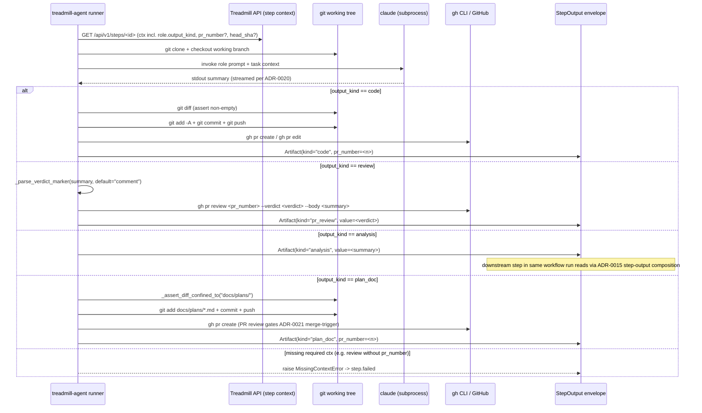

# ADR-0022: Role output kinds

- **Status:** proposed
- **Date:** 2026-05-12
- **Related:** ADR-0012, ADR-0015

## Context

The first autoscaler-driven smoke surfaced a real design gap. wf-review's worker booted, cloned the PR branch, ran Claude Code (which correctly produced a review observation: "the SMOKE.md file already exists at the repo root with the correct content"), and then **the runner failed** with:

```
CodeAuthorError: Claude Code produced no changes to commit
```

The streaming fix from ADR-0020 phase 2 made the diagnosis trivial: Claude Code did exactly what the reviewer role asked it to do — *review*, not *modify*. The runner, however, hard-codes a workflow that ends in `git add -A` + `git commit` + `git push` + `gh pr create`, and treats an empty diff as a failure. This is correct for `role-code-author`, the role this code was originally written against. It's wrong for every other seeded role:

| Role | Today's behavior | Intended behavior |
|------|------------------|-------------------|
| `role-code-author` | diff → commit → push → PR | unchanged (kind=`code`) |
| `role-reviewer` | empty diff → step.failed | post `gh pr review` (approve / request_changes / comment); kind=`review` |
| `role-validator` | empty diff → step.failed | placeholder (kind=`analysis`) at v0; proper Ralph-loop runner path lands with the validation ADR |
| `role-feedback-incorporator` | empty diff → step.failed | analysis consumed by a subsequent code-author step (kind=`analysis`) |
| `role-conflict-analyzer` | empty diff → step.failed | analysis (kind=`analysis`) |
| `role-ci-failure-analyzer` | empty diff → step.failed | analysis (kind=`analysis`) |
| `role-plan-author` | works (commits the plan doc) | kind=`plan_doc` — same as code but diff constrained to `docs/plans/*.md` |

The runner has been silently right about `role-code-author` and silently wrong about everything else. The smoke proves it: wf-review can't ever succeed against today's runner.

The fix has two halves: **declare what kind of output each role produces**, and **dispatch the runner's post-Claude-Code disposition on that kind**.

### Scope discipline: "validation" is reserved

One word in Treadmill's vocabulary is overloaded enough that we need to be explicit. **"Validation"** in this project's architecture refers to the Ralph-loop pattern: a per-task validator (deterministic check or LLM-as-judge) gates whether code-author output is accepted. The plan-doc parser already has a `validation:` block per task; `wf-validate` is the workflow that runs the checks; `role-validator` is the role.

This ADR does NOT introduce a `validation` output kind. Doing so would collide with the architectural meaning. See "What this ADR does NOT do" below.

## Decision

### Roles gain an `output_kind` field

The `Role` model gets a new required field: `output_kind: OutputKind`. Possible values at v0:

- `code` — produces arbitrary repo diffs that get committed and pushed; opens or updates a PR. **Empty diff is a failure** (the role was asked to make changes; it didn't). Today's runner behavior, unchanged.
- `review` — produces a PR review (approve / request_changes / comment). **Empty diff is a success**; the worker invokes `gh pr review` with Claude Code's stdout as the body. If Claude's output contains a parseable verdict marker (e.g., `VERDICT: approve`), it's used; otherwise the review is posted as a comment.
- `analysis` — produces structured analysis consumed by a downstream step in the same workflow run. **Empty diff is a success**; the worker writes Claude's output to the step's output envelope (`Artifact(kind="analysis", value="<text>")`). No PR-side side effect. The downstream step reads the upstream step's output via the existing step-output composition (ADR-0015).
- `plan_doc` — like `code`, but the diff MUST be confined to `docs/plans/*.md`. **Empty diff is a failure**; any diff touching files outside the plan-doc path is a failure. Commit → push → PR. The branch protection (the human-review gate) is what ADR-0021's merge-to-main trigger relies on.

`OutputKind` is a `StrEnum`. Spellings are lowercase snake_case (matching the ADR-0016 canonical-spellings discipline).

### What this ADR does NOT do: name collision avoidance

This ADR deliberately omits a `validation` kind. Treadmill already uses "validation" as the name of an **architectural pattern** — the Ralph-loop in which a per-task validator (deterministic or LLM-as-judge) gates progression of code-author output. The plan-doc `validation:` block declares the checks; `wf-validate` is the workflow that runs them; the verdict drives `wf-feedback` ↔ `wf-author` looping until the validator approves.

Reusing "validation" as a role-output-kind name (originally drafted as "post a check_run") would collide with the architectural concept and silently confuse the rest of the system. The role-validator role exists, but its proper output kind is a property of the Ralph-loop architecture, which earns its own ADR (see "Consequences" below). At v0, `role-validator` is classified as `analysis` — its output isn't yet routed anywhere because `wf-validate` is stubbed.

When the Ralph-loop validation ADR lands, it may introduce a new `output_kind` value, or it may handle validation via a different mechanism entirely (e.g., a non-Claude-Code runner path for deterministic checks). That decision is deferred.

A GitHub check_run mechanism (the originally-drafted `validation` kind) is still useful — for surfacing the Ralph-loop verdict to the PR UI — but it's an implementation detail of the validation handler, not a top-level role-output kind on its own. If a future role exists whose *only* purpose is to post a CI-style check_run with no Treadmill-internal gating, that's the moment to introduce a `check_run` output kind. YAGNI at v0.

### Per-kind runner dispatch

The runner's `_execute()` function (in `workers/agent/treadmill_agent/runner.py`) gets refactored:

1. **Shared prefix** (unchanged for all kinds): fetch the step's task context, clone the repo, check out the working branch, run Claude Code.
2. **Per-kind suffix** (new): a dispatch table keyed by `role.output_kind` calls a handler with `(ctx, claude_result, repo_dir)` and returns a `StepOutput` envelope.

The five v0 handlers:

```python
def _disposition_code(ctx, claude_result, repo_dir) -> StepOutput:
    # Today's logic: diff → commit → push → PR. Empty diff is a failure.
    ...

def _disposition_review(ctx, claude_result, repo_dir) -> StepOutput:
    verdict = _parse_verdict_marker(claude_result.summary, default="comment")
    pr_number = ctx.pr_number  # required for review-kind; raise if missing
    gh.pr_review(pr_number, verdict=verdict, body=claude_result.summary)
    return StepOutput(artifacts=[Artifact(kind="pr_review", value=verdict)])

def _disposition_analysis(ctx, claude_result, repo_dir) -> StepOutput:
    return StepOutput(artifacts=[Artifact(kind="analysis", value=claude_result.summary)])

def _disposition_plan_doc(ctx, claude_result, repo_dir) -> StepOutput:
    _assert_diff_confined_to(repo_dir, "docs/plans/")
    return _disposition_code(ctx, claude_result, repo_dir)  # reuse the code path
```

The shared prefix is identical across kinds — Claude Code still runs, output still streams (ADR-0020 phase 2). What changes is what the runner *does* with the result.

### Step context carries the disposition-relevant fields

`ctx` (the per-step context the runner builds from the API's `GET /api/v1/steps/<id>` response) gains:

- `pr_number: int | None` — the PR number this step relates to (required for `review`, optional for others).
- `head_sha: str | None` — the PR head commit SHA (optional today; future Ralph-loop validation ADR may need it).

These are derivable from the task + plan + run state today (the API knows the PR number via `task_prs` after wf-author opens one). The API endpoint serializes them into the step context. The runner reads them via the dispatch table.

Required fields raise `MissingContextError` if absent — e.g., a review-kind step against a task that hasn't opened a PR yet is a configuration error worth catching loudly.

### Verdict markers in Claude's output

For the `review` kind, the role's prompt instructs Claude to end its output with a verdict marker:

```
VERDICT: approve | request_changes | comment
```

on a line by itself near the end. The handler greps for the last matching line; if none found, falls back to `comment` (the safe default — never accidentally approves a PR Treadmill can't actually evaluate).

This keeps the prompt → handler contract simple (no JSON parsing, no structured output mode). If `claude --output-format json` becomes reliable (ADR-0020 Q20.c), the markers can be replaced with structured `verdict` fields without changing the runner's interface.

The Ralph-loop validation ADR may introduce its own verdict-marker convention, or may communicate verdicts through a different mechanism entirely (e.g., exit codes on deterministic checks). Out of scope here.

### Workflow validation (the static check, not the Ralph-loop): kinds must compose

ADR-0015 (multi-step workflows + role reuse) governs how workflow versions are defined. A workflow-shape validator (distinct from the Ralph-loop validation pattern) must reject:

- A `review` step in a position where no PR exists yet (e.g., the first step of wf-author — wf-author *opens* the PR, so its first step can't review).
- An `analysis` step whose downstream step doesn't read the artifact (orphan analysis = wasted run).
- A `plan_doc` step in a workflow that isn't wf-plan (the plan-doc constraint is workflow-specific).

This static-shape check at v0 is best-effort; mis-composed workflows surface at run time as `MissingContextError`. Stronger compile-time validation is a future cleanup.

### Migration of seeded roles

The starter roles seed via `services/api/treadmill_api/starters.py`. The seeder gets one new line per role declaring its kind:

```python
ROLES = [
    Role(id="role-code-author", ..., output_kind=OutputKind.CODE),
    Role(id="role-reviewer", ..., output_kind=OutputKind.REVIEW),
    Role(id="role-validator", ..., output_kind=OutputKind.ANALYSIS),  # placeholder at v0
    Role(id="role-feedback-incorporator", ..., output_kind=OutputKind.ANALYSIS),
    Role(id="role-conflict-analyzer", ..., output_kind=OutputKind.ANALYSIS),
    Role(id="role-ci-failure-analyzer", ..., output_kind=OutputKind.ANALYSIS),
    Role(id="role-plan-author", ..., output_kind=OutputKind.PLAN_DOC),
    # 8th role — verify in roles.py
]
```

`role-validator` is classified as `analysis` at v0 because `wf-validate` is stubbed; the role isn't actually invoked yet. The Ralph-loop validation ADR will reclassify it appropriately (likely introducing a new `OutputKind` value or moving `role-validator` to a non-Claude-Code runner path entirely).

The DB migration adds `output_kind` as NOT NULL with no default; existing seeded roles get updated as part of the migration's data fixup. New deployments seed with the kind set.

### Role prompts get verdict-marker instructions

`role-reviewer` gains a paragraph in its system prompt telling Claude to end its output with the `VERDICT:` marker convention. Other roles' prompts are unchanged at v0.

## Trade-offs

- **More state on each role** — one new field. Trivial cost; meaningful clarity gain.
- **More runner code** — 4 small dispatch handlers vs one monolithic `_execute`. Each handler is testable in isolation. Net: easier to reason about, easier to extend (e.g., a future `gh_issue` kind, or whatever the Ralph-loop validation ADR introduces).
- **Verdict-marker parsing is brittle** if Claude doesn't follow the convention. Mitigation: the default (`comment` for review) is benign; the operator can rerun. Future: switch to `--output-format json` when stable.
- **Cross-workflow coordination through `analysis` artifacts is already supported by ADR-0015's step-output composition** — we just weren't using it for non-code roles. This ADR clarifies it.
- **Role-prompt churn** — we have to edit role-reviewer's system prompt to teach the marker convention. Small one-time cost.
- **`role-validator` ships as a placeholder** — its proper handler waits for the Ralph-loop validation ADR. Until then, `wf-validate` continues to be stubbed (no behavior change from today).

## Alternatives considered

- **Include a `validation` or `check_run` output kind.** Originally drafted. Rejected for name collision: "validation" is the Ralph-loop architectural pattern (per-task LLM-as-judge or deterministic check that gates task progression). A role-output kind named "validation" would silently confuse the rest of the system. The Ralph-loop is forward-looking work that earns its own ADR; this ADR limits itself to the four kinds that don't collide.
- **Include a `check_run` output kind** (separate from validation) for "post a GitHub check_run." YAGNI at v0 — no current role is just "post a check_run with no Treadmill gating." When such a role exists, add the kind.
- **Runner inspects the working tree to decide what to do.** "Empty diff → post as comment" without an explicit role kind. Implicit; brittle (what if a code-author *should* have produced a diff but didn't?). Hard to validate at workflow-definition time. Rejected: explicit `output_kind` makes intent visible at compile time.
- **Per-role Python callable** (custom handler per role). More flexible than four kinds, but each new role becomes a code change. Four kinds covers the v0 surface; adding a fifth is a deliberate decision worth the friction. Rejected for v0.
- **Workflow declares the kind**, not the role. Workflows already carry the role reference; declaring kind there too is duplication. Roles are the right home. Rejected.
- **Skip the abstraction**: make wf-review's runner branch special-case its role. Solves the immediate bug but doesn't generalize to analyzers + plan_doc. Joe explicitly asked for a generalized solution. Rejected.
- **Use the existing `StepOutput.artifacts[0].kind` as the dispatch key.** That's the *output's* kind, not the *role's* intent. You can't decide what to do until after you've decided what to do. Confused. Rejected.

## Open questions

- **Q22.a — Does `role-plan-author` need a separate kind from `code`?** The diff-confined-to-paths constraint is the only distinction. v0 ships `plan_doc` as a separate kind so the constraint is enforceable; if the constraint moves into a generic per-role `allowed_paths` field, `plan_doc` collapses into `code` with a path restriction. Defer until we add the second path-restricted role.
- **Q22.b — Should analysis artifacts surface in observability?** ADR-0020's logs already capture Claude Code stdout per step; the artifact persistence is for the *downstream step* to consume. Observability is the live view; the artifact is the consumable handoff. Both useful; not duplicative.
- **Q22.c — How does verdict-marker parsing handle Claude saying both approve and request_changes in different paragraphs?** The handler takes the *last* line matching `VERDICT: ...`. If Claude is ambiguous, the role's prompt is wrong; treat that as a prompt-engineering issue, not a runner bug.
- **Q22.d — `gh pr review` / `gh api check-runs` failure modes?** Both can fail (network, permissions, PR closed, etc.). v0: bubble the failure up as a step.failed event with the gh CLI stderr captured. Future: retry semantics per handler.
- **Q22.e — Should the role's `output_kind` migrate the existing seeded-role test fixtures?** Yes — every test that creates a Role needs the new field. The migration test is the cheap way to confirm we caught them all.

## Consequences

- **DB migration** adds `output_kind` to the `roles` table. Existing seeded rows get their kind set in the same migration. Alembic upgrade runs at API startup (per the friction-point fix) so the schema is live before the API serves traffic.
- **API model** in `services/api/treadmill_api/models/roles.py` gains the field. Serializer + step-context endpoint propagate it.
- **Worker `Role` model** in `workers/agent/treadmill_agent/models/role.py` (or wherever) parses the field from the API response.
- **`workers/agent/treadmill_agent/runner.py`** refactors: shared prefix + dispatch table + 4 handlers. Each handler in a sibling module (`runner_dispositions/`) keeps the runner thin.
- **`workers/agent/treadmill_agent/gh.py`** gains `pr_review(pr_number, verdict, body)` helper. Subprocess shells out to `gh` CLI consistent with the existing pattern.
- **`services/api/treadmill_api/starters.py`** sets the kind on each seeded role.
- **Role prompts** for `role-reviewer` get verdict-marker instructions.
- **Workflow-shape validator** (in starters or a sibling module) gains kind-composition checks; v0 is best-effort.
- **wf-review smoke** rerun proves the path: PR opens → wf-review worker runs → posts a comment (or approves) → no false step.failed.
- **wf-feedback**, **wf-conflict**, **wf-ci-fix** become functional for the first time with this ADR — their analysis steps had no valid runner path before.
- **wf-validate stays stubbed** until the Ralph-loop validation ADR (forthcoming) defines its proper runner path. `role-validator` is classified as `analysis` as a placeholder; this is intentionally a "doesn't break anything, doesn't do anything new" state for it.
- **A follow-up ADR is owed**: the Ralph-loop validation pattern — per-task validator (deterministic or LLM-as-judge), `wf-validate` workflow, verdict-driven loop back to wf-feedback. That ADR will likely reclassify `role-validator` and may introduce a fifth `OutputKind` value or a separate non-Claude-Code runner path entirely.

## Diagram

The runner shares a prefix across kinds (clone, checkout, run Claude Code) and dispatches a per-kind disposition handler keyed by `role.output_kind`. Each handler produces a `StepOutput` envelope (ADR-0012) with kind-appropriate artifacts; only `code` and `plan_doc` push diffs to the remote.



`role-validator` is seeded as `analysis` at v0 (placeholder) because `wf-validate` is stubbed; the Ralph-loop validation ADR will reclassify it and may introduce a fifth `OutputKind` value or a separate non-Claude-Code runner path.
