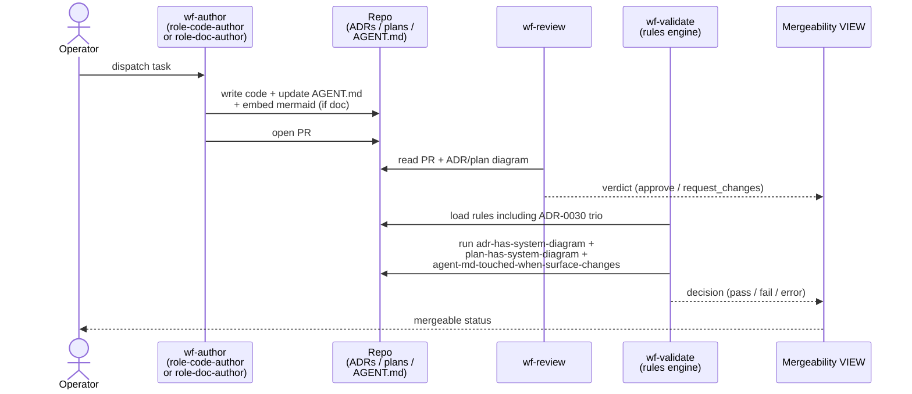
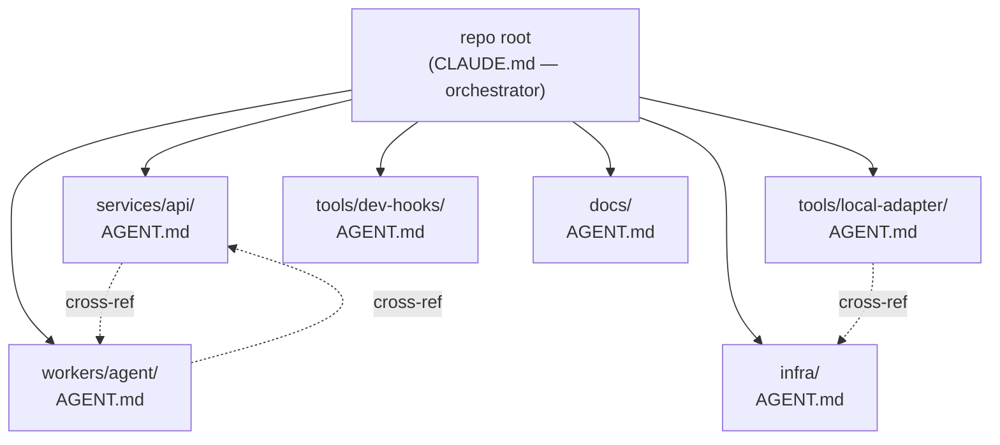

# ADR-0030: Federated in-repo agent context (mermaid + AGENT.md)

- **Status:** proposed
- **Date:** 2026-05-14
- **Related:** ADR-0004 (diagrams as contract of intent), ADR-0006 (rules + remediations primitive), ADR-0028 (DB-authoritative role configs), ADR-0029 (Ralph-loop validation runner)

## Context

The Treadmill-vs-Bunkhouse thesis was that an opinionated agentic
runner leaves **discrete, durable artifacts in the repo** — ADRs,
plans, learnings, rules — instead of burying context in chat.

The 2026-05-14 audit showed we have drifted. Of the fourteen ADRs
in ADR-0016 through ADR-0029, **zero** embed a mermaid diagram. Of
sixteen plans, **one** does. **Zero** `AGENT.md` files exist anywhere
in the tree.

Two visible consequences: (1) wf-validate has no canonical diagram
to compare implementation against — the gap behind the
`2026-05-14-authors-must-run-validation-before-submitting` learning;
(2) wf-author lands in unfamiliar components without an in-repo
breadcrumb, forced to read every ADR + grep for context. ADR-0031
(forthcoming auto-merge) compounds both — hands-free without
breadcrumbs is dangerous.

## Decision

We decided to require **federated in-repo agent context** as a
first-class concern, enforced at PR-merge time. ADR-0004 already
specifies the diagram half (when required, conformance criteria,
amendment protocol, judge contract); this ADR implements those
specifications and adds AGENT.md.

### 1. AGENT.md files at component roots

Each Treadmill component root carries an `AGENT.md` with required
sections:

- **Purpose** — one paragraph naming what lives here.
- **Key surfaces** — load-bearing files + their roles.
- **Recent changes** — last three notable changes with PR links.
- **Pitfalls** — gotchas, latent bugs, YAML-1.1-style traps.
- **Navigation** — pointers to adjacent components + relevant ADRs.

For Treadmill itself, the initial set is the ~6 roots:
`services/api/`, `workers/agent/`, `infra/`, `tools/local-adapter/`,
`tools/dev-hooks/`, `docs/`. Other repos that Treadmill manages
author their own `agent-md-locations.yaml` rule defining where THEIR
AGENT.md files belong (per the project-agnosticism principle of
ADR-0029).

### 2. Author setup so success is the easy path

Authors get told what to build against:

- `role-doc-author` (used by `wf-plan`) authors a mermaid diagram as
  part of every plan it drafts. Its system_prompt references
  ADR-0004's conformance checklist + diagram-type-by-decision-class
  guidance.
- `role-code-author` (used by `wf-author`, `wf-feedback`,
  `wf-ci-fix`, `wf-conflict`) **reads the plan's diagram + any
  cited ADR's diagram before implementing**. Its system_prompt
  explicitly instructs this discipline — the diagrams are the
  contract the implementation must conform to.
- `role-code-author` also updates the relevant component's
  `AGENT.md` when the change alters a load-bearing surface.
- `role-reviewer` flags missing diagrams + stale `AGENT.md` entries
  in `request_changes` verdicts.
- The `/decide` and `/plan` skill files reinforce the conformance
  checklist + diagram-type guidance, so operator-authored ADRs +
  Treadmill-authored plans share the same standard.

### 3. Rules enforce the policy

Four rules in `docs/knowledge-base/rules/`:

- `adr-and-plan-has-diagram.yaml` — deterministic grep for
  ` ```mermaid ` in new/changed ADRs and plans; severity blocking.
- `implementation-conforms-to-diagram.yaml` — fulfils ADR-0004's
  named follow-up. llm-judge applying ADR-0004's six conformance
  criteria + the four-outcome contract (`pass` /
  `fail-implementation` / `fail-diagram` / `uncertain`); severity
  blocking on `fail-implementation`, advisory on `fail-diagram` and
  `uncertain` (operator-mediated).
- `agent-md-section-presence.yaml` — deterministic check that every
  AGENT.md file has the five required section headers; severity
  blocking.
- `docs-current-with-pr.yaml` — llm-judge that reads the local
  relevant docs (touched component's AGENT.md, cited ADRs/plans,
  adjacent docs) and decides: should docs have been updated by this
  PR? Were they? Both conditions must hold; severity blocking. This
  is the **drift-prevention surface** — code drifting from
  documentation is the failure mode we are explicitly preventing.

### 4. Backfill discipline

After ADR-0030 + its plan land, Treadmill dispatches the backfill
recursively (Q30.e). Backfill PRs surface three classes of gap:

- **Class A** — clean: ADR intent matches code. Diagram is
  documentation. Standard PR flow.
- **Class B** — drift: intent and code both reasonable but
  divergent. Per ADR-0004's amendment protocol: diagram reflects
  current reality; ADR gets an amendment note.
- **Class C** — sub-optimality: code violates an architectural
  standard (DRY, async idempotency, etc.). The diagram surfaces
  this honestly. The PR also opens a `docs/learnings/` capturing
  the gap + flags it in the PR description. Operator decides:
  amend, supersede, or open a remediation plan.

**Principle: honest current-state in the diagram, never aspirational.**
Sub-optimal reality must be visible — that visibility is what makes
the documented intent eventually correctable.

## Alternatives considered

- **Status quo — operator vigilance.** Rejected: fourteen
  consecutive ADRs without diagrams demonstrates vigilance is not a
  control.
- **Diagrams only, skip AGENT.md.** Rejected: diagrams serve the
  validator + the human reader; they do not give an agent landing
  in `workers/agent/` a navigation surface. The two artifacts solve
  different problems.
- **AGENT.md only, skip diagram rule.** Rejected: the diagram is
  the validator's comparison surface. Without it, wf-validate is
  prose-reasoning over ADR text — the mode that produced the
  `authors-must-run-validation` failure.
- **Auto-generate diagrams from code.** Rejected for v1: a generated
  diagram describes what exists, not what we intended; the inverse
  of what the validator needs. Reconsider later as a complementary
  artifact.
- **External docs site (Sphinx, MkDocs).** Rejected: fragments the
  surface across two homes and violates the "discrete artifacts in
  the repo" principle that motivated the Bunkhouse-to-Treadmill
  shift.

## Consequences

### Good

- wf-validate gains a concrete comparison surface — the diagram is
  the contract of intent.
- Agents have a structured breadcrumb when landing in a component
  rather than reading every file or every ADR.
- ADR-0031 (auto-merge) lands on a base where context stays current
  automatically.

### Bad / trade-offs

- Per-ADR / per-plan / per-surface-changing-PR authoring overhead.
- AGENT.md adds another artifact class to keep current; the rule
  costs wf-validate wall-clock time.

### Risks

- **Diagram-implementation drift** — correct at authoring, wrong six
  months later. Mitigated by `implementation-conforms-to-diagram`
  (per ADR-0004's amendment protocol).
- **AGENT.md proliferation noise** if "component root" creeps to
  every package. Mitigation: plan seeds a finite set; further files
  require justification.
- **LLM-judge variance.** Two rules are llm-judge. Mitigation:
  `fail-diagram` and `uncertain` outcomes are advisory, not blocking,
  so a single false-positive doesn't gate a merge.
- **Backfill surfaces latent code-vs-intent drift.** Mitigation:
  backfill PRs are operator-mediated; gaps surface as learnings +
  ADR amendments, not silent fixes. This is a feature, not a bug.

## Diagram

The decision establishes a four-actor enforcement loop:



The static topology of AGENT.md files across the repo (component
roots only, with cross-references):



## Follow-ups

The Open Questions resolved during the 2026-05-14 drafting
conversation are locked here for the plan to execute against:

- **Q30.a — diagram check shape.** Deterministic grep for any
  mermaid block + llm-judge applying ADR-0004's six conformance
  criteria and the four-outcome contract.
- **Q30.b — AGENT.md scope.** Roots only for Treadmill; other repos
  define their own roots via `agent-md-locations.yaml`.
- **Q30.c — AGENT.md schema strictness.** Free-form prose with
  required-section presence enforced by a deterministic rule.
- **Q30.d — maintenance trigger.** llm-judge reads local relevant
  docs (touched AGENT.md + cited ADRs/plans + adjacent docs) and
  decides should-have-been-updated AND was-updated.
- **Q30.e — backfill ordering.** Fully recursive — Treadmill does
  its own backfill.
- **Q30.f — diagram type guidance.** Treadmill prescribes diagram
  type per decision class; skills (`/decide`, `/plan`) carry the
  guidance; `role-doc-author`'s system_prompt references it.

Remaining open after this ADR:

- The exact prompt text for each role update is plan-level work.
- The shape of any new workflow (e.g. `wf-doc-amend`) needed to
  recursively backfill ADR/plan diagrams is plan-level work.
- The schema for `agent-md-locations.yaml` (the per-repo override
  for AGENT.md placement) is plan-level work.

## References

- ADR-0004 — diagrams as contract of intent (this ADR fulfils its
  named follow-up `rule:implementation-conforms-to-diagram`).
- ADR-0006 — rules + remediations primitive (this ADR adds four
  rules on top of that schema).
- ADR-0028 — DB-authoritative role configs (the §2 role-prompt
  updates route through `treadmill role update`, not code-side
  edits to `starters.py`).
- ADR-0029 — Ralph-loop validation runner + project-agnosticism
  principle (the runner this ADR's rules are evaluated by; the
  principle that lets `agent-md-locations.yaml` vary per repo).
- `docs/learnings/2026-05-14-authors-must-run-validation-before-submitting.md`
  — the validator-gap class this ADR addresses.
- `.claude/skills/decide/SKILL.md`, `.claude/skills/plan/SKILL.md` —
  carry the conformance checklist + diagram-type guidance.
