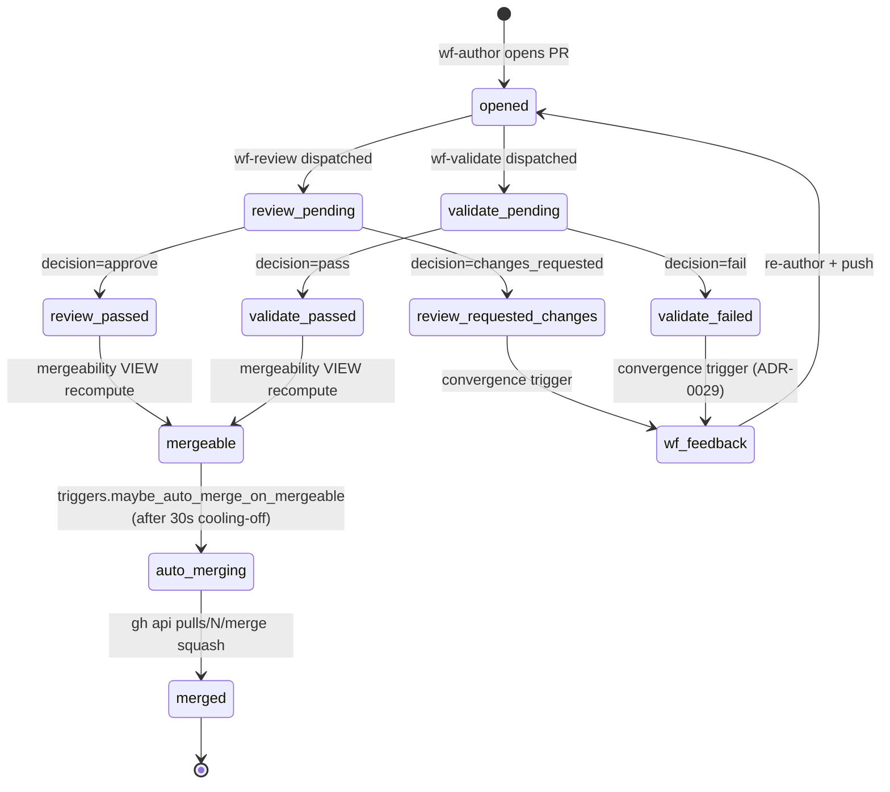

# ADR-0031: Auto-merge on mergeability=mergeable

- **Status:** accepted
- **Date:** 2026-05-14
- **Related:** ADR-0004 (diagrams as contract of intent), ADR-0023 (long-lived IAM keys), ADR-0029 (Ralph-loop validation runner), ADR-0030 (federated in-repo agent context)

## Context

Treadmill now produces PRs end-to-end without the SSO-TTL recurring outage (ADR-0023), with a real validation verdict from `wf-validate` (ADR-0029), against a federated context surface so the validator has something to compare against (ADR-0030). The remaining manual step in the loop is the operator merging each PR after `mergeability` flips to `mergeable`. That step is what currently gates hands-free driving — and what we decided to close here.

We chose this moment because the precondition stack is in place: long-lived credentials, a validation runner, in-repo diagrams and AGENT.md files. Auto-merge before those landed would have meant auto-merging into a system the validator did not actually evaluate.

The decision also rides on four task-level prerequisites surfaced during the 2026-05-14 push that auto-merge would otherwise compound:

- **#120 — wf-feedback duplicate PRs.** Re-author dispositions push to merged-then-deleted branches and `gh pr create` opens noise PRs. Auto-merge would silently land them.
- **#121 — authors skip their own validation.** Three PRs this push (#31, #33, #35) failed their declared validation scripts on first run. Auto-merge bakes the drift in before a human notices.
- **#124 — DB does not reflect main.** Operator-completed PRs leave the task layer permanently desynchronized; auto-merge magnifies the desync into a stuck downstream chain.
- **#125 + #126 — documentarian + architect roles.** Without them, drift surfaced by ADR-0030's backfill (or any future PR) has no role to author the amendment or capture the resolution — and auto-merge enshrines the gap.
- **#127 — GH Actions CI on PRs.** Treadmill has no CI gate today; the merge button is the only check. `wf-validate.pass` means "task-intent validation passed" — necessary but not sufficient. Auto-merge without an existing-test-suite gate ships regression-introducing PRs the moment task-intent + rules pass.

## Decision

We decided to auto-merge PRs via squash when **all** of the following hold: `mergeability` VIEW reads `mergeable`; `wf-validate.decision` is `pass` (NOT `uncertain` — see Q31.b); no human-review verdict is pending; and the PR's task is not opted out. The merger identity is the single PAT, same as the author identity (separate merger identity deferred to task #109 — GitHub-App migration).

Auto-merge fires from a new consumer trigger (`coordination/triggers.maybe_auto_merge_on_mergeable`) keyed on the `mergeability.changed.mergeable` event the existing VIEW already projects. The trigger calls `gh api pulls/{number}/merge` with `merge_method=squash` and emits a `task.<id>.auto_merged` event so downstream dispositions can observe the cause.

A 30-second cooling-off window applies to absorb event races between `wf-validate` and `wf-review`. Within that window any new event resets the timer. Per-plan opt-out is supported (the plan's front-matter may set `auto_merge: false`), but is expected to remain unused in steady state.

**LLM-judge outcomes**: ADR-0004's four-outcome contract (`pass` / `fail-implementation` / `fail-diagram` / `uncertain`) collapses to a binary at the auto-merge gate. `pass` proceeds; everything else — including `uncertain` — routes back to `wf-feedback` for rework rather than blocking on a human. Treadmill does not page humans in v1 (out of scope; awaits #109 / observability stack #98).

## Alternatives considered

- **Status quo — operator merges every PR.** Rejected because the validator/diagram/AGENT.md infrastructure exists specifically so the operator does not have to read every PR; keeping the manual gate negates that work.
- **Auto-merge with longer cooling-off (5+ minutes).** Rejected for v1 as too conservative. The validation runner is the gate, not wall-clock latency. We can dial up if races prove real.
- **Auto-merge only for a workflow subset (e.g., wf-author only).** Rejected because the per-rule severity field in ADR-0030's enforcement rules already gives us fine-grained control; introducing a second axis (workflow opt-in) duplicates the lever.
- **Formal merge queue via GitHub's built-in feature.** Rejected for v1 — heavy, requires branch protection changes, couples us to GitHub's specific behavior. Worth revisiting once #109 (GitHub App) is on the table.

## Consequences

### Good

- Hands-free driving closes: PRs land without operator intervention when the pipeline says they should.
- The validator becomes load-bearing in fact, not just in policy — the comparison surface ADR-0030 established gets exercised on every merge.
- Operator attention shifts to architectural review (ADR + plan authoring) rather than per-PR mechanical merges.

### Bad / trade-offs

- Bad merges land silently and fast. If `wf-validate` returns a false `pass`, regression reaches main without a human glance.
- The system's `pass`/`fail` discrimination becomes the entire safety surface. Rule quality matters more than it did under operator review.
- Reverting becomes the primary recovery affordance, since "block before merge" disappears.

### Risks

- **Merge storms.** A queue of mergeable PRs flushes simultaneously when the trigger fires. Mitigation: serialize per-repo via the existing dispatch lock; cap auto-merges per minute (Q31.d).
- **Validator false-positives turn into prod regressions.** Detection is via post-merge observation, not a runtime signal `wf-ci-fix` could surface — `wf-ci-fix` is correctly PR-scoped (requires `pr_number` in the event payload, per `coordination/triggers.py:_resolve_task_by_pr`) and never fires on main-branch check runs. Post-merge regressions require an external monitoring surface (Q31.d).
- **Documentarian/architect drift accumulation.** Mitigation: ADR-0030's `docs-current-with-pr` rule is blocking — drift fails the validator and prevents auto-merge.

## Diagram

The PR's lifecycle with the auto-merge transition explicit:

## Follow-ups

This ADR is blocked on five task-level prerequisites. Auto-merge does not ship before all five land:

- **#120** — code disposition skips `gh pr create` on re-author workflows.
- **#121** — author-side validation in code disposition (run validation script before `git push`).
- **#124** — DB ↔ main reconciliation (operator-completed PR linkage + branch-name fallback).
- **#125 + #126** — role-documentarian + role-architect (likely a single ADR-0032 covering both).
- **#127** — GH Actions CI on PRs + main (test suite runs as a check before `mergeability` flips to `mergeable`).

Open Questions resolved 2026-05-14 by operator review of this ADR:

- **Q31.a — cooling-off window.** 30s. Per-rule override not implemented in v1; revisit if races prove real.
- **Q31.b — `uncertain` handling.** `uncertain` does NOT auto-merge — it dispatches `wf-feedback` for rework. Treadmill does not page humans in v1 (paging is out of scope until #98 observability + #109 GitHub App).
- **Q31.c — opt-out granularity.** Per-plan, via plan front-matter (`auto_merge: false`). Not per-task, not per-workflow. Expected to remain unused.
- **Q31.d — circuit breaker.** No v1 implementation. `wf-ci-fix` is PR-scoped and never observes main-branch failures, so the framing from this ADR's earlier draft (count consecutive `wf-ci-fix` after merge) was wrong. Post-merge regressions need an external monitoring surface; route to #98 (observability stack) for the signal that would feed a future circuit breaker.
- **Q31.e — merger identity.** Single PAT for v1. Separate merger identity awaits #109 (GitHub App).
- **Q31.f — prerequisite completion gate.** The associated plan's **first phase** is verifying #120, #121, #124, and ADR-0032's plan are all merged. ADR-0031's implementation only dispatches when phase one signs off.

## References

- ADR-0004 — diagrams as contract of intent (the comparison surface auto-merge relies on).
- ADR-0023 — long-lived IAM keys (precondition: API runs indefinitely).
- ADR-0029 — Ralph-loop validation runner (precondition: real `wf-validate.decision`).
- ADR-0030 — federated in-repo agent context (precondition: validator has something to compare against).
- Task #120, #121, #124, #125, #126 — prerequisite work captured during ADR-0030 execution on 2026-05-14.
