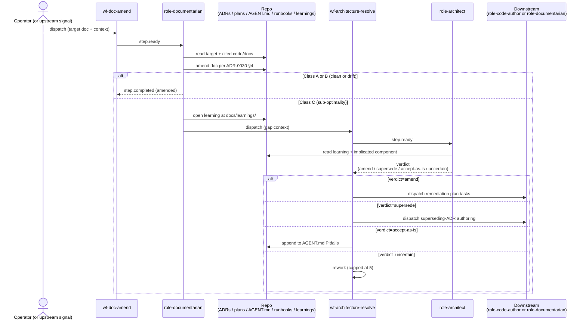

# ADR-0032: Documentarian + architect roles + drift-resolution workflows

- **Status:** proposed
- **Date:** 2026-05-14
- **Related:** ADR-0004 (diagrams as contract of intent), ADR-0022 (role output_kind taxonomy), ADR-0028 (DB-authoritative role configs), ADR-0030 (federated context), ADR-0031 (auto-merge)

## Context

ADR-0030 §4 established backfill discipline: when reality and intent diverge, the diagram reflects current reality (honest), gaps surface as learnings, and the operator decides remediation. ADR-0031 retires "operator decides" by committing to hands-free driving. The gap between the two is what this ADR closes.

Two distinct authoring needs are unmet:

- **Descriptive doc work** — backfill 18 ADRs and 15 plans with missing diagrams; keep AGENT.md files current; repair runbook drift. The on-disk artifact must reflect current reality. `role-code-author` already proved the wrong tool here: task #123 captured its hesitation on `.claude/` edits during ADR-0030 execution; `role-doc-author` is scoped narrowly to `plan_doc` output_kind and authors complete plans from briefs, not amendments to existing docs.
- **Prescriptive drift triage** — when descriptive work surfaces a sub-optimality gap (DRY violations, async/idempotency contradictions, code-vs-stated-intent divergence), someone has to decide: amend, supersede, accept-as-is, or open a remediation plan. Today nothing does. Learnings accumulate; drift compounds; auto-merge (ADR-0031) would silently enshrine each gap.

The 33-task backfill plan from ADR-0030 currently routes through `wf-author` / `role-code-author` — wrong tool, blocked dispatch.

## Gap classification

This ADR generalizes the three-class taxonomy ADR-0030 §4 introduced for backfill PRs. The classes apply to any PR — backfill, feature work, or fix — that touches a doc artifact or a documented component:

- **Class A — alignment.** Stated intent (in ADR / plan / AGENT.md) matches current code. The doc artifact captures reality. Standard PR flow.
- **Class B — drift.** Stated intent and current code both look reasonable, but they have diverged. Per ADR-0004's amendment protocol: the doc artifact is amended to reflect current reality; the originating ADR or plan gets an amendment note explaining what shifted and why. No new architectural decision required.
- **Class C — sub-optimality.** Current code violates an architectural standard the system has committed to (DRY, async-idempotency, named-actors-in-diagrams, etc.). Reality is wrong — or at least sub-optimal — and the honest diagram surfaces it. The gap demands a decision: amend the implementation to match intent, supersede the intent if it no longer applies, accept the gap with explicit acknowledgement, or open a remediation plan.

These three classes drive the workflows defined below. Class A/B are descriptive-only: `role-documentarian` handles them entirely. Class C requires prescriptive triage: `role-documentarian` opens a learning and hands off to `role-architect` via `wf-architecture-resolve`.

## Decision

We decided to introduce two new roles and two new workflows.

### role-documentarian + wf-doc-amend (descriptive)

`role-documentarian` authors amendments to existing documentation artifacts — ADR diagrams, AGENT.md updates, runbook repair. Its `output_kind` extends the `plan_doc` taxonomy to a broader `documentation` kind (Q32.a). The role is dispatched by `wf-doc-amend`, a single-step workflow:

> Step 1: `role-documentarian` reads the target artifact + the cited code/components + adjacent docs, then amends the artifact to reflect current reality per ADR-0030 §4. If a Class C gap is detected, the disposition opens a learning at `docs/learnings/<date>-<slug>-gap.md` and dispatches `wf-architecture-resolve` against the same task.

`wf-doc-amend` is the right vehicle for the ADR-0030 backfill: 33 tasks redirected to it once this ADR's plan lands.

### role-architect + wf-architecture-resolve (prescriptive)

`role-architect` triages Class C gaps. Its `output_kind` is `analysis`. The role returns one of four verdicts:

- **`amend`** — the ADR's stated intent is right; the code is the bug. Open a remediation plan.
- **`supersede`** — the ADR's stated intent is no longer right. Author a superseding ADR.
- **`accept-as-is`** — the gap is acceptable. Capture in the relevant AGENT.md's Pitfalls section.
- **`uncertain`** — block; route back for rework with more context (no human paging in v1 per ADR-0031 Q31.b).

`wf-architecture-resolve` is a two-step workflow: step 1 dispatches the architect; step 2 routes to the appropriate downstream role based on the verdict (`role-code-author` for remediation, `role-documentarian` for amend/supersede authoring, no-op for accept-as-is).

## Alternatives considered

- **Extend `role-doc-author` to cover all docs.** Rejected — conflates plan authoring (composition from brief) with doc amendment (reconciliation against reality); different prompts, different discipline.
- **Single role for descriptive + prescriptive work.** Rejected — "describe reality" and "decide direction" are different reasoning modes. Bundling them produces a role that's vague on both.
- **Skip; keep using `wf-author` / `role-code-author` for doc work.** Rejected — already proven not to work (task #123 captured the hesitation pattern).
- **Operator-mediated forever.** Rejected — defeats the hands-free goal of ADR-0031.

## Consequences

### Good

- ADR-0030 backfill dispatches cleanly through `wf-doc-amend`; 33 tasks land without operator scaffolding.
- ADR-0031 (auto-merge) lands on a base where drift has a resolution path, not just a queue of learnings.
- `role-documentarian` becomes the system's standing affordance for "make this doc reflect reality" — usable beyond ADR-0030 backfill.
- The architect's four-verdict contract makes triage decisions auditable; verdicts emit events for downstream observability (#98).

### Bad / trade-offs

- Two more roles to maintain prompts for (ADR-0028 DB-authoritative); seed scripts grow.
- `documentation` output_kind addition is a small schema change in ADR-0022's taxonomy.
- `wf-architecture-resolve`'s two-step shape is a new control-flow pattern; existing workflows are mostly single-step author + review.

### Risks

- **Architect over-triages.** Surfaces every minor drift as a Class C; remediation plan queue explodes. Mitigation: architect's prompt emphasizes `accept-as-is` as the default for small gaps; high bar for `supersede`.
- **Documentarian hesitates on `.claude/` like `role-code-author` did.** Mitigation: prompt explicitly authorizes edits to all task-scoped files including `.claude/skills/` and `.treadmill/` paths.
- **`uncertain` verdict creates infinite loops.** A rework dispatch returning `uncertain` again loops forever. Mitigation: cap rework dispatches per task (same 5-attempt cap as wf-feedback per ADR-0029 Q29.e).

## Diagram

The two workflows, with the conditional hand-off from descriptive to prescriptive:

## Follow-ups

Open Questions for the associated plan:

- **Q32.a — `output_kind` for documentarian.** Add `documentation` to the ADR-0022 taxonomy, or extend `plan_doc` to cover both?
- **Q32.b — AGENT.md ownership going forward.** ADR-0030 §2 says `role-code-author` updates AGENT.md when surfaces change. Does that stay, or does documentarian take exclusive ownership? (Lean: stays with code-author; documentarian only repairs drift.)
- **Q32.c — architect trigger.** Auto on Class C learning detection (current draft), or operator-dispatched only for v1? (Lean: auto, so hands-free works.)
- **Q32.d — verdict schema.** Should architect verdicts be a structured JSON envelope like ADR-0027's ReviewVerdict, or text the disposition parses?
- **Q32.e — cap on rework loops.** 5 per task (matching ADR-0029 Q29.e) — confirm.

## References

- ADR-0004 — diagrams as contract of intent (the conformance criteria documentarian applies).
- ADR-0022 — role output_kind taxonomy (this ADR adds `documentation`).
- ADR-0028 — DB-authoritative role configs (the new roles' prompts ship via `treadmill role update`, not code-side edits to `starters.py`).
- ADR-0030 — federated context + §4 backfill discipline (the motivating constraint).
- ADR-0031 — auto-merge (this ADR's roles are a prerequisite).
- Tasks #125, #126 — the captured surface this ADR formalizes.
- Task #123 — `role-code-author`'s hesitation on `.claude/` edits, the demonstration that this work needs different tooling.
