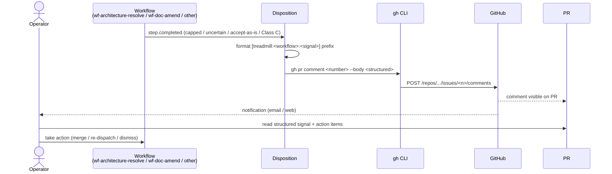

# ADR-0033: Git artifact discipline — commits, PRs, comments

- **Status:** accepted
- **Date:** 2026-05-14
- **Related:** ADR-0027 (Pydantic envelope pattern), ADR-0028 (DB-authoritative configs), ADR-0029 (validation runner), ADR-0030 (federated context), ADR-0031 (auto-merge), ADR-0032 (documentarian + architect roles)

## Context

Treadmill produces three kinds of git artifacts today: commits, PR descriptions, and (rarely) PR comments. Their content is inconsistent. Some commits cite the motivating task + plan + ADR; others say only what changed. Some PR descriptions include a Test plan; others don't. PR comments are essentially absent — `wf-feedback` re-authors against the same branch rather than commenting, and `wf-architecture-resolve` (forthcoming, per ADR-0032) doesn't yet have a surface for human-actionable signals.

Two problems compound. First, agents reading prior commits to understand context drift in unevenly — sometimes the why is in the body, sometimes only in the linked plan, sometimes only in the conversation that produced the commit (and that conversation is gone). Second, when the system needs a human — `uncertain` architect verdicts after the 5-attempt cap, `accept-as-is` decisions that warrant operator review, capped retries on any workflow — humans have nowhere to look except the PR description, which they may never re-read after the initial review.

ADR-0031 makes this gap urgent. When auto-merge fires, humans are not in the loop by default. The artifacts must be self-explanatory after the fact, and the system must surface "this needs you" signals proactively.

## Decision

We decided to standardize the three git artifact surfaces.

### Commit messages

Every Treadmill-authored commit carries:

```
<subject line — imperative mood, ≤72 chars>

<why — one or two paragraphs explaining the motivation, not the diff>

Refs: task/<task-id-prefix>, plan/<plan-slug>, ADR-<NNNN>
Co-Authored-By: <model identity> <noreply@anthropic.com>
```

The `Refs:` trailer is required when the change derives from a task, plan, or ADR. Omitting it for ad-hoc commits is permitted; omitting it for task-derived work is not. The trailer enables `git log --grep=ADR-0030` to surface every commit motivated by a given decision.

### PR descriptions

Every Treadmill-authored PR carries this structure:

```markdown
## Summary
<1–3 bullets — what the PR delivers>

## Why
<one paragraph — the motivating context; cite the ADR or plan that gates the work>

## Test plan
- [ ] <bullet per check the operator can run to verify>

## Validation
<the task's `validation:` script text, exactly>

## Refs
- Task: <id> in <plan-path>
- ADR: <NNNN-slug>
- Related: <other PRs / learnings / issues>
```

The `Validation` section quotes the task's own validation script so a reviewer can run it locally without consulting the plan doc. The `Refs` section makes the artifact graph navigable from GitHub alone.

### PR comments

PR comments are reserved for **human-actionable signals**. The disposition layer emits a PR comment (via `gh pr comment`) whenever:

- A workflow exhausts its retry cap (e.g., `wf-architecture-resolve` returns `uncertain` 5 times).
- An architect verdict is `accept-as-is` (operator should confirm the gap is genuinely acceptable).
- An ADR-0030 §4 Class C gap surfaces during backfill.
- Any future signal the operator must adjudicate.

Comments carry a structured prefix so they're machine-greppable later:

```
[treadmill:<workflow-id>:<signal-type>]

<one-paragraph human summary>

<bulleted action items>

See: <links to relevant artifacts>
```

Machine-readable signals (event-bus pubs, dedup keys, mergeability VIEW updates) continue through the existing event system — PR comments are exclusively for humans.

### Branch naming

Branches follow `task/<task-id-prefix>-<slug>` (already in use, now codified). The task-id-prefix is the first 8 characters of the task UUID. This enables the branch-name fallback in task #124's reconciliation flow.

## Alternatives considered

- **Status quo.** Rejected because auto-merge (ADR-0031) makes inconsistent artifacts dangerous: a human reading a year-old commit cannot reconstruct intent if the body skipped the `why`.
- **Richer commit trailers** (e.g., GitHub-style `Reviewed-by:`, `Fixes:`, `See-also:`). Rejected because the data lives in two places (commit + PR body) and inevitably drifts. Our single `Refs:` trailer + a structured PR description carry the same information without duplication.
- **JSON sidecar metadata files** under `.treadmill/commits/<sha>.json`. Rejected — fragments the artifact, requires custom tooling to read, defeats the discoverability of `git log` and `gh pr view`.
- **PR description templates enforced via GitHub Actions check.** Rejected for v1; the discipline rides on role prompts + the upcoming `docs-current-with-pr` rule. Revisit if drift proves unmanageable.

## Consequences

### Good

- An agent reading a six-month-old commit can answer "why" without leaving the artifact.
- A human scanning a PR queue can find the action items in a known place.
- `git log --grep=ADR-NNNN` and `gh pr list --search "[treadmill:wf-architecture-resolve"` become useful queries.
- Auto-merge (ADR-0031) ships into a base where post-hoc archaeology stays possible.

### Bad / trade-offs

- More structure per artifact = more tokens per commit/PR for agents to author.
- Role prompts grow to enforce the structure.
- Strict format means malformed artifacts fail the validator — slower iteration when prompts misbehave.

### Risks

- **Prompt drift.** Role prompts that author the format drift over time and the structure becomes vestigial. Mitigation: the upcoming `docs-current-with-pr` rule (ADR-0030 §3) checks PR descriptions for the required sections; severity blocking.
- **PR-comment noise.** Operator inbox fills with `[treadmill:*]` comments after auto-merge ramps up. Mitigation: comments only emit on the four signal classes above, not on routine events.

## Diagram

The PR-comment dispatch path is the load-bearing system interaction this ADR introduces:



## Follow-ups

Open Questions resolved 2026-05-14 by operator review:

- **Q33.a — commit-trailer enforcement.** Prompt-only for v1. No check.sh; if drift becomes a problem we revisit with a rule.
- **Q33.b — PR description rule.** New dedicated rule `pr-description-conforms` (not an extension of `docs-current-with-pr`). Separation of concerns: `docs-current-with-pr` checks the in-repo doc surface; `pr-description-conforms` checks the PR-side surface.
- **Q33.c — PR-comment template enforcement.** Template-based with required-section presence (mirrors AGENT.md schema discipline). No Pydantic envelope for the comment body — too heavy for what is essentially structured prose. The structured prefix `[treadmill:<workflow>:<signal>]` plus required sections (Summary / Action items / See) is enough.
- **Q33.d — back-application to historical commits.** Roll forward. History is what it is; the new shape applies to all new artifacts.

## References

- ADR-0027 — Pydantic envelope pattern (PR-comment body could follow the same discipline; Q33.c).
- ADR-0028 — DB-authoritative configs (role prompts that enforce the format live in the DB).
- ADR-0029 — validation runner (the rule that enforces the format runs here).
- ADR-0030 — federated context (PR description shape is part of the federated surface).
- ADR-0031 — auto-merge (the precipitating reason this matters now).
- ADR-0032 — architect verdicts (the `uncertain` and `accept-as-is` verdicts are the first PR-comment surfaces).
