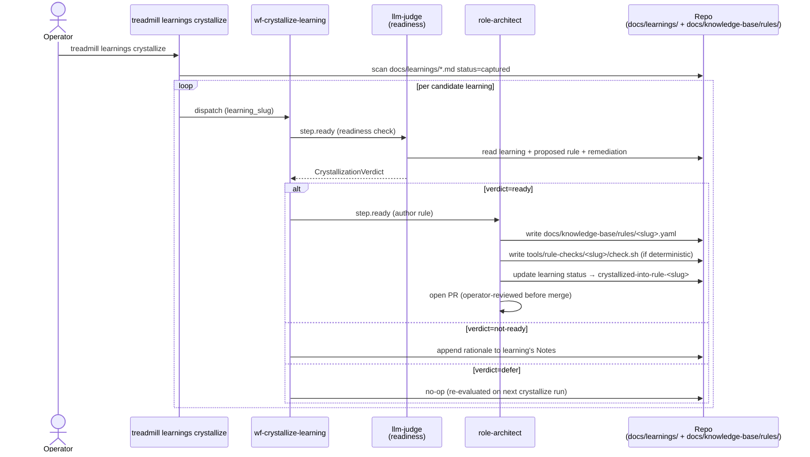

# ADR-0034: Learnings-to-rules crystallization pipeline

- **Status:** proposed
- **Date:** 2026-05-14
- **Related:** ADR-0001 (Treadmill as opinionated agentic runner — opinion #3 is learning), ADR-0006 (rules + remediations primitive), ADR-0008 (learning-capture skill + hook triggers), ADR-0030 (rules engine — the consumer side), ADR-0032 (role-architect — the role this ADR newly recruits)

## Context

ADR-0001's opinion #3 promises that Treadmill "learns from its mistakes." ADR-0008 shipped the capture side: an `UserPromptSubmit` hook detects correction phrases, the `/learning` skill writes structured artifacts to `docs/learnings/*.md`, and each carries a "proposed rule" + "proposed remediation" field by schema. Today's session alone produced ~10 learnings. The artifacts accumulate honestly.

The promotion side is missing. Today an operator who notices the same gap surfacing twice has to hand-author the rule in `docs/knowledge-base/rules/` and the matching script in `tools/rule-checks/<slug>/check.sh`, following the same patterns the proposed rule + remediation already describe. The schema is doing 80% of the authoring work in the learning itself; we just don't pick it up.

The cost is real. When `docs-current-with-pr` flags a Class C gap that a 2026-04-22 learning had already proposed a rule for, we have written evidence we knew + chose not to enforce. This ADR closes that loop.

## Decision

We decided to add a `wf-crystallize-learning` workflow with two steps:

**Step 1 — Readiness judge.** An llm-judge step (model: haiku per ADR-0029 Q29.b default) reads candidate learnings and returns a `CrystallizationVerdict` Pydantic envelope (patterned on ADR-0027 `ReviewVerdict` + ADR-0032 `ArchitectVerdict`):

```
class CrystallizationVerdict(BaseModel):
    verdict: Literal["ready", "not-ready", "defer"]
    reasoning: str
    learning_slug: str
    proposed_rule_slug: str | None = None   # populated when verdict == "ready"
```

Readiness criteria (codified in the judge's system_prompt):
- The learning's `proposed rule` field is non-`none`.
- The learning's `proposed remediation` field is non-`none`.
- The learning's `status` is `captured` (not `obsolete` or already-crystallized).
- The substance generalizes — the trigger isn't a one-off operational fact (those should be in a runbook, not a rule).

`verdict=defer` means the learning is plausibly ready but lacks enough signal yet (e.g., only one instance of the pattern). Defer rotates back to the candidate pool unchanged.

**Step 2 — Author the rule.** When verdict is `ready`, `role-architect` (from ADR-0032) is dispatched to author the rule YAML at `docs/knowledge-base/rules/<slug>.yaml` + the matching deterministic script at `tools/rule-checks/<slug>/check.sh` (when applicable). Architect treats the learning's `proposed rule` + `proposed remediation` as the spec, fleshes them into ADR-0006's schema, and validates the resulting YAML parses.

The same step updates the source learning's `status` field from `captured` to `crystallized-into-rule-<slug>` — closing the loop visibly in the artifact graph.

**Dispatch source for v1**: operator-initiated via `treadmill learnings crystallize` (CLI command processing all `captured`-status learnings + dispatching `wf-crystallize-learning` against each). Periodic dispatch (e.g., weekly audit) deferred to a future scheduler ADR.

## Alternatives considered

- **Status quo — learnings rot in `docs/learnings/`.** Rejected — directly contradicts ADR-0001 opinion #3 + lets known gaps repeat unchecked.
- **Bulk hand-author rules quarterly.** Rejected — too slow + bursty; high friction means it doesn't happen.
- **Auto-crystallize every captured learning.** Rejected — produces noise rules from spurious learnings; the readiness judge is the cheap filter that makes auto-promotion safe.
- **Require human review on every crystallization.** Rejected — defeats the automation purpose. Operators already review the rule when it shows up as a PR; gating crystallization itself is double-review.

## Consequences

### Good

- Today's learnings become tomorrow's automated checks without operator hand-authoring.
- ADR-0001's opinion #3 finally has machinery behind it.
- The dual-write (learning + rule) keeps the artifact graph navigable: rules cite the learning slug; learnings cite the rule slug. Walking from "why does this rule exist?" → "what incident motivated it?" is mechanical.

### Bad / trade-offs

- More llm-judge invocations on every learning corpus pass. Cost scales with learning count, not PR count, so it's bounded.
- Architect now has two job triggers (drift triage + crystallization) — prompt may grow.
- Rules authored by Treadmill may differ stylistically from operator-authored ones; reviewer rule discipline (style + naming) must hold.

### Risks

- **Over-eager crystallization** produces low-quality rules that block legitimate work. Mitigation: judge's `defer` outcome is the soft-no escape valve; the resulting PRs go through normal review before merging.
- **Learnings that resist crystallization accumulate.** Mitigation: judge returns `not-ready` with reasoning; operator can read the corpus periodically and decide whether to obsolete the learning or rephrase its proposed rule.
- **Rule + learning desync** when a rule is later superseded but the learning still cites it. Mitigation: status transition `crystallized-into-rule-<slug>` is documented; superseding the rule requires a follow-up edit to flip the learning's status to `obsolete` or to point at the superseding rule.

## Diagram

The crystallization loop, from operator dispatch to closed-loop status update:



## Follow-ups

Open Questions resolved 2026-05-14 by operator review:

- **Q34.a — `CrystallizationVerdict` schema location.** Own file at `services/api/treadmill_api/events/crystallization_verdict.py`, same as `ArchitectVerdict` (ADR-0032) lives at `events/architect_verdict.py`. Re-export from `events/__init__.py`.
- **Q34.b — readiness judge criteria.** Combination of **frequency** and **ease of deterministic remediation**. The judge's prompt weights two factors: (1) how often is this pattern surfacing? — measured by counting other learnings that cite the same trigger class, recent log mentions of the failure mode, or PR-comment hits on similar incidents; (2) how effortless is the proposed remediation? — deterministic checks (a grep, a script exit code, a deterministic rule) get more weight than llm-judge ones because they're closer to one-shot enforceability. Rough framing for the prompt: *"How often are we suffering from this, and how effortless is it to avoid?"*
- **Q34.c — bulk vs per-learning dispatch.** Single task that fans out internally. `treadmill learnings crystallize` dispatches **one** `wf-crystallize-learning` task that internally iterates the captured corpus.
- **Q34.d — periodic dispatch.** Same scheduler primitive ADR-0032 Q32.f deferred. Crystallization needs the same primitive. Worth noting from operator framing: *"This might be what moves us to OpenClaw or something similar"* — the scheduler ADR may pick an existing workflow engine rather than build from scratch.
- **Q34.e — `not-ready` re-evaluation cadence.** Backoff. A learning judged `not-ready` is reconsidered with exponentially-spaced gaps (e.g., re-evaluate in 1 day, then 3, then 7, then 14…). State carried in the learning's frontmatter as `last_crystallization_check: <date>` plus `crystallization_backoff_until: <date>`.
- **Q34.f — learning-status hygiene under rule supersession.** v1 holds the status `crystallized-into-rule-<slug>` at first crystallization and does NOT track downstream rule supersession. If rule R is later superseded by R', the learning still cites R. The artifact graph stays honest because R itself carries `superseded-by-R'` in its own frontmatter. Operators reading the learning trace `R` → `R.status: superseded by R'` → `R'`. No automated learning-status updates on rule supersession (could revisit if drift in practice).

## References

- ADR-0001 — opinion #3 (Treadmill learns from its mistakes).
- ADR-0006 — rules + remediations primitive (the schema the crystallized output conforms to).
- ADR-0008 — learning capture skill + hook triggers (the input pipeline).
- ADR-0027 — Pydantic envelope pattern (`CrystallizationVerdict` mirrors `ReviewVerdict`).
- ADR-0030 — rules engine (the runtime that consumes new rules).
- ADR-0032 — `role-architect` (the role this ADR newly recruits for rule authoring).
- `.claude/skills/learning/SKILL.md` — current schema + proposed-rule / proposed-remediation conventions.
