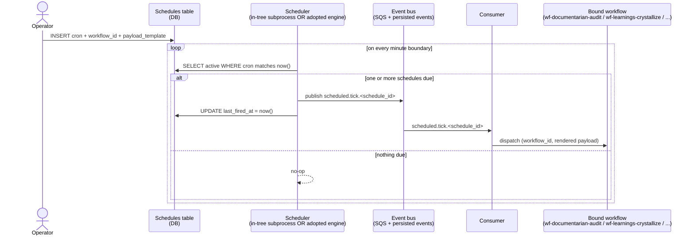

# ADR-0035: Scheduler primitive for periodic agent work

- **Status:** proposed
- **Date:** 2026-05-14
- **Related:** ADR-0011 (uniform event envelope), ADR-0018 (autoscaler — precedent for in-tree subprocess), ADR-0032 (documentarian — Q32.f deferred periodic dispatch), ADR-0034 (learnings crystallization — Q34.d deferred periodic dispatch)

## Context

Treadmill today is purely event-driven: SQS → consumer → dispatch. Nothing fires on a clock. Two recent ADRs surfaced a need for periodic agent work and explicitly deferred to a future scheduler:

- **ADR-0032 Q32.f**: periodic documentarian audit ("triage docs every Monday") for in-repo doc drift that wasn't caught by a PR-time rule.
- **ADR-0034 Q34.d**: periodic learnings-crystallization sweeps so backed-off learnings get reconsidered without operator intervention.

These two consumers are the visible cases. The broader pattern is "ops bots" — periodic doc-drift audit, daily learnings crystallization, weekly rule-corpus health check, hourly stale-task sweep, monthly cost-spend report. All need cron-like cadences against the existing workflow + role + dispatch system. The same pattern Treadmill's autoscaler (ADR-0018) implements for *worker-count control*; we want it for *temporal triggers*.

Operator framing 2026-05-14: *"This might be what moves us to OpenClaw or something similar"* — a workflow engine like OpenClaw, Temporal, Inngest, or similar may already solve this + adjacent problems (saga orchestration, retry semantics, distributed locks). Building from scratch may be reinventing.

## Decision

We decided to add a scheduler primitive whose **shape** is fixed here even though the **engine** is deferred to the associated plan.

**Shape** (load-bearing, decided now):

1. **Schedules are first-class DB rows.** A new `schedules` table: `id`, `cron_expression` (standard 5-field cron), `workflow_id` (the workflow to dispatch on each tick), `payload_template` (JSON template for the dispatch payload), `status` (`active` | `paused`), `last_fired_at`, `created_by`, `created_at`. Operators manage schedules via DB rows + a future CLI surface (Q35.e).

2. **Each fire emits a `scheduled.tick.<schedule_id>` event** into the existing event bus (ADR-0011's uniform envelope). The consumer's trigger evaluator dispatches the bound workflow, just as it does for github.* and step.* events today. No new dispatch path; the scheduler just *produces* events.

3. **Periodic consumers are otherwise normal workflows.** wf-documentarian-audit, wf-learnings-crystallize, wf-rule-corpus-health all become regular workflows whose first step is `role-*` analysis. No special "scheduled workflow" concept — schedules trigger normal workflows.

**Engine** (deferred to plan, Q35.a):

The decision *whether* to build (in-tree subprocess mirroring ADR-0018's autoscaler shape) or *adopt* (OpenClaw / Temporal / Inngest / similar) is plan-level work. The associated plan compares the candidates against (a) operational complexity, (b) deployment footprint in fully_local + dev_local + fully_remote topologies, (c) maturity of cron semantics + missed-tick handling, (d) Python-native vs separate runtime.

## Alternatives considered

- **Status quo — no scheduler.** Rejected because two accepted ADRs already depend on it and the ops-bot pattern is broader than those two.
- **Host crontab.** Rejected because it couples Treadmill to host-level scheduling; breaks fully_remote topology + makes schedules invisible to the rest of the system.
- **AWS EventBridge cron rules.** Rejected for v1: heavy infra (CDK rules, IAM, SNS plumbing), doesn't work in fully_local moto mode, opaque to operator unless we add observability bridges.
- **In-tree subprocess (autoscaler-shape).** Compatible with the shape above; deferred to plan to compare against engine adoption.
- **Adopt OpenClaw / Temporal / Inngest.** Compatible with the shape above; deferred. May bring saga semantics + retry semantics we'd want anyway.

## Consequences

### Good

- Periodic doc audits (ADR-0032 Q32.f) and crystallization sweeps (ADR-0034 Q34.d) become tractable.
- Ops-bot pattern is a first-class affordance, not a hack against the autoscaler or a host-cron afterthought.
- Schedules are observable + auditable as DB rows; future operators can read "what fires when and why" from the same surface they read tasks + plans.
- If we adopt OpenClaw/Temporal, we get retries + sagas + distributed locks "for free."

### Bad / trade-offs

- Engine choice is a real decision with operational cost (separate runtime to deploy/monitor vs in-tree-subprocess complexity).
- Cron is approachable but rigid; complex schedules ("every weekday at 9am unless it's a holiday") force higher-effort encoding.
- Schedules can fire across deploys + redeploys; idempotency burden on the consuming workflow (Q35.c).

### Risks

- **Thundering herd** at common cron boundaries (everything fires at 00:00 UTC). Mitigation: jitter (Q35.d) or stagger schedule design.
- **Missed ticks** when the scheduler is down across a fire window. Mitigation: missed-tick policy (Q35.c) — explicit catch-up vs skip.
- **Engine lock-in** if we adopt a framework that later doesn't fit. Mitigation: the shape decision (DB-rows + event-bus tick) is engine-agnostic; switching engines is a re-implementation of the scheduler subprocess, not a re-architecture.

## Diagram

The fire-then-dispatch flow, engine-agnostic:

## Follow-ups

Open Questions for the associated plan:

- **Q35.a — engine: build or adopt?** Compare in-tree autoscaler-shape subprocess against OpenClaw / Temporal / Inngest. Decide based on (a) topology fit (fully_local + dev_local + fully_remote), (b) Python-native, (c) cron + missed-tick semantics, (d) deployment footprint.
- **Q35.b — schedule row shape.** Standard 5-field cron, or 6-field with seconds? Payload templating syntax (Jinja2 vs simple `{{var}}` vs raw JSON only)?
- **Q35.c — missed-tick semantics.** When the scheduler is down across a fire window, do we catch up (fire every missed tick on recovery) or skip (only fire the most recent one)? Per-schedule override?
- **Q35.d — jitter.** Add per-schedule jitter (0-60s) to avoid thundering herd at common cron boundaries?
- **Q35.e — operator CLI.** `treadmill schedules list`, `create`, `pause`, `resume`, `delete`. What's the minimal v1 surface?
- **Q35.f — observability.** How does an operator see "which schedule fired when, what it dispatched, did it succeed?" Likely routes through ADR-0020 observability stack once that lands.

## References

- ADR-0011 — uniform event envelope (`scheduled.tick.<schedule_id>` is just another event under the same shape).
- ADR-0018 — autoscaler precedent for in-tree subprocess (one option for engine).
- ADR-0020 — observability stack (will consume scheduler signals once it lands).
- ADR-0032 §Q32.f — first consumer (periodic documentarian audit).
- ADR-0034 §Q34.d — second consumer (periodic learnings crystallization).
- OpenClaw, Temporal, Inngest — candidate engines for Q35.a evaluation.
