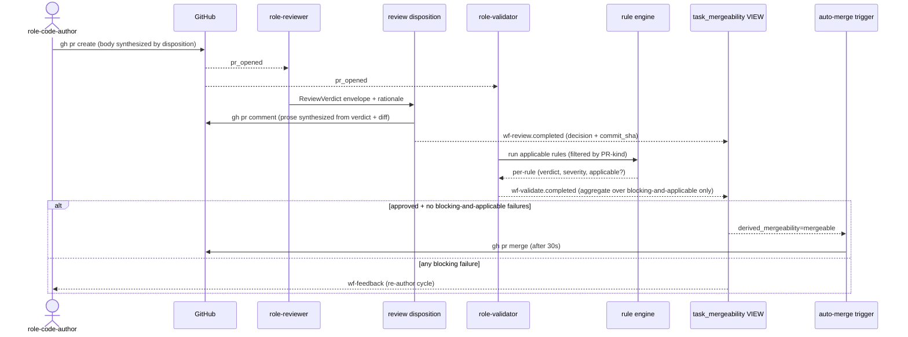

# ADR-0036: Hands-free review and validation discipline

- **Status:** amended by ADR-0037
- **Date:** 2026-05-15
- **Related:** ADR-0006 (rules + remediations primitive), ADR-0013 (mergeability VIEW), ADR-0027 (structured review envelope), ADR-0029 (validator + rule engine — esp. Q29.f), ADR-0031 (auto-merge predicate), ADR-0033 (git artifact discipline)

## Context

The first end-to-end smoke for ADR-0031 auto-merge surfaced that the gate machinery we decided in pieces does not converge under realistic conditions. Two failure shapes recur.

**Shape 1 — channel divergence.** The reviewer's prose narrative and the structured verdict disagree. On smoke 1c the PR comment body read *"the task is already complete"* while the JSON envelope emitted `request_changes`. ADR-0027 made the verdict structured, but the prose alongside it is still LLM-authored free text. The downstream consumer reads the envelope; the human reads the prose; the two can drift, and nothing detects the contradiction.

**Shape 2 — gate misfit.** The validator's rule set is calibrated for human PRs: `pr-description-conforms` (five required headers), `tests-exercise-success-criteria` (LLM-judge that the diff carries proof), `surface-changes-have-doc-updates`. A trivial bot PR — one line appended to a handoff notes file — naturally fails several of these even when the work itself is correct. ADR-0029 Q29.f already says *"only `severity=blocking` checks gate merge"* but every rule in the live set is currently blocking, so the severity axis is not yet doing real work.

The smoke proves the gates we built are *necessary* for hands-free safety. They are also *sufficient when authors emit conforming PRs*. What is missing is the discipline that keeps them consistent enough to converge on the work hands-free needs to ship.

## Decision

We adopt two coupled commitments under one ADR:

**(1) Single-channel verdict.** The structured envelope is *the* verdict. The prose body that ships with a review is synthesized by the review disposition from the envelope plus the diff, not passed through from the LLM's narrative. The model's natural-language output informs the synthesis (rationale + observations), but the disposition layer owns the binding between verdict and prose. There is one channel; the prose cannot disagree with the verdict because the prose is derived from it.

**(2) Kind-aware rules.** Every rule in the ADR-0006 corpus declares an applicability filter: a set of PR-kind tags (e.g. `code`, `docs-only`, `infra`, `test-only`, `migration`) it applies to. PR-kinds are derived deterministically from the diff at validate time. A rule fires only when at least one of its declared kinds intersects the PR's kinds. Combined with ADR-0029 Q29.f's severity axis, this gives two independent dimensions: **severity** decides whether a failure blocks merge; **applicability** decides whether the rule fires at all for this PR.

Both axes are properties of the *rule*, not of the PR or the author. A docs-only bot PR and a docs-only human PR receive identical gating.

## Alternatives considered

- **Status quo + better prompts** — Trust role-code-author and role-reviewer prompts to produce conforming output. Rejected because we have direct evidence of model drift across both channels under haiku and have no reason to expect it to disappear on the next model. Prompt-engineering as the primary lever does not compose with model substitution.
- **Bifurcate paths: hands-free vs human** — A separate gate set for bot-authored PRs. Rejected because it hides the misfire shape from human contributors and creates two code paths that drift apart. Rules are properties of *changes*, not of *who made them*.
- **Make all rules advisory** — Strip severity gating so nothing blocks merge. Rejected because it defeats the safety property hands-free needs from the gate machinery. We'd reconsider this only if we accepted that a human always merges.
- **Severity-only (no applicability axis)** — Set the misbehaving rules to severity=warning and call it done. Rejected because it conflates *"this rule doesn't apply here"* with *"this rule applies but failing it is OK"*; the second hides genuine misses behind chronic noise.

## Consequences

### Good
- One verdict-prose binding eliminates a class of operator confusion.
- Adding two axes (severity + applicability) composes with the existing three ADRs rather than rewriting any.
- Rules can be tightened over time (raise applicability or severity) without touching the gate machinery.

### Bad / trade-offs
- The review disposition takes on prose-synthesis responsibility — more logic at the worker boundary, less reliance on the LLM.
- Each existing rule now needs an applicability declaration; one-time migration of the rule corpus.
- Per-PR kind derivation is a new code path with its own failure modes (a misclassified PR is now possible).

### Risks
- **Applicability misclassification** — A `migration` PR labeled `docs-only` skips important rules. Mitigation: derive kinds conservatively (a PR is `code` if any non-doc file changed, etc.); test the kind-extractor against the existing PR corpus before turning the axis on.
- **Synthesis hides genuine reviewer reasoning** — If the disposition over-summarizes, useful context drops. Mitigation: include the model's rationale verbatim in a structured section beneath the synthesized verdict line.

## Diagram

## Follow-ups

- **PR-kind taxonomy.** Initial set: `code`, `docs-only`, `test-only`, `infra`, `migration`. Open: how to surface the derivation algorithm (rule-checks repo? worker?).
- **Rule manifest schema.** Each rule under `tools/rule-checks/<id>/` gains an `applies_to:` field in its existing manifest. One-time migration of the live corpus.
- **Synthesis prose contract.** Concrete template the review disposition produces; how rationale + observations are folded in.
- **Mergeability VIEW honoring severity.** Implementation of ADR-0029 Q29.f against the live VIEW — separate task but blocking on this ADR's acceptance.
- **wf-validate aggregate decision.** Today the worker emits a single `pass`/`fail` over all rules. The aggregate must now ignore non-applicable rules and ignore non-blocking failures.

## References

- Smoke 1c (2026-05-15) — `docs/handoffs/2026-05-15-auto-merge-smoke-notes.md` (in progress); PR #75.
- `docs/handoffs/2026-05-15-hands-free-cascade-state.md` — state of the cascade when this ADR was authored.
