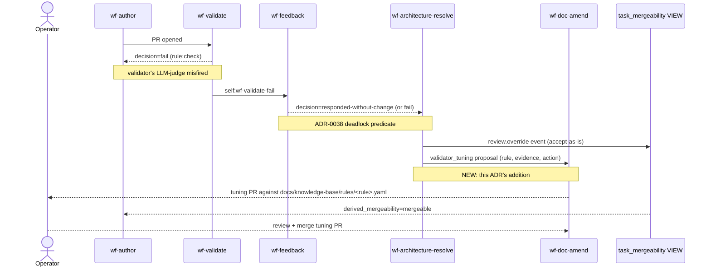

# ADR-0040: Architect tunes the validator rule on accept-as-is verdicts

- **Status:** proposed
- **Date:** 2026-05-16
- **Related:** ADR-0006 (rules + remediations primitive — the YAML format being tuned), ADR-0029 (validator + rule engine), ADR-0032 (role-architect's original triage scope — this ADR adds a third output dimension), ADR-0036 (severity gating — `demote_severity` interacts with this), ADR-0038 (deadlock arbitration — this ADR builds on the partnership), ADR-0039 (validate-fail predicates — `tune-rule` is the structural response to repeated validate false positives)

## Context

Across the 2026-05-15 → 2026-05-16 hands-free session we observed that every architect arbitration that produced a usable verdict said `accept-as-is` — i.e. the architect consistently sided with the author and disagreed with the validator. The pattern was first surfaced on task `c5438ed1` (Plan B OTel SDK wire): the `implementation-conforms-to-diagram` rule's LLM-judge returned `fail-implementation` defensively because no `DIAGRAM_SOURCE` was provided, then fell back to comparing the diff against the task-spec prose and produced complaints the architect on sonnet directly refuted by citing exact file:line evidence the work was complete.

The current loop closes the gate per-incident: ADR-0038's `review.override` event flips the mergeability VIEW projection so auto-merge proceeds. But the underlying validator rule that produced the false positive stays unchanged, so the same fail-then-override cycle will fire again the next time the rule's scope catches a PR. The architect's work is being repeated across incidents instead of compounded into a better validator.

The system has the necessary signal at the moment of arbitration — architect verdict `accept-as-is` against a validator that said `fail` — to identify which specific rule + check produced the false positive. But no feedback path closes that signal back onto the rule definition.

The result: the architect is necessary in proportion to how often the validator misfires. Without a tuning path, the architect's necessity is stable; with one, it should decay as the rule corpus converges.

## Decision

We decided to expand `role-architect`'s output surface so that, when the architect verdicts `accept-as-is` on a deadlock whose blocking signal was `wf-validate.decision='fail'` (not `wf-review.decision='changes_requested'`), the verdict envelope also carries a `validator_tuning` proposal naming the specific rule + check the architect believes misfired, the architect's evidence (which spec items were cited as missing vs. which the architect verified present, with file:line anchors), and one of three tuning actions:

- `demote_severity` — flip the check's severity from `blocking` to `warning` or `advisory` (per ADR-0036). Used when the check is correctly identifying real drift most of the time but its blocking gate produces unacceptable false-positive friction.
- `narrow_applies_to` — restrict the rule's `applies_to` globs so this PR shape no longer matches. Used when the check applies a sensible rule to file paths it shouldn't (e.g. a diagram-conformance rule firing on PRs that don't cite a diagram).
- `refine_prompt` — the check's LLM-judge prompt needs sharpening; the architect attaches a proposed text patch with the specific behavioral change.

The coordination consumer projects the `validator_tuning` proposal as a `wf-doc-amend` dispatch against the rule's YAML file under `docs/knowledge-base/rules/`, authored by `role-documentarian` with a new intent literal `tune-rule-from-architect`. The wf-doc-amend run produces a PR that the operator reviews — it does not auto-merge. Each tuning PR includes a back-reference to the originating architect run for auditability. The `review.override` event still fires in parallel so the original PR unblocks immediately; the rule-tuning PR is a separate, asynchronous artifact.

## Alternatives considered

- **Status quo (per-incident override only).** Rejected: the architect's work is wasted across repeated incidents; the validator's quality plateaus at "good enough to need correction every time."
- **Auto-demote any rule that fires accept-as-is more than N times in a window.** Rejected as too blunt — collapses per-incident evidence into a counter that loses the specific signal (which check, which evidence). Would also demote rules that fire correctly most of the time but occasionally get overridden for legitimate reasons.
- **Separate "validator-tuning role" running periodically over recent verdicts.** Rejected as too removed from the incident. The architect already has the full context (PR diff, validator rationale, task spec) at the moment of arbitration; deferring the tuning decision discards that context and adds a periodic batch job we don't have infrastructure for.
- **Architect modifies the rule YAML inline (no PR, no human review).** Rejected because the architect has been shown today to skip its JSON envelope and produce prose-only verdicts — its judgment is sound but its output discipline is uneven. Auto-applying its rule edits would compound errors. Operator review on the tuning PR is the safety net.

## Consequences

### Good
- Validator quality compounds over time. Each false positive corrected once.
- Architect dispatches should trend down as the rule corpus stabilises — the architect becomes less necessary as the system tunes itself.
- The signal — "rules producing systematic false positives" — gets surfaced as durable artifacts (the tuning PRs) rather than buried in arbitration runs.

### Bad / trade-offs
- The architect's prompt grows another responsibility (now triage + override + tune). Risk of further degrading structured-output reliability that we've been fighting in this session.
- Tuning PRs require operator review. Adds operator workload, though it should be smaller than the per-incident override workload it replaces.
- A rule tuned too aggressively could miss legitimate issues. The reversibility of the tuning PR (each is a normal commit) limits the damage, but we are accepting some drift toward laxer validation.

### Risks
- The architect proposes a tuning action that's *also* a false positive (architect was wrong about the validator being wrong). Mitigated by operator review.
- The architect proposes many tuning actions for the same rule across short time windows (noisy). Mitigated by dedup namespace `wf-doc-amend:<repo>:tune-rule=<rule-slug>` (per ADR-0026) so only the most-recent proposal lands per rule.
- If we revisit: the signal is a high architect dispatch rate, OR operator rejecting tuning PRs more than accepting them (the architect's tuning judgment is unreliable).

## Diagram

## Follow-ups

- Schema for the `validator_tuning` payload (probably a new `architect_verdict.py` field + a new `ValidatorTuning` Pydantic envelope).
- A new dispatch path `maybe_dispatch_rule_tuning_on_architect_completion` in coordination/triggers.py.
- Whether tuning PRs should retain the `auto_merge: false` frontmatter or be reviewable like any other docs change.
- Whether `refine_prompt` proposals should be capped (a rule prompt that gets tuned 10 times in a week is itself a signal — escalate to operator rather than keep tuning).
- How the architect knows *which* rule fired. The wf-validate output payload's `checks` list carries `check_id` + `rationale`; the architect dispatch context must surface that.

## References

- ADR-0006 — rules and remediations primitive (the YAML format being tuned).
- ADR-0029 §Q29.b — validator's per-check severity + LLM-judge model selection.
- ADR-0032 — role-architect's original triage scope; this ADR extends it.
- ADR-0036 — hands-free review/validate discipline (severity gating is the axis `demote_severity` targets).
- ADR-0038 — ralph-loop deadlock arbitration; this ADR is the partnership-self-tuning sibling.
- ADR-0039 — validator-error verdicts don't gate merge; same author-friction-vs-quality trade-off this ADR addresses for false positives.
- Today's session: c5438ed1 + d1571b8c + 472e3ddc arbitrations all verdicted accept-as-is against the validator's `implementation-conforms-to-diagram` rule.
