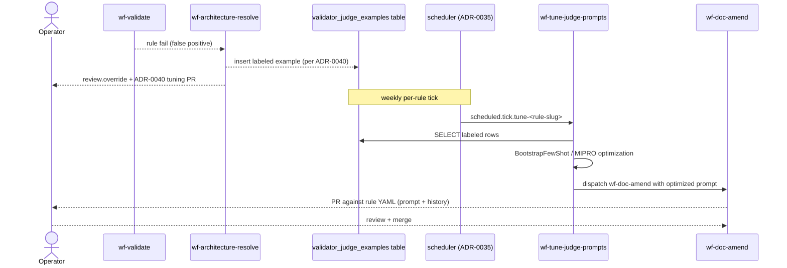

# ADR-0041: DSPy-based prompt optimization over the architect-labeled corpus

- **Status:** proposed — amended by ADR-0052 (its architect-verdict-as-label mechanism is replaced by human-labeled corpora; scope generalized from the validator to all judgment roles) and ADR-0053 (its DSPy-library mechanism is replaced by agentic optimization run via workers' Claude Code, no raw LLM API)
- **Date:** 2026-05-16
- **Related:** ADR-0006 (rules + remediations primitive — the YAML format where prompts live), ADR-0029 (validator + rule engine — what we are optimizing the prompts of), ADR-0032 (role-architect — produces the labels), ADR-0034 (learnings crystallization — sibling system also writing to `docs/knowledge-base/rules/`), ADR-0035 (scheduler primitive — delivers the periodic optimization run), ADR-0040 (architect tunes validator — provides the corpus; this ADR generalizes from per-incident to corpus-wide)

## Context

The 2026-05-15 → 2026-05-16 hands-free session surfaced a stable pattern: validator-rule LLM-judges produce false positives, the architect arbitration overrides each one with `accept-as-is`, the operator (or now ADR-0040's automated path) edits the rule YAML to prevent the next misfire. PR #109 was one such surgical fix to `implementation-conforms-to-diagram`; ADR-0040 codifies the architect-tunes-validator partnership that will produce more like it automatically.

Both #109 and ADR-0040 are reactive — they fix one false-positive shape per cycle, by hand or by architect-proposed PR. The corrections accumulate into a natural labeled corpus: every architect-overridden run pairs `{rule_slug, check_id, diff_excerpt, task_spec_excerpt, judge_output_actual, architect_verdict}`. Today's session alone produced six such examples in twelve hours. ADR-0040's tuning PRs will produce more.

But the corrections themselves are local prose edits — they don't generalize beyond the case that triggered them. A sibling false-positive shape that didn't match the specific cue we added still fires. The validator's quality plateaus at the level of operator + architect attention applied per-incident.

DSPy ([dspy.ai](https://dspy.ai)) is the mature open-source framework for the optimization pattern we need: declare an LLM call as a Signature, supply labeled examples, run an optimizer (BootstrapFewShot, MIPRO, etc.) against an evaluator, get back a tuned prompt that generalizes across the example space. The labels we need are exactly what ADR-0040 produces.

## Decision

We decided to adopt DSPy as a runtime dependency of `services/api` and close the validator-improvement loop with the following addition:

1. **Corpus collection.** Every architect override of a validator rule (per ADR-0040) writes a labeled example to a new `validator_judge_examples` table. Input fields: `rule_slug`, `check_id`, `diff_excerpt`, `task_spec_excerpt`, `judge_output_actual`. Label: the architect's verdict translated into the rule's verdict space (`pass` when the architect verdicts `accept-as-is`, `fail-implementation` when the architect verdicts `amend`, `uncertain` when the architect verdicts `uncertain`). The architect's `reasoning` is preserved as commentary for human review.
2. **Periodic optimization.** A new workflow `wf-tune-judge-prompts` runs **daily per rule during the ramp-up phase** (decided 2026-05-16: the validator corpus is still small + noisy + we expect heavy iteration; quicker feedback loop matters more than batch-efficiency right now). Cadence relaxes to weekly once each active rule has > 50 stable examples AND optimization-PR operator-acceptance rate exceeds 80% (whichever signal is reliable first). Dispatched via ADR-0035's scheduler primitive. The job picks up that rule's accumulated examples, runs `BootstrapFewShot` (or `MIPRO` once the per-rule example count exceeds a threshold — initial guess 20) against an evaluator that scores the proposed prompt against a held-out 20% of examples, and emits a PR against the rule YAML with the optimized prompt.
3. **Operator review on every optimization PR.** Same discipline as ADR-0040's tuning PRs. A noisy optimization run cannot auto-degrade the rule corpus.
4. **Prompt history.** The current `checks[i].prompt` field becomes the materialized output of the most-recent successful optimization run. The prior prompt is preserved in `checks[i].prompt_history[]` for rollback. The history is operator-readable evidence of how each rule's prompt evolved.

## Alternatives considered

- **Status quo + ADR-0040 only — reactive corrections forever.** Rejected: per-incident corrections don't generalize. Same false positive on a sibling case still fires. Validator quality plateaus at "good enough to need correction every time."
- **Custom optimization layer (build it ourselves).** Rejected: DSPy is the mature framework for this pattern, with proven Signature / Module / optimizer primitives, an active community, and citation-worthy benchmarks. Reinventing it costs months for no clear win. We will revisit only if DSPy is abandoned upstream or its assumptions break for our use case.
- **OpenAI / Anthropic fine-tuning instead of prompt optimization.** Rejected: fine-tuning produces an opaque weight diff, not an inspectable prompt. The rule YAML's `checks[i].prompt` is the audit surface operators read at review time; we don't want to lose that. (We may revisit if DSPy's prompt-only optimization plateaus and we're willing to give up the audit-readability for accuracy gains.)
- **Run DSPy optimization in CI rather than as a scheduled job.** Rejected: optimization runs need example corpus + evaluator computation that takes minutes per rule per cycle. CI is the wrong vehicle. ADR-0035's scheduler is the right one — periodic batch work is its purpose.
- **Have the architect run DSPy synchronously inside its `refine_prompt` proposal.** Rejected: latency would balloon architect dispatches from seconds to minutes. The architect's job is per-incident triage; corpus-wide optimization is a separate cadence and a separate workflow.

## Consequences

### Good
- The validator improves automatically over time, generalizing from the corpus rather than from per-incident hand-tunes.
- DSPy gives us a principled audit trail: the evaluator's score is recorded with each optimization run; operators can see "this prompt scored 0.91 on the held-out set" alongside the proposed PR.
- The architect dispatches trend down as the validator improves, freeing the architect for genuinely hard arbitration cases.
- The corpus itself becomes a durable asset — even if we swap optimization frameworks later, the labeled examples carry over.

### Bad / trade-offs
- New runtime dependency (`dspy-ai`) in `services/api`. Versioning + upgrade burden.
- The labeled corpus carries our biases (architect overrides may themselves be wrong). DSPy will faithfully optimize toward our errors as well as our wins. Mitigation: operator review on every optimization PR; human eyes on the diff before merge.
- The optimization run consumes Claude budget (one full LLM call per example per optimizer iteration). For 20 examples × 10 iterations × $0.05 per call = ~$10 per rule per week. Acceptable but non-zero.
- The scheduled job adds load to the worker pool that grows with rule count. Mitigation: stagger schedules (not all rules optimize on the same day).

### Risks
- **Corpus too sparse early.** With six examples in twelve hours, we'll need ~3 weeks of operation to have 20 examples per rule (the MIPRO threshold). Before then, BootstrapFewShot with smaller corpora is degraded relative to MIPRO. We'll accept the early-period suboptimality.
- **DSPy version drift.** If DSPy makes a breaking API change, our pipeline breaks. Pin the version; treat upgrades as their own scheduled work item.
- **Optimizer fits the corpus too tightly.** A small held-out set can mislead. We'll start with a 20% held-out share and revisit if optimization PRs show signs of overfitting (operator rejection rate climbs).
- **If we revisit:** the signal is that the validator's false-positive rate is NOT trending down despite DSPy running. That would suggest the optimization is fitting the wrong things, or the corpus is poisoned.

## Diagram

## Follow-ups

- The `validator_judge_examples` table schema needs a Pydantic envelope + Alembic migration. Probably a sibling of the ADR-0040 corpus collection.
- The evaluator function (score a proposed prompt against held-out examples) needs an explicit signature — likely a callable returning a float ∈ [0, 1].
- The PR description format for optimization runs should include the evaluator score, the corpus size, and the held-out share so operators can review with the right context.
- Whether `prompt_history[]` should be capped (last N entries) or unbounded.
- How `wf-tune-judge-prompts` interacts with ADR-0040's `wf-doc-amend` dispatches when both fire against the same rule (race condition: the optimizer's PR vs the architect's tuning PR). Probably the optimizer's PR is the authoritative one once it lands; the architect's per-incident PR is a stopgap.
- Whether DSPy's `MIPROv2` (the newer optimizer) is preferred over MIPRO from the start.

## References

- DSPy: [https://dspy.ai](https://dspy.ai) — Signatures, Modules, BootstrapFewShot, MIPRO.
- ADR-0035 — scheduler primitive that delivers periodic optimization runs.
- ADR-0040 — architect tunes validator on accept-as-is; provides the labeled corpus this ADR optimizes over.
- ADR-0006 — rules + remediations primitive; the YAML format the optimized prompts land in.
- Today's session log: PR #109 (manual prompt fix), the 6+ architect overrides that motivated this generalization.
