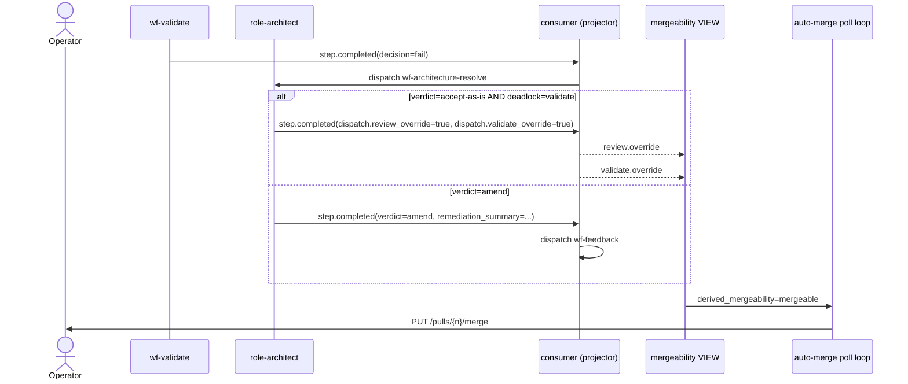

# ADR-0042: validate.override channel for architect accept-as-is on validate-fail deadlock

- **Status:** accepted
- **Date:** 2026-05-16
- **Related:** ADR-0031, ADR-0038, ADR-0040

## Context

ADR-0031 wires the auto-merge cooling-off trigger and explicitly requires `validate_decision = 'pass'` (Q31.b) before firing — uncertain or fail decisions block the merge predicate. ADR-0038 introduces the architect's deadlock arbitration, including the `accept-as-is` verdict, which today emits only `review.override` — flipping the review vote in the mergeability VIEW (per migration 0016) but leaving validate's verdict authoritative.

We hit the failure mode on 2026-05-16: four PRs (#120, #122, #123, #124) reached green CI plus an architect `accept-as-is` plus an emitted `review.override`, yet sat OPEN because the underlying wf-validate decision was `fail` on a docs-gap LLM-judge rule. The architect saw the gap, judged it acceptable for the PRs' merge, and emitted the only override signal it had — but the auto-merge predicate ignored it. The architect's authority is structurally undermined when the deadlock trigger was validate, not review. ADR-0038 envisions accept-as-is as terminal arbitration; the predicate must reflect that intent across both gates, not just one.

## Decision

We introduced a sibling override event `validate.override` (`entity_type='validate'`, `action='override'`) that the architect disposition emits whenever `verdict='accept-as-is'` AND the deadlock context indicates wf-validate was the failing workflow. Payload carries `reasoning: str` and `override_validate_check_ids: list[str]` naming the specific failing `check_id`s the architect is overriding. A new alembic migration `0018_mergeability_validate_override` extends the mergeability VIEW to project a `validate_override` column read from the most-recent `validate.override` event, and the auto-merge predicate is widened from `validate_decision='pass'` to `validate_decision='pass' OR validate_override IS NOT NULL`. The existing ADR-0038 cap of two `accept-as-is` verdicts per task continues to bound override blast radius — we added no new gate.

## Alternatives considered

- **Status quo (no validate override).** Rejected: we saw four PRs structurally stuck with architect `accept-as-is` plus green CI on the day this ADR was written; the architect's authority is undermined when the deadlock was a validate-fail.
- **Collapse wf-validate findings into wf-review (single gate).** Rejected: validate's deterministic plus LLM-judge checks are categorically different from review's per-task acceptance reasoning. We want both signals on different axes — collapsing them loses information at the projection layer and downstream observability.
- **Blanket severity downgrade when architect accepts (`blocking → warning` for the run's checks).** Rejected: that's a global rule change applied per incident; we wanted a targeted, per-event override tied to a single architect decision and a specific `check_id` list, not a severity rewrite that affects future runs of the same rule on unrelated PRs.
- **Mutate the validate step's output payload in place to swap `fail → pass`.** Rejected: destroys the audit trail. The override event pattern (review.override precedent from migration 0016) preserves the original fail row and overlays the override at the projection layer — a reader can still see the architect overrode a real fail, not a phantom pass.

## Consequences

### Good

- The architect's `accept-as-is` verdict now closes the loop on both review-fail and validate-fail deadlocks. Hands-free convergence works for the validate-driven case, not just the review-driven case.
- The override event pattern stays uniform across review and validate, simplifying the projection layer (one migration shape mirrored).
- Audit trail preserved: the original `validate.fail` row is unchanged; the override event sits next to it.

### Bad / trade-offs

- The architect's blast radius grows. An `accept-as-is` decision now waives both review and validate signals when the trigger was validate, where previously it waived review only.
- The mergeability VIEW grows one more column and one more event-read clause. Projection complexity is monotonically increasing.

### Risks

- **False accept-as-is on a real validate-fail** lands code that violates a rule. Bounded by the existing ADR-0038 cap of two per task and the operator's review on every architect-overridden merge in the post-mortem. Signal to revisit: if we see merged PRs that turn out to have shipped real rule violations the architect waved through.
- **Architect cue table regression** — sharpening the accept-as-is detection logic could leak. Mitigation lives in the implementing plan (`docs/plans/2026-05-16-validate-override-channel.md`): keep the existing cue table additive.

## Diagram

## References

- Plan: `docs/plans/2026-05-16-validate-override-channel.md`
- ADR-0031 (auto-merge cooling-off — Q31.b is the predicate we are widening)
- ADR-0038 (deadlock arbitration — defines accept-as-is and its two-per-task cap)
- ADR-0040 (architect tunes validator on accept-as-is — sibling; this ADR adds the override-emission piece next to ADR-0040's tuning-emission piece)
- Migration 0016 (`mergeability_review_override.py`) — the projection pattern we mirror
