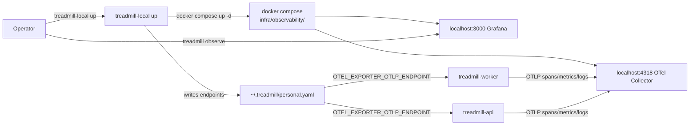

# ADR-0043: dev_local observability runs in local docker compose, not AWS

- **Status:** accepted
- **Date:** 2026-05-16
- **Related:** ADR-0016, ADR-0020 (amended by this ADR), ADR-0035

## Context

ADR-0020 §"Implementation notes" decided that the local-adapter's `runtime.py` does **not** add observability containers — `OTEL_EXPORTER_OTLP_ENDPOINT` is unset for `fully_local` and points to the AWS deployment's collector for `dev_local`. The design rationale was "one stack per deployment, deployed identically" — keep production and `dev_local` symmetric so dashboards and queries work the same way for the laptop operator as for production.

On 2026-05-16 we tried to deploy `TreadmillPersonalObservability` via CDK and surfaced two as-shipped bugs in PR #123 (missing `env=cdk.Environment(...)` on the stack constructor, off-by-one `.parent` chain on the S3 asset directory). Both were patched in a worktree and synth succeeded. The deployment itself is feasible and was authorized by the operator. But the recurring cost (~$10–15/month for one EC2 + EBS + S3 per `dev_local` deployment per operator) and the 5–10 minute deploy time on every fresh bring-up emerged as friction for solo iteration work.

The same `infra/observability/docker-compose.yml` from PR #123 can run locally with two adjustments — replace `/mnt/loki` and `/mnt/prometheus` EBS paths with named docker volumes, and configure Tempo to use a local filesystem backend instead of S3. ADR-0020's `fully_local` rationale explicitly said "trade-off accepted: keeping fully-local trivially-fast is more valuable than mirroring the Grafana stack on laptop." The symmetry argument never beat local-iteration speed there. Extending that precedent to `dev_local`-local-docker is consistent with the spirit of ADR-0020 rather than against it.

## Decision

We decided to amend ADR-0020 so that `dev_local` mode runs observability in local docker compose by default rather than against an AWS-hosted EC2 stack. The same `infra/observability/docker-compose.yml` from PR #123 is reused, paired with a sibling `docker-compose.local.yml` override that:

1. Swaps `/mnt/loki` and `/mnt/prometheus` EBS paths for named docker volumes.
2. Configures Tempo to use a local filesystem backend (`/var/tempo` inside the container, a named volume on the host) instead of `s3://${TEMPO_S3_BUCKET}`.
3. Sets a default `GF_SECURITY_ADMIN_PASSWORD` for local Grafana.

`treadmill-local up` spawns the compose stack via `docker compose -f infra/observability/docker-compose.yml -f infra/observability/docker-compose.local.yml up -d` after the API, worker, and autoscaler are healthy. `treadmill-local init <deployment>` writes the localhost endpoints (`http://localhost:4318` for OTLP, `http://localhost:3000` for Grafana) into `~/.treadmill/<deployment>.yaml`. The `TreadmillObservabilityStack` CDK construct remains the canonical path for `fully_remote` deployments — unchanged. `fully_local` continues to have no observability (unchanged from ADR-0020). The two CDK bugs from PR #123 are filed as a separate fix PR regardless — `fully_remote` will still want them.

## Alternatives considered

- **Status quo (AWS-hosted for `dev_local` per ADR-0020).** Rejected: $10–15/month per deployment per operator is recurring friction; the 5–10 minute CDK deploy on every fresh bring-up is iteration drag; the symmetry-with-prod argument is already weakened by `fully_local`'s break from symmetry.
- **Add local-docker as an explicit yaml flag — `observability_mode: local | aws | none`.** Rejected for now as scope creep; the local-docker default in `dev_local` will simply be the new behavior. The flag option can be added later without superseding this ADR — it's purely additive when the need arises.
- **Use a sibling project's already-running compose stack (RAMJAC's containers from a different project tree) via shared mount.** Rejected: that stack isn't Treadmill's audit surface; sharing the compose unit would couple two projects' storage and dashboards. We want Treadmill-named containers + Treadmill-shaped retention.
- **Skip Grafana locally — emit OTLP to a no-op collector for `dev_local` until `fully_remote` needs it.** Rejected: defeats the point of `dev_local`; operators want to see real spans, metrics, and logs during iteration, not only post-hoc in prod. The `treadmill observe` CLI presumes a Grafana to point at.

## Consequences

### Good

- Zero recurring AWS cost for `dev_local` observability. Solo operators iterate without burning ~$10/month per deployment.
- Sub-second bring-up: `docker compose up` instead of 5–10 minute CDK deploy. Edits to compose configs visible on `compose restart`.
- Same compose file as `fully_remote` — config drift between local and prod is contained to the override layer.
- `treadmill observe` localhost URLs work in the operator's browser without SSM port-forward complexity.

### Bad / trade-offs

- Local Grafana data is operator-local and not durable across machines. We give up the "all your traces in one place across operators" property that the AWS-hosted stack would provide. Acceptable because we never had it (this is the first o11y stack to land for `dev_local`).
- Storage lives on the operator's disk (named docker volumes). Loki + Prometheus growth needs the operator's attention if retention isn't tuned for laptop disk capacity. We default the compose retention windows to the same prod values; operators tune down if needed.
- One more set of containers running on the operator's machine when `treadmill-local up` is on. Memory and CPU footprint is real (~500MB resident for the full stack).

### Risks

- **Local Grafana drifts from prod Grafana** if operators tweak dashboards locally and don't carry them back. Mitigation: dashboards live in version-controlled JSON under `infra/observability/dashboards/`; local edits are explicit edits in the repo, not a separate Grafana instance.
- **Compose stack becomes the "default" so the AWS path bit-rots.** Mitigation: the AWS path is exercised by `fully_remote` deployments (when operators ship Treadmill against an employer account). The CDK construct stays load-bearing; we just don't use it for `dev_local` solo work.
- **Operator surprise** when an old `personal.yaml` carries the AWS endpoint and the new local stack endpoint is different. Mitigation: `treadmill-local init` overwrites `observability_*` fields on each run; the migration is `init`-driven, not silent.

## Diagram

## References

- ADR-0016 (deployment modes — `fully_local` / `dev_local` / `fully_remote`)
- ADR-0020 (observability via OpenTelemetry + Grafana — this ADR amends its `dev_local` target)
- ADR-0035 (scheduler primitive — runs in `dev_local` mode, benefits from local Grafana traces)
- `infra/observability/docker-compose.yml` (the compose file we reuse)
- `tools/local-adapter/treadmill_local/runtime.py` (the entry point being extended)
