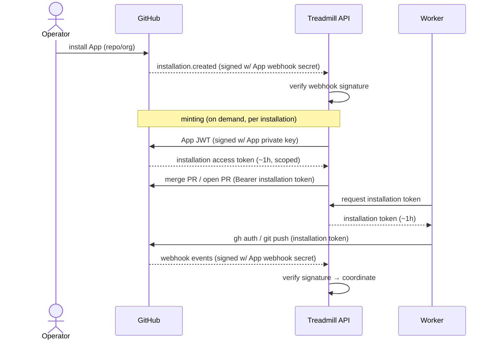

# ADR-0049: Treadmill operates as a GitHub App

- **Status:** accepted
- **Date:** 2026-05-20
- **Related:** ADR-0016 (amends), ADR-0017 (amends), ADR-0031 (amends)

## Context

Treadmill authenticates to GitHub with a single *personal* access token (`GITHUB_TOKEN`, owned by the operator). That one identity authors commits and PRs (the worker's `gh`/`git push`), posts the wf-review verdict as a PR comment (the task #108 workaround, because GitHub rejects "Can not approve your own pull request"), and merges via the API's direct `pulls/{n}/merge` call. The token lives on the API container and on every worker.

This was a deliberate v0 choice, deferred for migration in three prior ADRs: ADR-0016 Q16.d ("v0 uses PAT; App migration is a future ADR when multi-user evidence appears"), ADR-0031 Q31.e ("Single PAT for v1; separate merger identity awaits #109 — GitHub App"), and ADR-0017 (webhook signing via a shared secret, App signing deferred).

The forcing function has arrived. The next goal is pointing Treadmill at repositories it did not create; a personal token cannot scope that — installing a broad personal credential on repos the operator does not own is the wrong trust model. Operationally, the same long-lived broad-scope token is replicated across worker containers and recently surfaced in plaintext. Note what is *not* at issue: auto-merge already works. Mergeability is internal (Treadmill's own `review.decision` / `validate.override` events feeding the `task_mergeability` VIEW), the merge is a direct API call, and no branch protection requires GitHub-side approvals. This decision is about identity and scoping, not about unblocking merge.

## Decision

We adopt a GitHub App as Treadmill's GitHub identity. The App authors commits and PRs and merges using short-lived, per-installation, scoped installation tokens minted on demand: the API signs an App JWT with the App private key, exchanges it for an installation access token (~1h TTL, refreshed), and that token is used by both the API (PR/merge calls) and the workers (`gh auth` / `git push`). Webhook delivery is verified against the App's webhook secret, replacing ADR-0017's shared secret. Each target repository or org gets its own installation, yielding scoped access and native multi-repo support. The bot identity (`treadmill[bot]`) becomes distinct from the human operator.

A single App is sufficient: Treadmill's review is internal (the `role-reviewer` LLM emits `review.decision`; it is not a GitHub approval), so the same App both authoring and merging is fine, and review independence is a role-layer property (distinct `role-code-author` vs `role-reviewer` prompts/models), not a GitHub-identity property.

## Alternatives considered

- **Second machine-user + second PAT** — a distinct bot account authors and a second identity approves, enabling GitHub-enforced 4-eyes. Rejected: two long-lived tokens to manage, a real GitHub seat to provision, and still no clean per-repo scoping for cross-repo work. It trades one token-management problem for two without unblocking multi-repo. Reconsider only if GitHub-enforced required-reviews become a requirement.
- **Keep the single personal PAT** — rejected: blocks the cross-repo goal and is a security single-point-of-failure.
- **Dedicated machine-user PAT (not personal)** — separates bot from human, a quick win. Rejected as the destination: still a long-lived broad token with no per-repo scoping; it does not move us toward multi-repo. Acceptable only as an interim if App work slips.

## Consequences

### Good
- Scoped, short-lived installation tokens replace a long-lived broad PAT; rotation is automatic.
- A real `treadmill[bot]` identity, distinct from the operator, on every commit/PR.
- Per-repo installation is the substrate the non-Treadmill bootstrap builds on.

### Bad / trade-offs
- New machinery: JWT signing + installation-token minting/caching/refresh in the API; the App private key becomes a managed secret.
- Worker auth changes from a static PAT to a TTL-bound token — requires refresh at startup and mid-run for long runs.
- Webhook signature verification migrates to the App secret (cutover coordination).

### Risks
- Installation-token expiry mid-run could fail a long worker step if refresh is not handled — the chief implementation risk.
- Identity change on commits/PRs (`treadmill[bot]`) may affect any automation or filters keyed on the operator's username.

## Follow-ups

- The reviewer-identity question for *GitHub-enforced* 4-eyes (required-reviews branch protection needing a second approving identity) is out of scope here and deferred.
- A `/plan` for the phased migration (App registration → token minting in the API → worker auth swap → webhook-secret cutover → per-repo install/onboarding flow).
- Amend the status headers of ADR-0016, ADR-0017, and ADR-0031 to "amended by ADR-0049" for their single-PAT / webhook-secret clauses.

## Diagram

## References

- Amends the single-PAT clauses of ADR-0016 (Q16.d), ADR-0031 (Q31.e), and ADR-0017 (webhook signing).
- Realizes the deferred task #109 (GitHub-App migration).
