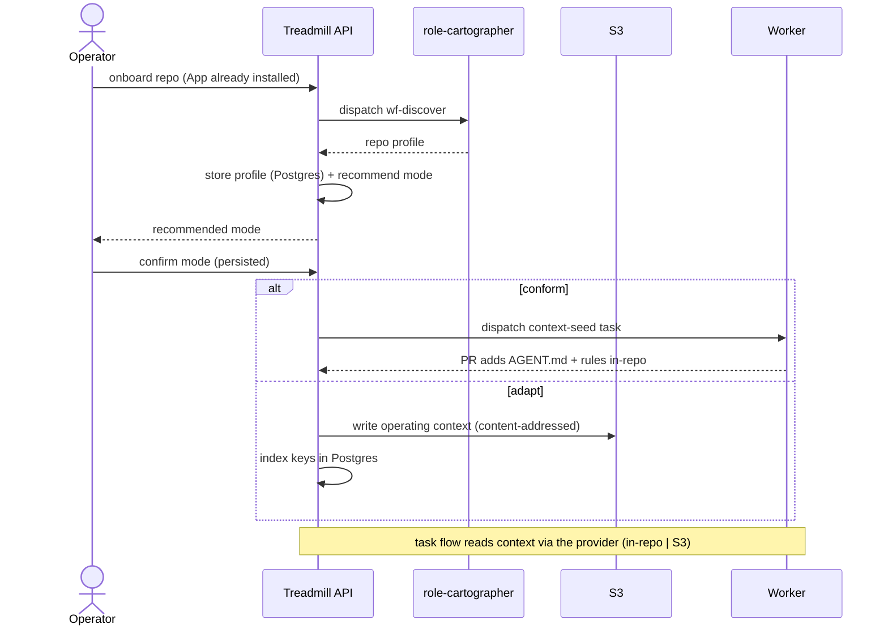

# ADR-0050: Onboarding repositories Treadmill did not create

- **Status:** accepted — decision 1 (discovery mechanism) amended by ADR-0051
- **Date:** 2026-05-21
- **Related:** ADR-0049 (auth substrate), ADR-0030 (in-repo context this lacks), ADR-0016 (per-account topology), ADR-0031 (auto-merge), ADR-0034 (the future KB store), ADR-0051 (operator-initiated bootstrap / client-side discovery v1)

## Context

ADR-0049 gave Treadmill scoped, per-installation GitHub App auth — the substrate for operating on repositories it did not create. But auth was the easy part. Treadmill's quality machinery assumes *in-repo context*: the federated `AGENT.md` of ADR-0030, the rules corpus, diagrams-as-contract, per-task validation scripts. A repo Treadmill never bootstrapped has none of it.

So the real question is not "can we authenticate" but "how does Treadmill operate with confidence on a repo whose conventions it doesn't know — and where do its operating artifacts live when the repo does not want them in-tree." A repo that declines Treadmill's documentation discipline still needs that discipline to exist *somewhere*; it cannot live in the Treadmill source ("the repo would become a junk drawer of other people's docs").

## Decision

We onboard an unfamiliar repo in five moves:

1. **Discover first.** A new `wf-discover` workflow (`role-cartographer`, read-only) produces a structured **repo profile**: languages, build/test/lint commands, doc locations, CI, component layout, and whether `AGENT`-style context already exists.

2. **Two modes, chosen per repo.** *Conform* — Treadmill opens PRs that seed its context (`AGENT.md`, a starter rule set) into the repo, and gates run Treadmill's rules. *Adapt* — the repo stays pristine, Treadmill's operating context lives in the external store, and gates run the repo's own discovered checks. Discovery *recommends* the mode from the profile; the operator confirms; the choice persists as source of truth.

3. **Context has a source, not a location.** Roles read operating context through a **context-provider interface** with two backends — in-repo files (conform) or the external store (adapt). The two modes are one pipeline with different context sources.

4. **External store: S3 for blobs, Postgres for the keys.** Document blobs (markdown — profile docs, the `AGENT.md`-equivalent, rules, diagrams) live in **S3, content-addressed**, in a per-deployment bucket. Postgres holds the index: `(repo, doc_path) → s3_key/sha/version`, plus the structured profile (JSONB) and the repo config. Roles read/write via **presigned URLs** minted by the API — the API stays thin, IAM stays on the API.

5. **Repo-level config, external, source of truth.** Per repo: the mode, the discovered command set, and an **auto-merge policy that can block all auto-merge for that repo**. The auto-merge trigger honors a repo-level block in addition to the existing plan-level flag.

## Alternatives considered

- **Conform-only (force Treadmill's context into every repo).** Rejected: many repos will not accept Treadmill files; forcing it bars the multi-repo goal.
- **External docs in Postgres blobs.** Rejected: markdown does not belong in a relational store. S3 is the document substrate; content-addressing buys dedup and history for free.
- **Stand up OpenSearch / a vector store now.** Rejected *for the first cut*: per-repo context is a profile plus a handful of docs, not a search corpus. OpenSearch earns its place when retrieval over a cross-repo / learning corpus is the need (the ADR-0034 durable KB) — adopted then, behind the same context-provider interface, not before.
- **External docs in the Treadmill source.** Rejected outright — that is the junk-drawer failure above.

## Consequences

### Good
- Multi-repo onboarding without forcing convention on the target; pristine-repo support.
- A clean swap path to S3-at-scale / OpenSearch behind one interface.
- A per-repo auto-merge safety valve, independent of plans.

### Bad / trade-offs
- New machinery: an S3 bucket, index tables, IAM, and a context-provider indirection over what was a direct file read.
- Two validation paths — rules-driven (conform) and profile-driven (adapt).

### Risks
- Adapt-mode gates run the repo's *own* checks; if discovery mis-reads the commands, validation is wrong. Mitigate by having the operator confirm the profile before the first task.
- IAM: the API's policy must include the new bucket **up front** — the webhook-secret `AccessDenied` of ADR-0049 phase 6 is the precedent.

## Diagram

## Follow-ups

- Adapt-mode validator: how `wf-validate` consumes the discovered command set.
- The `role-cartographer` prompt/model and `wf-discover` registration.
- **ramjac** as the canary — first non-Treadmill repo onboarded end-to-end.
- The OpenSearch KB phase, once retrieval is the need.

## References

- Builds on ADR-0049 (App identity); fills the gap ADR-0030 leaves for unfamiliar repos.
- Plan: `docs/plans/2026-05-21-onboard-unfamiliar-repos.md`.
