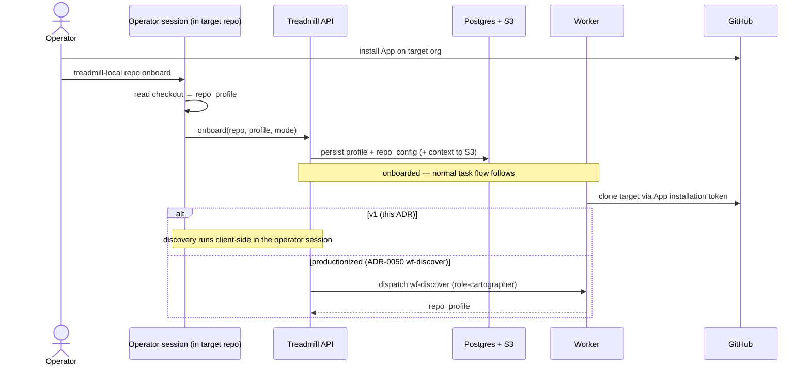

# ADR-0051: Operator-initiated bootstrap with client-side discovery (v1)

- **Status:** accepted
- **Date:** 2026-05-21
- **Amends:** ADR-0050 (decision 1 + its diagram)
- **Related:** ADR-0049 (App auth substrate), ADR-0016 (operator-global deployment config)

## Context

ADR-0050 decided onboarding begins with a *server-side* `wf-discover` workflow (`role-cartographer`) that clones the target repo and emits a structured profile; its diagram shows `API → dispatch wf-discover → cartographer → profile`. That workflow and role do not exist yet, and building them is the long pole.

Meanwhile the pieces a profile feeds are already merged: the `repo_profile` schema (+ `recommend_mode`), `OnboardingStore` persistence, the S3 `context_store`, and `repo_config`. We want to smoke-test bootstrapping now, against **ramjac** (the first non-Treadmill repo), and to initiate it from an operator session sitting *inside the target repo* — not from the Treadmill checkout. That already works at the layer that matters: deployment config is operator-global (`~/.treadmill/<id>.yaml`, ADR-0016), so the tooling is location-independent.

## Decision

For v1, **bootstrap is operator-initiated from the target repo's working directory, and discovery runs client-side.** Concretely:

- A location-independent entrypoint (`treadmill-local repo onboard`) infers the target repo from the cwd's git remote and talks to the running deployment.
- The **operator session reads the local checkout, produces the `repo_profile`, and uploads it** (plus any conform-mode context docs) to the deployment through a new **onboard API endpoint**, which persists via the already-merged `OnboardingStore` / `context_store` / `repo_config`.
- `wf-discover` / `role-cartographer` (ADR-0050 decision 1) become the **server-side productionization** of the same step — same profile shape, same store, same modes — adopted once the plumbing is proven and we want hands-free, no-local-checkout onboarding.
- The GitHub App must be installed on the target org first (operator action); that install is the gate on any server-side step (token minting, worker clone/PR).

This amends only ADR-0050's decision 1 and diagram (who produces the profile and how onboarding is initiated). Decisions 2–5 (conform/adapt, the context-provider, S3+PG store, repo-level config incl. the auto-merge block) are unchanged and reused.

## Alternatives considered

- **Build server-side `wf-discover` first (ADR-0050 as written).** Rejected for v1: it's the long pole and blocks the smoke test, and having a worker re-clone a repo the operator already has checked out is wasted effort for the first proof. It remains the productionization target, not a rejection.
- **Pure CLI writing straight to Postgres/S3.** Rejected: the deployment owns its store + IAM. Routing through an onboard API endpoint keeps the API as the single writer (mirroring the App-token-minting endpoint) and serves *both* the client-side and the future server-side producer.

## Consequences

### Good
- Smoke-test bootstrapping now, reusing every merged piece — no `wf-discover` dependency.
- Literally "bootstrap from inside the repo," matching how an operator actually works.
- Cleanly separates the two risks: onboarding plumbing first, then the worker-operates-on-an-external-repo path.
- One onboard endpoint serves both discovery producers.

### Bad / trade-offs
- Two discovery producers (client now, server later) to keep aligned to one profile schema until `wf-discover` lands.
- Client-side discovery needs a local checkout — fine for operator-initiated onboarding, not for hands-free.

### Risks
- A client-built profile could drift from what a server cartographer would emit. Mitigation: both go through the shared `repo_profile` schema + `recommend_mode` as the single source of truth.

## Diagram

## Follow-ups

- The onboard API endpoint; the `treadmill-local repo onboard` CLI (client-side discovery).
- Plan: `docs/plans/2026-05-21-ramjac-bootstrap-smoke.md`.
- Productionize discovery via `wf-discover` / `role-cartographer` (realizes ADR-0050 decision 1).

## References

- Amends ADR-0050 (decisions 1 + diagram); builds on ADR-0049 (App identity) and ADR-0016 (operator-global deployment config).
