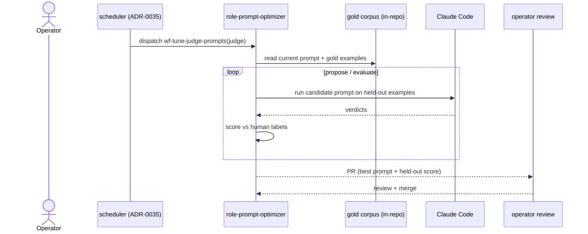

# ADR-0053: Judge-prompt optimization runs agentically via workers, not the DSPy library

- **Status:** accepted
- **Date:** 2026-05-22
- **Amends:** ADR-0041 (replaces its DSPy-library mechanism)
- **Related:** ADR-0052 (human-labeled corpora — the inputs), ADR-0035 (scheduler), ADR-0006 (rules YAML — where optimized prompts land), ADR-0049 (App auth the worker already holds)

## Context

ADR-0041 chose the **DSPy library** to optimize judge prompts, and ADR-0052 fixed its label source to human-reviewed corpora. But DSPy assumes a raw LLM **completion API**, and Treadmill workers don't have one — they run **Claude Code** (an agentic CLI), authenticated via the GitHub App / Claude Code session, not an `ANTHROPIC_API_KEY`. Standing up DSPy inside a worker would re-introduce a managed API key (the exact thing we want to avoid) and force DSPy's LM interface onto a tool that doesn't expose one. Running DSPy *locally by the operator* via the Anthropic API was the fallback — but it isn't pipeline-native, needs a key, and doesn't dogfood.

Meanwhile this session showed the optimization need is real but uneven: the validator's `purpose-articulated` judge needed a one-branch **prompt edit** (no optimization), two judges need **code** fixes, and the **architect** is the genuine fuzzy-calibration case where an optimizer earns its keep. So we want an optimization mechanism that lives *in* Treadmill's worker pipeline and uses the access workers already have.

## Decision

Judge-prompt optimization runs as a **Treadmill workflow, `wf-tune-judge-prompts`, executed agentically by a `role-prompt-optimizer`** — not the DSPy library and not a raw Anthropic API.

Given a target judge's current prompt + the committed human-labeled gold corpus (ADR-0052), the role:
1. **proposes** candidate prompt variants;
2. **evaluates** each against a held-out slice of the gold set — running the candidate through its own Claude Code on those examples and scoring its verdicts against the human labels (a reusable `evaluate_judge_prompt(prompt, examples) -> score` harness);
3. **emits a PR** against the rule/role YAML with the best-scoring prompt + its held-out score, gated like any other change (operator review per ADR-0041's discipline).

This is DSPy *the concept* — optimize a prompt against labeled examples and a held-out metric — implemented with the worker's existing Claude Code access. The gold corpus is committed in-repo (`docs/analysis/`) so the workflow can read it. First target: the **architect**; validator judges enter the same path only when they need *fuzzy* tuning (logic bugs get a direct edit, input-starvation/parse bugs get a code fix).

## Alternatives considered

- **DSPy library inside a worker.** Rejected: needs a raw LLM API key in the worker (re-introduces the problem) and DSPy's LM interface doesn't fit Claude Code. Reconsider if the agentic optimizer plateaus and principled optimizers (MIPRO) would clearly help.
- **Operator runs DSPy locally via the Anthropic API.** Rejected: not pipeline-native, needs a managed key, doesn't dogfood Treadmill on its own quality.
- **Fine-tune weights.** Rejected (as in ADR-0041): loses the inspectable prompt as the audit surface.

## Consequences

### Good
- **No managed API key** — uses the access workers already have.
- Native to the gated-PR pipeline; dogfoods Treadmill improving its own judges.
- The `evaluate_judge_prompt` harness is reusable for any judge + as a regression metric.

### Bad / trade-offs
- We lose DSPy's principled optimizers; the agentic propose-evaluate loop is fuzzier and less sample-efficient.
- The gold corpus must live in-repo (~MBs of jsonl + diffs).
- Held-out evaluation spends Claude budget per example per iteration (bounded by held-out size × iterations).

### Risks
- The agentic optimizer may not search prompt space as well as DSPy. **Revisit signal:** the target judge's labeled error rate is not trending down across optimization PRs.
- Reward-hacking the held-out set if it's small — keep a real held-out share + operator review on every PR.

## Diagram

## Follow-ups

- The `evaluate_judge_prompt` harness (first build wave) and the `role-prompt-optimizer` prompt + `wf-tune-judge-prompts` registration.
- First run on the architect; capture whether the agentic loop actually improves the held-out score (the DSPy-revisit signal).
- Plan: `docs/plans/2026-05-22-agentic-judge-prompt-optimizer.md`.

## References

- Amends ADR-0041 (DSPy-library mechanism); inputs from ADR-0052 (human-labeled corpora).
- Corpus: `docs/analysis/architect-gold-labels.json`, `architect-corpus.jsonl`, `validator-corpus.jsonl`.
