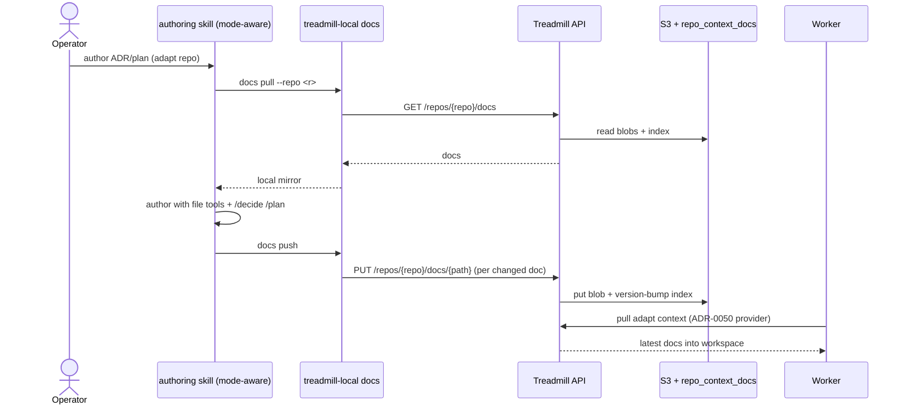

# ADR-0054: Adapt-mode doc authoring via a local mirror over an API-backed store

- **Status:** accepted
- **Date:** 2026-05-22
- **Related:** ADR-0050 (onboarding / context-provider / S3 store — this realizes its adapt-mode authoring), ADR-0051 (operator-initiated bootstrap), ADR-0030 (federated in-repo context — the conform analog), ADR-0016 (per-deployment topology / S3 bucket)

## Context

ADR-0050 put an **adapt** repo's operating context in the external S3 + `repo_context_docs` store so the repo stays pristine. But Treadmill's *authoring* — ADRs, plans, learnings, rules (the `/decide`, `/plan`, `/learning`, `/rule` skills) — and the roles that read those docs are **file-native**: they `Write`/`Edit`/grep `docs/…`, follow `[[links]]`, and browse the tree. For an adapt repo there is no `docs/` to write into, and putting the docs *only* behind an API breaks all of that: no tree to browse, no grep, awkward cross-references, and the existing skills don't apply.

We want adapt-mode authoring that keeps the file-native workflow **and** the existing skills, while the canonical store is the API-backed S3 from ADR-0050.

## Decision

Adapt-repo docs are authored against a **local mirror synced over a REST doc API**:

1. **Canonical store:** the per-deployment **S3 bucket** (content-addressed blobs via the merged `ContextStore`), indexed + versioned in `repo_context_docs`, exposed by a REST doc API: `PUT /api/v1/repos/{repo}/docs/{doc_path}` (upsert → S3 put + version bump), `GET …/docs/{doc_path}` (latest or `?version=`), `GET …/docs` (list).
2. **Working surface = a local mirror.** `treadmill-local docs pull --repo <r>` materializes the repo's docs to a local dir; you author/edit there with **normal file tools and the existing `/decide` `/plan` skills**; `treadmill-local docs push` syncs changed docs back through the API. The CLI is the *happy path* over the API; the canonical state is S3, but nothing authors against the API directly.
3. **Path parity:** store doc paths mirror the in-repo layout (`adrs/…`, `plans/…`, `learnings/…`, `rules/…`), so **conform and adapt differ only in backend**, never in how docs are named or referenced.
4. **One mode-aware authoring skill:** detect the repo's onboarding mode — `adapt` → pull → author → push; `conform` → author in-repo + commit (today's behavior).
5. **Conflict handling (v1):** last-write-wins, with **full version history retained** in `repo_context_docs` (nothing is lost); `push` warns if a doc's remote version moved since `pull`. Real merge is deferred.

The same `pull` feeds a worker's workspace in adapt mode — the ADR-0050 context-provider's adapt backend *is* a pull of the mirror before the role runs.

## Alternatives considered

- **Per-doc API editing (no mirror)** — each edit round-trips one doc via the API. Rejected: it's the thing that breaks file-native authoring (no grep/tree/cross-ref) and strands the existing skills. The mirror restores all of it.
- **Commit docs into the adapt repo (conform-style)** — rejected: violates adapt's "repo stays pristine," which is the whole point of the mode.
- **Interim Postgres-content storage instead of S3** — rejected: S3 is the chosen substrate (ADR-0050 d.4); operator picked S3 to start.
- **A separate adapt-only authoring skill** — rejected: a mode-aware skill avoids duplicating `/decide` + `/plan` logic.

## Consequences

### Good
- File-native authoring + the existing skills survive over an API-backed store.
- Conform/adapt parity (same paths, same skill); versioned doc history for free.
- The mirror doubles as the worker's adapt-context source — one mechanism.

### Bad / trade-offs
- A sync model (pull/push) adds a staleness/conflict surface and a working copy to manage (gitignored, per-deployment).
- More moving parts: bucket + IAM, the doc API, the CLI, the skill.

### Risks
- Concurrent authors → push conflicts; mitigated v1 by warn + retained history, real merge later.
- A skipped `push` leaves the mirror ahead of the store; the skill enforces push as its final step.

## Diagram

## Follow-ups

- Build order: **CDK S3 bucket + API IAM** (up-front in the policy, ADR-0049 precedent) → **doc REST API** → **CLI `docs` (`pull`/`push`/`list`/`get`)** → **the mode-aware authoring skill**.
- Doc kinds v1: ADRs + plans first; learnings + rules after.
- Conflict-merge beyond last-write-wins.
- Plan: `docs/plans/2026-05-22-adapt-mode-authoring.md`.

## References

- Realizes ADR-0050's adapt-mode authoring + context-provider; builds on ADR-0051; the conform analog is ADR-0030.
