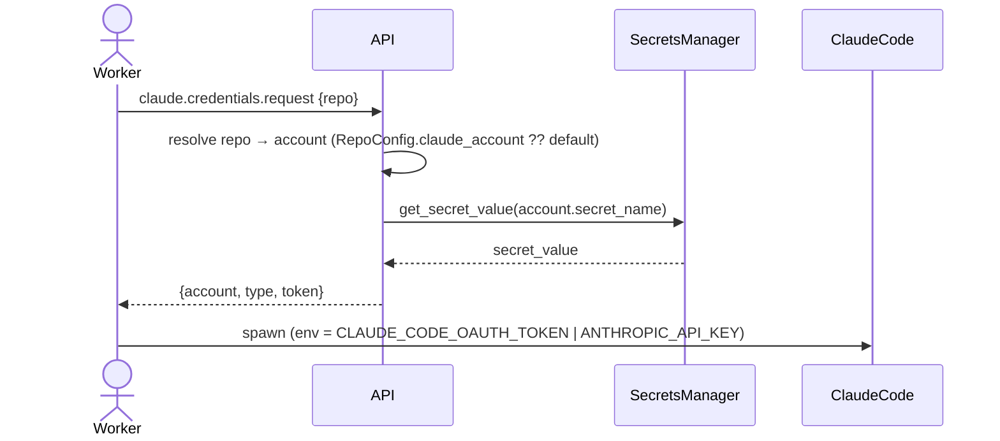

# ADR-0055: Per-account Claude credential routing for workers

- **Status:** accepted
- **Date:** 2026-05-26
- **Related:** ADR-0049 (App identity — same per-task auth re-mint shape), ADR-0050 (RepoConfig as per-repo policy carrier), ADR-0023 (post-deploy operator action for credentials)

## Context

A Treadmill deployment can drive work on repos belonging to multiple Claude accounts (an operator's personal account plus one or more client accounts they contract for). Today the worker container reads OAuth credentials from a single bind-mounted host file (`~/.claude/.credentials.json` → `/root/.claude/.credentials.json`); every worker, every task, every repo bills the same account. There is no way to route a repo's work to a different Claude account, and no way to migrate one account onto API-key auth while another stays on OAuth.

We want repo-scoped credential routing: when a worker processes a task whose repo is owned by account X, Claude Code calls bill X; tasks on the operator's own repos bill the operator's account. The mechanism must also carry a per-account credential *type* (long-lived OAuth token today; Anthropic API key later for workers) so migrating an account from OAuth → API key is a deployment-config change, not a code change.

## Decision

A deployment carries a map of **named Claude accounts**, each with a credential `type` (`oauth` | `api_key`) and a Secrets Manager `secret_name`. The map plus a `claude_default_account` name are operator-configured (deployment YAML, mirroring the existing App-secret config shape). `RepoConfig` gains a nullable `claude_account` field; that field's value, or `claude_default_account` when null, picks the account for that repo.

The worker resolves the credential at the **same per-step seam where it already re-mints the GitHub App token** (`runner._handle_step`, after `ctx.repo` is known). Resolution is API-mediated to mirror `installation-token`: the worker calls `POST /api/v1/claude/credentials {repo}`; the API resolves the repo's account, fetches the secret, and returns `{account, type, token}`. The worker then launches Claude Code with the appropriate env var: `CLAUDE_CODE_OAUTH_TOKEN` for `type=oauth`, `ANTHROPIC_API_KEY` for `type=api_key`. Claude Code's precedence rules ignore any inherited credential when one of these is set.

The existing `CLAUDE_CREDENTIALS_PATH` bind-mount is preserved as a **fallback** when no Claude accounts are configured (backward-compat with unmigrated deployments).

## Alternatives considered

- **Worker reads Secrets Manager directly.** Rejected: workers have no `secretsmanager:GetSecretValue` today, and granting it broadens the worker's blast radius. The API already mediates credential access for the GitHub App; we adopt by precedent.
- **Per-account container with a different mounted credential file.** Rejected: the container is long-lived and serves steps across repos; recreating per repo to swap a file mount adds the very container-lifecycle coupling we avoided for the GitHub App token (which re-mints in-process at per-step).
- **Account selection by step kind or worker pool.** Rejected: account is a property of the repo (who pays for work on this repo), not of the work or the worker.

## Consequences

### Good
- Per-repo billing alignment; cross-account leakage is impossible by construction (no silent fallback).
- Per-account credential *type* is a config flip — migrating workers from OAuth → API key for one account at a time costs no code change.
- Existing deployments unaffected: zero configured accounts → the file-mount fallback continues unchanged.

### Bad / trade-offs
- One additional secret per account (operator action; mirrors the App private-key secret).
- Deployment YAML grows a structured field; API config gains a JSON env var.

### Risks
- A misconfigured account (wrong type, missing secret) could silently route to the wrong account. Mitigated by **failing the step on resolution error** — never falling back across accounts.
- OAuth tokens in env are bearer-equivalent. Same surface as today (no widening); we assert in tests that the credential string never appears in captured subprocess stdout/stderr.

## Diagram

## References

- ADR-0049 GitHub App identity (per-repo re-mint pattern this mirrors).
- ADR-0050 RepoConfig as per-repo policy carrier.
- Plan: `docs/plans/2026-05-26-per-account-claude-credentials.md`.
