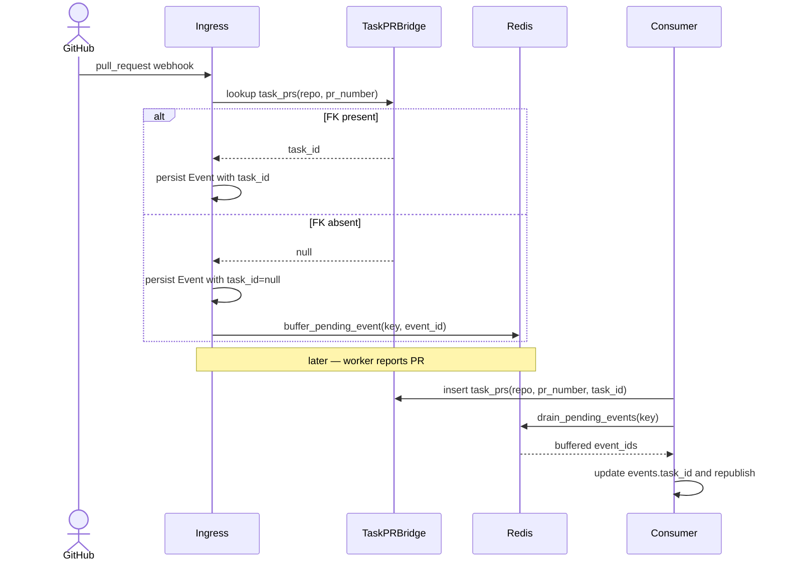

# ADR-0063: Lazy-reconciliation cache for webhook FK resolution

- **Status:** proposed
- **Date:** 2026-05-29
- **Related:** ADR-0007 (cache-then-heal for pr task_prs), ADR-0049
  (App-identity ingress cutover), ADR-0035 (scheduler — context for
  rejected periodic-sweeper alternative)

## Context

Treadmill ingests GitHub webhooks through two paths: the HTTP route
at `routers/webhooks.py` and the SQS-based inbox poller at
`coordination/webhook_inbox.py` introduced by ADR-0049. Both resolve
`task_id` for each event by looking up `task_prs(repo, pr_number) →
task_id` and persisting the resolved value onto the Event row. When
the lookup misses — most commonly because a worker's `pr_opened` PR
hook arrives before the worker has registered the bridge row — we
persist the Event with `task_id = NULL`, and downstream consumers
(notably `dispatch._is_dep_pr_merged`) silently fail to fire
`task.<id>.pr_merged` for any task depending on that PR.

ADR-0007 solved exactly this on the HTTP path: buffer the Event in
Redis on miss; drain inline when the future `task_prs` INSERT
happens. `routers/webhooks.py:223-235` buffers; `coordination/
consumer.py:935` and `:1412` drain. The bridge held for nine
months. ADR-0049's SQS ingress path was added later and did the
`task_prs` lookup without the buffer call. The comment at
`coordination/webhook_inbox.py:498-504` cites the 2026-05-14
dual-ingress drift learning — and the drift recurred anyway. On
2026-05-29 the Task 3b race (PR #92) sat for forty minutes with
both `pr_opened` and `pr_merged` events recorded with
`task_id = NULL`, blocking downstream Task 3d until manual backfill;
the stuck-task-sweep eventually caught it but only after the SLO
window we care about.

A sibling Treadmill-managed codebase (RAMJAC) implements the same
shape generally for its event pipeline: a parent entity's commit
handler walks every child type's pending cache and drains the items
keyed to this parent inline. There is no periodic worker; the
natural arrival of parent writes is the reconciliation cadence.

## Decision

We adopt the **lazy-reconciliation cache** as Treadmill's standard
shape for webhook → consumer races where an event arrives before its
FK target exists. The contract has four parts:

1. **Buffer on FK miss.** Every webhook ingress path must, for every
   Event it persists, either resolve the FK or buffer the
   `event_id` in a Redis list keyed by the missing parent's
   identity. Both ingress paths must call the same helper; a new
   ingress added later inherits the requirement by going through
   the helper.
2. **Drain inline at parent-write.** Every site that INSERTs or
   UPDATEs a row capable of resolving a buffered key must invoke
   `drain_pending_events(key)` in the same transaction. The drain
   reads the buffered `event_id`s, updates each Event's `task_id`
   under our single-writer invariant (ADR-0011), and re-publishes
   on the bus.
3. **Generalize the key.** Today `webhooks/pending_events.py`
   hard-codes the `pr:<repo>:<pr_number>:pending_events` shape. We
   refactor the helper to accept an opaque `pending_buffer_key:
   str` and move the PR-bound key derivation into the caller. Three
   FK families exist today (`(repo, pr_number)`, `(repo, head_sha)`,
   `(repo, branch)`); each gets its own key-deriving helper as its
   first consumer ships.
4. **Reject periodic sweeps.** The natural cadence of parent
   writes is the reconciliation trigger. A periodic sweeper
   duplicates the parent-write site and adds latency; we reject it
   as an architectural option in this surface.

The lock-step requirement (1) becomes structural: both ingress paths
delegate to a single `persist_and_resolve_webhook_event(...)`
function that encapsulates the FK lookup, the buffer-on-miss, and
the Event INSERT. The Event ingress paths shrink to calling that
function with the normalized payload.

## Alternatives considered

- **Periodic Redis sweep** — a scheduled `*/2` worker that drains
  stale entries. Rejected: the parent-write is a better trigger
  (lower latency, no duplicate site), and RAMJAC explicitly does
  not do this.
- **Read FK from event payload at consumer time** — let the depends-on
  resolver derive `task_id` from `head_branch` each time it reads
  the Event row. Rejected: it bandages the symptom by spreading the
  derivation across every downstream consumer; `events.task_id` is
  a hot index the dashboard view and depends-on resolver already
  rely on; the audit log loses the invariant that resolved events
  carry their resolved FK.
- **Drop `events.task_id` and join through `task_prs`** at read
  time. Rejected: removes an index the system depends on; pushes
  the join into every projection.

## Consequences

### Good

- Tonight's race class becomes structurally impossible once the SQS
  path uses the shared helper. Future ingress paths inherit the
  contract by construction.
- The generalized key admits the head_sha and branch FK families
  without forking the helper module.
- The single-writer invariant on `events.task_id` is preserved —
  the drain remains the only writer.

### Bad / trade-offs

- The shared helper is a new abstraction across two ingress paths
  that have historically diverged; we accept the coupling because
  the drift has now caused incidents twice.
- Buffered events live in Redis until parent-write; a parent that
  never arrives leaves the buffer to expire on its 48h TTL. We
  treat orphaned buffers as acceptable noise.

### Risks

- A future ingress path could persist Event rows directly, skipping
  the helper. We plan a CI gate that flags any new ingress route
  that touches the Event model without going through
  `persist_and_resolve_webhook_event(...)`. If that gate proves
  noisy, we may downgrade it to a code review checklist item.

## Diagram

## References

- ADR-0007 — existing cache-then-heal implementation.
- ADR-0049 — App-identity ingress cutover that introduced the drift.
- `docs/learnings/2026-05-14-dual-ingress-paths-need-a-shared-facade.md`
- `docs/learnings/2026-05-29-parent-write-drains-pending-children-no-poller.md`
- RAMJAC's event-pipeline parent-message handlers — precedent for
  parent-write drains children inline (private repo; pattern
  abstracted into this ADR's Decision section).
