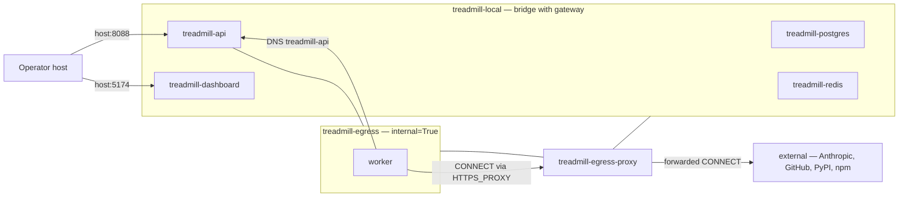

# ADR-0064: Multi-network attach for internal worker traffic under egress proxy

- **Status:** proposed
- **Date:** 2026-06-02
- **Related:** ADR-0060 (the original egress-proxy design that this
  ADR completes the network topology for)

## Context

ADR-0060 Step 3b shipped (PR #92) an autoscaler-spawn flow that
places workers on a Docker network named `treadmill-egress` created
with `internal=True` (no external gateway). The egress proxy lives
on the same network. The design intent was that the proxy is the
worker's only path to the outside world.

Internal Treadmill services — `treadmill-api`, `treadmill-postgres`,
`treadmill-redis` — live on the pre-existing `treadmill-local`
network. Docker's embedded DNS resolver only resolves container
names within the same network. A worker on `treadmill-egress` that
attempts to call `http://treadmill-api:8088/api/v1/github/installation-token`
at startup gets `Temporary failure in name resolution` and exits 1
before completing the GitHub-App bootstrap. ADR-0060's loopback-socket
"integration test" never exercised cross-network DNS, so the gap
shipped silently.

A second symmetric problem: the egress proxy itself is on a network
with `internal=True`. Docker's `internal` flag drops the bridge's
NAT route, so the proxy cannot reach external hosts (Anthropic,
GitHub, PyPI, npm) when forwarding worker CONNECT requests.

The 2026-06-02 cascade (PRs #104/#105/#106/#107) ended with the
feature flag `TREADMILL_EGRESS_PROXY_ENABLED=false` as the operator
escape hatch. Workers fall back to the pre-#92 single-network path
and run. This ADR specifies the design that lets the flag be
flipped back on.

## Decision

We adopted **selective multi-network attachment**: containers join
both networks when both reachability domains are required.

| Container | `treadmill-local` | `treadmill-egress` |
|---|---|---|
| `treadmill-api` | ✓ (host-port mapping) | ✓ (worker DNS) |
| `treadmill-egress-proxy` | ✓ (external gateway for CONNECT forwarding) | ✓ (worker-facing CONNECT listener) |
| Workers | — | ✓ (only) |
| `treadmill-postgres`, `treadmill-redis` | ✓ (only) | — |
| `treadmill-dashboard` | ✓ (only) | — |

Workers remain on `treadmill-egress` only. They reach internal
services (the API) via Docker DNS on the egress network because the
API multi-attaches. They reach external hosts only via the proxy,
which multi-attaches to gain external gateway access. Postgres,
Redis, and the dashboard stay on `treadmill-local` only — workers
never address them directly.

The runtime creates `treadmill-egress` before any service spawn so
the API's multi-attach can happen at boot. `ensure_egress_network`
moves from the autoscaler subprocess into `_up_dev_local`'s startup
sequence; the autoscaler's call becomes idempotent.

`TREADMILL_EGRESS_PROXY_ENABLED` defaults flip from `false` to
`true` only after the real-Docker smoke (see Follow-ups) passes.
The flag survives as the operator escape hatch.

## Alternatives considered

- **Single-network collapse.** Put workers, the API, and the proxy
  all on `treadmill-local`; rely on `HTTP_PROXY` + `NO_PROXY` env
  alone. Rejected: loses ADR-0060's "workers cannot reach external
  without the proxy" property — a worker whose env is tampered with
  could bypass the proxy and reach external hosts directly. Reversing
  ADR-0060's two-network choice belongs in a separate ADR if we
  decide the isolation goal is no longer worth its complexity.
- **Workers multi-attach to both networks.** Symmetric to the
  chosen design but extends external-gateway access to workers,
  which defeats ADR-0060's isolation goal.
- **Out-of-Docker discovery (explicit host IP, host networking, or
  a sidecar relay).** Brittle. Loses Docker DNS convenience. Adds
  failure modes specific to dev-local that don't exist in cloud
  deployments.

## Consequences

### Good

- Workers can reach the API by name without losing isolation.
- The proxy can forward external requests without changing
  ADR-0060's `internal=True` invariant for the network workers live
  on.
- Postgres / Redis / dashboard stay isolated from workers
  structurally — workers cannot resolve them on the egress network.

### Bad / trade-offs

- The API container is now on two networks at runtime. Container
  restart logic must re-attach to both; the deploy-watcher's
  `recreate_api_container` path needs to walk both networks.
- The proxy is bridged to `treadmill-local` for external gateway
  access. A misconfigured proxy could in principle route worker
  traffic via `treadmill-local`'s gateway directly, but the proxy
  is our code; we control the forwarding.

### Risks

- Docker network behavior on Linux differs from MacOS / WSL
  developer machines. The real-Docker smoke must run in the same
  Docker daemon CI uses to be load-bearing. Mitigation: ADR-0065's
  smoke gate runs on the same Linux Docker the prod path uses.

## Diagram

## Follow-ups

- ADR-0065 (proposed alongside this one): a real-Docker
  integration-smoke gate that exercises this topology end-to-end
  on PRs touching the autoscaler / runtime / egress-proxy modules.
  The gap that hid the cross-network DNS issue is a CI-process
  concern; this ADR is the architecture.
- Operator handling of mixed cloud + dev-local deployments. Real
  AWS uses VPC subnets + Security Groups, not Docker networks; the
  translation is a separate ADR if/when we run the egress proxy in
  cloud.

## References

- ADR-0060 — original egress-proxy design (decided two-network
  topology; underspecified internal-service reachability).
- PRs #104 / #105 / #106 / #107 — the 2026-06-02 cascade.
- `tools/local-adapter/treadmill_local/egress_proxy.py` — current
  network primitives (`ensure_egress_network`,
  `ensure_egress_proxy_container`).
- `tools/local-adapter/treadmill_local/runtime.py` — container
  spawn sites that need the multi-attach change.
