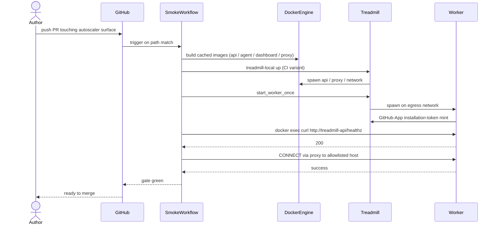

# ADR-0065: Real-Docker integration-smoke gate for autoscaler-touching PRs

- **Status:** proposed
- **Date:** 2026-06-02
- **Related:** ADR-0060 (egress proxy — origin of the gap this gate
  closes), ADR-0064 (network topology the gate exercises)

## Context

The 2026-06-02 cascade put four wedges in series — PRs #104, #105,
#106, #107 — all caused by PR #92 (ADR-0060 Step 3b) shipping
autoscaler-spawn code that broke end-to-end on real Docker. Each
of the four failures was structural (image build wiring, env var
injection, filesystem ownership, cross-network DNS) and none was
caught by the existing CI. The cascade cost ~3 hours of operator
plus orchestrator time, and the original wedge sat undetected for
60 minutes (Step 1 of the ADR-0063 plan was `wf-author: executing`
with no actual worker behind it).

ADR-0060's "integration test" (`tools/local-adapter/tests/test_egress_proxy_integration.py`)
uses asyncio loopback sockets. It never spawns a real container,
never crosses Docker networks, and never runs the autoscaler's
real spawn path. PR #92 passed CI by exercising fake adapters.

The pattern: tests existed, but they didn't exercise the load-
bearing integration. Memory-based reviewer checklists ("did this
PR add a real-Docker test?") cannot reliably catch coverage gaps
when the failure modes are this subtle. The fix needs enforcement.

Treadmill's `treadmill-local up` flow is already a real-Docker
boot procedure for the dev-local stack. A CI gate that runs that
flow on autoscaler-touching PRs is the right shape; we are not
inventing a new test framework, we are running the existing one in
CI.

## Decision

We added a GitHub Actions workflow at
`.github/workflows/autoscaler_smoke.yml`. It triggers on PRs whose
changed paths match a filter covering the autoscaler surface and
the proxy. The job runs on `ubuntu-latest`, boots a stripped-down
`treadmill-local up`, spawns one worker via the autoscaler entry
point, and asserts the worker reaches healthy state on real Docker.

### Trigger filter

```yaml
paths:
  - tools/local-adapter/treadmill_local/autoscaler.py
  - tools/local-adapter/treadmill_local/runtime.py
  - tools/local-adapter/treadmill_local/egress_proxy.py
  - tools/local-adapter/treadmill_local/docker_client.py
  - services/egress-proxy/**
  - workers/agent/Dockerfile
  - infra/treadmill_infra/stacks/**
```

### Assertions

Within a 60-second wall-clock budget after the boot completes:

1. The worker container is in `Up` state (`docker inspect`).
2. The worker has completed the GitHub-App installation-token
   mint (grep the worker log for the post-mint marker).
3. The worker can resolve and reach `treadmill-api` from inside
   its network (`docker exec <worker> curl http://treadmill-api:8088/healthz`
   returns 200).
4. When `TREADMILL_EGRESS_PROXY_ENABLED=true` (post-ADR-0064): a
   CONNECT to an allowlisted external host via `HTTPS_PROXY`
   succeeds; a CONNECT to a non-allowlisted host returns 403.

### Image caching + runtime budget

GitHub Actions caches the four built images (api, agent, dashboard,
egress-proxy) keyed by Dockerfile content + source-tree hash.
First run after a Dockerfile change is ~3-4 minutes; subsequent
runs are ~30 seconds. The gate is REQUIRED in branch protection
for filtered paths; for paths outside the filter the gate does not
run (zero cost).

### Failure handling

On assertion failure the job dumps the worker container logs, the
proxy container logs, and the autoscaler subprocess tail to the GH
Actions artifacts so the author can diagnose without re-running.
A single retry runs on Docker-daemon flakiness signatures (e.g.
`failed to start daemon`); other failures fail immediately.

## Alternatives considered

- **Option II — LLM-judge "is this PR covered by a real-Docker
  test?"** Soft, fast, runs on every PR. Rejected: the cascade
  was not caused by missing tests but by tests that didn't
  exercise the right path. An LLM that reads "we have a test"
  would have green-lit PR #92. We need actual coverage, not the
  appearance of coverage.
- **Option III — documented rule + reviewer checklist.** No
  enforcement. Rejected: the team is small, and four cascade
  layers in one day prove we cannot rely on memory-based checks
  for failure modes this subtle.
- **Option IV — Testcontainers in the existing pytest suite.**
  Compelling in principle, but Testcontainers on GHA requires
  Docker-in-Docker, which is fragile. Native GHA Docker is simpler
  and matches the dev-local boot path exactly.

## Consequences

### Good

- Every autoscaler PR ships with proof that the integration works
  on the same Docker engine the prod path uses.
- The four-layer cascade pattern (each fix surfaces the next gap)
  cannot recur silently — the smoke catches the first layer at
  PR-author time.
- The gate is path-filtered, so PRs touching unrelated surfaces
  pay zero CI cost.

### Bad / trade-offs

- The CI run is heavier than unit tests — 30s warm, several
  minutes cold. PR authors touching the autoscaler wait longer
  for green.
- Docker on GHA can flake. The retry wrapper plus log-dumping
  is the mitigation, but operators must distinguish "actually
  broken" from "GHA flaked" when triaging red gates.

### Risks

- New autoscaler surfaces get added without updating the path
  filter — the gate stops firing where it should. Mitigation: an
  annual review of the filter is too soft; we add the filter
  surface to the autoscaler's own AGENT.md so any new module
  there reminds the author.
- The smoke uses moto for AWS, which can drift from real AWS
  behavior. Mitigation: cloud-side has its own deploy-watcher
  smoke; the dev-local gate exercises the spawn primitives, not
  AWS-API correctness.

## Diagram



## Follow-ups

- Generalize the gate to a broader integration-smoke pattern if
  other surfaces (API, dashboard, scheduler) show similar
  cascade-prone failure modes. Not warranted yet.
- A real-cloud smoke is a separate ADR if/when the dev-local
  Docker primitive diverges from cloud behavior in a way that
  matters. ECS uses Service tasks + Security Groups, not Docker
  networks; the egress design's cloud port is its own ADR.

## References

- ADR-0060 — egress proxy (where the gap originated).
- ADR-0064 — network topology the smoke validates.
- The 2026-06-02 cascade: PRs #104 / #105 / #106 / #107.
- `tools/local-adapter/treadmill_local/runtime.py::_ensure_images_built`
  — the existing real-Docker boot the smoke wraps.
