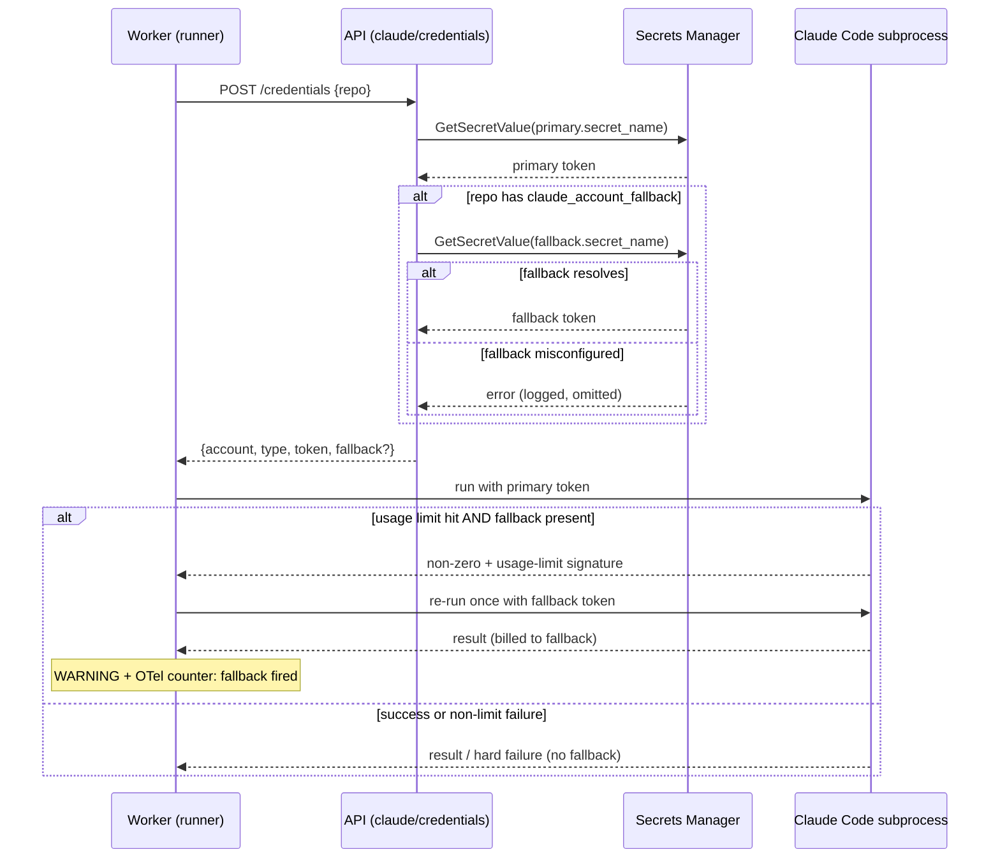

# ADR-0066 — Usage-limit fallback for Claude account routing

- **Status:** accepted
- **Date:** 2026-06-02
- **Amends:** ADR-0055 (per-account Claude credentials for workers)

## Context

ADR-0055 routes each repo to exactly one Claude account: `RepoConfig.claude_account`
(or the deployment's `CLAUDE_DEFAULT_ACCOUNT`) → `Settings.claude_accounts` map →
Secrets Manager → one token, set as `CLAUDE_CODE_OAUTH_TOKEN` (oauth) or
`ANTHROPIC_API_KEY` (api_key) on the Claude Code subprocess. ADR-0055 deliberately
forbids **silent cross-account fallback**: a misroute must fail loudly, never quietly
bill the wrong account.

That single-account routing has an operational gap. When a repo is pinned to a Claude
*subscription* (oauth) account, that subscription carries a rolling usage limit that
resets roughly every five hours. When the limit is hit, every Claude Code subprocess
for that repo fails until the window resets — the worker has no way to keep making
progress even when the operator holds a second, idle subscription.

We want a repo to name a **primary** account and an **explicit, configured fallback**
account, and to use the fallback only when the primary is genuinely exhausted. This is
not the silent fallback ADR-0055 rejected — it is fallback the operator opts into per
repo, between accounts the operator owns.

## Decision

Add an optional per-repo **fallback account**, resolved server-side and applied at the
failing subprocess. Three properties define it:

1. **Explicit, configured, opt-in.** A repo participates only when its config sets
   `claude_account_fallback` to a named account that exists in `Settings.claude_accounts`.
   Absent that, behaviour is exactly ADR-0055. The ADR-0055 invariant — the *worker*
   never chooses an account — is preserved: the API still owns all routing.

2. **Per-step, retry-primary-first.** Each step resolves the primary as before. Only the
   Claude Code subprocess that actually hits a usage limit falls back, and it falls back
   exactly once. The next step (and the next run) starts on the primary again, so a repo
   keeps preferring its primary subscription and naturally returns to it as limits reset.
   We do **not** make fallback sticky for the run — that would burn the secondary
   subscription long after the primary recovered.

3. **Best-effort fallback, hard primary.** The credentials resolver returns the primary
   credential exactly as ADR-0055 dictates (404/502/503 on failure). When the repo also
   names a fallback, the resolver additionally fetches the fallback secret and returns it
   in an optional `fallback` block. If *fallback* resolution fails (name not in the map,
   Secrets Manager error), the resolver logs and returns the primary-only response — a
   misconfigured fallback degrades availability, it never breaks a working primary.

### Mechanics

- **Schema.** `RepoConfig.claude_account_fallback: str | None` (nullable `VARCHAR(64)`
  column on `repo_configs`, mirroring `claude_account`).
- **Resolver.** `POST /api/v1/claude/credentials` gains an optional nested
  `fallback: {account, type, token} | None` on its response.
- **Worker.** The resolved `ClaudeCreds` carries an optional `fallback`. Each Claude Code
  invocation runs with the primary token; if the subprocess exits non-zero **and** its
  captured output matches a usage-limit signature **and** a fallback is present, the
  invocation re-runs once with the fallback token's env (`build_claude_env` already sets
  exactly one credential, so the swap is a clean env rebuild). A structured WARNING and an
  OTel counter record each fallback so the operator can see how often the primary is
  saturating.

### Detection

Usage-limit detection is a conservative match over the subprocess's combined
stdout/stderr (case-insensitive: `usage limit`, `rate limit` / `rate_limit_error`,
`overloaded`, HTTP `429`, quota/reset markers). The exact strings Claude Code emits for
an exhausted oauth subscription in `--print --output-format json` mode are version-
specific and are pinned by unit tests against captured real samples — see Consequences.

## Sequence

## Alternatives considered

- **Sticky fallback for the rest of the run.** Rejected: fewer mid-run limit hits, but it
  keeps billing the secondary subscription after the primary's window resets, defeating
  the "primary-first" intent.
- **Worker re-calls the resolver with `prefer=fallback`.** Rejected: adds a round-trip and
  pushes account-selection knowledge toward the worker; returning both credentials keeps
  all routing in the API (ADR-0055 invariant) and makes the retry a local env swap.
- **Coarse retry of the whole step on the runner.** Rejected: re-clones the tree and
  re-runs sibling Claude calls that already succeeded. Subprocess-local retry is cheaper
  and matches "only the failing call falls back".
- **Account-chain (depth > 1).** Deferred. A single fallback covers the two-subscription
  case; a list can come later if a third account is ever needed.

## Consequences

- A repo with a configured fallback keeps making progress across the primary's usage-limit
  windows, at the cost of spending the secondary subscription for the affected calls.
- **Detection brittleness is the load-bearing risk.** Too-broad signatures cause spurious
  fallback (silently spending the secondary on unrelated failures); too-narrow misses the
  case. The matcher stays conservative and is pinned by tests with captured samples, and is
  revisited whenever the worker image's Claude Code version is bumped.
- Token-usage attribution does not yet record *which* account a call billed; when fallback
  fires, usage rows still read as the primary's model with no account dimension. Adding an
  account attribute to `record_token_usage` is a follow-up, out of scope here.
- The "no silent cross-account fallback" rule of ADR-0055 stands for *misroutes*. This ADR
  narrows it: fallback is allowed only between operator-configured accounts on an explicit
  usage-limit signal, and it is observable when it happens.
