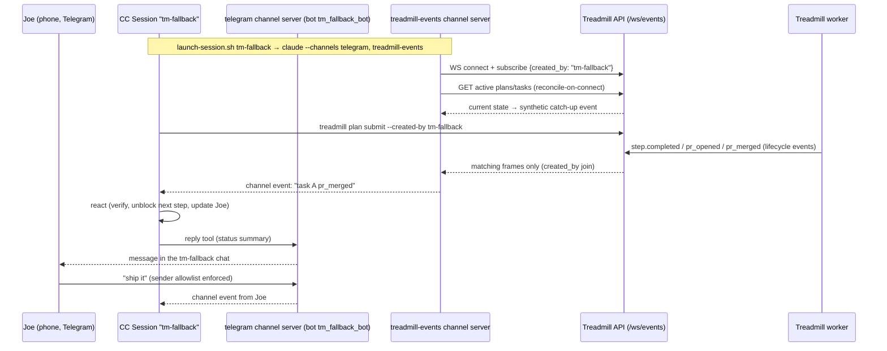

# ADR-0068 — Treadmill events channel, and shared conventions for per-session channels

- **Status:** proposed
- **Date:** 2026-06-03
- **Related:** ADR-0067 (CC Channels, one bot per session, for phone access — adopted
  unchanged, extended here), ADR-0062 (operator escalations; Step 4's Slack notifier is
  the *outbound-to-operator* sibling of this *inbound-to-session* path)
- **Handoffs:** `docs/handoffs/2026-06-03-cc-channels-one-bot-per-session.md` (phone-access
  track, picked up by this ADR's track)

## Context

Two workstreams have independently arrived at Claude Code **Channels** (research preview,
CC ≥ 2.1.80 — workstation runs 2.1.161):

1. **Phone access (ADR-0067, proposed).** Joe drives ~5 concurrent long-lived sessions
   and wants to reach them from his phone. Decision: one dedicated Telegram bot per
   session, launched via a wrapper. Research done; setup blocked on Bun install and
   BotFather bot creation.

2. **Dispatch supervision (this ADR).** When a session dispatches work through Treadmill,
   it currently learns about progress by **polling** — Monitor loops hitting the API every
   ~90s per session. With ~5 sessions that is noisy, slow to react, and structurally
   backwards: Treadmill already *emits* every lifecycle event the poller is fishing for
   (the events table, SQS/SNS, and the dashboard's `WS /api/v1/dashboard/ws/events`
   broadcast).

Channels are the missing transport: an MCP channel server per session pushes events into
the running session, so the orchestrator reacts to `pr_merged` / `step.failed` instead of
discovering them on the next poll tick.

Two constraints shape the design:

- **The channel architecture is fan-out, not demux** (ADR-0067's core finding). There is
  no session addressing in the protocol; each session runs its own channel server
  process. Multi-session correctness therefore lives in *what each per-session server
  subscribes to*, not in any shared router.
- **The events need a routing key.** Five sessions may touch the same repo, so repo-level
  filtering cross-talks. The natural key already exists: `plans.created_by` and
  `tasks.created_by` (both `String(255)`, already populated by `treadmill plan submit
  --created-by`). Today the WS frame carries `{entity_type, action, task_id, ts, id}` —
  no `plan_id`, no `created_by` — so server-side filtering requires a join and a slightly
  wider frame.

Without shared conventions, the two channel tracks would each invent a launcher, a state
layout, an identity scheme, and a security posture. We standardize them now, while both
are greenfield.

## Decision

### Part 1 — shared conventions for all per-session channels

1. **The session label is the identity primitive.** Every long-lived session gets a
   stable kebab-case label (e.g. `tm-fallback`, `osmo-forecast`). The label names the
   session's Telegram bot (ADR-0067: the phone's chat list *is* the session list), keys
   its channel state directory, and is the value the session passes as `--created-by` on
   every Treadmill dispatch. One label, three uses — phone addressing, state isolation,
   and event routing all agree on what a "session" is.

2. **One launcher composes all channels.** A single `launch-session.sh <label>` wrapper
   (extending ADR-0067's planned script) sets the per-session state dirs, exports the
   session's bot token, and launches one `claude --channels` invocation naming *every*
   channel the session uses — Telegram and treadmill-events side by side. While the
   research preview gates custom channels, the launcher adds
   `--dangerously-load-development-channels`; this is acceptable only because the channel
   is our own code talking to our own localhost API.

3. **State layout:** `~/.cc-channels/<label>/telegram/` (the plugin's
   `TELEGRAM_STATE_DIR`) and `~/.cc-channels/<label>/treadmill/` (subscription cursor,
   dedup window).

4. **Inbound gating is mandatory, per channel type.** These sessions run with bypassed
   permissions, so every inbound path is a prompt-injection surface (ADR-0067 risk #1):
   - *Chat channels:* strict sender allowlist before anything else; gate on sender
     identity, never chat identity.
   - *Treadmill events:* the channel server connects only to the localhost API with the
     API key; it forwards **structured event facts** (entity, action, task id, PR number,
     verdict), never raw LLM/PR prose — event *content* is data, not instructions.

5. **Delineation from ADR-0062:** escalations → Slack tell *Joe* something needs a human;
   the events channel tells *the originating session* its dispatched work moved. Same
   underlying events, different audience; neither replaces the other.

### Part 2 — the treadmill-events channel

A small custom channel server (Bun script per the channels reference, living in-repo at
`tools/cc-channel-treadmill/`) plus two API-side extensions:

1. **Wider WS frame + server-side subscribe filter.** `WS /ws/events` accepts a
   subscription (query param or first client frame) `{created_by: "<label>"}`. The relay
   joins each event's `task_id`/`plan_id` to its `created_by` and only sends matching
   frames down that socket. Frames gain `plan_id` and `created_by`. Unfiltered
   connections (the dashboard) behave exactly as today.

2. **The channel server** connects to the WS with its session label, and:
   - **Reconciles on connect** — one REST query for the current state of the label's
     active plans/tasks, emitted as a synthetic catch-up event (channels only push into
     *live* sessions; a restarted session must not trust silence).
   - **Dedups by event `id`** across a sliding window (SQS redelivery means the same
     event can be relayed twice).
   - **Forwards compact lines** into the session (`task 57598e7a pr_opened #128`,
     `step claude-fallback-schema failed: <error head>`), throttled per task so a noisy
     run cannot flood the session.

3. **Sessions stop polling.** The per-plan Monitor loops are retired once the channel
   delivers; the session's standing context (memory/CLAUDE.md guidance) shifts from "arm
   a poll monitor after dispatch" to "dispatch with `--created-by <label>` and react to
   channel events".

## Sequence

## Alternatives considered

- **Keep polling (status quo).** Works today, zero build. Rejected as the steady state:
  5 sessions × 90s polls is sustained API noise, reaction latency is the poll interval,
  and every session re-implements the same loop. Polling survives only as
  reconcile-on-connect.
- **SNS → per-session SQS fan-out** instead of the WS. Correct broadcast semantics, but
  adds per-session AWS resources and credentials for what is a localhost concern; the WS
  relay already broadcasts to N dashboard clients. Rejected.
- **Point channel servers at the existing SQS events queue.** Hard-rejected: SQS is
  competing-consumer — five subscribers would each steal ~1/5 of the stream.
- **One shared gateway channel multiplexing all sessions.** Same demux problem ADR-0067
  hit with Telegram: the protocol has no session addressing. A per-session server with a
  server-side filter *is* the supported shape. (ADR-0067's deferred "custom channel
  server with a routing table" remains deferred; building this channel creates the
  in-house channel competence that path would need.)
- **Filter by repo instead of `created_by`.** Too coarse — concurrent sessions
  legitimately work the same repo and would cross-talk.
- **Client-side filtering (broadcast everything, channel drops non-matching).** Simpler
  API change, but every session's channel receives every other session's events —
  wasteful and leaky. Server-side filter chosen; client-side dedup/throttle retained.

## Consequences

### Good
- Push replaces poll: reaction latency drops from poll-interval to near-immediate, and
  per-session API polling load goes away.
- One identity scheme (`label = bot name = state dir = created_by`) across both channel
  tracks; one launcher; one security posture.
- The dashboard WS gains `plan_id`/`created_by` and an optional filter — useful to the
  dashboard itself, independent of channels.

### Bad / trade-offs
- Research preview: custom channels require `--dangerously-load-development-channels`,
  and the `--channels` contract may drift between CC releases (pin the tested CC version
  in the launcher header; the handoff already flags this).
- Events to a dead session drop silently; reconcile-on-connect bounds the damage to the
  downtime window, but a session that never restarts never learns. (ADR-0067's liveness
  ping idea applies to both tracks; deferred.)
- Bun becomes a workstation dependency (already required by ADR-0067's plugins).

### Risks
- **Prompt injection via event content.** Lifecycle events embed worker/PR text. The
  channel forwards structured facts only; the session treats event text as data. The
  Telegram sender allowlist remains mandatory and is configured before anything else.
- **Double notification** (channel + ADR-0062 Slack escalation for the same failure) is
  by design — different audiences — but worth watching for alert fatigue.

## Sequencing (implementation sketch, plan doc to follow)

1. API: WS frame gains `plan_id`/`created_by`; subscribe filter on `/ws/events`
   (dispatchable as a Treadmill task — touches only the dashboard WS relay).
2. Channel server `tools/cc-channel-treadmill/` + the shared launcher (orchestrator-built;
   needs `--dangerously-load-development-channels` to test, so not worker-dispatchable
   end-to-end).
3. Operator: Bun install (needs Joe's nod), BotFather bots × N labels, Telegram-vs-Discord
   confirmation (ADR-0067 holds Telegram as the weak default), pair + allowlist first.
4. Cutover: relaunch sessions through the launcher; retire poll monitors; flip ADR-0067
   and this ADR `proposed` → `accepted` after one session runs both channels for a day.
