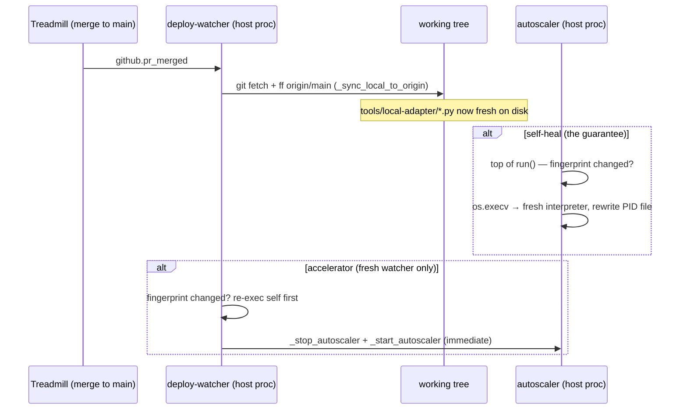

# ADR-0069 — Managed host processes self-heal when their code goes stale

- **Status:** proposed
- **Date:** 2026-06-04
- **Related:** ADR-0024 (deploy-watcher recreates containers on merge), ADR-0064
  (API/proxy multi-attach), ADR-0062 (operator escalations)
- **Learnings:** `2026-06-04-host-processes-pin-code-at-import-time.md`,
  `2026-06-04-accept-as-is-terminalizes-task-before-merge.md` (sibling boundary class)

## Context

The local adapter runs three long-lived **host processes** as detached
`subprocess.Popen(start_new_session=True)` children with PID files and no
supervisor: the autoscaler, the scheduler, and the deploy-watcher
(`runtime.py:_start_autoscaler` / `_start_scheduler_dev_local` / the
deploy-watcher launcher). Python pins module code at import time, so each
keeps executing whatever it imported at launch until the process is manually
restarted.

When code merges to `main`, the deploy-watcher ff's the clone to `origin/main`
(`_sync_local_to_origin`) and recreates the **containers** it manages (API,
dashboard) — but `tools/local-adapter/**` is classified `adapter → notify-only`
(`deploy_watcher.py` dispatch table). So a merge that changes the host
processes' *own* code updates the files on disk and does nothing else. The
processes run stale until a human runs `treadmill-local up`.

This bit us three times in one night (2026-06-03):

1. Autoscaler running pre-merge `_ALWAYS_ALLOWED_STATIC` kept writing
   per-worker allowlists without `github.com` after #130 merged → every clone
   `CONNECT 403`.
2. Same autoscaler, pre-merge registry scoping after #132 → every `uv run`
   validation gate `tunnel error` → tasks looped through gate-broken architect
   resolutions.
3. Deploy-watcher running pre-#118 code recreated the API for #133 without the
   ADR-0064 egress multi-attach → workers lost DNS for `treadmill-api`,
   crashlooped, and a step sat unclaimed in `ready` for 1h40m.

Each time the *source on disk was correct* and a fresh interpreter imported the
fix — only the resident process was stale. Verification kept lying because we
checked the tree, not the process.

Critically, #3 shows the deploy-watcher **cannot be the sole fixer**: it was
itself the stale process. Whatever heals this class must not depend on any one
process already being fresh.

## Decision

Every managed host process **self-heals**: it captures a fingerprint of its own
package's source at startup, re-checks once per control-loop iteration, and
**re-execs itself** (`os.execv(sys.executable, ...)`) at the top of the loop —
a safe point, never mid-handler — when the fingerprint changes. A fresh
interpreter re-imports current code; the bug class is closed regardless of
*which* process was stale, with no supervisor and no cross-process trust.

Specifics:

1. **Fingerprint.** A content hash over the `treadmill_local` package's `*.py`
   files (the source these processes import). Cheap (a few dozen small files,
   once per multi-second tick). Content hash, not mtime — robust to clock skew
   and `git` operations that touch mtimes without changing bytes.

2. **Safe re-exec point.** Top of the loop, before claiming/handling work:
   - autoscaler — top of `Autoscaler.run()` before `tick()`;
   - scheduler — its analogous loop head;
   - deploy-watcher — top of its poll loop, between merge-event batches (never
     mid-recreate).
   Re-exec preserves argv/env/cwd and rewrites the PID file to the new pid so
   `treadmill-local`'s `_*_pid_alive` checks stay correct. A loud
   `process X re-execing: source changed (<old>→<new>)` log precedes it.

3. **Accelerator (not the safety net): adapter merges restart siblings.**
   The deploy-watcher promotes `tools/local-adapter/**` from notify-only to
   "restart the autoscaler + scheduler" (reusing `_stop_autoscaler` /
   `_start_autoscaler`). This collapses the heal latency from "up to one loop
   interval" to "immediate" for the common path. It is explicitly *not* relied
   on for correctness — the per-loop self-check is the guarantee, because the
   deploy-watcher itself can be the stale one (and it heals itself via the
   same self-check, then its sibling-restart logic is fresh).

## Sequence

## Alternatives considered

- **Warn-only / escalate-and-let-operator-restart.** A stuck-task-style sweep
  flags a process older than its code and pings the operator (ADR-0062). Safe,
  but leaves the failure live until a human acts — exactly the gap that cost
  1h40m tonight. Kept as an *additional* signal, not the fix.
- **A real supervisor (systemd / a watchdog parent) that restarts on file
  change.** Heaviest option; introduces a new always-on component and platform
  coupling for a dev-adjacent local adapter. Re-exec achieves the same
  freshness with no new process.
- **Deploy-watcher restarts siblings, full stop (no self-check).** Insufficient
  alone — #3 was the deploy-watcher itself being stale; a stale watcher won't
  run new restart logic. Demoted to accelerator.
- **mtime comparison instead of content hash.** Rejected: `git` checkouts and
  editable installs churn mtimes without byte changes (and vice-versa); the
  hash measures the thing that actually matters — did the imported source
  change.
- **Restart mid-handler the instant a change is seen.** Rejected: re-execing
  the autoscaler mid-reap or the watcher mid-recreate could orphan a
  half-applied operation. The loop-boundary guard is the whole point.

## Consequences

### Good
- The stale-process class is structurally closed for all three processes with
  one shared mechanism; future host processes get it by calling one helper.
- No supervisor, no new component, no cross-process trust assumption.
- Heal latency is one loop interval worst case (seconds), immediate on the
  accelerator path.

### Bad / trade-offs
- A re-exec drops in-flight loop-local state (acceptable — these loops are
  stateless between iterations by design; durable state is in Postgres/Redis).
- A pathological "code changes every tick" scenario could thrash; mitigated by
  only re-checking once per tick and requiring the fingerprint to actually
  differ (steady state = no change = no re-exec).
- Re-exec must faithfully rewrite the PID file or `treadmill-local` health
  checks will spawn a duplicate; covered by tests.

### Risks
- **Re-exec at the wrong point.** Mitigated by fixing the check to the loop head
  and unit-testing that a mid-handler change is deferred to the next boundary.
- **Self-update of the deploy-watcher.** It must re-exec itself *before* acting
  on a batch that changed its own code; ordering covered in the plan.

## Implementation note

Logic (fingerprint, should-reexec decision, PID-file rewrite) is pure and
unit-testable in the worker sandbox; the actual `os.execv` end-to-end is
operator/orchestrator-verified on the live host. Plan + dispatch to follow.
