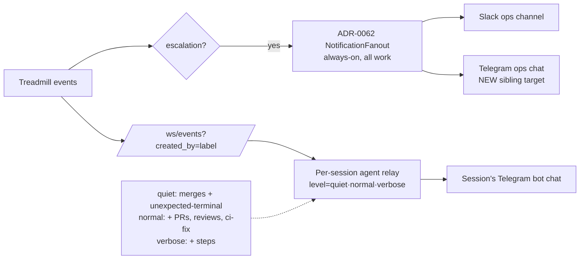

# ADR-0071 — Operator notification strategy: log levels + two-layer delivery

- **Status:** accepted
- **Date:** 2026-06-04
- **Related:** ADR-0062 (operator escalations → Slack/webhook fan-out), ADR-0067 /
  ADR-0068 (Claude Code channels), PR #147 (per-session Telegram relay contract)
- **Supersedes:** the default-verbosity of PR #147's relay (the significant-set is now
  governed by a log level; see Decision)

## Context

Two operator-notification paths now exist, and they have different properties:

1. **Server-side escalation fan-out (ADR-0062 Step 4).** `NotificationFanout` subscribes
   to the in-process event broadcaster and POSTs `task.escalated_to_operator` /
   `task.escalation_closed` to Slack and generic webhooks. It is **always-on** (fires
   whether or not any agent session is alive), cross-cutting (all repos), and MTTR-tracked.

2. **Per-session agent relay (PR #147).** A labelled Claude Code session running the
   `treadmill-events` channel forwards its own (`created_by`-filtered) lifecycle events,
   and — when a Telegram channel is also active — relays them to that session's bot. It is
   **richer and in-context** (the agent can add detail / act), but only lives while the
   session does, and is scoped to that one session's work.

Telegram is now the primary away-from-keyboard operator surface (the long-deferred
"Telegram over Slack" preference). Operators asked for a **verbosity control** ("by default
just tell me when tasks merge or hit an unexpected terminal state") and a coherent story for
which path carries what — without ripping Slack out. This ADR settles both.

## Decision

### 1. Relay log levels (reuse the ADR-0062 taxonomy — no new classification)

A per-session `TREADMILL_RELAY_LEVEL` (default `quiet`), set by the launcher per label,
governs what the per-session relay forwards:

- **`quiet` (default):** `pr_merged` (clean terminal success) + any **unexpected terminal
  state** — exactly the ADR-0062 escalation reasons: `terminal_step_failure`, `cap_reached`,
  `gate_broken`, architect amend-exhausted, unresolved conflict, `cancelled`. "Tell me when
  something finishes or goes wrong."
- **`normal`:** + PR opened, review verdicts (approve / changes-requested), ci-fix loop entries.
- **`verbose`:** + step started/completed and other intermediate lifecycle.

The level reuses the escalation taxonomy ADR-0062 already computes; "unexpected terminal
state" is not redefined here.

### 2. Two layers with distinct, non-overlapping scopes

- **Server fan-out (ADR-0062) = always-on escalation safety net.** Keep its scope as-is:
  **escalations only**, fired server-side regardless of live sessions, across all work. This
  guarantees an unexpected terminal state surfaces even when *no* session is watching that
  repo. **Extend it with a Telegram target** alongside Slack (`TREADMILL_TELEGRAM_*` ops
  destination) — Telegram becomes a first-class sibling fan-out target. **Slack is retained**,
  not replaced; an operator runs either or both.
- **Per-session relay (PR #147) = scoped, in-context, tunable.** Carries the per-session
  baseline (`quiet`: merges + that session's escalations, for immediate context) plus richer
  detail at higher levels, to that session's bot. Lives only while the session runs.

Because the server path is **escalations-only** and the session path adds **merges + detail**,
the two compose cleanly: the only overlap is an escalation for *actively-watched* work
appearing in both the session bot and the always-on ops destination — which is desirable
(you want it in the chat you're watching *and* the durable ops channel), not noise.

## Diagram

## Alternatives considered

- **Rip out Slack, Telegram-only.** Rejected — the deferred preference was Telegram *as a
  sibling*, not a replacement; Slack stays a fan-out target so existing wiring/teams keep working.
- **One path only (either always-on OR per-session).** Rejected — they trade off reliability
  vs. richness. Always-on can't add in-context detail or act; per-session can't fire when no
  session is up. Keeping both, with clean scopes, gets both properties.
- **A new severity classification for relayed events.** Rejected — ADR-0062 already computes
  the "unexpected terminal state" set; the log level reuses it.
- **Make the per-session relay carry the always-on baseline.** Rejected — a session can be
  down; the always-on guarantee must live server-side.

## Consequences

### Good
- A reliable, always-on baseline (escalations) that no session-liveness gap can drop.
- Per-session verbosity tuning; quiet by default so phones aren't a firehose.
- Telegram is a first-class ops target; Slack retained; operators choose their mix.

### Bad / trade-offs
- Two mechanisms to maintain. Mitigated by the clean scope split (escalations server-side;
  merges + detail session-side).
- An escalation on actively-watched work pings twice (session bot + ops destination). Judged
  desirable, not noise; an operator who dislikes it runs only one destination.
- `TREADMILL_RELAY_LEVEL` is per-session config (launcher/env); there is no live "turn it up
  for this run" control yet — a future enhancement (e.g., a Telegram command) if needed.

## Implementation sketch (plan + dispatch to follow)

1. ADR-0062 `NotificationFanout`: add a Telegram target (bot token + chat id via
   `TREADMILL_TELEGRAM_*` settings) beside the Slack/raw-webhook targets; same
   failure-isolation contract.
2. `treadmill-events` channel: read `TREADMILL_RELAY_LEVEL` and gate the relay set by level
   (extends the PR #147 instructions); launcher sets it per label (default `quiet`).
3. Docs: `services/api/AGENT.md` (fan-out targets), `tools/cc-channel-treadmill/README.md`
   (levels). Flip ADR-0067/0068 to accepted alongside, post-soak.
