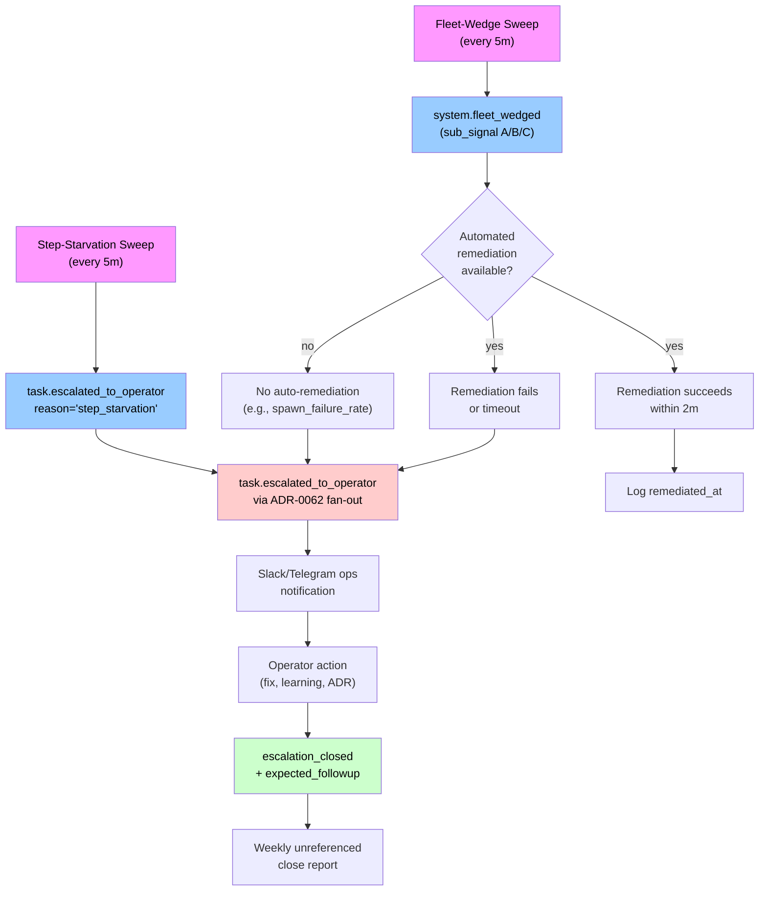

# ADR-0075 — Step-starvation detector and fleet-wedge alerting

- **Status:** accepted
- **Date:** 2026-06-05
- **Related:** ADR-0058 (architect gate-broken verdict), ADR-0062 (operator escalations as incidents), ADR-0071 (operator notification two-layer), ADR-0072 (long-lived IAM credentials), ADR-0073 (persistent orchestrator sessions), `docs/learnings/2026-06-05-autoscaler-ignores-no-build-and-stalls-silently.md`

## Context

Two structural gaps in wedge detection emerged during the 2026-06-05 incident:

> A TypeScript bug landed on `main` in PR #179. The dev-local autoscaler crashed every tick with a docker build failure, kept ticking and logging the same error every 5 seconds for **~1h26m** (400+ consecutive failed ticks) before an operator noticed. Zero workers ever spawned; the SQS queue grew; in-flight labelling tasks sat in `pending` with no progress.

> The operator misread the silence as "the loop is chewing tokens" and asked to investigate — the truth was the inverse: nothing was running.

**Gap 1 — step starvation is invisible:** A task showing `wf-author: executing` whose underlying `workflow_run_steps` row has been `pending` (no `started_at`) for N minutes signals queue starvation, but the task-list surface reads `derived_status` from step existence, not progress. No detector surfaces this pattern.

**Gap 2 — fleet-wide wedges are invisible:** The autoscaler's only output is `.treadmill-local/autoscaler.log`. When image builds fail, worker spawning stalls, the queue grows, and the operator only discovers it by accident. There is no surface that says "the worker fleet is wedged — no new workers are being spawned, or the consume rate is zero."

Both gaps follow the same shape as `project_deploy_watcher_builds_from_stale_source` — a background system holding a freshness invariant, failing silently (just-keeps-trying) instead of escalating. Both ate hours before a human noticed.

## Decision

Add two deterministic sweeps (mirrors `stuck_task_sweep`'s structure) to surface step starvation and fleet-wide wedges, with mandatory self-healing accompaniment and operator-incident followup tracking.

### (1) Step-starvation sweep

A periodic sweep (*/5 schedule) detects tasks whose latest workflow step has been `pending` (status = pending, `started_at IS NULL`) for ≥5 minutes without earlier `step.ready` downstream dispatch.

**Detection signal:**
- Latest `step.*` event for the task is `step.completed` with no later `step.ready`.
- Most recent `workflow_run_steps` row (ordered by step sequence) has `status='pending'` and `started_at IS NULL`.
- Time since the step's `created_at` ≥ 5 minutes.
- Task not already terminal or escalated.

**Emission:**
- `task.escalated_to_operator` with `reason='step_starvation'` and detail including the stalled step name and duration.
- Signal deduplicates on `(task_id, 'step_starvation')` so re-running the sweep does not duplicate escalations.

### (2) Fleet-wedge sweep

A parallel sweep (*/5 schedule) detects system-wide worker-pool stalls by monitoring three sub-signals:

**Sub-signal A — zero active workers:**
- Count of running / idle workers in the local runtime's worker pool is 0.
- Queue has visible tasks (count > 0 from `treadmill task list --status pending`).
- Worker spawn has not succeeded in the last 10 minutes.

**Sub-signal B — zero consume rate:**
- At least one pending task exists.
- No `step.started` events in the last 5 minutes across the entire task table.
- Indicates queue traffic has frozen despite tasks being enqueued.

**Sub-signal C — spawn failure rate ≥80%:**
- Autoscaler (or equivalent managed-host worker manager) has attempted N≥5 spawns in the last 10 minutes.
- ≥80% of those attempts failed (logged in autoscaler.log with exit code or error message).

**Emission:**
- `system.fleet_wedged` event (new entity type) with:
  - `sub_signal`: which of the three conditions fired (`zero_workers`, `zero_consume_rate`, or `spawn_failure_rate`).
  - `detail`: numeric counts and timeframes (e.g., "0 workers running, 11 pending tasks, no spawns succeeded in 10m").
  - `remediation_path`: reference to the automated fix or playbook (see sub-decision 3).

### (3) Self-heal requirement

**Every fleet-wedge signal type must ship with either automated remediation or a checked-in playbook:**

- **`zero_workers` + `zero_consume_rate`:** Automatically attempt a worker restart (respawn 1–3 workers). If the restart succeeds (first spawn in the sequence completes) within 2 minutes, suppress the escalation and log the self-heal. If restart fails or times out, escalate with `remediation_path` pointing to the playbook.
- **`spawn_failure_rate` ≥80%:** Emit the escalation immediately (do not auto-retry — the failure is structural). Set `remediation_path` to `docs/playbooks/worker-spawn-failures.md`, which documents log-analysis steps and the `--no-build` escape hatch.

A `remediation_path` field on the `system.fleet_wedged` event names the automated remediation function (in code) or the playbook (checked-in path). If remediation auto-fires and succeeds, the event carries a `remediated_at` timestamp and the escalation is not emitted. If remediation is manual, the event carries the path and the escalation fires normally (ADR-0062 path).

### (4) Operator obligations on incident close

**Every `escalation_closed` event must carry an `expected_followup` field** unless the close reason is a named transient external event.

- **Valid external-transient reasons (no followup required):**
  - `aws_service_degradation` — AWS SDK returns 5xx; automatically cleared when the next step succeeds.
  - `network_transient` — temporary DNS/connectivity resolved; next step ran successfully.

- **All other close reasons require `expected_followup`:** one of:
  - `learning`: a new `.md` file added to `docs/learnings/` documenting what happened and what surprised us.
  - `pr`: a PR number or branch name that fixes the root cause.
  - `adr`: a new or existing ADR number that formalizes the fix or decision.

**Weekly audit:**
- A weekly `treadmill escalations report` computes closure rate by reason and flags any `escalation_closed` rows with `expected_followup IS NULL` and close_reason NOT IN ('aws_service_degradation', 'network_transient'). These are operator-error closures (escalation resolved but no learning recorded) — the report surfaces them so the operator can backfill.

## Diagram

## Alternatives considered

**Detect step starvation via a new `step_pending_duration` table column and trigger on UPDATE.** Rejected because:
- Triggers are hard to test and debug in an async context; the sweep is a pure query.
- A sweep is already the pattern established by `stuck_task_sweep` (ADR-0035 P2); reusing it keeps the codebase coherent.
- Threshold tuning (when is 5 minutes "too long"?) is easier with a sweep parameter than a trigger configuration.

**Auto-remediate all fleet-wedge signals by force-restarting the autoscaler.** Rejected because:
- A restart is heavy-handed; most wedges are transient (image build, temporary API limit) and recover within seconds.
- Auto-remediation without visibility (logging the action) is how the 2026-06-05 incident burned 1h26m — operators need to see that a fix was attempted.
- Spawn-failure wedges are structural (e.g., bad IAM credentials, image-build failures) and require operator action or config change; auto-restart wastes time.
- Mandatory followup tracking (sub-decision 4) ensures learning is captured, so the next occurrence surfaces faster.

**Emit step-starvation escalations only after ≥2 consecutive sweeps detect the stall.** Rejected because:
- One 5-minute threshold is simpler and matches the 30-minute `STUCK_TASK_THRESHOLD` pattern (ADR-0035).
- A second-detection buffer delays surfacing by an additional 5 minutes; task queues are time-sensitive.
- The dedup on `(task_id, 'step_starvation')` prevents noise from re-running sweeps.

**Extend `stuck_task_sweep` to handle both step-starvation and fleet-wedge detection.** Rejected because:
- `stuck_task_sweep` runs `*/10` (every 10 minutes); step-starvation needs faster detection (`*/5`) to catch 5-minute stalls without a 15-minute worst-case latency.
- Fleet-wedge signals (worker count, consume rate) are system-global state, not task-specific; mixing them with task-level detection muddles the sweep's scope.
- Separate sweeps keep the detectors independently testable and independently tunable.

## Consequences

**Positive:**

- Step-starvation wedges surface to the operator within 5 minutes (one sweep cycle + one-minute execution window) instead of being discovered by accident hours later. The 1h26m 2026-06-05 incident becomes a sub-10-minute escalation.
- Fleet-wide wedges (zero workers, zero consume rate, high spawn-failure rate) have explicit detection and a clear remediation surface — no more "the autoscaler log is the only source of truth."
- Self-heal automation (worker respawn for transient wedges) reduces MTTR for the most common case (temporary build failures or transient scheduler backlog) without operator action.
- Mandatory `expected_followup` tracking on incident close creates a durable audit trail. Root-cause fixes and learnings surface in the PR/ADR space where they are discovered by future authors; transient incidents are explicitly marked so they don't pollute the learning corpus.
- Weekly unreferenced-close report surfaces operator-error escalation-close patterns (closed without learning), catching the feedback loop early.

**Negative / Risks:**

- Two new periodic sweeps add scheduler load and DB query overhead. Mitigation: both run `*/5` (5-minute cadence) with small, indexed query scopes; the total workload is comparable to one `stuck_task_sweep` tick. Monitor via scheduler latency metrics (ADR-0018 § OTel observations).
- `build_images=False` escape-hatch fallback risk (from the 2026-06-05 learning): an operator who runs `treadmill-local up --no-build` and the autoscaler subprocess doesn't honor the flag could trigger a wedge that itself tries to auto-remediate via worker respawn, creating a circular failure. Mitigation: ADR-0072 (plumb `--no-build` through to autoscaler.py) must land first; fleet-wedge auto-remediation is gated on that fix. Document the dependency in the implementation plan.
- Spawn-failure detection requires parsing autoscaler logs; log format changes could desync the detector. Mitigation: autoscaler.log format is internal-only and will be stabilized via a schema document as part of the implementation plan (step 6).
- `expected_followup` enforcement requires discipline from operators closing incidents. A closure with a stale or incorrect followup reference is not much better than no reference. Mitigation: the weekly report flags unreferenced closures, and the decision logic is strict (no magic; only named external-event reasons exempt).

**Neutral:**

- Two new event types (`system.fleet_wedged` and extended `escalation_closed.expected_followup`) are added to the event registry. Existing dashboards and sweeps that don't consume these events are unaffected (event-sourced design, backward-compatible).
- The remediation path feature adds a field to the event payload but is optional — events without remediation still emit and notify normally.

## Sequence (high-level — full step list in the plan)

1. **Step-starvation sweep.** Add to `coordination/` with 5-minute threshold; emits `task.escalated_to_operator` with `reason='step_starvation'`. Unit test covers the 2026-06-05 shape (step pending >5m, no downstream dispatch).
2. **Fleet-wedge sweep — zero-workers detector.** Monitor worker count and pending task backlog; emit `system.fleet_wedged` with `sub_signal='zero_workers'`.
3. **Fleet-wedge sweep — zero-consume-rate detector.** Monitor for no `step.started` events in N minutes; emit with `sub_signal='zero_consume_rate'`.
4. **Fleet-wedge sweep — spawn-failure-rate detector.** Parse autoscaler logs for spawn attempts and failures; emit with `sub_signal='spawn_failure_rate'`.
5. **Self-heal automation.** For `zero_workers` + `zero_consume_rate`, auto-spawn 1–3 workers and poll for success within 2 minutes. If success, emit `remediated_at` and do not escalate. If failure, escalate with `remediation_path`.
6. **Autoscaler log schema.** Document the format of spawn-attempt and failure lines in autoscaler.log; add unit tests that parse the format.
7. **Escalation-close with `expected_followup`.** Extend `escalation_closed` event (ADR-0062 step 2) with `expected_followup` field; gate emission on close reason. Enforce via schema validation.
8. **Weekly unreferenced-close report.** Add to `treadmill escalations report --since 1w --unreferenced-only` to surface closures with no followup.
9. **AGENT.md update.** (If an index exists at `docs/adrs/AGENT.md`, add entry; otherwise skip.)

Dependency note: Steps 1–2 can proceed in parallel with the main ADR-0071 fan-out work (ADR-0062 step 4 onwards); the event types are compatible with the existing notification layer. Step 5 (auto-remediation) should not ship before ADR-0072 lands, as the `--no-build` gap would leave the remediation loop exposed to a stale-code fall back.
