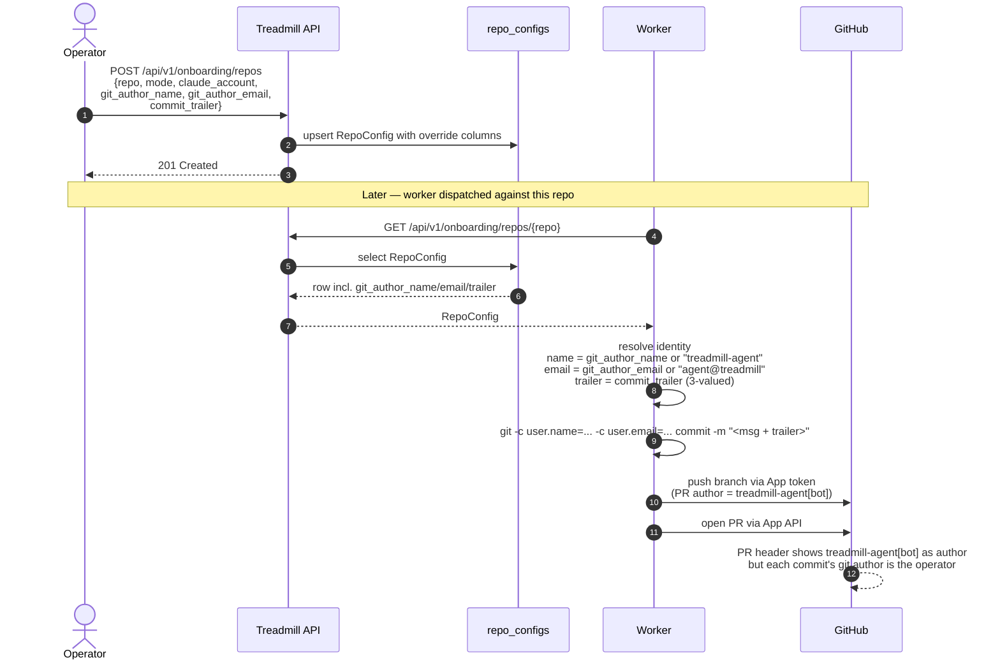

# ADR-0076: Per-repo git author override on RepoConfig

- **Status:** proposed
- **Date:** 2026-06-05
- **Related:** ADR-0049 (GitHub App migration — dual-identity at the App seam), ADR-0050 (onboarding + RepoConfig), ADR-0054 (adapt-mode docs over the API), ADR-0055 (per-repo `claude_account` field on RepoConfig — same pattern shape as this ADR)

## Context

Today every commit a Treadmill worker authors is identified with a single
hard-coded git author — `treadmill-agent <agent@treadmill>` — and includes
a `Co-Authored-By: Claude <noreply@anthropic.com>` trailer set by the
worker's commit template. That contract is fine for the Treadmill repo
itself, where the operator agreed to the attribution, and tolerable on
RAMJAC, where the RAMJAC org is comfortable with bot-authored commits.

It is **not tolerable on the next adapt-mode bootstrap target,
ZEPHYR/zephyr**. The operator (Joe Lepper) wants commits landing there to
show under his own identity — `Joe Lepper <josephlepper@gmail.com>` —
with no `Co-Authored-By` trailer and no Anthropic or Treadmill string
anywhere in the commit metadata. The constraint is product-shaped:
ZEPHYR/zephyr is owned by a separate org with its own contributor norms,
and bot-attributed commits in their PR diffs are a cultural friction
that the operator has decided to avoid for the initial passes.

The blocking gap is on the **storage side**: `repo_configs` has no
columns for per-repo author identity or commit-trailer policy. The
worker has no way to learn that ZEPHYR/zephyr wants a different identity
than RAMJAC, and the operator has no way to express it. ADR-0049's
dual-identity model already separated the GitHub App seam (PR author +
merger) from the worker's identity-on-disk, so the schema layer is the
only thing missing.

Two layers of identity are at play, and conflating them confuses the
decision:

1. **Commit-level identity** — what `git log --format=%an %ae` shows.
   Determined entirely by `user.name` / `user.email` at commit time
   plus any trailer in the message body. The worker controls this
   directly.
2. **PR-level identity** — the GitHub PR's "opened by" + the merge
   commit's "merged by". Determined by the token used to call the
   GitHub API. ADR-0049 made both `treadmill-agent[bot]` (the App
   installation).

This ADR scopes to (1). (2) is explicitly deferred — see Follow-ups.

The PR-level question gets its own ADR because the trade-offs are
different (per-repo PAT vs. installing the GitHub App on the target
org). The operator stated that for initial passes against
ZEPHYR/zephyr, App-authored PRs are acceptable as long as the *commits*
inside the PR show the operator's identity.

## Decision

We added three nullable columns to `repo_configs`:

- `git_author_name : varchar | NULL` — overrides the worker's
  `user.name` for this repo when present.
- `git_author_email : varchar | NULL` — overrides `user.email`
  similarly.
- `commit_trailer : text | NULL` — three-valued: `NULL` keeps the
  default `Co-Authored-By: Claude <noreply@anthropic.com>` trailer,
  empty-string `""` suppresses any trailer, any other value is used
  verbatim as the trailer line(s) appended to every commit body. This
  shape mirrors how `claude_account` overrides a default at the repo
  level (ADR-0055): null means "use the deployment default," non-null
  means "use this exact value."

The two name/email columns are linked by an integrity check: either
both are NULL (use defaults) or both are NOT NULL (use the override
pair). A migration adds a `CHECK ((git_author_name IS NULL) =
(git_author_email IS NULL))` constraint so a half-populated row can
never reach the worker.

Worker commit path now resolves the identity per-repo right before
the commit subprocess: it reads the repo's `RepoConfig` (already
fetched for `claude_account` resolution), applies any non-NULL author
override via `git -c user.name=... -c user.email=... commit`, and
strips/replaces the trailer per `commit_trailer`. The default trailer
template lives in a single constant on the worker so the suppression
path is one branch, not a sed pass over the message.

`OnboardingStore.upsert_repo_config` accepts the three new fields in
its dict payload (default `None`), and `RepoConfig` carries them. The
`POST /api/v1/onboarding/repos` body accepts them; `GET` returns them.
Existing repos remain unaffected — `claude.tasks` rows touching
already-onboarded RAMJAC and `treadmill` continue to commit with
the current identity because the override columns default to NULL.

## Alternatives considered

- **A per-account git identity instead of per-repo.** Rejected:
  identity is a property of where the commit is going, not who the
  worker is running as. The same account (`personal`) commits to
  Treadmill (where `treadmill-agent` is fine) and would commit to
  ZEPHYR/zephyr (where it isn't). Per-repo is the load-bearing axis.
- **Read the operator's git config from `~/.gitconfig` and use that
  for all worker commits.** Rejected: workers run on Cloud Run, not on
  the operator's host; there is no `~/.gitconfig` to read, and even
  with it the dev-local vs. prod-worker split would produce different
  identities for the same repo.
- **Always strip the `Co-Authored-By` trailer for adapt repos, never
  strip it for conform repos.** Rejected: ties the trailer policy to
  the onboarding mode in a way that conflates two orthogonal axes
  (mode = "where do docs live," trailer = "is the AI attribution
  acceptable"). An adapt repo might still want the trailer; a conform
  repo might not. Make it an explicit per-repo knob.
- **Use git's `commit.gpgsign=false -c user.name=... commit -m ...
  --trailer="Co-Authored-By: ..."` inline flag chain only, no schema
  storage; let the operator pass identity per dispatch.** Rejected: a
  dispatch-time override is per-task, not per-repo, and an operator
  who forgets the override on one of fifty tasks against ZEPHYR/zephyr
  has already lost. Per-repo storage means the operator chooses once
  at onboarding and every subsequent dispatch inherits.

## Consequences

### Good

- Operators can onboard a repo with a foreign contributor-attribution
  policy without code changes — fill in the three columns at
  onboarding and every Treadmill PR against that repo carries the
  intended identity.
- The ZEPHYR/zephyr bootstrap unblocks immediately on Treadmill's side:
  with this in place, the only remaining identity question is the
  PR-author one (sibling ADR, see Follow-ups).
- The trailer suppression knob also covers a class of conform-repo
  cases that have come up informally — repos whose downstream review
  process is allergic to `Co-Authored-By` trailers but happy with
  bot-authored commits.
- Migration is additive and behavior-neutral by default: `NULL` in
  every existing row, defaults preserved.

### Bad / trade-offs

- Three new columns is real surface area on `repo_configs`. The table
  is intentionally narrow (Joe has pushed back twice on schema
  widening); this widening is justified by the bootstrap path being
  blocked, but it counts against the budget.
- The `commit_trailer` three-valued semantics (NULL vs `""` vs string)
  is subtle. Anyone hand-editing the YAML has to know that empty
  string means "no trailer," not "use default." Documented in the
  RepoConfig docstring + a test that pins both paths.
- A commit-time check is added to the worker's hot path. The cost is
  negligible (the repo config is already in memory), but the seam
  exists.

### Risks

- **Identity-spoofing risk.** A worker that mis-resolves the identity
  could commit as the operator on a repo where the operator never
  consented. Mitigation: the columns are write-only by operator
  action (`POST /api/v1/onboarding/repos`), no API path lets a worker
  set its own author identity, and the worker's commit path treats
  the RepoConfig as read-only state.
- **Half-populated rows.** A row with `git_author_name` set but
  `git_author_email` NULL would silently produce commits with a stale
  email. Mitigated by the `CHECK ((git_author_name IS NULL) =
  (git_author_email IS NULL))` constraint at the database level.
- **Forgetting the migration on already-deployed environments.** A
  worker built against the new schema reading from a pre-migration DB
  would 500. Mitigated by alembic running in the API container's
  startup probe — same path that catches all schema drift today.

### Neutral

- The PR-level identity (treadmill-agent[bot]) is unchanged. A PR
  against ZEPHYR/zephyr will still show "opened by treadmill-agent[bot]"
  in the GitHub UI. The operator has accepted that for initial
  passes.

## Diagram

## Follow-ups

- **PR-level identity.** When the operator decides that
  treadmill-agent[bot] as PR author is itself too much attribution
  for a target repo, a sibling ADR will define how Treadmill switches
  the push + PR-open path to a per-repo PAT (per-repo column +
  Secrets Manager secret name, mirroring the `claude_account` ↔ SM
  secret pattern). Out of scope here; that ADR will need to weigh PAT
  rotation, scope minimization, and the loss of App-side conveniences
  against the attribution benefit.
- **Worker clone path for ZEPHYR/zephyr.** The Treadmill GitHub App is
  installed on the `joeLepper` org and the RAMJAC org but not on
  `ZEPHYR`. Before any Forecast work can dispatch, either the App
  needs to be installed on ZEPHYR (operator + ZEPHYR admin task) or
  the worker needs a separate clone path keyed on a PAT for the
  target repo. Tracked alongside the PR-identity ADR above.
- **Operator UI for the override columns.** The CLI / dashboard
  onboarding flows need fields for these. Out of scope here —
  schema-first.

## References

- ADR-0049 — GitHub App migration (dual-identity split: PR author and
  merger both moved to `treadmill-agent[bot]`).
- ADR-0050 — Onboarding + `RepoConfig` as the per-repo source of
  truth.
- ADR-0054 — Adapt-mode context-docs over the API; ZEPHYR/zephyr will
  be the second adapt-mode target after RAMJAC.
- ADR-0055 — Per-repo `claude_account` override; the schema shape
  here mirrors that ADR (nullable override → deployment default).
