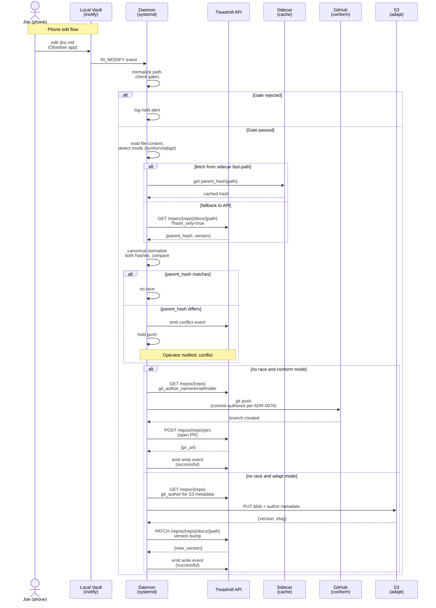

# ADR-0078: Bidirectional Obsidian sync via systemd user daemon

- **Status:** accepted
- **Date:** 2026-06-05
- **Related:** ADR-0054 (adapt-mode doc authoring via local mirror — this ADR extends its write side), ADR-0076 (per-repo git author override — soft-dep with PR-shift callout, confirm column names on merge), ADR-0049 (GitHub App identity), ADR-0075 (step-starvation detector and self-heal pattern), cc-relay trust-gates work (PR #199 / #207 — asymmetric trust shape)

## Context

The Obsidian vault backing Treadmill's federated doc authoring (ADR-0030, ADR-0054) is synced one-way from the API to a local mirror. Phone edits (Joe's iPad in the Obsidian app) are captured locally on the device but never propagate back to the server or to other machines. This creates a **failure mode where phone edits are stuck on the device** — any work done in Obsidian on mobile has no path back to Treadmill's state. The blocking gap is a write-side sync daemon that watches the local vault, detects changes, and pushes them back through the same API-backed store.

The vault file naming convention is governed by `project_obsidian_vault_layout_convention`: files are stored as `{slug}/{doc_path}.md` where `{slug}` is derived from the repo's normalized identifier (e.g., `treadmill`, `ramjac-prod`, `osmoai-osmo`), ensuring deterministic, readable paths across all synced repos.

## Decision

A **systemd user service** (`treadmill-vault-sync.service`) runs on the operator's machine and syncs vault edits back to the server, completing the bidirectional loop and unblocking mobile authoring workflows.

### (1) Daemon lifecycle and restarts

One daemon service, `Type=simple`, with auto-restart on failure:

```ini
[Service]
Type=simple
ExecStart=/usr/local/bin/treadmill-vault-sync
Restart=on-failure
RestartSec=10
StartLimitIntervalSec=60
StartLimitBurst=5
```

If the daemon crashes, systemd restarts it after 10 seconds. If it crashes ≥5 times in 60 seconds, systemd stops attempting and emits a unit failure (operator intervention required). This trades eager recovery for restart-burn mitigation — a flapping daemon is a sign of a structural problem (e.g., persistent API unavailability, corrupted vault state), not a transient blip.

### (2) Read-side unchanged

The read path (vault → API → mirror) is already modeled in ADR-0054 (`treadmill-local docs pull`) and in the conform/adapt context-providers (ADR-0050, ADR-0054). The daemon does not modify the read path. Phone edits appear in the local vault file system; the daemon detects them via inotify and routes them through the write path (sub-decision 3).

### (3) Write-side: inotify watch + per-mode push

The daemon watches the vault directory tree with `inotify` for file-change events (`IN_MODIFY`, `IN_CLOSE_WRITE`, `IN_CREATE`, `IN_DELETE` — see side-defaults below). On each file change:

1. **Normalize the file path** to canonical form (resolve symlinks, collapse `../`, strip trailing `/`, lowercase the slug).
2. **Check gates** (sub-decision 4). If any gate rejects the file, log and skip.
3. **Detect the sync mode** by reading the repo's `RepoConfig`: `conform` → push via git (create a commit on a branch, open a PR), `adapt` → push via S3 API (upsert the doc blob, bump version in `repo_context_docs`).
4. **Read the file content** from disk.
5. **Compute a parent_hash** (sub-decision 5) and **detect races** against the server state.
6. **Author the commit or doc update** using the repo's git/commit identity from ADR-0076 (sub-decision 6).
7. **Push** (git push to open branch / S3 put + version bump) and **emit events** for the write (successful, held due to conflict, or rejected by a gate).

### (4) Five gates (refuse-to-bypass rules) + side-defaults

The daemon refuses to push if any of these conditions hold (logged as a *held* alert to the operator, not silently skipped):

1. **Filename gate:** File name matches the ADR-immutable pattern (e.g., `adrs/{num}-*.md`, `rules/{num}-*.md`). ADRs and rules are versioned artifacts on the server; phone edits cannot author them. Held alert: `"ADR/rule file {path} edited on phone — immutable on this device, held for manual review"`.
2. **ADR-immutability gate:** Any edit to a file previously tagged as immutable on the server (stored in the vault metadata or as a special comment in the ADR itself). Held alert.
3. **Creation-disallowed gate:** File path does not exist on the server (new file creation). Phone edits are assumed to be edits to existing docs, not the creation of new ones. Held alert: `"New file {path} created on phone — doc creation disallowed, held for server-side adoption"`.
4. **No-source gate:** The file has no corresponding row in the doc index (repo_context_docs) on the server. Treat as creation-disallowed.
5. **Public-repo-secret-leak gate:** The file is being pushed to an `adapt`-mode repo (public external repo like osmoai/osmo, stored in S3) and the content matches a secret pattern (regex check against `TREADMILL_SECRET_PATTERNS`; e.g., `ANTHROPIC_API_KEY=`, `aws_secret_access_key=`). Held alert: `"Potential secret detected in {path} destined for public repo, held for review"`.

**Side-defaults** (not gates, no hold-on-match — silent behavior):

- **Empty-diff skip:** If the file's content is identical to the version on the server (byte-for-byte), skip the push and log silently (no-op).
- **IN_DELETE ignored:** `inotify` fires on file deletion. The daemon logs the event but does not push a deletion — vault deletions are assumed to be user accidents (Obsidian crash recovery, cache clear). Deletions are routed through a separate server-side API call (out of scope here, v2 work).

### (5) Server-authoritative parent_hash race detection

The write daemon is one of many potential writers to the vault — the API's conform/adapt paths, other daemons on other machines (per ADR-0073 persistent sessions), or manual edits on other devices. To detect and surface races (the same file edited both on the server and on the phone between the daemon's last pull and the push attempt):

1. **Canonical normalization:** Before comparing hashes, normalize the server's latest version and the local version to the same canonical form (strip trailing whitespace, normalize line endings to LF, sort front-matter keys in a consistent order, etc.). Hash the normalized forms, not the raw bytes.
2. **Server-authoritative check:** Before push, the daemon fetches the server's latest `parent_hash` (or equivalent version metadata) for the file. If the daemon's remembered hash (from the last `pull`) differs from the current server hash, a race is detected.
3. **Conflict emission:** On race detection, emit a *conflict* event (structured log entry, optionally an alert) with both hashes and both versions, and **hold the push**. The operator is notified: `"Conflict on {path}: server version changed since pull — review and merge manually"`.
4. **Per-host sidecar fast-path:** On the same machine, a co-resident sidecar (optional, for v1) can cache the server's latest hash and serve it to the daemon at commit time, avoiding a round-trip to the API. The sidecar is **non-load-bearing** — if it is unavailable, the daemon falls back to fetching the hash from the API. This is an optimization for the happy path (single-device editing); v2 can make it mandatory.

### (6) Author identity via ADR-0076

The daemon uses the repo's git author override columns (`git_author_name`, `git_author_email`, `commit_trailer`) from `RepoConfig` (ADR-0076) to author commits on conform-mode repos. For adapt-mode repos (S3 API), the daemon records the author in S3 metadata or in the version index.

**Soft-dependency callout:** ADR-0076 is currently `proposed` (status as of 2026-06-05). If ADR-0076's PR (#210 or similar) is not merged by the time this daemon ships, the column names in this ADR's worker code must be updated to match ADR-0076's final schema. The daemon's code path reads `RepoConfig.git_author_name`, `RepoConfig.git_author_email`, and `RepoConfig.commit_trailer` — if those names change on merge, propagate the change here before GA.

### (7) Systemd ownership and authorization chain

The systemd unit is **owned and managed by `treadmill-carla`** (the Treadmill orchestrator session managing the operator's machine state). The authorization chain is:

1. **Operator consent:** Operator runs `treadmill-local install-vault-sync` (CLI command) on their machine, which calls the Treadmill API with `POST /api/v1/daemon/install-vault-sync`.
2. **API authorization:** The API verifies the request is from an authenticated operator (via GitHub OAuth or CLI token) and records the decision in `daemon_installs` table.
3. **Carla dispatch:** Carla (a persistent orchestrator session managed by Treadmill) receives the install signal, provisions the systemd unit file at `~/.config/systemd/user/treadmill-vault-sync.service`, and runs `systemctl --user enable treadmill-vault-sync`.
4. **Audit trail:** Every install, enable, disable, and uninstall event is logged in `daemon_installs` with timestamp, operator ID, and carla session ID, so future operators can audit who installed what and when.

The unit runs as the operator's user (not root), with read access to the vault directory and API credentials (scoped installation token, refreshed per ADR-0049). If the operator uninstalls (`treadmill-local uninstall-vault-sync`), carla receives the signal and runs `systemctl --user disable treadmill-vault-sync` + `rm ~/.config/systemd/user/treadmill-vault-sync.service`.

## Diagram



## Alternatives considered

- **(a) Obsidian Git plugin:** Use the Obsidian Git plugin (community) to auto-commit and push vault changes. Rejected: (i) the plugin runs in Obsidian's sandbox on the phone and has limited git CLI access; (ii) it assumes a GitHub repo as the backend, not an API-backed S3 store; (iii) control over the commit message and authorship is limited; (iv) no way to emit structured conflict or gate events back to Treadmill; (v) the plugin's restart/error behavior is opaque and unmonitored.
  
- **(b) Three-way auto-resolution:** Implement automatic three-way merge (local ↔ server ↔ phone) to resolve races without operator intervention. Rejected: (i) three-way merge is complex and error-prone for prose docs (unlike code); (ii) Treadmill's docs are ADRs, plans, learnings — human judgment is required to merge different versions of a design decision; (iii) silent auto-merge of conflicting phone and server edits could lose work or propagate unwanted changes.
  
- **(c) Poll-only write-side:** Instead of inotify, poll the vault directory every N seconds for changes. Rejected: (i) polling adds latency (5–30s lag between editing and detecting the change); (ii) inefficient for sparse edits (polling even when nothing changed); (iii) inotify is the standard for file-watch use cases on Linux and macOS; (iv) push notification via cloud messaging (Apple's PushKit) is more complex and phone-OS-dependent.
  
- **(d) Per-direction services (two daemons):** One daemon for pull (vault ← API, separate from conform/adapt context-providers) and one for push (vault → API). Rejected: (i) two daemons double the lifecycle complexity (two systemd units, two sets of restarts, two sets of logs); (ii) pull is already handled by ADR-0054's `treadmill-local docs pull` CLI, making a separate pull daemon redundant; (iii) a single bidirectional daemon is simpler to reason about and monitor.
  
- **(e) Per-host sidecar as truth (reject multi-device edits):** Make the sidecar the authoritative version keeper and reject any edits from other devices/the server if the sidecar has seen a more recent version locally. Rejected: **explicitly — deferred to v2**. This moves the race arbitration burden to the sidecar (which runs on only one device) and breaks multi-device workflows where edits legitimately come from the server or from another machine's conform workflow. V1 keeps the server as the source of truth and surfacs races to the operator.

## Consequences

### Good

- **Immediate sync:** Phone edits propagate back to the server within seconds of the inotify event (or within the next check if using polling as a fallback).
- **Dual-mode routing:** A single daemon handles both conform (git push, open PR) and adapt (S3 API) repos; no separate logic needed.
- **Conflict detection and visibility:** Races between phone and server edits are detected via parent_hash comparison and surfaced as structured events, with an operator-facing hold instead of silent overwrites.
- **Sidecar non-critical:** The optional sidecar fast-path is an optimization; the daemon degrades gracefully to API round-trips if the sidecar is unavailable (v1 can ship without it).
- **Self-healing systemd restarts:** Crashes are auto-recovered; restart-burn limits prevent flapping.

### Bad / trade-offs

- **Restart-burn risk:** If a bug causes the daemon to crash repeatedly (e.g., on a specific vault file, a malformed RepoConfig), systemd will back off after 5 failures in 60 seconds and stop restarting. The operator must manually investigate and restart the unit. This is a deliberate trade-off to avoid resource waste; failures are logged and surface to the operator as stale vault syncs (alerting via ADR-0075's step-starvation or fleet-wedge patterns).
- **Inotify limits:** High-frequency edits or large vault trees can exceed the system's inotify watch limit (`/proc/sys/fs/inotify/max_user_watches`, typically ~8k on Linux). The daemon logs a warning and gracefully falls back to a poll loop if inotify saturates. Users with very large vaults may need to increase the limit.
- **ADR-0076 PR-shift risk:** ADR-0076 (git author override) is currently `proposed` and not yet merged. If the final schema names columns differently than expected, this ADR's worker code must be updated before the daemon ships. The soft-dep callout in sub-decision 6 flags this.
- **Clock skew sensitivity:** The parent_hash race detection relies on the server's version metadata; if the server's clock is significantly skewed from the phone's clock, the comparison may give false positives (e.g., a phone edit timestamped in the future vs. a server edit). Mitigated by using content hashes instead of timestamps, and by canonical normalization.

### Risks

- **Concurrent writes to the same file:** If the phone and the server both edit the same file between the daemon's last pull and its push, the race is detected and the push is held. But if the server edits the file *during* the daemon's push (after the parent_hash check but before the git push / S3 put completes), the final state is undefined. Mitigated by the API's transactional semantics (git push is atomic; S3 put + version-bump is a two-phase operation). The operator should assume the phone's edit is at risk if a conflict is held; rebase or cherry-pick if needed.
- **Sidecar cascades:** If the sidecar is used as a fast-path and the sidecar's cache becomes stale or corrupt, the daemon may compare against a stale hash, miss a race, and push an overwrite. Mitigated by marking the sidecar non-load-bearing and including a verification step (optional in v1) to re-verify the hash from the API before the final push. The sidecar is trusted but not exclusive.
- **Secret-leak false positives:** The public-repo-secret-leak gate uses regex patterns to detect potential secrets. Regex patterns can have false positives (e.g., matching `ANTHROPIC_` in a doc URL) and false negatives (e.g., a secret obfuscated or split across lines). Mitigated by logging the held alert with full context so the operator can review the file and decide; in v1.1, a human-in-loop review step or a trained LLM secret detector can replace or augment the regex.

## Implementation plan

1. **Schema migration:** Add `daemon_installs` table (operator_id, service_name, status, created_at, updated_at, carla_session_id) to track vault-sync daemon installations and authorizations.
2. **Daemon binary:** Implement the daemon binary at `/usr/local/bin/treadmill-vault-sync` (or equivalent, per deployment) in Rust or Go with inotify watch, gate logic, conflict detection, and push routing (git / S3).
3. **Systemd unit template:** Create `treadmill-vault-sync.service.template` (in the repo, under `deploy/systemd/`) with the config from sub-decision 1.
4. **Sidecar (optional, v1):** Sketch the sidecar (hash-cache daemon) to be built in v1.1; include its schema (e.g., a local SQLite DB for the cache) and startup/shutdown in the implementation plan.
5. **ADR-0076 integration:** Coordinate with the ADR-0076 PR review to confirm the RepoConfig column names (`git_author_name`, `git_author_email`, `commit_trailer`); if they differ on merge, patch this ADR and the daemon code before GA.
6. **Conflict event schema:** Define the `conflict` event in the Treadmill events system (e.g., `type: 'vault_conflict'`, with `repo`, `path`, `local_hash`, `server_hash`, `versions: {local, server}`).
7. **Alerting / held events:** Implement the held and conflict alerts as structured events (per ADR-0012 step-output envelope) that feed into the operator's dashboard and escalations (ADR-0062, ADR-0075).
8. **Tests:** Unit tests for gate logic (filename, immutability, creation-disallowed, no-source, secret-leak), race detection (canonical normalization, hash comparison), mode detection (conform vs. adapt), and end-to-end integration tests (mock vault edits, mock API, verify push routing).
9. **Deployment guide:** Document installation, systemd management, log locations, troubleshooting (restart-burn, inotify limits, secret-leak false positives), and the optional sidecar setup.

## Follow-ups

- **Three-way merge v2:** Implement automatic three-way merge for prose docs (alternative (b)), using an LLM-assisted merge strategy (e.g., Claude's prompt for merging conflicting versions of an ADR). Triggered when a conflict is detected; operator can opt-in or opt-out per repo.
- **Poll fallback:** If inotify saturates or is unavailable (e.g., on some macOS versions or mounted network vaults), implement a configurable poll loop as a fallback (alternative (c)). Operator can tune the poll interval.
- **ADR-0076 finalization:** On ADR-0076 merge, audit the daemon's RepoConfig field names and push logic. Update this ADR's sub-decision 6 to "accepted" status if column names match.
- **Vault encryption at rest:** Extend the daemon to support vault encryption (e.g., encrypted S3 blobs for adapt repos, encrypted local vault on the phone). Currently out of scope.
- **Client-side normalization:** Implement canonical normalization logic on the phone (Obsidian plugin or app hook) to reduce normalization drift between phone and server hashes. Requires Obsidian API or native iOS/Android app changes.

## References

- ADR-0054 — Adapt-mode doc authoring via local mirror over the API-backed store; this ADR completes its write side.
- ADR-0076 — Per-repo git author override on RepoConfig (soft-dep; column names to be confirmed on merge).
- ADR-0049 — GitHub App identity (installation tokens for conformrepository pushes).
- ADR-0075 — Step-starvation detector and fleet-wedge alerting (self-heal pattern; vault-sync daemon restarts slot into this framework).
- ADR-0030 — Federated in-repo agent context (conform-mode doc authoring with vault sync).
- ADR-0050 — Onboarding repositories — this ADR's adapt-mode repos and S3 store context.
- cc-relay trust-gates work (PR #199 / #207) — asymmetric trust model for held/conflict alerts.
- ADR-0073 — Persistent orchestrator sessions (carla manages systemd unit installation).
- ADR-0062 — Operator escalations as incidents (conflict/held events escalate as incidents if not resolved).
- `project_obsidian_vault_layout_convention` — vault file naming convention (slug-derived paths).
