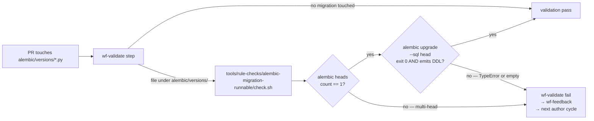

# ADR-0080: Alembic-migration-runnable rule-check gate

- **Status:** proposed
- **Date:** 2026-06-05
- **Related:** ADR-0030 (rule-check pattern for plan/PR gates), ADR-0029 (wf-validate's role), the 2026-06-05 ADR-0076 implementation incidents (this ADR's motivating data)

## Context

The 2026-06-05 ADR-0076 PR A implementation went through two
worker iteration cycles, each blocked by a different alembic-side
bug that should have been caught before the PR reached human
review:

**Pass 1** — the migration's `upgrade()` shipped:

```python
op.create_check_constraint(
    "ck_repo_configs_git_author_paired",
    "(git_author_name IS NULL) = (git_author_email IS NULL)",
    table_name="repo_configs",
)
```

The actual alembic signature is
`create_check_constraint(constraint_name, table_name, condition, *, ...)`.
The condition string lands in the `table_name` positional slot;
`table_name="repo_configs"` then collides as a duplicate kwarg →
`TypeError: create_check_constraint() got multiple values for
argument 'table_name'`. The migration crashes at the
`op.create_check_constraint(...)` line, before the DB sees the
DDL. No version is ever committed; alembic's revision table
stays at the prior head. Validation tests pass (they don't run
the migration). wf-review caught the bug by hand-reading the
call signature against the installed alembic version — but only
after a full author + validate + review cycle, and the fix
needed a hand-merge from the operator because wf-feedback's
re-author cycle produced an empty diff (Claude Code thought the
file was already correct — same shape as the operator-side
fix).

**Pass 2** — the migration's `down_revision = "20260605_1615"`
pointed at the same parent as another in-flight migration that
landed during the iteration window (`20260605_1700_validator_gold_rows.py`
shipped while ADR-0076 was being amended). Two alembic heads
chained off `20260605_1615`. CI's existing
`expected exactly one alembic head` check fired, but only
post-CI on the test job — after the worker had already iterated
through one author cycle on the wrong base.

Both failures share a root: the worker's wf-validate step doesn't
run `alembic upgrade head` against the changes it produced. Pass
1's bug crashes at parse time of the `upgrade()` function body,
so even a dry-run (`alembic upgrade --sql head`) catches it. Pass
2's bug is visible to `alembic heads` (the count returns > 1)
and would have failed pre-author if the worker checked. Both are
mechanically detectable; both burned cycles because the worker
had no plan-validate or wf-validate gate that exercised the
migration.

Sibling shape: ADR-0030 established the rule-check pattern (small
scripts under `tools/rule-checks/<name>/check.sh` consumed by the
plan-validate CLI + wf-validate). Existing examples include
`agent-md-locations`, `python-tests-resolve`, `cdk-synth-passes`.
A new rule-check sitting in the same shape closes this class.

## Decision

We added a new rule-check `alembic-migration-runnable` under
`tools/rule-checks/alembic-migration-runnable/check.sh`. The
script:

1. Greps the changed-files list for any path under
   `services/api/alembic/versions/`. If none, exits 0 (no work
   to do).
2. Runs `alembic heads --resolve-dependencies` and asserts the
   line count of the output is exactly 1. Fails fast with a
   message naming the colliding revision ids when > 1.
3. Runs `alembic upgrade --sql head` against the merged migration
   set. The `--sql` flag generates the DDL without touching a
   real DB; the script asserts the subprocess exit is 0 AND that
   the generated SQL contains at least one of `CREATE`, `ALTER`,
   `INSERT`, `DROP` (a non-empty operation set proves the
   function bodies actually executed without raising). A
   `TypeError` from a bad `op.*` call shape exits non-zero here
   — pass 1's bug fails this check loudly.
4. (Optional, dependent on availability) Runs
   `alembic upgrade head` then `alembic downgrade base` against
   a throwaway SQLite or transient pg via the existing
   integration-test fixture. Out of scope for v1 (heavier; the
   `--sql` dry-run catches the load-bearing class). Captured as
   a follow-up.

The rule-check is wired into:

- `cli/treadmill_cli/plan_validate.py` — runs the check whenever
  the plan's `scope.files` include `services/api/alembic/versions/`.
  Plan-validate already inspects scope files for sibling
  pattern-checks; this slots in alongside.
- `workers/agent/treadmill_agent/validation_runtime.py` — the
  wf-validate step's rule-check loader picks up the new check by
  filename convention (same as the existing nine). No code
  change to the runtime; the rule-check pattern auto-discovers.

A new `tools/rule-checks/alembic-migration-runnable/README.md`
documents the check the same way the existing rule-checks
document themselves.

## Alternatives considered

- **Build the runnable check into alembic's own
  `env.py`**, so any `alembic` invocation crashes loudly if the
  state is malformed. Rejected: alembic env.py is shared across
  every command (`upgrade`, `downgrade`, `current`, `history`);
  a check there would either run unconditionally on every command
  (overhead, false positives in dev) or require a separate flag,
  at which point it's the same shape as a rule-check script with
  worse ergonomics. Rule-check is the cleaner seam.
- **Require operators to run `alembic upgrade head` locally
  before plan-submit**, via a SKILL.md rule rather than a
  rule-check. Rejected because skill rules are advisory; this is
  an enforce-via-gate failure mode (the worker doesn't read
  SKILL.md, the validate step does run rule-checks). Rule-check
  is the right enforcement layer.
- **Smaller tasks** (operator suggestion 2026-06-05): split
  schema + ORM + router work into separate sequential tasks. A
  valid orthogonal direction but doesn't address THIS bug
  class — pass 1's `TypeError` would still ship in whichever
  task carried the alembic migration. Smaller tasks reduce
  cycle blast radius; this ADR reduces the bug detection
  latency. Both useful, neither replaces the other.
- **Run the full test suite in wf-validate** so any test that
  imports the migration catches the TypeError. Rejected: the
  existing wf-validate runs a focused subset to keep cycle time
  bounded. The targeted rule-check is cheaper and catches the
  same population.

## Consequences

### Good

- Closes the empty-diff loop class that pass 1 created: when the
  rule-check fires the bug in wf-validate, the architect-amend
  cycle has a deterministic verdict to amend against (rather
  than the wf-author re-running and producing the same broken
  migration).
- Closes the head-collision race more tightly: pass 2's failure
  fires at wf-validate-time, not post-CI. The worker reads the
  failure in-loop and re-chains the migration BEFORE pushing,
  saving one full author cycle.
- Adds operational visibility — every plan touching alembic
  now has a named gate that pins the migration's runnability.
  Sweeps and the dashboard can surface gate-broken on this
  check distinct from other validation failures.
- Lands within the established ADR-0030 rule-check pattern;
  zero new infrastructure, just a new script slotting into the
  existing loader.

### Bad / trade-offs

- The `alembic upgrade --sql head` dry-run requires the alembic
  config + sqlalchemy + the project's ORM to be loadable in the
  worker sandbox. Already a requirement for the existing
  `services/api` test suite, so no new sandbox cost — but a
  follow-up that moves the check to a more isolated context
  would have to pay it.
- The check is opt-in by filename pattern (changed file under
  `alembic/versions/`). A migration committed under a different
  path (unlikely but possible during a refactor) would slip
  past. Mitigation: the existing CI alembic-head check stays in
  place as the post-CI backstop.
- Adds a new test surface to maintain — the rule-check itself
  needs its own happy-path + failure-path tests, parallel to
  the existing rule-checks.

### Risks

- **The `--sql` flag's output is verbose** and parsing for
  `CREATE|ALTER|INSERT|DROP` could be brittle against alembic
  output format changes. Mitigation: keep the assertion loose
  (any non-empty match), and pin alembic version in the
  worker's requirements. ADR-0059 already enforces version
  pinning at the worker-deps level.
- **False-positive on intentionally-empty migrations** (a
  migration that only updates the alembic version table with no
  DDL). Rare; mitigation is to add `--allow-empty` as an opt-out
  if a real case arises. v1 fails loud on empty; a follow-up
  loosens if observation shows false positives.
- **Read-only environment failure** — `alembic upgrade --sql`
  doesn't touch a DB but does parse the env.py which may itself
  try to connect. Mitigation: the project's env.py already
  supports offline mode; the rule-check passes `--sql` which
  triggers it.

## Diagram



## Follow-ups

- **Live-DB upgrade + downgrade** as a richer check
  (`alembic upgrade head` then `alembic downgrade base` against
  a transient db). Catches a class of bugs the `--sql` dry-run
  misses — e.g. data migrations that depend on rows the DDL
  alone can't validate. Heavier; opt-in.
- **plan-validate CLI integration** with a more precise scope
  detector — today plan-validate inspects `scope.files` for the
  pattern; widening to also match `services/api/treadmill_api/models/`
  (ORM changes that imply migrations) would catch missing-migration
  cases. Out of scope; separate ADR if observation justifies.
- **Operator UI surface** — surface alembic-rule-check
  failures distinctly in the dashboard so they're triageable
  separately from other validation failures.

## References

- ADR-0030 — the rule-check pattern this ADR extends.
- ADR-0059 — per-repo worker-deps materialization; the alembic
  binary + sqlalchemy already land in the worker sandbox via
  this path.
- 2026-06-05 ADR-0076 incidents — the motivating data; PR A
  cycled twice on alembic-specific bugs (TypeError + head
  collision) that this gate would have caught pre-author or
  in-author validation.
