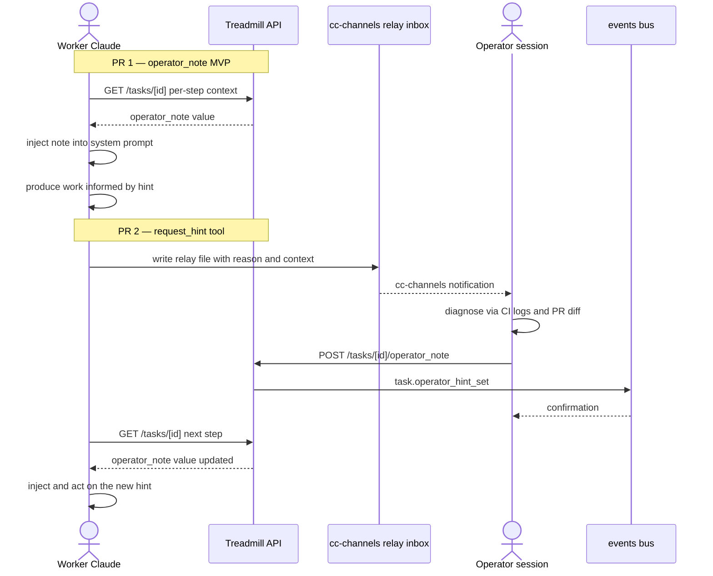

# ADR-0081: Worker → Operator hint channel — phone-home for context, in-band hints

- **Status:** accepted
- **Date:** 2026-06-06
- **Related:** ADR-0029 (architect amend-cap — the budget this saves),
  ADR-0058 (gate-broken — sibling deterministic detector),
  ADR-0067 / ADR-0068 (cc-channels phone bots + treadmill-events
  channel — the existing relay primitives this extends),
  ADR-0074 (nothing-to-do short-circuit — also reduces architect burn,
  but on a different failure shape than this ADR), ADR-0079
  (dispatcher short-circuits — terminal-status guard, sibling
  token-savings work)

## Context

The dispatching operator (a Claude session like `treadmill-carla`,
sometimes the human) frequently has context the worker can't see:
the full PR diff, the CI logs, the prior PR's bandaid notes, what
*didn't* work last time on the same module. When the worker stalls
in a wf-author / wf-feedback / wf-architecture-resolve loop, the
operator looking at the logs can typically diagnose what's wrong in
seconds — "the test count needs bumping," "the alembic head has a
collision," "you need to scope in the existing test file." The
architect role's Claude call rarely catches these patterns because
the architect's prompt doesn't see the same source as the operator
does.

Today the only path from operator insight to worker action is:
operator runs `treadmill task retry --force-bypass-cap` after the
loop hits the architect cap, with no way to inject context. The
worker then re-runs the same prompt and produces the same wrong
output.

The 2026-06-05 night session demonstrated this concretely on four
tasks (f839f914, da520f44, 92fb08dd, 86317e66) that each burned
3-5 architect cycles before getting cancelled, while the operator
session had a clear diagnosis from cycle 1. Sister incident: PR #208
where the worker re-pushed and corrected the operator's wrong fix —
that was the worker's reasoning beating the operator's, but the
inverse case (operator's reasoning beating the worker's) is the
common one and has no mechanism to communicate.

The cc-channels relay (ADR-0067 / ADR-0068) gives us a per-label
inbox at `~/.cc-channels/<label>/relay/` that any process can drop
files into. The dispatching operator's session label is already
recorded on every task as `created_by`. Half the plumbing for a
worker→operator channel is in place; what's missing is the worker
side (a tool to drop into the operator's inbox) and the operator
side (a way to inject a hint back into the worker's next prompt).

## Decision

We adopted a two-layer hint channel: a passive `operator_note`
field workers read before every step (MVP, ships first), and an
active worker-initiated `request_hint` tool that relays to the
dispatching operator via cc-channels (v2, ships second). Both
layers feed the same `operator_note` field, so the worker-side
read path is single-sourced.

### 1. `operator_note` field on tasks (MVP, PR #1)

A new nullable text field `operator_note` on the `tasks` table.
Workers read it via the existing per-step context fetch and inject
it into the system prompt as a clearly-tagged section:

```
## Operator hint

<operator_note text verbatim>

(End operator hint. The dispatching operator added this hint to
help focus your work. Take it seriously but verify before acting.)
```

The note is set via:

- `POST /api/v1/tasks/<task_id>/operator_note` body `{note: str | null}`
- `treadmill task note <task_id> "hint here"` CLI wrapper (sets)
- `treadmill task note <task_id> --clear` (sets to null)

Notes are persistent across step boundaries — the worker reads the
same note on every step in the task's workflow until the operator
clears it. The operator typically clears the note after the worker
acted on it, before the next step would otherwise read a stale
hint.

### 2. Worker-initiated `request_hint` tool (v2, PR #2)

A new tool the worker can invoke from within its role-step Claude
call, with shape:

```
request_hint(reason: str, context: str) -> {acknowledged: bool}
```

- `reason` — short slug naming the class of help wanted
  (e.g. `tests_need_scope`, `alembic_heads_unclear`,
  `architect_output_unparseable`).
- `context` — a brief description of what the worker tried + what
  it's stuck on. Bounded to ~2000 chars to keep the relay
  manageable.

On invocation the worker writes a file to
`~/.cc-channels/<created_by>/relay/<timestamp>-from-worker-<task-id>.md`
with the reason + context. The relay file is a `type=context`
message (per ADR-0067 trust model — non-action, doesn't require
operator pre-authorization), so the operator session's
`treadmill-events` channel surfaces it as a normal channel
notification.

The tool **does not block**: it returns `{acknowledged: true}`
immediately after writing the relay file. The worker's next step
re-reads `operator_note` — by then the operator has typically set
one, or chosen not to (the absence of a hint is also a signal:
"keep doing what you're doing"). v1 does not implement
synchronous wait-for-hint semantics; that's a v3 follow-up if the
event rate justifies it.

### 3. Operator-side workflow (no new code, leverages relay)

The dispatching operator session (a Claude session like
`treadmill-carla`) already subscribes to the `treadmill-events`
channel and processes cc-channels relay files. When a worker
`request_hint` lands, the operator sees it tagged as
`source="relay"` `[from: worker-<task-id>]`. The operator
diagnoses (often by reading CI logs, the PR diff, prior bandaid
notes), then calls the `POST /api/v1/tasks/<task_id>/operator_note`
endpoint or its CLI wrapper to set the hint.

No special operator tooling is needed beyond what cc-channels +
the API already provide. The operator's existing skills (Read
files, Bash for CI log queries, Edit for hint composition) are
the diagnosis surface.

### 4. Audit trail in events

Every `operator_note` write emits `task.operator_hint_set` with
payload `{note_excerpt: str, set_by: str}`. Every `request_hint`
invocation emits `task.worker_hint_requested` with payload
`{reason: str, context_excerpt: str, worker_step_id: str}`. The
events provide:

- A discoverable log of operator-injected hints for post-hoc
  audit.
- A measurable signal of how often the channel is used, broken
  out by reason — feeds the ADR-0075 fleet-wedge sub-signal idea
  for "high hint request rate" (a system-level
  workers-keep-getting-stuck symptom).

### 5. Both sides are independently configurable for easy rollback

The hint channel is experimental. If the data shows it doesn't
help — token economics inverted, hint quality poor, false-fix rate
high — we want to be able to turn it off without reverting code.
Two independent feature flags govern the two halves:

- **Worker side: `RepoConfig.worker_hints_enabled` (BOOLEAN
  NOT NULL DEFAULT true).** Set per-repo (sibling to
  `is_public` from ADR-0078). Controls whether the worker's
  `request_hint` tool is registered for any role-step running
  against this repo. Default `true` so the feature ships on by
  default; flip to `false` to disable phone-home for a specific
  repo without touching code. The worker also skips
  `operator_note` injection when this flag is false, so a single
  toggle silences both directions.

- **Operator side: `TREADMILL_OPERATOR_RELAY_HINTS=on|off`
  environment variable read by the operator session at launch
  (sibling to `TREADMILL_RELAY_LEVEL` from ADR-0071).** Defaults
  to `on`. When `off`, the session ignores
  `task.worker_hint_requested` events from
  `treadmill-events` and `[from: worker-...]` cc-channels relay
  messages. The operator still sets `operator_note` manually if
  they want; only the automatic notification path is silenced.

Both flags can be flipped independently. Combinations:

| worker_hints_enabled | OPERATOR_RELAY_HINTS | Effect |
|----------------------|----------------------|--------|
| true  | on  | Full feature (default). |
| true  | off | Workers can request hints but the operator session ignores them. Useful when the operator is human-only or away. |
| false | on  | Workers don't request hints, but operators can still set `operator_note` manually. Useful for repos where we want operator-pushed hints only. |
| false | off | Feature fully disabled for this repo. |

The CLI surfaces a per-repo toggle:

- `treadmill onboarding update --repo <repo> --hints on|off`

And the operator-side relay level interaction is documented in
the launch-session.sh docs alongside `TREADMILL_RELAY_LEVEL`.

Events still fire when flags are flipped (we want auditable record
that a request was suppressed or a note was set) — they just don't
trigger the downstream injection. The events table thus serves as
the "would have helped" counterfactual data for deciding whether
to keep the feature.

## Alternatives considered

- **Synchronous worker-blocking phone-home.** Rejected for v1.
  Async-write + next-step-reads is much simpler operationally and
  doesn't require new step lifecycle machinery. The downside is
  the worker might do one more step before the hint lands — that
  step is "cheap" if the hint is for the *next* step anyway, and
  trivially-fixable by the operator setting the hint while the
  worker is mid-step (it'll read on next-step entry).

- **A new `wf-operator-consult` workflow step type.** Rejected as
  over-architected. The `operator_note` field on the existing
  `tasks` row is a 1-column schema delta vs. a whole new workflow
  shape with its own events + dispatcher logic. The win/effort
  ratio doesn't justify the bigger surface.

- **Make `operator_note` per-step, not per-task.** Rejected — the
  operator's mental model is "I'm hinting *this task*", not "I'm
  hinting step N of this task." Per-task simplifies the API + UI
  and matches how operators actually think about the work.

- **Skip the MVP, jump straight to worker-initiated phone-home.**
  Rejected — the MVP requires no new worker code, just a DB
  column + endpoint + worker prompt change. Operators get value
  immediately (today's incident class would have been resolvable
  in 60s with operator-set notes). Phone-home in PR #2 then
  adds the worker-initiated trigger on top of the same plumbing.

- **Build a chat-style two-way conversation between worker and
  operator.** Rejected as over-scope. The fundamental win is
  "one operator insight injected at the right moment saves 3-5
  architect cycles." A chat is much more infrastructure for
  marginal additional gain — the worker's prompt doesn't need
  back-and-forth; one good hint is enough most of the time.

- **Build the same channel as worker → architect-Claude.** Rejected
  — the architect Claude has the same blind spots as the worker
  Claude (both are sonnet/haiku without source access to the full
  PR or CI). The operator session has source-of-truth view of
  the workspace + CI logs + prior conversation context. The
  operator is the right addressee.

## Consequences

### Good

- Cuts architect-amend cycles on tasks where operator insight is
  available — empirically 3-5 cycles per stuck task, 17-30K
  output tokens at sonnet-tier rates. The 2026-06-05 night
  session would have saved an estimated $5-10 in tokens with
  this channel in place.
- Honors Treadmill's existing architecture (cc-channels,
  per-session relays, dispatcher-driven task lifecycle) — no
  new infrastructure, just a field + an endpoint + a tool.
- Re-uses the operator's existing diagnostic surfaces (logs,
  PR diff, conversation context). The operator does what they
  do today (look at logs, diagnose) but now has a write path
  to the worker.
- Audit-trail via events lets us measure usage patterns and
  feed the ADR-0075 fleet-wedge detector with a sub-signal for
  systemic worker-stuck rate.

### Bad / trade-offs

- Makes the operator session load-bearing for *some* worker
  steps, not just escalations. Treadmill's premise has been
  "operator out of the loop except for genuine forks." This
  shifts the balance: operator is out of the loop on the easy
  path, in the loop when the worker asks (or proactively, when
  the operator notices something in the channel events).
- Hint quality matters. A wrong operator hint will push the
  worker in a wrong direction faster than no hint. The prompt
  template emphasizes "verify before acting," but operators
  still have to be honest about their confidence.
- The note is mutable — an operator can set, change, and clear
  it. The event log captures every write, but two operators
  (or operator + worker `request_hint` self-clear) can race.
  v1 accepts last-write-wins; multi-operator races are not the
  expected case (one operator session per task per the
  `created_by` convention).
- For ADAPT-mode repos (ramjac, ZEPHYR) the operator session
  may be a different label than the `created_by` if the
  bootstrap was operator-initiated. Plan must verify the
  cc-channels relay path correctly routes to the active
  operator's inbox, not a stale `created_by` value.

### Risks

- **The hint becomes a band-aid.** Operators may use
  `operator_note` to fix individual tasks instead of fixing the
  underlying class. ADR-0075 §4's operator-obligation rule
  (every fix ships with a learning or structural follow-up)
  applies here too — a recurring class of hint is a signal we
  need a deterministic detector, not just a hint.
- **Token economics inverted on simple tasks.** If a task
  would have completed in 1-2 cycles without help, the
  operator-set hint adds the operator-diagnosis-time (which is
  also tokens, in the operator session). v1 expects this to be
  net-positive overall but worth measuring.
- **Hint persists across workflow shifts.** A note that's stale
  for the current step (e.g. operator hinted the wf-author
  step, work has progressed to wf-validate) is still injected.
  Operators must clear notes between phase shifts. A v2 could
  add per-step targeting; v1 keeps it simple.
- **`request_hint` becomes a worker stalling tactic.** Workers
  might invoke it to delay actual work. Mitigation: the
  event log makes this measurable, and the existing
  ADR-0029 amend-cap still bounds the loop.

## Diagram



## References

- ADR-0067 / ADR-0068 — cc-channels phone bots + treadmill-events
  channel (the relay primitives this consumes).
- ADR-0029 — architect amend-cap (the budget this saves).
- ADR-0058 / ADR-0074 — deterministic detectors that complement
  the operator-hint mechanism (both reduce architect burn but
  on different shapes — deterministic for known failure modes,
  operator-hint for novel ones).
- ADR-0075 §4 — operator obligations on resolution; applies to
  hint-driven fixes too.
- The 2026-06-05 night session's four-task architect-output
  cluster (f839f914 / da520f44 / 92fb08dd / 86317e66) — the
  empirical motivation. With this channel, each of those would
  have been operator-resolvable in seconds via a one-line note,
  not cancelled-and-hand-authored.
- `docs/learnings/2026-06-05-architect-output-malformed-recurring-on-large-prompt-tasks.md`
  — the failure mode this ADR partially addresses.
