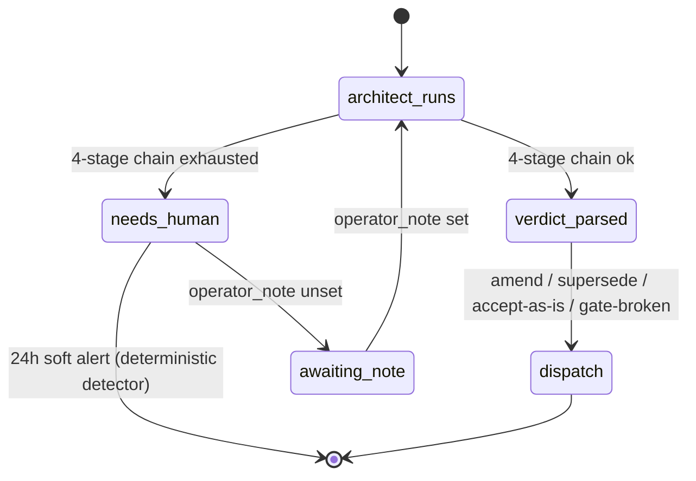

# ADR-0082: Architect parse-failure escalates to NEEDS_HUMAN, does not consume a cap attempt

- **Status:** proposed
- **Date:** 2026-06-07
- **Related:** ADR-0048 (verdict surface), ADR-0058 (gate-broken), ADR-0062 (escalation reasons), ADR-0081 (operator hint channel), ADR-0029 (architect amend cap)

## Context

The architect role emits a verdict envelope (`accept-as-is` | `amend` | `supersede` | `gate-broken`). `workers/agent/treadmill_agent/runner_dispositions/architecture.py::_extract_verdict_envelope` parses that envelope through a four-stage fallback chain:

1. Strict JSON-block scan over the model output.
2. Structured-output retry — a focused second Claude call that asks for the envelope alone.
3. Prose-cue table — pattern-match verdict phrasings in the prose.
4. Hard fail — raise `ArchitectVerdictParseError`.

Stage 4 propagates out of `handle()`. The dispatcher converts the step failure into a `terminal_step_failure` and decrements the architect amend cap (3, per PR #235). After three such failures the task lands in `cap_reached` and stalls until an operator intervenes.

This conflates two distinct conditions:

- **The architect made a decision the worker could not parse.** The model produced output; the post-processing classifier failed. Re-running the same prompt against the same model is roughly as likely to fail again.
- **The architect could not reach a decision the worker can act on.** The model considered the work and produced an output that genuinely doesn't decide.

We treat both as architect attempts. Donna hit this on medicoder task `78258322` 2026-06-07 04:18Z — the worker had shipped a 230-line bash script (syntax-clean), the architect ran successfully, the summary just lacked a verdict block. The task burned an attempt and a `terminal_step_failure` for what was, at the parse level, a classifier miss. Documented as a recurring pattern in `docs/learnings/2026-06-05-architect-output-malformed-recurring-on-large-prompt-tasks.md`. The four-task 2026-06-05 cluster burned 60K-140K tokens against similar failures.

ADR-0081 shipped a hint channel (PR #234) that lets the operator set an `operator_note` on a stuck task and the worker read it at step entry. That primitive is now load-bearing for any soft-escalation path that wants operator context injected without consuming a cap attempt.

## Decision

We decided that architect parse-failure — exhaustion of the four-stage fallback chain in `_extract_verdict_envelope` — is a `NEEDS_HUMAN` escalation, not a step failure. The disposition returns a synthetic envelope with `verdict="needs-human"`, the dispatcher sets an `operator_note` on the task asking the operator to confirm the verdict in plain prose, and the task pauses awaiting that note. Parse-failure does not decrement the architect amend cap, because no architect decision was emitted — the cap counts decisions, not classifier misses.

Concretely:

- `_extract_verdict_envelope` no longer raises on stage-4 exhaustion. It returns an envelope shaped `{"verdict": "needs-human", "reasoning": "<raw architect prose preserved>", "parse_failure": true}`.
- `handle()` recognizes `verdict="needs-human"` and emits a `StepOutput` with `decision="needs-human"` and a `dispatch` payload that fires `wf-operator-note-await` instead of `wf-plan` / `wf-feedback`.
- The coordination consumer's cap-attempt accounting (`services/api/treadmill_api/coordination/triggers.py`) treats steps with `decision="needs-human"` as not consuming an attempt.
- When the operator sets `operator_note` on the task, the worker re-runs the architect step with the note injected into the system prompt (the ADR-0081 read-at-step-entry path), and the cap-attempt counter resumes from where it was.

`supersede`-without-`rewritten_description` and `gate-broken`-without-`gate_log_excerpt` — current "structured-but-invalid" subfailures inside the parser — also re-shape as `needs-human` rather than `ArchitectVerdictParseError`. They are the same conceptual class: the architect emitted something but it didn't classify cleanly.

## Alternatives considered

- **Force-retry the same prompt without decrement.** Rejected — Donna already established the structured-output retry stage covers the prose-vs-JSON case. After the four-stage chain exhausts, re-running the original prompt is unlikely to produce a different result, and the silent retry would mask a real architect-prompt regression.
- **Drop stage-4 entirely; default to `amend`.** Rejected — defaulting silently picks a verdict the architect did not pick, which is the failure mode ADR-0048 specifically removed when it dropped `uncertain`. The operator must be in the loop when classification fails.
- **Prompt hardening (Donna's vector 3).** Deferred to a sibling ADR. Forcing the architect output through a tool-use schema or stronger structured-output constraint reduces the rate at which we hit the fallback chain at all, but it does not fix the classification semantics: a tool-use call that goes wrong still has to land somewhere, and that somewhere must be `needs-human`, not `terminal_step_failure`. This ADR establishes the landing pad; a follow-up ADR can harden the input.

## Consequences

### Good

- The architect amend cap counts decisions, which is what an operator reads it as. Today it counts decisions plus classifier misses, which is the gap that surprised Joe and Donna live tonight.
- The operator's recovery loop becomes deterministic: when the architect's verdict can't be parsed, the operator sees an `operator_note`-request notification (the ADR-0081 surface), sets a one-line note ("verdict: amend, fix the bash quoting on line 47"), and the worker proceeds. No `--force-bypass-cap`, no hand-authored PR, no burned attempt.
- ADR-0081 picks up its first non-author-initiated consumer, validating the channel works for system-initiated escalations and not just worker-initiated ones.

### Bad / trade-offs

- A flaky architect-prompt regression (where the model genuinely emits unparseable output every cycle) will now silently park tasks in `needs-human` rather than fail-fast at `cap_reached`. Mitigation: emit a `task.architect_parse_failure` event whenever a parse-failure occurs, and surface the count on the dashboard so a regression spike is visible without waiting for `cap_reached`.
- `needs-human` is now a fifth verdict variant in the worker's vocabulary, even though `ArchitectVerdict` itself remains four-valued at the API surface. We accept the asymmetry: the worker-side disposition needs a sentinel; the API-side validator does not, because `needs-human` is never persisted as an architect verdict (it only routes the disposition's downstream).
- ADR-0081's `operator_note` channel becomes load-bearing for an additional failure class. If the note channel is broken for any reason, parse-failures stall without recovery. Mitigation: deterministic detector + alert on tasks in `needs-human` for >24h.

### Risks

- The synthetic `verdict="needs-human"` envelope could leak into the consumer's existing accept-as-is / amend / supersede / gate-broken switch paths and dispatch the wrong workflow. Mitigation: the dispatch payload builder rejects unknown verdicts loudly (existing behavior); the new case lands in its own `wf-operator-note-await` branch.
- If `operator_note` is set with prose the worker can't parse, we loop. Mitigation: out of scope here — that's the ADR-0081 robustness story; we trust the operator to write a one-line verdict cue.

## Diagram

## Follow-ups

- Sibling ADR on prompt hardening: forced structured-output / tool-use schema for the architect role. Donna's vector 3.
- Deterministic detector on `task.architect_parse_failure` event rate as a sentinel for architect-prompt regressions.

## References

- `docs/learnings/2026-06-05-architect-output-malformed-recurring-on-large-prompt-tasks.md`
- `workers/agent/treadmill_agent/runner_dispositions/architecture.py::_extract_verdict_envelope`
- Donna's live workaround: MediCoderHQ PR #1100 (hand-authored from the worker's preserved `rejected_diff`)
