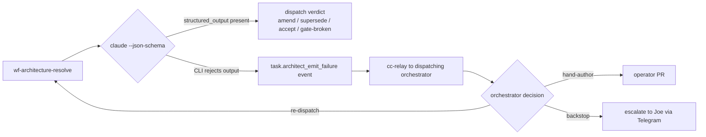

# ADR-0083: Architect emits its verdict via `claude --json-schema`; residual escalation routes to the dispatching orchestrator

- **Status:** proposed
- **Date:** 2026-06-07
- **Supersedes:** ADR-0082
- **Related:** ADR-0029 (architect amend cap), ADR-0048 (verdict surface), ADR-0058 (gate-broken), ADR-0075 (operator-as-backstop premise), ADR-0081 (operator-hint channel)

## Context

ADR-0082 (PR #239) proposed treating architect parse-failure as a `NEEDS_HUMAN` soft escalation: route the task to an `operator_note` pause, let the human set a one-line verdict cue, re-dispatch the architect under a new `cap_exempt` flag. We discarded that proposal during research on 2026-06-07 (see `docs/research/2026-06-07-architect-forced-structured-output-spike.md`, PR #241). The reasons:

- **Token economics.** `cap_exempt` protects the attempt counter but not the downstream Ralph loop. Production data from 9 historical parse-failure-affected tasks: 2.877M output tokens burned across 95 workflow runs, average 325K tokens per affected task. One Ralph-loop iteration ≈ 63K output tokens ≈ $0.95 at Sonnet 4.5 pricing. Tightening the failure tail leaves that spend in place.
- **"Operator" framing.** ADR-0082 implicitly cast Joe as the operator-of-record for parse-failure recovery. The orchestrator sessions (bert/alan/carla/donna) carry larger context than the worker and are the right recipients of an escalation in the common case. Human escalation is the backstop, not the first line — per ADR-0075 and the `feedback_operator_acts_on_own_escalations` precedent.
- **Wedge location.** The failure surface is the model's output channel, not the orchestration tail. Fixing it at the orchestration tail (escalation pipelines, cap accounting, re-dispatch triggers) keeps the model free to malform; fixing it at the input forecloses the entire failure class.

The architect today calls `claude --print --output-format json --model <model> --permission-mode acceptEdits "<prompt>"` and parses the prose `result` field through a four-stage fallback chain (strict JSON → structured-output retry → prose cues → `ArchitectVerdictParseError`). Tonight's research validated that the deployed Claude Code CLI (`2.1.168`) exposes a `--json-schema <schema>` flag that, combined with `--output-format json`, produces a `structured_output` field on the result payload that conforms to the supplied schema. Smoke-tested against a malformed-architect-prompt fixture (matching the ramjac task `78258322` shape Donna hit live tonight): the model emitted `structured_output.verdict="gate-broken"` matching the four-value enum, with the prose `result` field empty.

## Decision

We decided to force the architect's verdict through `claude --json-schema` at the worker's `claude --print` invocation, and to remove the prose-fallback machinery for the architect role. When the schema-validated emit somehow still fails (the model rejects the schema, or the CLI returns no `structured_output`), the disposition routes the case to the dispatching orchestrator session via cc-relay — not to the human — and the task pauses awaiting an orchestrator decision (hand-author, re-dispatch with adjusted scope, or escalate to Joe).

Concretely:

- `workers/agent/treadmill_agent/runner_dispositions/architecture.py` and the underlying call site in `claude_code.py::run_claude_code` add `--json-schema` to the architect's `claude --print` invocation. The schema constrains `verdict` to the four-value enum (`amend | supersede | accept-as-is | gate-broken`) and requires `reasoning` + `target_artifact`; `remediation_summary` and `gate_log_excerpt` are conditional-required per the existing ADR-0048 / ADR-0058 contracts.
- `_extract_verdict_envelope` reads `structured_output` from the CLI result payload first. On presence: unpack + validate against the in-code `_VALID_VERDICTS` set (defensive — the CLI should already enforce, but the worker stays paranoid about model evolution). On absence: skip the four-stage prose chain entirely and emit a `task.architect_emit_failure` event routed via cc-relay to the dispatching session's label.
- `_try_structured_retry` (the second-Claude-call prose-reformatting path) is deleted. Its purpose was to recover from a missing JSON envelope; with schema-forcing, the envelope is structural.
- The prose-cue table (`_PROSE_VERDICT_CUES`) and `_parse_verdict_from_prose` are deleted. Their purpose was to extract verdicts from prose; with schema-forcing, the model has no prose channel to lose information in.
- The `architect_emit_failure` event payload carries the worker's `created_by` label so the cc-relay channel server on the matching orchestrator session injects it as a `<channel source="treadmill-events">` notification. The orchestrator session reads the failing run, picks one of: hand-author the missing decision and bypass the architect; re-dispatch with adjusted scope; or escalate to Joe via Telegram.
- The amend-cap accounting (`_is_capped`) is unchanged. The architect role no longer parses, so it no longer fails-to-parse; the cap continues to count emitted decisions. No `cap_exempt` column needed.

`supersede`-without-`rewritten_description` and `gate-broken`-without-`gate_log_excerpt` — the two in-`handle()` mid-parse subfailures — are validated in worker code as a post-emit check, not at the schema layer. We attempted conditional-required via JSON Schema's `allOf` + `if-then-else` on 2026-06-07 and the Anthropic tool-schema validator returned `400 input_schema does not support oneOf` — the schema engine that backs `claude --json-schema` does not accept JSON Schema's branching keywords. The schema therefore stays flat: enum-constrained `verdict`, always-required `reasoning` + `target_artifact` + `remediation_summary`, optional `rewritten_description` + `gate_log_excerpt`. Worker code then rejects the envelope when verdict is `supersede` and `rewritten_description` is empty, or verdict is `gate-broken` and `gate_log_excerpt` is empty — same `architect_emit_failure` path as a missing `structured_output` outright.

## Alternatives considered

- **Direct Anthropic API call with `tool_choice`.** Path B in the research spike. Architecturally cleaner (forces tool use at the API layer, eliminates Claude Code subprocess overhead, opens the door to collapsing the architect's agent loop from ~25K output tokens/run to ~1-3K). Rejected for v1: larger change (new function, httpx call, dead-code removal, credential audit), and Joe ruled it out explicitly on 2026-06-07 as not realistic right now. Defer to a sibling ADR as a future optimization; the agent-loop collapse is its own value proposition independent of parse-failure.
- **Soft escalation to human via `operator_note` + `cap_exempt` re-dispatch** (the prior ADR-0082). Rejected for the three reasons in §Context: token economics, "operator" framing, wedge location.
- **Keep the prose-fallback machinery as belt-and-braces under schema-forcing.** Rejected: the prose chain is dead code under schema-forcing, and dead code rots. Worse, leaving it in masks regressions — if the schema breaks for any reason, the worker silently falls through to prose instead of failing visibly. Delete the chain; let failures surface.
- **Use MCP to expose an `emit_verdict` tool the model invokes.** Theoretically possible, but the model has freedom to ignore an MCP tool without a `tool_choice` constraint. The CLI does not expose `tool_choice` for MCP tools. Higher complexity, no stronger guarantee than `--json-schema`. Rejected.

## Consequences

### Good

- Parse-failure as a structural class is gone. The 9-task historical cluster (~$34 in output-token waste at Sonnet pricing) does not recur; the ~$3.80 per-future-task savings compounds across every architect run.
- The disposition layer shrinks. `_extract_verdict_envelope`, `_try_structured_retry`, `_parse_verdict_from_prose`, `_PROSE_VERDICT_CUES`, `ArchitectVerdictParseError` (or most of it) — all deletable. Less code, fewer code paths to test.
- The "operator" frame is corrected. Residual schema-reject cases route to the orchestrator session that dispatched the work — the entity with the largest context for the recovery decision. Joe is the backstop, not the first line.
- The CLI seam is preserved. No new dependencies, no new auth path, no new credentials threading. Reversible by removing the flag.
- A previously decorative observation crystallizes: the architect runs as a full Claude Code agent today. `--json-schema` doesn't fix this, but it makes the case for the sibling ADR (direct-API single-shot) much sharper — the only remaining cost in the architect call after this ADR is the agent-loop exploration, which is wholly unnecessary for a verdict-only inference.

### Bad / trade-offs

- The CLI `--json-schema` flag is a Claude Code feature, not an Anthropic API feature; if Claude Code's behavior around this flag changes (validation strictness, model-routing logic, schema-rejection semantics), the architect's verdict path moves with it. Mitigation: pin the validation in worker code as well — `structured_output.verdict in _VALID_VERDICTS` post-check is cheap insurance.
- The architect still runs as an agent (file-reading, multi-turn) under acceptEdits permission mode. We pay the agent-loop cost on every run; schema-forcing doesn't shrink it. The Path B sibling ADR addresses this; in the interim, the architect's per-run output-token cost stays at ~25K average.
- A model output the CLI can't validate against the schema becomes a hard `architect_emit_failure` rather than the prior soft prose-fallback. If the schema is overly strict, recoverable cases become escalations. Mitigation: pilot the schema with the minimum-viable required fields (verdict + reasoning + target_artifact); add conditional required fields as we gain confidence.

### Risks

- **Schema rejection rate baseline unknown.** We've validated the happy path on one smoke. The rate at which the model produces output the CLI rejects is unmeasured. Mitigation: emit a `task.architect_emit_failure` event with the model output excerpt on every rejection, so we can size the residual rate quickly post-merge and iterate the schema if needed.
- **cc-relay channel as the escalation transport** depends on the destination orchestrator session being live + reading its inbox. If the orchestrator is dead, the failure stalls in the relay drop directory. Mitigation: same deterministic detector pattern as the prior ADR-0082 — sweep for stale `architect_emit_failure` events and re-route to Joe via Telegram. Out of scope for v1 (handle if the residual rate is non-zero).

## Diagram

## Follow-ups

- Sibling ADR on direct-Anthropic-API architect call (Path B). Same goal at the next layer down — collapse the agent loop, drop subprocess overhead, eliminate Claude Code as a dependency for the architect's single-shot inference. Sized as larger than this ADR.
- Conditional-required schema fields for `supersede.rewritten_description` and `gate-broken.gate_log_excerpt` may need iteration once we see the real schema-rejection rate. The first cut requires only the always-mandatory fields; conditional-required is a tightening step.
- If residual `architect_emit_failure` rate is non-zero, build the cc-relay → Telegram-backstop sweep mentioned under Risks.

## References

- `docs/research/2026-06-07-architect-forced-structured-output-spike.md` (PR #241) — the research that grounds this decision.
- ADR-0082 (PR #239) — superseded by this ADR; PR will be closed when this lands.
- `workers/agent/treadmill_agent/runner_dispositions/architecture.py::_extract_verdict_envelope`
- `workers/agent/treadmill_agent/claude_code.py::run_claude_code`
- `docs/learnings/2026-06-05-architect-output-malformed-recurring-on-large-prompt-tasks.md`
- Production data: 9 affected tasks, 95 runs, 2.877M output tokens — queried 2026-06-07 from `treadmill-postgres`.
