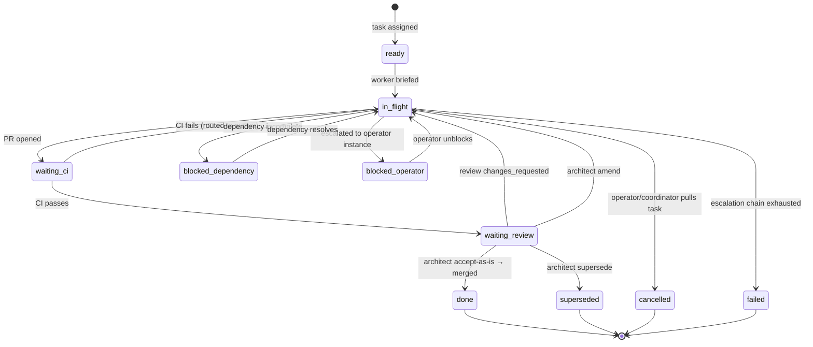

# ADR-0084: Coordinator-Led Team Execution Model

- **Status:** proposed
- **Date:** 2026-06-08
- **Supersedes:** ADR-0018 (autoscaler), ADR-0016 (dev-local deployment topology — Docker-for-workers assumption)
- **Related:** ADR-0011 (event-driven architecture), ADR-0025 (worker heartbeat), ADR-0029 (ralph loop), ADR-0031 (auto-merge), ADR-0038 (architect arbitration), ADR-0048 (architect as recoverer), ADR-0055 (per-account credentials), ADR-0067 (cc-channels), ADR-0068 (treadmill-events channel), ADR-0073 (persistent orchestrator sessions), ADR-0075 (operator-as-backstop), ADR-0081 (hint channel), ADR-0083 (architect json-schema verdict)

## Context

### The experiment that motivated this ADR

On 2026-06-07, the operator ran a multi-session sprint using four named orchestrator sessions (alan, bert, carla, donna) to execute a set of coordinated ramjac tasks. The sessions communicated via cc-relay (see ADR-0067 / ADR-0068), shared plan context, divided work, warned each other about file conflicts before they happened, and asked for help when stuck. Result: substantially more work completed with fewer total tokens than a comparable batch of isolated workers looping independently.

The core efficiency gain was not from better individual workers — it was from the elimination of rework. Conflicts were resolved before they created dirty-branch states. Gate failures that one worker had already solved were shared before a second worker hit the same wall. Workers sized their scope by reading what others were doing rather than discovering the conflict at merge time. The reactive-loop model (ralph loop → wf-feedback → wf-architecture-resolve → cap) is correct in shape but fires too late: most of its iterations address conditions that pre-push communication would have prevented.

The net token-cost advantage of coordinator-led execution over the prior worker-pool baseline is operationally observed but not yet instrumented. The follow-up implementation plan should baseline coordinator token budget (coordinator session + worker sessions combined) against the prior per-task worker cost and track the delta over the first several plans. The ramp-up allowance pattern in §9 — measure, then tighten — applies to coordinator budget as well: if the coordinator's overhead outweighs the rework savings, the model needs adjustment.

### Current system: what works, what doesn't

**What works and must be preserved:**
- The ralph loop structure (author → review gate → validate gate → CI → auto-merge) is the right primitive. It is what we want each piece of work to travel. Reducing loop iterations is the goal; eliminating the loop is not.
- Auto-merge is non-negotiable. The gates exist in service of auto-merge; auto-merge is the whole point.
- SQS is the event backbone — not merely a task dispatch queue. It carries external system events (CI passed, PR merged, PR dirty, push, conflict detected, check_run.completed) into Treadmill from systems outside its control. This function is irreplaceable. The coordinator's ability to route signals to the right team member depends on receiving these events reliably.
- The DB is the source of truth for plan/task state. Event/audit trails are non-negotiable.
- Per-repo auth tokens (ADR-0055) scope workers to a repository's identity.

**What is wrong:**
- Ephemeral workers have no shared context. Each worker starts cold, rediscovers the same files and pitfalls, and has no way to learn what a sibling worker already encountered.
- Reactive-only recovery (wf-feedback, wf-architecture-resolve) means failures are resolved *after* they occur, often after multiple loop iterations. An architect invocation today costs ~25K output tokens and is structurally invoked in a loop. Pre-push team coordination would prevent most of the cases that reach it.
- Hard attempt caps (wf-feedback cap, architecture-resolve cap) are blunt instruments. They enforce a limit on recovery attempts but cannot distinguish "looping on a structural flaw" from "almost there after three real improvements." The former should terminate early; the latter should be allowed to finish. A coordinator watching the task has the context to make that judgment.
- Docker for workers adds overhead without benefit in a singleton. It was designed for cloud deployment; the operational reality is that Treadmill is a dev-local singleton (see ADR-0016, ADR-0073). systemd + tmux gives observability, restartability, and per-session attach without the container layer.
- The autoscaler (ADR-0018) exists to respond to queue depth. In the coordinator model, the coordinator decides whether to spin up a worker — it has the plan context the autoscaler lacks.

### The right framing

Treadmill is a singleton deployed on one machine. Workers are long-lived processes observable via tmux. The coordinator is not an external service — it is one more persistent session with PM-level context. This reframing dissolves most of the "how do we scale this" complexity: per-repo teams are the horizontal scaling unit, and we discover the real limits through operation.

## Decision

### 1. Coordinator role

A **Coordinator** is a named, persistent Claude Code session with plan-level context. It is not a PR reviewer — that is the `wf-review` role. It is not the architect — that remains a single final pre-merge gate call. The coordinator is the PM for a software team bound to a plan.

**At plan start**, the coordinator:
- Reads the plan spec and task graph
- Assigns tasks to available workers, considering file ownership and dependency order
- Briefs each worker with: task intent, scope, known pitfalls from per-repo memory, the active-peer list (set of currently-active worker labels), and awareness of what other workers are doing and which files they own
- Records which session is designated as the plan's **operator instance** (the session that co-authored the plan with Joe — see §10). This may be the same session as the coordinator or a different one.

**During execution**, the coordinator:
- Is the primary SQS consumer for plan-scoped events
- Routes signals: CI failure → routes to the author worker; review changes_requested → routes to author; merge completed → unblocks dependent tasks and notifies next worker; conflict detected → coordinator intervenes, re-coordinates ownership and scope; cross-task pattern (same failure across 3+ workers) → coordinator drafts a learning and may reframe scope
- Monitors task board; can provision a new worker if a task needs one
- Receives escalations from workers (see escalation chain, §10)
- Tracks session liveness via heartbeat (ADR-0025); re-routes signals when the target worker is offline

**At plan close**, the coordinator writes plan-level notes to per-repo memory (§7), synthesizing what workers reported.

The coordinator does not make architectural decisions — it routes them. Structural questions about a PR go to the architect (one call, final gate). The coordinator's judgment is about coordination, not correctness.

**Coordinator handoff protocol:** When the coordinator approaches context limits, it prepares a handoff document and relays it to the incoming coordinator session before terminating. The handoff document contains: current task board snapshot, per-worker lane summary (each worker's current task, last-known status, any pending routing signals not yet acted on), unresolved signals, active ownership claims, and the operator-instance designation for this plan. The incoming coordinator begins with the §6 restart reconciliation procedure and then reads the handoff document to restore routing memory. This is distinct from worker handoff (which uses per-repo memory): the coordinator's routing state is ephemeral and plan-specific — active signal queues and lane assignments cannot be reduced to reusable repo-level patterns.

**Operator pivot handling:** When the operator issues a mid-stream scope change (cancels tasks, reassigns workers, changes direction), the coordinator:
1. Broadcasts a STOP signal to all in-flight workers via relay
2. Waits for acknowledgement from each worker. If a worker does not ack within the §8 configurable inactivity threshold, treats it as offline: marks its in-flight tasks `blocked_operator` and proceeds without it.
3. Updates task_board status for all affected tasks (`→ cancelled` or `→ blocked_operator`)
4. Re-briefs workers on the new scope, treating it as a new plan-start from the current state
5. Preserves work completed so far in per-repo memory — insights from cancelled work remain valid for future plans

### 2. Long-lived named worker pool

Workers are **named persistent sessions** (`treadmill-alan`, `treadmill-bert`, etc.), each bound to a Claude Code instance via cc-channels. They are not ephemeral spawn-and-forget; they are long-running agents that a coordinator briefs with new task context.

The coordinator tracks which workers are available and what they are working on. A worker finishes a task, reports back, and is re-briefed on the next task rather than terminated.

Workers for a given repo form a **per-repo team**: a coordinator + a pool of workers, all using the same repo's auth credentials (per ADR-0055 / ADR-0076). The team is the horizontal scaling unit. We spin up additional teams as we onboard repos; within a team, the coordinator handles work distribution.

Team size is operationally determined. Start with 2–4 workers per team; adjust based on observed bottlenecks. The coordinator can request a new worker be provisioned when queue depth warrants it.

### 3. Execution substrate: systemd + tmux, not Docker

Workers run as **systemd user units** with **tmux sessions**. This replaces the Docker container model for worker execution.

Rationale:
- The operator can `tmux attach` to any worker for direct observation — exactly the visibility Joe wanted during the experiment
- systemd provides restart-on-failure and process supervision without the image-build loop
- No Docker daemon dependency; simpler local setup

**Session survival under restarts:** The systemd unit launches the worker _inside_ a `tmux new-session -d -s <label>` invocation. The tmux server is a separate process group from the worker child. When systemd restarts the unit, it kills the worker child but the tmux server (and thus the session shell) survives — the session is retained and the worker respawns into it. If the tmux server itself is killed (e.g., a system reboot or `tmux kill-server`), the session is gone and the unit restart creates a fresh session. The operator can observe without interrupting the session in either case.

The cc-channels infrastructure (one bot per session, ADR-0067) is unchanged for sessions whose Claude account has channel permissions — it rides on the same named sessions. Workers on accounts without channel permissions run without a channel server; the coordinator communicates with them via `tmux send-keys` (see §4).

**Wake-up requirement for idle sessions:** Use `cc-relay.py --type action` for messages that require the receiving session to act. The `[ACTION REQUEST]` header is a convention the receiver honors — the channel server itself treats action and context files identically. Whether a relay message wakes an idle session is determined by Claude Code's channel-notification behavior, not the channel server. For non-channel workers, the tmux fallback is required regardless.

### 4. Worker communication: cc-relay primary, tmux fallback

The primary communication transport for the team is the existing **cc-relay + channel server** infrastructure (ADR-0067 / ADR-0068). Any session sends a message to a peer by dropping a file into `~/.cc-channels/<to-label>/relay/` via `cc-relay.py`. The target's channel server (Bun MCP process) watches that directory, injects the content as a `<channel source="treadmill-events">` notification, and the worker sees it on its next turn — or immediately if the channel injects mid-turn. This already works today; the team model uses it as-is. Workers check their relay inbox **on every turn AND every tool use** via the channel injection mechanism.

**Fallback: `tmux send-keys` for accounts without channel permissions**

Not every Claude account supports cc-channels. Workers on accounts without channel permissions run without a channel server; the relay file drop has no consumer and the worker can go fully idle with no way to receive messages.

For these workers, the coordinator uses `tmux send-keys` to deliver the message directly. This path has been used successfully in informal coordination (confirmed 2026-06-08) but is unproven at production scale; failure modes are discovered through operation.

The coordinator must:
1. Confirm the worker is **idle** before sending — `tmux capture-pane -t <label> -p` and check for an empty prompt line. Defer the message if the worker is mid-turn; characters injected during an active turn enter the input buffer unpredictably.
2. **Escape message content** before injection — backticks, `$`, and double-quotes in message text trigger shell evaluation in the REPL prompt. Use a temp-file pattern: write the message to a temp file, send `cat /tmp/relay-<id>.txt` as the injected text, followed by Enter. This bypasses shell parsing of the message body entirely.
3. Send text and Enter as **two separate calls**:
   ```
   tmux send-keys -t <label> "cat /tmp/relay-<id>.txt"
   tmux send-keys -t <label> "" Enter
   ```
   A combined text+Enter call can buffer the Enter during an active turn and fail to submit.

The injected text becomes the worker's next user prompt — the session wakes from idle, reads the relay file, and processes the message.

**Delivery acknowledgement:** When a worker receives a relay message and begins acting on it, it sends a brief reply confirming receipt: `[from: <label>] Got it — working on <task-id>.` This gives the coordinator a signal to distinguish "delivered + in progress" from "not yet delivered." The coordinator tracks the last-ack timestamp per worker; combined with the push-based liveness signal in §8, it covers the three states: in-progress, stalled, and offline.

**Message self-containment discipline:** Each message — whether delivered via channel or tmux — must make sense without reference to other in-flight messages. Batch summaries (§8 signal-storm batching) must include the full net state, not just the delta.

### 5. Worker-to-worker messaging

Workers can write directly to any peer's relay inbox using the same write path the coordinator uses — dropping a file via `cc-relay.py`. The coordinator is not a required intermediary for peer communication. For peers on accounts without channel permissions, the sender uses `tmux send-keys` instead (same idle-check + escaping + two-call pattern as §4).

**Ownership claim granularity:** Use ownership claims when collision risk is at file or module level. When workers own entire services or plan lanes, per-file claims add overhead without collision prevention value — service/lane ownership is communicated once in the task brief. Claims are for fine-grained work within a shared surface (multiple workers touching the same module or config file).

**Ownership claims:** When a worker picks up a file or module it will be modifying, it sends a brief message to each active peer (provided in the coordinator's task brief) and CCs the coordinator:

```
[from: treadmill-bert] Taking routes/tags.js and routes/attachments.js for task T-04.
Don't touch those until I push.
```

Ownership claims reduce collision frequency but do not eliminate it. Two workers that pick up overlapping files in the same plan tick may both broadcast simultaneously and both proceed — the `pull_request.dirty` routing path in §8 handles residual collisions. The claim pattern is "I get there second and back off," not a distributed lock. The back-off pattern applies when a worker has not yet started on the claimed files; the worktree fallback (below) applies when work is already in flight.

**Simultaneous-start fallback:** If a worker receives a sibling's ownership claim for files it has already started working on, it opens an **isolated worktree** at `.claude/worktrees/<task-id>-<scope>` and continues its work there. The coordinator decides at merge time which branch wins; the worker on the secondary branch rebases or is superseded depending on the coordinator's assessment of scope overlap.

**Ownership release:** When the worker pushes, it sends a release:
```
[from: treadmill-bert] Released routes/tags.js — T-04 PR opened (#1204).
```
Siblings may also infer release from the task board when `task_board.pr_number` goes non-null.

**Solution sharing:** When a worker resolves a gate failure with a non-obvious fix, it relays the substance to the coordinator and optionally to any sibling working in the same area:
```
[from: treadmill-carla] Tag has no direct account_id — filter via
attachment.attachment_associations.notification.account_id. Fix in ea625ac8.
```

Workers CC the coordinator on ownership claims so the task board reflects actual file ownership, not just assigned scope.

**Direct peer messaging does not bypass the coordinator's routing judgment.** Workers message each other for information exchange. Escalations go to the coordinator (§10). A blocked worker escalates up the chain, not laterally.

### 6. Task board

A lightweight **task board** in the team's SQLite DB:

```sql
CREATE TABLE IF NOT EXISTS task_board (
    task_id TEXT PRIMARY KEY,
    plan_id TEXT NOT NULL,
    assignee TEXT,
    status TEXT NOT NULL,
    branch TEXT,
    pr_number INTEGER,
    notes TEXT,
    updated_at TEXT NOT NULL
);
```

**Status vocabulary:** `ready | in_flight | waiting_ci | waiting_review | done | blocked_dependency | blocked_operator | superseded | cancelled | failed`

- `blocked_dependency` — waiting on another task to complete
- `blocked_operator` — escalated to operator instance; awaiting strategic decision
- `superseded` — architect returned supersede verdict; scope rewritten, new task or PR in progress
- `cancelled` — operator or coordinator pulled the task; no further work
- `failed` — escalation chain exhausted without resolution

**Coordinator restart reconciliation:** On startup, the coordinator reconstructs the task board from DB ground truth before accepting any worker signals:
1. Query `tasks` + `workflow_runs` for all active tasks in the plan (not in `done | cancelled | failed`)
2. Rebuild each row: assignee from `workflow_runs.created_by`, branch from the most recent `push` event, `pr_number` from the most recent `pull_request.opened` event for that branch
3. Relay a status-check to each assigned worker: `[coordinator] Restarted — report your current task status and any pending relay messages you have not yet acknowledged`
4. Reconcile worker replies against the reconstructed board; `notes` field is carried forward from the prior board if the DB contains it (the coordinator writes notes to the DB before acting on them for exactly this reason)

The `CREATE TABLE IF NOT EXISTS` is idempotent — coordinator-on-startup owns it; no Treadmill bootstrap step needed.

The task board is a coordinator-maintained planning overlay derived from and cross-checked against the DB. The DB remains authoritative; the board is the coordinator's working view.

### 7. Per-repo memory

Workers accumulate **per-repo memory** in a **markdown file** (default format; SQLite deferred to the implementation plan if coordinator-query patterns require it) scoped to the repository. Contents: file ownership patterns, known pitfalls, test patterns, prior plan learnings relevant to this repo.

Memory is written by the coordinator at plan close, synthesizing what workers reported. It may be updated incrementally mid-plan as substantive patterns surface — a pitfall discovered at task 2 is immediately useful to tasks 3–8 still in-flight.

**Concurrent-write protocol:** Two coordinators running concurrent plans on the same repo both write to the same memory file. Protocol: each coordinator writes to a per-plan staging file (`memory/<repo>/<plan-id>.md`) during the plan. At plan close, it appends its staging file to the canonical `memory/<repo>/main.md` under an advisory file lock (`flock`). The canonical file is append-only during concurrent operation; a periodic compaction pass (once per plan close, after append) deduplicates and reorganizes. Last-write-wins on overlapping pitfall entries is acceptable — patterns are additive, not mutually exclusive.

Per-repo memory is injected into every new worker brief at task start.

### 8. Signal routing

The coordinator subscribes to all plan-scoped SQS events. On each event:

| Event | Recipient | Coordinator action |
|---|---|---|
| `check_run.completed` (failure) | Author worker | Routes failure signal + log excerpt; author self-corrects |
| `check_run.completed` (success) | Coordinator | Updates task board; may trigger architect gate call |
| `workflow_run.requested` | Coordinator | Updates `task_board.status = waiting_ci` |
| `pr_review.changes_requested` | Author worker | Routes review body to author; author responds |
| `pr_review.approved` | Coordinator | Updates readiness state; may trigger architect gate call |
| `issue_comment.created` on PR | Author worker | Routes comment to author for triage and response |
| `pull_request.opened` | Coordinator | Auto-links branch → task_id; sets `task_board.pr_number` |
| `pull_request.dirty` (conflict) | Coordinator | Intervenes; re-coordinates scope; may reassign or merge on behalf |
| `pull_request.closed` (unmerged) | Coordinator | Task returns to `ready` or `blocked_operator`; coordinator decides re-assignment |
| `pr_merged` | Coordinator | Unblocks dependent tasks; notifies next worker |
| `push` | Coordinator | Worker liveness signal (per ADR-0075); updates `task_board.updated_at`; distinguishes `in_flight` from stalled |
| Same failure across 3+ workers in plan | Coordinator | Drafts a learning; may reframe scope or pause new task starts. 3+ is the unmistakable count-based threshold; coordinator may act earlier on structural-pattern recognition (two distinct failures that both reduce to the same root class constitute a structural signal at N=2) |
| Worker surfaces task-premise failure during study | Coordinator | Pause all downstream tasks in the dependency chain; propagate to operator instance for re-scope decision. This signal does not come from SQS — it arrives via worker relay when research reveals the task's premise is wrong (e.g., a dependency that doesn't exist, a constraint that invalidates the approach) |

**Author-worker-offline routing hole:** If the author worker is dead when a signal is routed to it, the relay message accumulates unread and the plan stalls silently. The coordinator tracks liveness via the heartbeat mechanism (ADR-0025) — `tmux list-sessions` confirms the transport target exists; worker responsiveness is tracked via the last-ack timestamp (§4 delivery acknowledgement) and `push` events. After a configurable inactivity threshold (default from implementation plan), the coordinator re-routes the task — either reassigning it to an available worker or escalating to the operator instance.

**Signal-storm batching:** A noisy PR generates many routable events within a short window. The coordinator collapses N events on the same PR within a sliding window into one batched relay message. The batched message must be self-contained: it includes the latest-event verdict plus a one-line summary of prior states in the window. Example format:
```
CI on PR #1204: pass → fail (compile: missing import in auth.py, step 3 of 4) →
retry started. You are awaiting the retry result; no action needed unless retry fails.
```
The recipient must not need to pull GitHub history to understand the state.

**wf-feedback backstop trigger:** The reactive wf-feedback loop is retired as the primary recovery path but remains as a backstop. The coordinator falls back to it when it has routed the same gate failure to the author worker 3 consecutive times without an intervening `push` event from that worker — indicating the author is stuck rather than iterating. A different failure class resets the count; the threshold is per-failure, not per-task. At that point, the coordinator writes a log entry (`escalating to wf-feedback: reason <X>`) and invokes the loop explicitly. The 3-routing threshold is the coordinator's give-up signal.

### 9. Architect as single final pre-merge gate

The architect (ADR-0038, ADR-0048, ADR-0083) transitions from a loop arbiter to a **single final pre-merge gate call**.

Before the coordinator signals auto-merge readiness, it triggers one architect call with: the PR diff, the review verdict, the validate output, any coordinator context about the task's history, and per-repo memory relevant to the changed files.

The architect renders one verdict: `accept-as-is | amend | supersede | gate-broken`. The coordinator routes accordingly:
- `accept-as-is` → trigger auto-merge
- `amend` → route remediation to the author worker; author corrects; re-run CI; one more architect call
- `supersede` → coordinator works with the author worker on the rewritten scope; new PR
- `gate-broken` → coordinator escalates to the operator instance

**Defining a real amend:** A second architect call is permitted only on a **real amend**: the diff is non-trivial AND it directly addresses the architect's first verdict. A commit message rewrite or whitespace-only change is not a real amend.

**Edge cases:**
- *Amend reveals a deeper issue:* author addresses the architect's stated flag; fix exposes a second problem. Second architect call is permitted; if it returns `amend` again, coordinator evaluates convergence vs. structural flaw requiring escalation.
- *Partially-correct amend:* architect flags two items; author fixes one. Second call re-states the remaining flag. Coordinator tracks whether author is making progress.
- *gate-broken from ADR-0083:* architect emits `gate-broken` due to schema-emit failure → operator path, not a re-call.

**Supersede tie-break:** Coordinator cannot override a `supersede` verdict. Coordinator-architect disagreement → operator escalation. Supersede direction is not coordinator-overridable.

**Ramp-up allowance:** Until coordinator briefing quality is proven, a 2-amend allowance is in effect with a required log note on the second attempt justifying convergence. **Termination criterion:** the rolling 50-architect-call window is re-evaluated at each plan close. When two consecutive plan-close evaluations both show an amend rate below 20%, the 2-amend allowance retires to 1-amend. Anchoring evaluation to plan boundaries gives the window a chance to compound across complete plans rather than reacting to per-call noise. Numbers (50, 20%, two) are the measurement shape; calibration belongs in the implementation plan.

The attempt cap on architect calls is retired; the ramp-up allowance and coordinator judgment replace it.

### 10. Escalation chain

```
Worker
  → Coordinator (PM: routes, unblocks, re-scopes)
    → Operator instance (the exec who co-authored the plan)
      → Human (true backstop)
```

A worker that is blocked escalates to the coordinator, not directly to the human. The coordinator has plan context to triage: scope issue, technical blocker, conflict, missing permission. The coordinator resolves most blockers; only genuine strategic questions go to the operator instance. Joe is the backstop, not the first line — per ADR-0075.

**Operator instance vs. worker role overlap:** The operator instance is the session that worked through the plan with Joe at authoring time. In the current team (alan, bert, carla, donna), the same named session may hold both the operator-instance role for a plan AND a worker role in its execution. When that happens:
- Escalations that would go to the operator instance instead go to that session's **coordinator-channel mode** — the session receives the escalation as a relay message in its coordinator inbox, not its worker inbox, so the worker-role context and operator-role context do not conflate.
- If the coordinator and operator instance are the **same session** (single-team operation), the escalation chain collapses: worker → coordinator/operator-instance → human. There is no intermediate tier; the session escalates directly to Joe.

**Coordinator-operator-instance identity at plan start:** The coordinator records which session is the operator instance at plan start (§1). This record is stored in the task board's plan metadata so a restarted coordinator can recover it.

The operator instance is not redundant with the coordinator even though the coordinator was briefed on the plan at start. The coordinator received a structural brief (task graph, scope, file assignments). The operator instance was present for the planning conversation and holds the *reasoning* behind the constraints — rejected alternatives, explicit operator rulings, strategic context the plan document does not capture.

### 11. Autoscaler retirement

The autoscaler (ADR-0018) is retired. Its job — responding to queue depth — is taken over by the coordinator, which has better context (plan graph, worker availability, task dependencies). The coordinator provisions workers when needed; it does not respond blindly to queue depth.

### 12. Attempt caps retirement

Hard attempt caps (wf-feedback max 5, architecture-resolve max 3/5) are retired. Coordinator judgment replaces them. The coordinator can observe a worker looping on a structural flaw and escalate earlier; it can also allow a nearly-complete task an additional iteration when the fix is substantive. Hard caps optimized for bounding runaway cost in the absence of oversight; the coordinator provides oversight.

Cost control is enforced by the coordinator's token budget awareness and escalation chain, not by a static attempt counter.

## Diagram

### Happy-path PR lifecycle

```mermaid
sequenceDiagram
    participant W as Worker
    participant C as Coordinator
    participant SQS as SQS
    participant GH as GitHub / CI
    participant A as Architect
    participant AM as Auto-merge

    C->>W: brief(task, scope, active-peers, per-repo memory)
    W->>GH: push branch, open PR
    GH->>SQS: pull_request.opened
    SQS->>C: pull_request.opened
    C->>C: task_board.pr_number set; status = waiting_ci
    GH->>SQS: check_run.completed (pass)
    GH->>SQS: pr_review.approved
    SQS->>C: check_run.completed (pass)
    SQS->>C: pr_review.approved
    C->>A: architect call (diff + review + validate + context)
    A-->>C: accept-as-is
    C->>AM: trigger auto-merge
    AM->>SQS: pr_merged
    SQS->>C: pr_merged
    C->>C: task_board.status = done; unblock dependents
    C->>W: brief next task
```

### Task board state machine



## Alternatives considered

### A. Status quo — ephemeral workers + reactive loops

Keep the current model, tune the attempt caps and wf-feedback prompts. Rejected: the experiment was decisive. Team coordination produces better results with fewer tokens; the efficiency gap grows with plan complexity. Tuning the reactive loop addresses symptoms; the coordinator addresses the cause.

### B. Coordinator-as-SQS-replacement for task dispatch

Have the coordinator dispatch work directly to workers, eliminating SQS for internal task routing. Rejected: SQS carries external system events (CI, GitHub webhooks, PR events) that originate outside Treadmill. This delivery function is irreplaceable without an equivalent durable subscriber. SQS stays as the event backbone; the coordinator consumes its output rather than replacing the queue.

### C. Keep Docker for workers with a coordinator layer on top

Add the coordinator role without changing the worker substrate. Rejected for now: Docker adds build-loop overhead, makes per-session tmux attach awkward, and was never needed for the singleton case. systemd + tmux is simpler and gives the operator direct observability. The Docker option remains available if Treadmill ever scales out of the singleton model.

### D. Coordinator-as-required-intermediary for all worker messages

Require all worker-to-worker communication to route through the coordinator so it has full visibility. Rejected: the coordinator cannot meaningfully act on most peer messages (ownership claims, solution shares, status updates). Mandatory routing adds latency and makes the coordinator a bottleneck. Workers talk directly; coordinator is CC'd on ownership claims so the task board stays accurate.

### E. SQLite relay DB as primary messaging transport

Use a shared SQLite DB with a `relay_messages` table as the primary transport, with `PreToolUse` + `UserPromptSubmit` hooks draining undelivered rows into worker context. Rejected as primary: the cc-relay + channel server already does this job and is proven in production. SQLite adds implementation work without adding capability over what channels already provide. SQLite is retained for the task board (§6) and per-repo memory (§7) — structured state, not message transport.

### F. Self-compaction by the coordinator

Allow the coordinator to compact workers' context windows by injecting `/compact` via `tmux send-keys`. Rejected: `/compact` is a REPL-only slash command, not invokable by the model programmatically. Workers that approach context limits surface this to the coordinator via a relay message; the coordinator's recovery path is to brief a new worker with a summary handoff.

_(Note: `tmux send-keys` is used in §4 for message delivery to non-channel workers, where it injects plain text into the input prompt. That use is distinct from `/compact` injection, which requires the REPL to interpret a slash command — a capability the model cannot force.)_

### G. Coordinator as a non-Claude Python service

A deterministic daemon consuming SQS and applying routing rules to worker inboxes. Pros: no context limit, no token cost, completely predictable. Cons: no judgment. The coordinator's value is precisely its ability to read a situation — "these three workers are all hitting the same gate failure, which means the plan scope is wrong" — and act on it. A rule-based daemon cannot make that call. Model-based coordination is load-bearing here, not incidental.

### H. Plan-scoped state on existing `tasks` columns instead of a separate task board

The existing `tasks` / `workflow_runs` DB already carries assignee, status, and branch. Using those directly would avoid a parallel state problem. Rejected as the primary path: the task board's status vocabulary (`waiting_ci`, `blocked_operator`, `superseded`) is coordinator-semantics, not DB-semantics; the DB models workflow execution state, the board models team coordination state. The coordinator reconciles the two on startup (§6), treating the DB as authoritative ground truth and the board as its working overlay.

### I. Two concurrent coordinators on the same repo interact at runtime

When two plans run concurrently on the same repo, their coordinators share per-repo memory (§7's append-only protocol handles this) but do not coordinate with each other directly. Concurrent same-repo coordinator interaction is **out of scope for v1**. Each coordinator operates independently; the per-repo memory protocol and file lock prevent write corruption. A future ADR addresses runtime coordinator-coordinator interaction when the first concurrent-plan case demands it.

### J. Collapse operator-instance + coordinator into one tier

The escalation chain has two Claude tiers. The coordinator was briefed on the plan — why not collapse to worker → coordinator → human? Rejected: the coordinator received a structural brief. The operator instance was in the room at authoring time and holds the strategic intent, rejected alternatives, and "why these constraints" context that no briefing document captures. For `supersede` verdicts and architectural disagreements, that context is decisive. The two tiers are not redundant; they have different epistemic positions.

## Consequences

### Good

- Rework from file conflicts is reduced at the source: coordinator-tracked file ownership and peer ownership claims prevent most collision-class failures before they reach merge time.
- Repeated gate failures are absorbed by the team: a worker that has already resolved a validate failure can relay the solution to a sibling about to hit the same wall.
- The operator gets direct tmux observability of every worker: `tmux attach -t treadmill-bert` without any Docker exec machinery.
- Per-repo memory compounds over plans: the second plan on a repo starts with context from the first; cold-start cost shrinks toward zero.
- The architect becomes a quality signal, not a recovery loop. Frequent `amend` verdicts signal to the coordinator that briefings need to improve — the ramp-up allowance makes this measurable.
- Attempt caps retire cleanly: coordinator judgment is more contextual than a static counter, and the cost-control function passes to an entity that has the context to use it correctly.

### Bad / trade-offs

- The coordinator is a new role with new prompting requirements. Getting the coordinator briefing prompt right will take iteration; a poorly-briefed coordinator could be worse than the reactive model. The coordinator briefing prompt is the operationalizing artifact — defined in the follow-up implementation plan, iterated based on amend-rate data.
- Long-lived workers accumulate context. Per ADR-0073, context accumulation is a known challenge for persistent sessions. Without `/compact` automation, coordinators must proactively manage worker state: brief, task, summarize, re-brief.
- Per-repo teams multiply the number of named sessions. Claude Code channel slot limits become a real constraint at scale. We learn the actual limits through operation; per-repo teams are provisioned on demand rather than pre-allocated.

### Risks

- **Coordinator as single point of failure for a plan.** Mitigation: coordinator writes routing decisions and task board state to SQLite before acting on them; a restarted coordinator reconciles from DB ground truth (§6 restart procedure).
- **tmux send-keys for non-channel workers is unproven at production scale.** Idle-state check + escaping discipline (§4) are specified; full failure-mode coverage belongs in the implementation plan. We discover edge cases through operation.
- **Coordinator token budget.** A coordinator watching a large plan accumulates context quickly. Mitigation: treadmill-events channel filtering (quiet level, per ADR-0071); signal-storm batching (§8); summarize-and-re-brief when approaching limits.
- **Claude Code channel availability varies by account.** Coordinator must track which workers use channel vs. tmux path. Worker responsiveness is tracked via the last-ack timestamp (§4) and push-based liveness signal (§8), not `tmux list-sessions` alone (which confirms the transport target exists, not that the worker is responsive).
