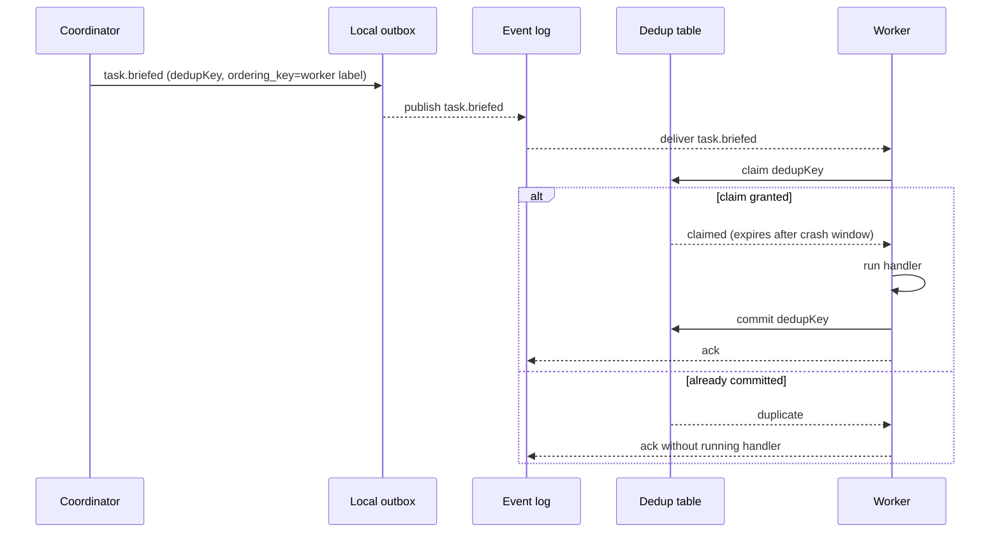

# ADR-0093: Durable, ordered, effectively-once agent messaging

- **Status:** accepted (2026-08-13, operator)
- **Date:** 2026-08-12
- **Amends:** ADR-0084 (§4 worker communication), ADR-0068 (channel role)
- **Related:** ADR-0011 (event-driven architecture), ADR-0087 (long-lived team execution model)

## Context

**Treadmill's coordination path has never had a delivery guarantee.** It has now carried two transports, and neither provided one.

The incumbent is cc-relay. Per ADR-0084 §4, a session messages a peer by dropping a file into `~/.cc-channels/<to-label>/relay/`, and the target's channel server injects it on the next turn. **It works when both parties are cc-channels sessions.** Its defect is the absence of guarantees: no acknowledgement, no sequence numbers, no deduplication, and no redelivery. A sender cannot tell whether a message arrived.

We should be precise about one incident, because it is easy to misread. On 2026-07-19 we retired cc-relay, citing "real message loss — #165." That loss was **not** cc-relay failing at its job. Its root cause, per the commit: a relay write went to a directory that "no fabric agent watches" — the recipients had been migrated onto the `exec_otp` fabric while the senders had not, so nothing was left watching. The loss was an artefact of a half-finished migration. cc-relay is under-specified, not broken.

The migration that caused it has since collapsed. `exec_otp` was retired on 2026-08-12, and the operator has directed that the commits coupling Treadmill to it be backed out as "spurious wrong work." That restores cc-relay as the working transport, and restores the original problem with it: agent coordination has no delivery guarantee, while the state path — Postgres, derived status, SQS FIFO — has been durable throughout.

ADR-0084 considered the durable alternative and rejected it: "Use a shared SQLite DB with a `relay_messages` table as the primary transport... **Rejected as primary:** the cc-relay + channel server already does this job and is proven in production." Since that ADR (2026-06-08) we have run two migrations away from cc-relay and back, and the operator's verdict on messaging is that deliverability is "very negatively impacting our ability for the agents to ship code."

The operator's requirement: messages "should be delivered in the order that they were sent and guarantee exactly once delivery."

## Decision

We decided that **agent-to-agent messages are events on the durable log, not files on a watched directory.** Every message is written through an outbox, published to the log, and delivered at-least-once to an idempotent receiver, which yields effectively-once processing.

Three properties define the contract:

1. **Identity.** Every message carries a stable `dedupKey` — a UUID per logical publication, minted by the sender.
2. **Order.** The **ordering key is the recipient label**. Messages to a given agent are delivered in the order the log appended them. We do not claim a global order across recipients; no global clock exists.
3. **Idempotence.** The receiver **claims** `dedupKey` with a crash expiry, runs its handler, then **commits** the key. A key already committed is dropped. A key claimed but not committed becomes re-claimable once its expiry passes, so a receiver that dies mid-handler gets the message again rather than losing it. Marking the key before the handler runs would suppress redelivery of a message that was never processed, which breaks the at-least-once guarantee this decision rests on (found in review by `treadmill-donna`, 2026-08-12).

**Targets — unicast and broadcast.** A message addresses either a single agent **label** (unicast) or a **channel**: a named subscription set a team joins for team-wide messages. A broadcast is **N unicast deliveries** and does not weaken the guarantee; three rules make it exact:

- **Subscriber set = the log fold at the broadcast's offset.** "Current subscribers" means the subscription set as of the broadcast's append point on the log — deterministic and replayable. A join after that point misses this broadcast; a leave after it does not un-deliver.
- **dedupKey is the composite `(subscriber, broadcast_id)`**, never a fresh per-delivery UUID. A key shared across subscribers would deliver to only the first to dedup (the rest skip it as a duplicate); a fresh UUID would let a re-fanned-out broadcast reprocess. This is ADR-0009's rule — dedup on `event_id × subscriber_id`, never `event_id` alone.
- **Order is per-subscriber** (ordering key = subscriber, per property 2), never a per-channel global order — that would contradict "no global order across recipients." Two subscribers may see the broadcast at different positions in their own mail; that is expected.

Subscription is a durable fact on the log, so a subscriber isolated at broadcast time receives the message when it drains (ADR-0094).

We author a **Treadmill-owned library** for these semantics, modelled on `ramjac-events` (ADR-0014), not a runtime dependency on it (it is PHI-coupled, and cross-project coupling is what we avoid elsewhere — ADR-0095, ADR-0096). We **copy the interface fresh** — the outbox `write`/`read_pending`/`mark_published` methods and the dedup-table shape — but **port the hardened semantics as code plus ramjac's invariant tests** (the silent-crash and unscoped-dedup-collision cases), rather than re-deriving the claim/commit cycle, dedup scoping, and pump retry from prose. Re-deriving semantics from an ADR is what produced the mark-then-process bug above. Each ported unit carries a provenance comment (source + version) so a later ramjac fix stays re-portable.

cc-relay is **demoted to a local wake signal**, and it never crosses hosts. It may nudge an idle session on its **own** machine that work is waiting; it no longer carries the work. Cross-host reach is the event log alone (ADR-0095): the recipient's host runs a consumer for its bound labels, sees the message on the log, and wakes its local session — cc-relay is only that last, intra-host hop. A sender on one host never touches another host.

## Alternatives considered

- **Incumbent: cc-relay + the channel server (ADR-0084 §4), restored by the #370/#371 revert.** It works: both parties drop and read files under `~/.cc-channels/<label>/relay/`, and it is carrying operator traffic today. **Why insufficient:** it offers no delivery guarantee. There is no acknowledgement, no ordering, no deduplication, and no redelivery, so a sender cannot establish whether a message arrived. Observed on 2026-08-12: a session's brief was consumed by the channel server, the session stopped before acting on it, and nothing redelivered — a human noticed by reading the terminal.
- **The `exec_otp` fabric (#370, #371).** Rejected: it no longer exists. The fabric was torn down on 2026-08-12, `send` is not on `PATH`, and the `fabric-messaging` skill `CLAUDE.md` pointed to was never committed. Both commits are reverted.
- **True exactly-once delivery.** Rejected as unachievable: over an unreliable link a sender cannot distinguish "the receiver processed it and the acknowledgement was lost" from "the receiver never got it." At-least-once transport plus an idempotent receiver is the achievable form, and is what "exactly once" means operationally.
- **Postgres `LISTEN`/`NOTIFY`.** Rejected on ramjac's finding (ADR-0014): "durability story for `NOTIFY` is 'don't trust it, poll anyway'."
- **SQS FIFO for agent traffic.** Already carries external events. Rejected for intra-host agent mail because it makes local coordination depend on a cloud round-trip; reconsider if agent traffic crosses accounts.

## Consequences

### Good
- A sent message is delivered or visible as pending. Silent loss stops being possible.
- Agent coordination becomes replayable and auditable from the same log as task state.
- Ordering is defined and testable rather than incidental.

### Bad / trade-offs
- Higher latency than a file drop. Agent mail now costs a durable write.
- Receivers must carry a dedup table and run the claim/commit cycle around every handler.
- One stuck message stalls its ordering key, so a wedged agent's inbox halts. We accept this: an agent processes serially regardless, and a visible stall beats silent reordering.

### Risks
- Getting the claim/commit order wrong is silent in both directions: committing early loses messages, never committing double-processes them. The cycle belongs in a shared consumer base class, not in each agent.
- The crash expiry is a guess. Too short and a slow handler gets its message re-delivered underneath it; too long and a dead receiver's inbox stalls.
- **Falsifier:** a message delivered twice to a handler, out of order for one recipient, or lost because a receiver died mid-handler after marking its key.
- **Check:** none yet — see Follow-ups.

## Diagram

## Follow-ups

- Which store backs the dedup table, and its retention window.
- Whether orchestrator-to-orchestrator mail uses this path or remains operator-driven.
- **Channel lifecycle:** how a subscription is recorded and changed on the log, and how a channel is created and retired. (Order and the subscriber-set semantics are settled in the Decision.)

## References

- ADR-0084 §4 and its rejected SQLite alternative.
- ramjac ADR-0014 (event bus, ordering keys, `dedupKey` semantics).
- `exec_otp` postmortem, §3.3 and §4: `~/obsidian/lepper/exec-otp/exec_otp Postmortem.md`.
