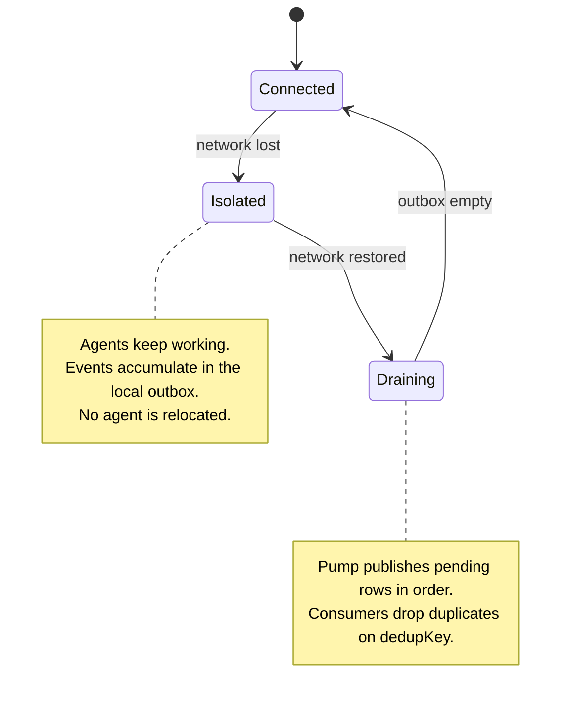

# ADR-0094: Hosts survive isolation via a local outbox; nothing adopts their agents

- **Status:** accepted (2026-08-13, operator)
- **Date:** 2026-08-12
- **Related:** ADR-0093 (durable agent messaging), ADR-0011 (event-driven architecture), ADR-0087 (long-lived team execution model)

## Context

Treadmill runs as a singleton on one machine (ADR-0016, ADR-0087), so network isolation has never been a design concern. We intend to run named agents on more than one host, which makes it one.

`exec_otp` ran that experiment and failed it. Its durable tables held a single replica on the cloud node, and its reconciler adopted "homeless" agents onto that node whenever their home stopped answering. On 2026-08-11 a short link drop on the desktop produced this chain: the reconciler adopted 13 agents in 28 seconds; the cloud node — 2 vCPU, 7.7 GB — attempted to run 15 Claude Code sessions; CPU held flat at 60.5% for three and a half hours; the OOM killer ended it. That node held the only replica, so every other machine could read nothing for the full period, including a healthy idle desktop. AWS reported `StatusCheckFailed_System` of 0 throughout: the hardware never failed.

Two mechanisms combined. Failover concentrated load onto one machine, and shared durable state made that machine indispensable. Either alone is survivable. The operator's directive is direct: "Nodes should be able to survive isolation and continue to function... the agents should just keep working and push state when the network comes back."

## Decision

We decided that **a host that loses the network keeps working, buffers its outbound events in a local durable outbox, and drains them in order on reconnect. No component may move an agent because its host is unreachable.**

Concretely:

1. **Each host owns a local outbox.** An agent writes its event to that outbox in the same transaction as the local state change it describes. The write succeeds without any network.
2. **One pump per host outbox** drains pending rows to the central event log, retries indefinitely, and never drops. Each row already carries its `dedupKey` (ADR-0093), so a retry after a lost acknowledgement is harmless.
3. **Unreachable is not dead.** Isolation is an expected state, not a failure to be corrected. No reconciler, scheduler, or peer relocates an agent on the basis of an unreachable host.

We build a **Treadmill-owned outbox** modelled on `ramjac-events` (`OutboxBackend`, `service/outbox_service`, `outbox-publisher`) — we copy and adapt its proven shape, we do not depend on it at runtime (ADR-0093). Ours is a **SQLite backend** with the three methods `write`, `read_pending`, `mark_published`.

**Invariant: exactly one pump per host outbox, enforced by `flock`.** ramjac's contract uses `SELECT … FOR UPDATE SKIP LOCKED` so concurrent pumps claim disjoint rows; SQLite has neither, so ours is the **weaker single-pump variant** — correct only because exactly one pump runs. We hold that with an OS advisory lock (`flock`) on the outbox for the pump's lifetime, released automatically on death; a pidfile is not enough (it races at startup and goes stale on crash). ADR-0093's dedup already makes a stray second pump non-corrupting — the consumer drops the duplicate publications — so the single pump's real job is preserving per-recipient **order**, not preventing loss.

## Alternatives considered

- **Incumbent: Treadmill's singleton topology (ADR-0016, ADR-0087).** One host, so isolation cannot occur. **Why insufficient:** it forecloses running pinned agents on more than one machine, which is a stated goal. The incumbent does not fail — it declines the problem.
- **`exec_otp`'s model: shared distributed state plus adoption on node-down.** Rejected on evidence. It converted a sub-minute link drop into a 3-hour 38-minute total outage on 2026-08-11.
- **Postgres on every host, replicated.** Rejected: it reintroduces the coupling that made `exec_otp` fragile. The local store exists to buffer one host's outbound events, not to be a replica of the truth.
- **Block agents while the host is isolated.** Rejected: it makes the network a dependency of local work, which is the precise failure we are removing.

## Consequences

### Good
- Local work never depends on a remote node being alive.
- The blast radius of a link drop is delayed publication, not lost agents.
- The store is SQLite, so a host needs no database server.

### Bad / trade-offs
- Central state lags during isolation. Anything reading the log sees a stale view of that host until it drains.
- An isolated host produces no visible progress to an observer, which is indistinguishable from a wedged host without a separate liveness signal.
- Outbox rows accumulate on disk for the length of the isolation.

### Risks
- **The single-pump invariant must be enforced, not assumed.** Hold an OS advisory lock (`flock`) on the outbox, asserted at startup; a pidfile races and goes stale. ADR-0093's dedup keeps a stray second pump non-corrupting, so the residual exposure is ordering and churn, not loss.
- Unbounded outbox growth during a long isolation. Size it, and alert before the disk fills.
- **Falsifier:** any component relocating an agent because its host is unreachable, or a host refusing local work while isolated.
- **Check:** none yet — see Follow-ups.

## Diagram

## Follow-ups

- Outbox retention and the alert threshold for pending depth.
- The liveness signal that distinguishes an isolated host from a wedged one.
- Whether agents on an isolated host may message peers on other hosts, or only queue for them.

## References

- `exec_otp` postmortem §4.2, §4.3 and incident record 2026-08-11: `~/obsidian/lepper/exec-otp/`.
- ramjac ADR-0014; `ramjac-events` `outbox.py`; `ramjac/service/outbox_service/AGENT.md`.
