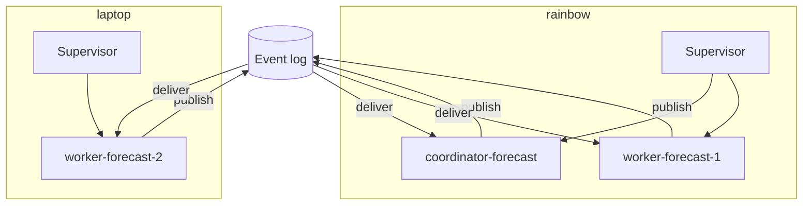

# ADR-0095: Named agents bind to hosts; hosts share only the event log

- **Status:** accepted (2026-08-13, operator)
- **Date:** 2026-08-12
- **Amends:** ADR-0087 (single-machine team topology)
- **Related:** ADR-0093 (durable agent messaging), ADR-0094 (isolation and local outbox), ADR-0073 (persistent sessions and interactive attach)

## Context

ADR-0087 defines a team as a coordinator, an evaluator, and N workers, each a long-lived named session. Its framing is explicit: "Treadmill is a singleton deployed on one machine." A session's identity is its label, and the label carries no location, because there is only one location.

The operator intends to run agents on more than one machine — a desktop, a laptop, and a cloud host — and to reach any of them from any other: "I could run agents pinned on multiple machines and open up a web or native app that lets me look at any of them regardless of which machine I'm on."

`exec_otp` provided that capability and paid for it with a cluster: Erlang distribution, Mnesia replication, cluster-wide membership, and a partition guard. Its postmortem records the result — every mechanism added for safety coupled the nodes more tightly, so a local fault became a global outage. Its §6 rule 1: "Do not distribute state you can centralize." The operator agrees: "Whether this needs to be a cluster or not isn't important so long as agents are able to address each other." We need placement without clustering.

## Decision

We decided that **an agent's identity is `(label, host)`. The label addresses the agent; the host says where its session runs. Hosts share exactly one thing — the central event log — and know nothing else about each other.**

1. **The label remains the addressing primitive.** Senders address `worker-forecast-1`, never a machine. Placement is a routing fact, not part of the address.
2. **`team_configs` gains a host per session label.** A session starts on its bound host and nowhere else.
3. **Each host runs its own supervisor** for its own sessions, using the ADR-0073 substrate: a systemd user unit per label, with tmux owning the TTY.
4. **Hosts hold no shared mutable state.** No membership protocol, no distributed database, no quorum, no leader election. A host's only outbound dependency is publishing to the event log, and ADR-0094 makes that survivable when absent.

An agent moves hosts only by an explicit operator or coordinator decision, never as an automatic response to a host being unreachable (ADR-0094).

## Alternatives considered

- **Incumbent: single-host topology (ADR-0087).** All sessions on one machine; the label is the whole identity. **Why insufficient:** it cannot place an agent near the resources it needs — a laptop's local checkout, a cloud host's uptime — and it makes that one machine's availability the availability of every agent.
- **`exec_otp`'s cluster: Erlang distribution with a replicated store.** Rejected on evidence. It delivered real migration and cost 3 h 38 min of total outage on 2026-08-11 when one link dropped. Its own postmortem recommends against repeating it.
- **Agent migration between hosts as a first-class feature.** Rejected for v1. It was `exec_otp`'s headline capability and, per the operator, "really doesn't buy us very much at all" relative to its complexity. Handing work between agents (ADR-0093) covers the cases migration was serving.
- **Container or VM placement per agent.** Rejected: ADR-0084 already retired Docker for sessions, finding it "adds overhead without benefit in a singleton." Host binding is the coarser unit and is sufficient.

## Consequences

### Good
- Agents can sit where their work is, without a cluster.
- A host's failure is local: its agents stop, and no other host is affected.
- Adding a host is registering it and binding labels to it.

### Bad / trade-offs
- No automatic recovery. If a host is down, its agents are down until a human or coordinator acts. We prefer this to `exec_otp`'s automatic adoption.
- Placement becomes a decision someone must make and record.
- Bootstrapping is per-host: each machine needs its own supervisor and toolchain.

### Risks
- Host binding drifts when a session is started by hand on the wrong machine. The supervisor must refuse to start a label not bound to it.
- Reintroducing migration later would revive the coupling this decision avoids. Any such proposal must supersede this ADR explicitly.
- **Falsifier:** any host reading or writing another host's state directly rather than through the event log.
- **Check:** none yet — see Follow-ups.

## Diagram

## Follow-ups

- Where the host registry lives, and how a host proves its identity.
- What a coordinator does when a task's preferred host is unreachable.
- Whether a label may be rebound to another host while its former host is isolated.

## References

- `exec_otp` postmortem §5 and §6 rules 1–3: `~/obsidian/lepper/exec-otp/exec_otp Postmortem.md`.
- ADR-0087 §"The right framing" (singleton assumption).
