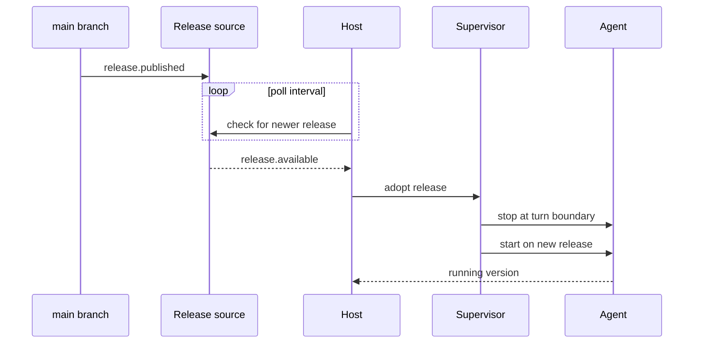

# ADR-0096: Runtime code comes from merged releases only; hot-loading is prohibited

- **Status:** accepted (2026-08-13, operator)
- **Date:** 2026-08-12
- **Related:** ADR-0024 (local-mode auto-redeploy on merge), ADR-0069 (managed host processes self-heal on stale code), ADR-0095 (named agents bind to hosts)

## Context

ADR-0069 records a night in which three incidents traced to one cause: long-lived host processes kept executing the code they imported at launch. "Each time the *source on disk was correct* and a fresh interpreter imported the fix — only the resident process was stale. Verification kept lying."

`exec_otp` produced the sharper version of the same failure. Its team applied a fix for a defect that crash-looped the whole fleet, but applied it by hot-loading the module rather than persisting it. Two of its agents recorded the exposure in writing: any uncontrolled restart "= loses #282 protection AND keeps #279 = whole-fleet crash-loop." On 2026-08-11 the OOM killer supplied that restart. The node reloaded from disk, the fix vanished, and the two hosts were left running different versions of the same module. The prediction was correct and the condition went live.

The operator's directive is unambiguous: "We should never hot-load code. We need to design in a system for the next framework that only deploys code when it's merged into main. In fact the framework should probably be polling for new releases of itself to update to."

## Decision

We decided that **the only source of runtime code is a merged release, and that mutating a running process's code in place is prohibited.**

1. **Merged means main.** Code reaches a host by a release built from `main`. There is no path from a working tree, a branch, or an operator's terminal into a running agent's runtime.
2. **Hosts poll for their own releases.** Each host checks for a newer release on an interval and restarts its managed processes to adopt it. A host updates itself; nothing pushes to it.
3. **Hot-loading is prohibited.** No mechanism may replace code in a live process. This includes Erlang-style code loading, `importlib.reload`, and monkey-patching a running service.
4. **A restart is the unit of adoption.** Because restart is the only way code changes, a restart can never lose a fix — the disk is always at least as new as the process.
5. **The discipline ships as a skill.** The rule is operationalised as a Treadmill skill (`.claude/skills/`), not left as prose — so it is invoked, not ignored (the failure ADR-0098 names). The skill encodes cutting a release from `main` and the host adopt/restart procedure, and is the surface an agent reaches for instead of hand-editing a running process (operator directive, 2026-08-12).

Point 4 is the property being bought. Under hot-loading, a restart is a *downgrade risk*. Under this decision, a restart is the mechanism.

## Alternatives considered

- **Incumbent: ADR-0024 plus ADR-0069 self-heal.** The deploy-watcher fast-forwards the clone and recreates containers; ADR-0069 adds staleness detection for host processes. **Why insufficient:** it corrects the symptom after the fact and remains merge-triggered on one machine. With agents on several hosts (ADR-0095), a push-from-one-place model has no way to reach a host that was isolated at merge time. Polling does.
- **Hot-loading for urgent fixes.** Rejected on evidence: this is exactly what `exec_otp` did, and it produced two hosts running different versions of the fleet-killing module with no operator visible signal.
- **Push-based deploy to every host.** Rejected: it fails for an isolated host (ADR-0094) and requires the deployer to hold credentials for every machine. A polling host converges whenever it can reach the release source.
- **Pin every host to a version the operator sets by hand.** Rejected for routine operation as unnecessary toil, but retained as the escape hatch: a host may pin a release deliberately, and that pin must be visible.

## Consequences

### Good
- A restart can never regress the runtime. Stale-process incidents of the ADR-0069 class stop existing.
- An isolated host converges on its own once the network returns.
- "Which code is this agent running?" has one answer: its release version.

### Bad / trade-offs
- Urgent fixes travel through merge, so the pipeline's speed becomes the floor on incident response.
- Restarting to adopt a release interrupts in-flight agent turns. The supervisor must restart at a turn boundary.
- Hosts can sit on different releases between poll intervals; skew is bounded but real.

### Risks
- An agent with shell access can defeat this by editing files a process later imports. The prohibition is a design rule, not an enforced sandbox.
- A pinned host is invisible drift unless surfaced. Report version per host.
- **Falsifier:** a running process whose behaviour changes without a restart, or two hosts on the same release running different code versions.
- **Check:** none yet — see Follow-ups.

## Diagram

## Follow-ups

- The release artefact format and where it is published.
- The poll interval, and whether a host may defer adoption while an agent is mid-turn.
- How a deliberate version pin is recorded and surfaced.
- The deploy skill's surface: what it automates (release cut, host adopt) versus what it only asserts (never hot-load), and where it lives under `.claude/skills/`.

## References

- ADR-0069 Context (three stale-process incidents, 2026-06-03).
- `exec_otp` postmortem §4.8 and §6 rule 6: `~/obsidian/lepper/exec-otp/exec_otp Postmortem.md`.
